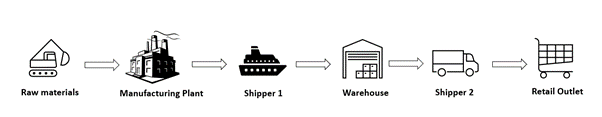
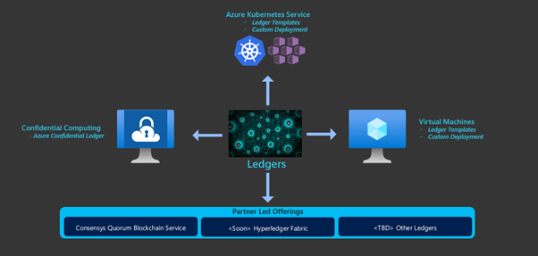
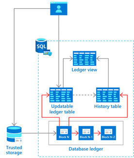
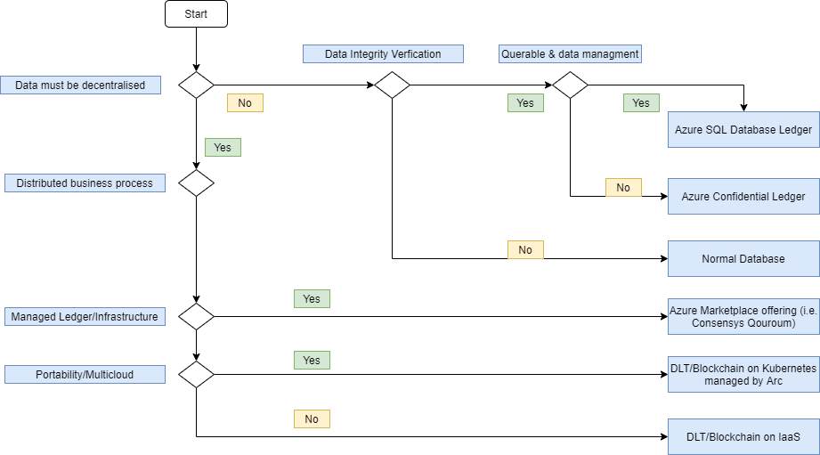

Multiparty computing or privacy-preserving computation allows parties in a business relationship to share data, do computations, and arrive at a mutual result without divulging their private data. Azure services can help you build a multiparty computing solution. The solution can include cloud-based and on-premises resources.

Multiparty computing has the following attributes:

- More than one company or organization is involved.
- The parties are independent.
- The parties don't trust one another with all their data.
- All parties access a common computing and data storage platform.
- Some processes must be private for some of the parties involved.

A supply chain is an example of a workflow that involves multiple parties. Raw materials flow from the point of origin to manufacturing. Goods from the manufacturer go through shipping partners to a distribution hub. From the hub, goods are sent to retail outlets.

This process has companies working together. These parties include the raw materials supplier, the manufacturer, shipping firms, warehouse operators, and the retail outlets. The product changes hands several times during the supply chain. Different parties need to track the product at all stages.

## Multiparty computing technologies

Multiparty computing includes different technologies that enable parties to transact securely over a network.

One option is distributed ledgers. Blockchain is an example. Blockchain is a data ledger that can be shared between independent parties where all parties trust the data on the ledger. Transactions are collected in blocks with each block linking to the previous block. Some distributed ledgers don't use blocks. Each transaction can be linked to the previous transaction on the ledger.

Another possibility for multiparty computing uses hardware protected memory on the CPU itself. These regions, called *secure enclaves*, are cryptographically protected. This approach means that even a privileged administrator having full access to the server can't look at the process or the data inside those secure enclaves.

Since secure enclaves have the capability to remotely attest themselves to other enclaves, you can design a multiple organization network where the system runs from the enclaves. This approach is called the *trusted execution environment*.

Azure offers a managed service called Azure Confidential Ledger that lets you run a blockchain model on secure enclaves.

Finally, you could choose a centralized system, which offers immutability and trustworthiness. Azure SQL Database ledger offers the trust needed for multiparty computing in a relational database. You may not need a decentralized consensus, but just the immutability aspect of the ledger.

## Blockchain network models

To decide if blockchain is a good fit for a business process, consider these questions:

- Does this business process cross trust boundaries?
- Do multiple parties share and update data?
- Are there any intermediaries that control the single source of truth?
- Does the process involve low-value manual verification steps?

If the answers to these questions are *yes*, the business process is a good candidate for a blockchain-based approach. Even if some answers are *no*, blockchain might still make sense. Look closely at the other multiparty computing options before deciding.

There are various kinds of blockchain networks to address your business needs. One characteristic is the criteria for taking part in the network. If the network is open for all, it's called a *public blockchain network*. You just download the client and join. Most cryptocurrencies work this way.

An alternative is a *permissioned blockchain network*, where you need permission from the existing members of the network to join. This model works for enterprises that deal with known organizations. For instance, a superstore may want to have a closed and permissioned blockchain network for its supply chain participants.

A business process might require only tamper-proof or tamper-evident data, which wouldn't require blockchain. If your process can run centrally, or all parties trust one another with the data, blockchain might also be unnecessary.

## Azure multiparty computing

This section describes multiparty computing options available using Azure services.

### Blockchain with Azure Virtual Machines

You can run ledger software using Azure Virtual Machines. Create as many virtual machines as you need and connect them in a blockchain network.

Deploying your own virtual machines allows you to customize your solution. The approach includes management overhead, such as updates, high availability, and business continuity requirements. You may have multiple organizations and multiple cloud accounts. Connecting the individual nodes can be complicated.

There are deployment templates available on Azure for most blockchain ledgers for virtual machines.

### Blockchain on Kubernetes

Since most blockchain ledgers support deploying into Docker containers, you can use Kubernetes to manage the containers. Azure has a managed Kubernetes offering called Azure Kubernetes Service (AKS) that you can use to deploy and configure your blockchain nodes.

AKS implementations come with a managed service for the virtual machines that power the AKS cluster. However, your organization must still manage your AKS clusters and any networking or storage options in your architecture.

There are deployment templates available on Azure for most blockchain ledgers for AKS.

### Blockchain as a service

Azure supports third-party services that run ledger software on Azure. The service provider manages the infrastructure. They handle maintenance and updates. High availability and consortium management are included in the service.

ConsenSys offers Quorum on Azure. Quorum is an open-source protocol layer that supports Ethereum-based applications.

There may be other offerings in the future.

### Azure Confidential Ledger

Azure Confidential Ledger is a managed service built on the Confidential Consortium Framework. It implements a permissioned blockchain network of nodes within Azure confidential computing. Confidential Ledger builds on existing encryption.

- Existing encryption
  - **Data at rest.** Encrypt inactive data when stored in blob storage or a database.
  - **Data in transit.** Encrypt data that's flowing between public or private networks.
- Confidential computing
  - **Data in use.** Encrypt data that's in use, while in memory and during computation.

Confidential computing allows encryption of data in the main memory. Confidential computing lets you process data from multiple sources without exposing the input data to other parties. This type of secure computation supports multiparty computing scenarios where data protection is mandatory in every step, such as money laundering detection, fraud detection, and secure analysis of healthcare data.

Data stored in Confidential Ledger is immutable and tamper-proof in the append-only ledger. The ledger is also independently verifiable. Confidential Ledger uses secure enclaves for a decentralized blockchain network and requires a minimal trusted computing base.

### Azure SQL Database ledger

Azure SQL Database ledger allows participants to verify the data integrity of centrally-housed data without the network consensus of a blockchain network. For some centralized solutions trust is important, but decentralized infrastructure isn't necessary. This approach avoids complexity and performance implications of such an infrastructure.

> [!NOTE]
> Azure SQL Database ledger is currently in public preview.

Ledger provides tamper-evidence capabilities for your database. These capabilities allow you to cryptographically attest that your data hasn't been tampered with.

Ledger helps protect data from any attacker or high-privileged user, including database, system, and cloud administrators. Historical data is preserved. If a row is updated in the database, its previous value is maintained in a history table. This offers protection without any application changes.

Ledger is a feature of Azure SQL Database. It can be enabled in any existing Azure SQL Database.

## Comparing options

### Confidential Ledger and Azure SQL Database ledger

This table compares Confidential Ledger with Azure SQL Database ledger.

|  | SQL Database ledger | Confidential Ledger |
|- |-------------------------- |-------------------- |
| **Centralized system that requires tamper evidence** | Yes | No |
| **Decentralized system that requires data to be tamper proof** | No | Yes |
| **Protects relational data from tampering** | Yes | No |
| **Protects unstructured data from tampering** | No | Yes |
| **Secure off-chain store of chain data in a blockchain** | Yes | No |
| **Secure off-chain store for files referenced to from a blockchain** | No | Yes |
| **Relational data is queryable** | Yes | No |
| **Unstructured stored data is queryable** | No | Yes |

### Confidential Ledger and Azure Blob Storage

The immutable storage feature of Azure Blob Storage ensures that data written to it can be read but never changed. This table compares that technology with Confidential Ledger.

|  | Confidential Ledger | Immutable storage |
|- |-------------------- |------------------ |
| **Confidential hardware enclaves** | Yes | No |
| **Append-only data integrity** | Yes | Yes, limited to intervals |
| **In-use data encryption** | Yes | No |
| **Blockchain ledger proof** | Yes | No |

### Multiparty computing decision

This diagram summarizes options for the multiparty computing with Azure services.

*Download a [Visio file](https://arch-center.azureedge.net/MultiPartyComputeDecisionTree.vsdx) of this architecture.*

## Next steps

- [Azure Confidential Ledger](https://azure.microsoft.com/services/azure-confidential-ledger)
- [Azure SQL Database ledger](/azure/azure-sql/database/ledger-overview)
- [Azure Virtual Machines](https://azure.microsoft.com/services/virtual-machines)
- [Azure Kubernetes Service](https://azure.microsoft.com/services/kubernetes-service)
- [Azure SQL Database](https://azure.microsoft.com/products/azure-sql/database)

## Related resources

- [Supply chain track and trace](../../solution-ideas/articles/supply-chain-track-and-trace.yml)
- [Blockchain workflow application](https://azure.microsoft.com/updates/action-required-migrate-your-azure-blockchain-service-data-by-10-september-2021)
- [Multi-cloud blockchain DLT](../../example-scenario/blockchain/multi-cloud-blockchain.yml)
- [Decentralized trust between banks](../../example-scenario/apps/decentralized-trust.yml)
- [Authenticating Azure confidential ledger nodes](/azure/confidential-ledger/authenticate-ledger-nodes)
- [Azure Confidential Ledger Architecture](/azure/confidential-ledger/architecture)