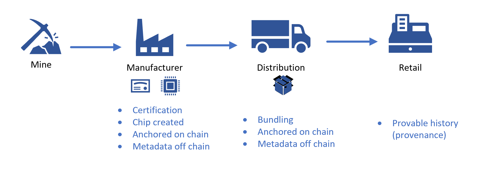

[!INCLUDE [header_file](../../../includes/sol-idea-header.md)]

This article describes how to use Quorum Blockchain Service to track and trace physical assets, along with their metadata.

## Architecture

:::image type="content" source="images/quorum-blockchain-service.png" alt-text="Screenshot that shows the Azure architecture of Quorum blockchain service." lightbox="images/quorum-blockchain-service.png":::

*Download a [Visio file](https://arch-center.azureedge.net/quorum-blockchain-service.vsdx) of this architecture.*

### Dataflow

Quorum Blockchain Service (QBS) is a managed ledger service from [ConsenSys](https://consensys.net/). It allows organizations to run their own blockchain network without having to deal with infrastructure management.

The following are features of QBS:

- Uses standard Ethereum technology with privacy enhancements.
- Supports open-source tools such as [Truffle](https://trufflesuite.com/) for developing and managing lifecycle of smart contracts.
- Supports event listening models for off-chain storage and integration with open-source tools such as Ethlogger from Splunk.
- Provides extensions for Visual Studio Code (VS Code).
  - Users can create and debug smart contracts using [Solidity](https://marketplace.visualstudio.com/items?itemName=JuanBlanco.solidity) in VS Code.
  - Users can also deploy assets to Quorum via the [TruffleSuite](https://trufflesuite.com/docs/vscode-ext/quickstart/) using VS Code Extension.
- Provides management APIs and supports monitoring and logging of blockchain nodes with integration to [Azure Monitor](/azure/azure-monitor/overview).

**Getting started with QBS:**

QBS is currently accessible as a Private offering on Azure. You can access QBS using one of the following ways:

- Sign-up directly on the [ConsenSys Quorum Blockchain Service](https://consensys.net/quorum/qbs/#qbs-private-preview) page.
- Inquire directly with [QBS Support](https://quorum-support.zendesk.com).

The elements of the architectural diagram are explained below:

- **Input/Intake**

Input to the application uses existing Azure services. For instance, a traditional web application that runs in [Azure App Services](/azure/app-service/),  serves as an input from interactive users. Additionally, the need for batch type inputs driven by business logic not directly interactive by users is handled using Azure messaging services, primarily being Service Bus.

- **Core ledger**

Input that is destined to be persisted in the underlying ledger for the solution is handled by blockchain, using QBS. A set of validator nodes are created as part of QBS however the interaction from the input application is with the transaction nodes. Azure Virtual Machines or Virtual Machine Scale Sets that uses agent pool in [Azure Kubernetes Service](/azure/aks/) provide compute and storage/persistence needed by QBS.

- **Output/Analytics**

As data continues to exist in the ledger in QBS, the need for both analytics and triggers for existing non-blockchain based systems is required in most cases. A listener supporting tooling such as Ethlogger can be configured to run in Azure and send data to off-chain data technologies, such as Azure Cosmos DB or Azure SQL. The Ethlogger component is run on either [Azure Virtual Machines](/azure/virtual-machines/) or using container in [Azure Container Instances](/azure/container-instances/).

#### Dataflow in action

The above diagram represents a simplified version of the stages in supply chain for chip manufacturing. The stages involved are mining, manufacturing, distribution and retail, where material change hands many times in progression. For a company that values sustainability and ethical responsibility, it becomes important to track and trace the source of truth and quality details of the materials. In the past, each participant used to put the data in their own data technology stack and synchronize data to other parties.

The data flow mapping of the above diagram is described below:

- **Mine/manufacturer**

After raw material is received by the manufacturer, input is created. Then, the certification of the material is checked and ownership of the component is established with on-chain data in the ledger and off-chain data in traditional storage.

- **Distribution**

Once the components are manufactured, they are bundled for distribution. The bundle is used in the ledger with QBS to establish provenance, such as a palette. This is done using a combination of on-chain data in the ledger and off-chain data in traditional storage.

- **Retail**

The ledger system of the QBS helps organizations get the history of low-level component packed in a larger product. This system takes the ownership of the products and allows to refer to its history.

### Components

- [Azure App Service](https://azure.microsoft.com/products/app-service) is an HTTP-based service to host web applications, REST APIs, and mobile back ends. The App Service is a web application/API that allows interactive use of the data by users in the supply chain. In this article, App Services are used to read or reference the data in Input/Intake stage and all other stages.

- [Azure Service Bus](https://azure.microsoft.com/services/service-bus) is a fully managed enterprise message broker with message queues and publish-subscribe topics (in a namespace). In this article, Azure Service Bus is used by manufacturers to inject data into the blockchain ledger or off-chain data store.

- [Azure Managed Applications](https://azure.microsoft.com/services/managed-applications) enable you to offer cloud solutions that are easy for consumers to deploy and operate.
  - Publish a managed application to the Azure market place to be available for all the customers.
  - Publish a managed application to an internal catalog to be available to only your company's users.

- Event Listener: In this scenario, [Ethloggger](https://github.com/splunk/splunk-connect-for-ethereum/blob/main/docs/cli.md) is utilized to send data to off-chain data technologies, such as Azure Cosmos DB or Azure SQL.

- [Azure Cosmos DB](https://azure.microsoft.com/services/cosmos-db) is a fully managed NoSQL database for modern app development that provides single-digit millisecond response times, automatic and instant scalability, and guaranteed speed at any scale. In this scenario Azure Cosmos DB is a data store used to house the output of events raised on the blockchain such as state changes that are used by an analytics solution or simple reporting.

- [Azure SQL Database](https://azure.microsoft.com/products/azure-sql/database) is a fully managed platform as a service (PaaS) database engine that handles most of the database management functions such as upgrading, patching, backups, and monitoring without user involvement. In this scenario Azure SQL Database is a data store used to house the output of events raised on the blockchain such as state changes that will ultimately be used by an analytics solution or simple reporting. Additionally, by utilizing the [ledger](/azure/azure-sql/database/ledger-landing) feature of Azure SQL Database, the integrity of output of events from the blockchain replicated to the SQL database can be maintained.

- [Azure Monitor](https://azure.microsoft.com/services/monitor) provides a comprehensive solution for collecting, analyzing, and acting on telemetry from cloud and on-premises environments. In this scenario Azure Monitor provides availability and performance data of the architecture components. QBS is integrated with Azure Monitor to provide additional telemetry data on blockchain nodes.

## Scenario details

Blockchain technology helps organizations track and trace the product life cycle and meet regulatory, financial, ethical, and sustainability requirements.

The need for the blockchain technology started with organizations trying to understand more about the products, like:

- Where did the product originate from?
- How was a product built?
- What were the processes followed to build a product?

Building and maintaining the electronic data interface (EDI) across suppliers to track and trace parts of a product is not worthwhile for some organizations. By using ConsenSys Quorum Blockchain Service (QBS) with App Services, Azure Key Vault, Service Bus, and Azure Cosmos DB, organizations can track and trace a tokenized version of the product's physical assets and relevant metadata to meet requirements.

### Potential use cases

With QBS powered by Azure services, an organization can build solutions that can track and provide an immutable history of the product parts and their metadata, such as quality certificates. Through a shared ledger these certificates cover carbon footprint and percentage of recycled component used.

Blockchain technology allows the logical data flow model to use with physical components deployed with each participant. This reduces the need for participants to trust a single partner.
While this could be built using traditional centralized components, this is usually not the case with supply chain workloads. Supply chain workloads have their own systems that require isolation from others.

This solution is ideal for the sustainability, manufacturing, and energy/environment industries.

## Contributors

*This article is maintained by Microsoft. It was originally written by the following contributors.*

Principal authors:

- [Samrat Adhikari](https://www.linkedin.com/in/samrat-adhikari-mba-mcis-pmp-csm-8538a9169) | Senior Manager, Technology Solutions Delivery
- [Cale Teeter](https://www.linkedin.com/in/caleteeter) | Senior Software Engineer

Other contributor:

- [Lavanya Kasturi](https://www.linkedin.com/in/lakshmilavanyakasturi) | Technical Writer

*To see non-public LinkedIn profiles, sign in to LinkedIn.*

## Next steps

- [Azure App Service overview](/azure/app-service/overview)
- [Introduction to blockchain on Azure](/training/modules/intro-to-blockchain/)

## Related resources

- [Multiparty computing architecture design](/azure/architecture/guide/blockchain/multiparty-compute)
- [Multicloud blockchain DLT](/azure/architecture/example-scenario/blockchain/multi-cloud-blockchain)
