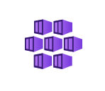

# Choose an Azure container service

Azure provides a range of container hosting services that are designed to accommodate various workloads, architectures, and business requirements. This container service selection guide can help your workload team understand which Azure container service is best suited to your workload scenarios and requirements.

> [!NOTE]
> In this guide, *workload* refers to a collection of application resources that support a business goal or the implementation of a business process. A workload uses multiple services, like APIs and data stores, that work together to deliver specific end-to-end functionality.

## Overview

This guide includes this introduction article and another article about [considerations that are shared](container-service-general-considerations.md) across all workload types.

> [!NOTE]
> If you aren't committed to containerization, [choose a different compute option](technology-choices/compute-decision-tree.md) to host your workload.

This introductory article outlines the Azure container services covered in this guide and compares their service models based on configurability and predefined solutions, such as customer-managed versus Microsoft-managed approaches. After you identify candidate services based on your service model preferences, the next step is to assess the options against your workload requirements by reviewing the article on [shared considerations](container-service-general-considerations.md) for networking, security, operations, and reliability.

This guide helps you evaluate trade-offs based on your workload's technical requirements, size, and complexity. It also considers the expertise of your team to ensure informed decision-making.

## Azure container services in scope for this guide

This guide focuses on a subset of the container services that Azure provides. This subset provides a mature feature set for web applications and APIs, networking, observability, developer tools, and operations. The following container services are compared:

:::row:::
    :::column:::
    
    :::column-end:::
    :::column span="3":::
    [Azure Container Apps](https://azure.microsoft.com/products/container-apps) is a fully managed platform that allows you to run containerized applications without worrying about orchestration or infrastructure. For more information, see [Container Apps documentation](/azure/container-apps).
    :::column-end:::
:::row-end:::
:::row:::
    :::column:::
    
    :::column-end:::
    :::column span="3":::
    [Azure Kubernetes Service (AKS)](https://azure.microsoft.com/products/kubernetes-service) is a managed Kubernetes service for running containerized applications. With AKS, you can take advantage of managed [add-ons and extensions](/azure/aks/integrations) for extra capabilities while preserving the broadest level of configurability. For more information, see [AKS documentation](/azure/aks/).
    :::column-end:::
:::row-end:::
:::row:::
    :::column:::
    
    :::column-end:::
    :::column span="3":::
    [Web App for Containers](https://azure.microsoft.com/products/app-service/containers) is a feature of Azure App Service. App Service is a fully managed service for hosting HTTP-based web apps that have built-in infrastructure maintenance, security patching, scaling, and diagnostic tooling. For more information, see [App Service documentation](/azure/app-service/).
    :::column-end:::
:::row-end:::

For a complete list of Azure container services, see [Containers on Azure](https://azure.microsoft.com/products/category/containers/).

## Service model considerations

A service model helps you understand how much flexibility and control each Azure container service provides. Complex services provide more control, while simpler services make management easier but limit customization.

For more information about service model terminology and concepts, including infrastructure as a service (IaaS) and platform as a service (PaaS), see [Shared responsibility in the cloud](/azure/security/fundamentals/shared-responsibility).

### Compare the service models of Azure container solutions

#### Azure Kubernetes Service (AKS)

AKS is a mix of IaaS and PaaS that focuses more on control than simplicity. It uses Kubernetes, which is the standard system for orchestrating containers. AKS streamlines the management of the underlying core infrastructure. However, this virtual machine (VM)-based platform is exposed to your applications and requires appropriate guardrails and processes, like patching, to ensure security and business continuity. The compute infrastructure is supported by extra Azure resources that are hosted directly in your subscription, like Azure load balancers, container registries, or application gateways.

AKS provides access to the Kubernetes API server, which enables you to customize container orchestration and deploy auxiliary applications from the Cloud Native Computing Foundation. As a result, workload teams that are new to Kubernetes face a significant learning curve. If you're unfamiliar with containerized solutions, you must consider this learning curve. The following PaaS solutions provide a lower barrier to entry. You can transition to Kubernetes when your requirements demand it.

##### AKS Automatic

[AKS Automatic](/azure/aks/intro-aks-automatic) makes it easier to adopt Kubernetes by automating complex cluster management tasks. This automation reduces the need for advanced Kubernetes expertise. It provides a more streamlined, PaaS-like experience while maintaining Kubernetes' flexibility and extensibility. Azure manages cluster setup, node provisioning, scaling, security patching, and applies best-practice configurations by default. This automation reduces operational effort but limits the available topology options.

> [!NOTE]
> This guide differentiates between AKS Standard and AKS Automatic where applicable. Otherwise, you can assume that the described functionality is consistent across both offerings.

#### Container Apps  

Container Apps is an abstraction layer on top of Kubernetes that allows your apps to run and scale without requiring direct management of the underlying infrastructure. Container Apps provides both serverless and dedicated compute options. These options give you full control over the type and amount of compute resources available to your applications. Container Apps abstracts container orchestration APIs while still providing built-in access to key features like Layer 7 ingress, traffic splitting, A/B testing, and application life cycle management.

#### Web App for Containers

Web App for Containers is a PaaS offering that prioritizes simplicity over control compared to Container Apps. It abstracts container orchestration while still supporting scaling, application life cycle management, traffic splitting, network integration, and observability.

### Hosting model considerations

You can use Azure resources, like AKS clusters, to host multiple workloads. This approach can help you streamline operations, which reduces overall cost. If you choose this option, consider the following features:

- **AKS** is commonly used to host multiple workloads or disparate workload components. You can isolate these workloads and components by using Kubernetes' native functionality, such as namespaces, access controls, and network controls, to meet security requirements.

  You can also use AKS in single-workload scenarios if you need the extra functionality that the Kubernetes API provides and your workload team has sufficient experience operating a Kubernetes cluster. Teams with less Kubernetes experience can still effectively manage their own clusters by using Azure-managed [add-ons](/azure/aks/integrations#available-add-ons) and features like [cluster automatic-upgrade](/azure/aks/auto-upgrade-cluster) to reduce operational effort.

- **Container Apps** should be used to host a single workload with a shared security boundary. Container Apps has a single top-level logical boundary called a *Container Apps environment*, which also serves as an enhanced security boundary. There are no mechanisms for more granular access control. For example, intra-environment communication is unrestricted and all applications share a single Log Analytics workspace.

  If the workload has multiple components and security boundaries, deploy multiple Container Apps environments or consider AKS instead.

- **Web App for Containers** is a feature of App Service. App Service groups applications into a logical compute boundary called an *App Service plan*. Because you can scope role-based access control at the application level, you might want to host multiple workloads in a single plan. However, it's best to host a single workload for each plan to avoid the noisy neighbor problem. All apps in a single App Service plan share the same allocated compute, memory, and storage.

  When you consider hardware isolation, keep in mind that App Service plans generally run on infrastructure shared with other Azure customers. You can choose Dedicated tiers for dedicated VMs or Isolated tiers for dedicated VMs in a dedicated virtual network.

In general, all Azure container services can host multiple applications that have multiple components. However, Container Apps and Web App for Containers work best for a single workload component or multiple closely related workload components that share a similar life cycle and a single team owns and runs the application.

If you need to host disparate, potentially unrelated application components or workloads on one host, consider AKS.

## The trade-off between control and ease of use

AKS provides the most configurability, but that configurability requires more operational effort compared to the other services. Container Apps and Web App for Containers are both PaaS services that have similar levels of Microsoft-managed features. Web App for Containers focuses on simplicity to serve its target audience, which is existing App Service customers who are familiar with the interface.

### Best practices

Services that provide more simplicity usually suit customers who focus on feature development instead of infrastructure management. Services that provide more control usually suit customers who need configurability and have the skills, resources, and business justification to manage their own infrastructure.

## Shared considerations across all workloads

A workload team might prefer a specific service model, but that model might not meet the organization's overall requirements. For example, developers might want less operational effort, but security teams might consider this overhead necessary for compliance. Teams need to collaborate to make the right trade-offs.

Shared considerations cover a wide range of factors. Only a subset of considerations might apply to you based on the workload type. Your role within the organization also affects which considerations are relevant.

The following table provides a high-level overview of considerations, including service feature comparisons. Review the considerations in each category and compare them against your workload's requirements.

| Category | Overview |
|---|---|
| [Networking considerations](container-service-general-considerations.md#networking-considerations) | Networking in Azure container services depends on your preference for simplicity or configurability. AKS provides extensive control over network flow but requires more operational effort. Container Apps has Azure-managed networking features and sits between AKS and Web App for Containers, which serves customers who already use App Service.    Network design decisions have long-term consequences because changing them often requires you to redeploy workloads. Several factors, such as IP address planning, load balancing, service discovery, and private networking, vary across these services. You should carefully review how each service meets specific networking requirements. |
| [Security considerations](container-service-general-considerations.md#security-considerations) | Container Apps, AKS, and Web App for Containers integrate with key Azure security offerings like Azure Key Vault and managed identities. AKS provides extra features like runtime threat protection and network policies. PaaS services like Container Apps might seem to have fewer security features, but that's partly because Azure manages more of the underlying infrastructure components. Because these components aren't exposed to customers, the risk is lower. |
| [Operational considerations](container-service-general-considerations.md#operational-considerations) | AKS provides the most customization, but it requires more operational input.    PaaS solutions like Container Apps and Web App for Containers let Azure handle tasks like OS updates. Scalability and hardware SKU flexibility are important. AKS provides flexible hardware options, but Container Apps and Web App for Containers have fewer choices. In AKS, application scalability is your responsibility, so you can apply any Kubernetes-compatible solution. AKS Automatic, Container Apps, and Web App for Containers focus on simpler approaches. |
| [Reliability considerations](container-service-general-considerations.md#reliability) | Web App for Containers and Container Apps have limited health probe configurations compared to AKS. However, they're simpler to set up because they use the familiar Azure Resource Manager API.    AKS requires the Kubernetes API and also requires you to manage Kubernetes node pool scalability and availability to properly schedule application instances. These requirements increase operational effort for AKS. Service-level agreements (SLAs) for Container Apps and Web App for Containers are simpler to calculate than AKS SLAs. The AKS control plane and node pools each have their own SLAs, which must be compounded. All services provide zone redundancy in datacenters that support it. |

After you review the preceding considerations, you might still not find the perfect fit, which is typical.

## Evaluate trade-offs

Cloud computing is complex. It involves collaboration across many teams and must account for constraints in people, budgets, and time. These factors make cloud service selection difficult and full of trade-offs.

For any workload, some requirements might be more critical than others. For example, an application team might prefer a PaaS solution like Container Apps but choose AKS because their security team requires deny-by-default network controls between colocated workload components. This AKS-only feature uses Kubernetes network policies.  

The preceding shared considerations cover the most common requirements but aren't comprehensive. You must evaluate every requirement against your preferred service's feature set before you make a decision.

## Conclusion

This guide covers the most common considerations when you choose an Azure container service. It's designed to help your workload team make informed decisions. The process begins with selecting a cloud service model, which involves determining the desired level of control. More control comes at the expense of simplicity. In other words, the goal is to find the right balance between a self-managed infrastructure and a Microsoft-managed infrastructure.

Many workload teams choose an Azure container service based solely on whether they prefer either PaaS or IaaS. Other teams need to investigate further to determine how service-specific features address workload or organizational requirements.

Use this guide to carefully evaluate your options and avoid making decisions that are difficult to reverse. However, no decision is final until developers try the service and evaluate it based on hands-on experience instead of theory.

## Contributors

*Microsoft maintains this article. The following contributors wrote this article.*

Principal authors:

- [Andre Dewes](https://www.linkedin.com/in/andre-dewes-480b5b62/) | Senior Customer Engineer
- [Marcos Martinez](https://www.linkedin.com/in/marcosmarcusm/) | Senior Service Engineer  
- [Julie Ng](https://www.linkedin.com/in/julie-io/) | Senior Engineer

Other contributors:

- [Martin Gjoshevski](https://www.linkedin.com/in/martin-gjoshevski/) | Senior Customer Engineer
- [Don High](https://www.linkedin.com/in/donhighdevops/) |  Principal Customer Engineer
- [Nelly Kiboi](https://www.linkedin.com/in/nellykiboi/)  | Service Engineer
- [Xuhong Liu](https://www.linkedin.com/in/xuhong-l-5937159b/) | Senior Service Engineer  
- [Faisal Mustafa](https://www.linkedin.com/in/faisalmustafa/) |  Senior Customer Engineer
- [Walter Myers](https://www.linkedin.com/in/waltermyersiii/) | Principal Customer Engineering Manager
- [Sonalika Roy](https://www.linkedin.com/in/sonalika-roy-27138319/) | Senior Customer Engineer
- [Paolo Salvatori](https://www.linkedin.com/in/paolo-salvatori/) |  Principal Customer Engineer
- [Victor Santana](https://www.linkedin.com/in/victorwelascosantana/) |  Principal Customer Engineer
- [Carlos Mestre del Pino](https://www.linkedin.com/in/mestredelpino/) |  Cloud Solution Architect

*To see nonpublic LinkedIn profiles, sign in to LinkedIn.*

## Related resource

- [Shared architectural considerations](container-service-general-considerations.md)
