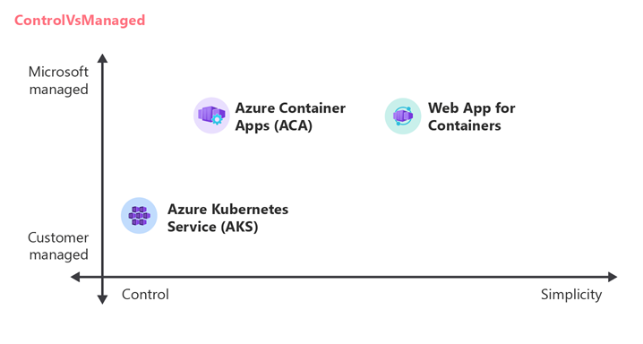

# Choose an Azure container service

Azure offers a range of container hosting services designed to accommodate various workloads, architectures, as well as business requirements. This container service selection guide will help you understand how to evaluate container services on Azure depending on workload scenarios and requirements. 

> [!important]
> In this guide, the term *workload* refers to a collection of application resources that support a common business goal or the execution of a common business process, with multiple services, such as APIs and data stores, working together to deliver specific end-to-end functionality.

## How to use this guide

This guide includes two articles: this introduction article and an additional article on shared considerations across all workload types.

> [!note]
> If you have not yet committed to containerization, please also see this "choose an Azure compute service” article for further compute options to host your workload.

This introduction article lists Azure container services in scope for this guide and covers how service models compare when it comes to understanding trade-offs between control and ease of use, such as customer managed vs. Microsoft managed services. After identifying candidate services based on service model preferences, the next step is to evaluate the candidates against workload requirements by leveraging the article on shared considerations around networking, security, operations, and reliability.

This guide aims to help you select a container service while instilling confidence in decision-making leading to tradeoffs that you may ultimately have to make depending on the technical requirements, size, and complexity of the workload and expertise of the workload’s team. 

## Azure container services in scope for this guide

This guide will focus on a subset of the container services which Azure currently offers. This subset offers a mature feature set around web applications and APIs, networking, observability, developer tools, and operations. Focus will be given to the container services: 

:::row:::
    :::column::: 
     
    :::column-end:::
    :::column span="3":::
    [Azure Container Apps](https://azure.microsoft.com/products/container-apps) is a fully managed Kubernetes-based application platform that helps you deploy http and non-http apps from code or containers without orchestrating complex infrastructure. For details, see [ACA documentation](/azure/container-apps).
    :::column-end:::
:::row-end:::
:::row:::
    :::column::: 
    
    :::column-end:::
    :::column span="3":::
    [Azure Kubernetes Service (AKS)](https://azure.microsoft.com/products/kubernetes-service) is a managed Kubernetes service for running containerized applications. Leverage managed [add-ons and extensions](/azure/aks/integrations) for additional capabilities while preserving the broadest level of flexibility and control. For details, see [AKS documentation](/azure/aks/). 
    :::column-end:::
:::row-end:::
:::row:::
    :::column::: 
     
    :::column-end:::
    :::column span="3":::
    [Web App for Containers](https://azure.microsoft.com/products/app-service/containers) is an offering of Azure App Service, a fully managed service for hosting http-based web apps with built-in infrastructure maintenance, security patching, scaling, diagnostic tooling and more. For details, see [App Service documentation](/azure/app-service/).
    :::column-end:::
:::row-end:::

For a complete list of all Azure container services, please see [the container services product category page](https://azure.microsoft.com/products/category/containers/).

## Service model considerations

It is important to understand that the service model provides the broadest insight into the level of flexibility and control any Azure container service provides in exchange for its overall simplicity and ease of use.

For a general introduction into the terminology and concepts around service models, including infrastructure as a service (IaaS) and platform as a service (PaaS), see this article on [shared responsibility in the cloud.](/azure/security/fundamentals/shared-responsibility)

### Comparing service models of Azure container solutions

#### Azure Kubernetes Service (AKS)

As a hybrid of IaaS and PaaS, AKS falls on the control side of the control vs. simplicity spectrum. Though AKS streamlines the management of the underlying core infrastructure, this virtual machine based platform is still exposed to your applications and requires appropriate guardrails and processes, such as patching, to ensure security and business continuity. The compute infrastructure is supported by additional Azure resources hosted directly in your subscription, such as Azure Load Balancers. 

AKS also provides access to the Kubernetes API server, which enables customers to customize the container orchestration and thus deploy projects from the Cloud Native Computing Foundation (CNCF) landscape. Consequently, there is a significant learning curve for workload teams new to Kubernetes. You should not feel inclined to start with Kubernetes when starting with containerized solutions. The PaaS solutions below offer a lower barrier to entry. You can move to Kubernetes when your requirements dictate that move.

#### Azure Container Apps  

Container Apps strikes a balance of control and simplicity, as a PaaS offering. It has both serverless and dedicated compute options, which abstract away the need to patch the operating system or build guardrails around applications relative to the operating system. Container Apps also completely abstracts away the container orchestration API and provides a subset of its most vital functionality through already familiar Azure APIs. Furthermore, Layer 7 ingress, traffic splitting, A/B testing and application lifecycle management are all fully available out of the box.

#### Web App for Containers

Web App for Containers is also a PaaS offering, but leans more towards simplicity compared to Container Apps. It abstracts away container orchestration, while still offering appropriate scaling, application lifecycle management, traffic splitting, network integration, and observability.

### Hosting model considerations

Customers can use Azure resources, such as an AKS cluster, to host multiple workloads which can help streamline operations and thereby reduce overall cost. If you choose this path, here are a few important considerations:

- **AKS** is commonly used to host multiple workloads or disparate workload components, which can be isolated with Kubernetes native functionality, such as namespaces, access controls, and network controls to meet security requirements.   

- AKS can also be used in single workload scenarios if there's a need for the additional functionality that the Kubernetes API provides and the workload team has enough experience and confidence to operate a Kubernetes cluster. Teams with less Kubernetes experience can still successfully operate their own clusters, by leveraging Azure managed addons and features like cluster auto-upgrade to reduce operational overhead.

**Azure Container Apps** should be used to host a single workload with a shared security boundary. Container Apps has a single top level logical boundary called an Container Apps Environment, which also serves as a secure boundary. There are no mechanisms for additional granular access control. For example, intra-environment communication is unrestricted, and all applications share a single log analytics workspace.

If the workload has multiple components and multiple security boundaries, deploy multiple Container Apps environments, or consider AKS instead.

- **Web App for Containers** is a part of the App Service offering, which groups applications into a billing boundary called an App Service Plan. Although it is tempting to host multiple workloads within a single plan because role-based access control (RBAC) can be scoped to the application level, it is recommended to host a single workload per plan to avoid the noisy neighbor problem. All apps within the same App Service plan share the same allocated compute, memory, and storage.

  When considering hardware isolation, it is important to note that App Service Plans generally runs on infrastructure shared with other Azure customers. Customers can choose **Dedicated** tiers for dedicated VMs or **Isolated** tiers for dedicated VMs and a dedicated virtual network.

In general, all Azure container services can host multiple applications with multiple components. However, Container Apps and Web App are better suited for a single workload component or multiple highly related workload components sharing a similar lifecycle, where a single team owns and runs the applications.

If you need to host disparate, potentially unrelated, applications components or workloads on one host consider AKS.

## The trade-off between control and ease of use

The diagram below illustrates how services and their service models can compare. AKS offers the greatest configurability but at the cost of increased operational overhead compared to the other services. While Container Apps and Web Apps are both PaaS services with similar levels of Microsoft managed features, Web App emphasizes simplicity to cater to its target audience - existing Azure PaaS customers, who will find the interface of Web App very familiar. This diagram also illustrates the trade-offs between responsibility and configurability. 

*Figure 1 – understanding tradeoffs in customer managed vs Microsoft managed service* *model* *flavors*

### Rule of Thumb

Generally, services that offer more “simplicity” tend to suit customers who prefer to focus more on feature development and less on infrastructure. Inversely, services that offer more “control” tend to suit customers who need more configurability and have the skills, resources, and business justification necessary to manage their own infrastructure.

**Shared considerations across all workloads**

While a workload team may prefer a particular service model, that model may not meet the requirements for the organization. For example, developers may prefer less operational overhead, whereas security teams may see this type of overhead as necessary to meet compliance requirements. Internal collaboration across teams is necessary to make the appropriate tradeoffs.

Be aware that shared considerations are broad and only a subset may be relevant to you depending not just on workload type, but also one’s role within an organization.

This next section is a high level overview of considerations including service feature comparison tables when choosing a service. Please review the considerations in each category and compare them against your workload’s requirements.

| Category| High-level overview|
|---|---|
| **Networking considerations** | Networking within Azure container services varies depending on user preferences for simplicity versus configurability. AKS is highly configurable, providing extensive control over network flow, but requires more operational effort. Container Apps offers Azure-managed networking features; it serves as a middle ground between AKS and Web App for Containers, which is tailored to those familiar with the App Service offering. Crucially, network design decisions can have long-term consequences due to the challenges of changing them without re-deploying workloads. Several factors, such as IP address planning, load balancing responsibilities, service discovery methods, and private networking capabilities, differ across these services and should be carefully reviewed to meet specific networking requirements. |
| **Security considerations** | Container Apps, AKS, and Web App for Containers all offer integration with key Azure security offerings such as Key Vault and Managed Identities. AKS offers additional features such as runtime threat protection and network policies. While it seems PaaS offerings like Container Apps offer fewer security protections, this is in part because more of the underlying infrastructure components are Azure managed and not exposed to the customer, which reduces risk. |
| **Operations considerations** | While Azure Kubernetes Service (AKS) offers the most customization, it demands greater operational input. In contrast, Platform-as-a-Service (PaaS) solutions like Container Apps and Web App for Containers let Azure handle tasks like OS updates. Scalability and hardware SKU flexibility are crucial. AKS provides flexible hardware options, while Container Apps and Web App have set configurations. Application scalability in AKS is the sole responsibility of the customer while Container Apps and Web App for Containers offer more streamlined approaches. |
| **Reliability considerations** | Web App for Containers and Container Apps health probe configurations are more streamlined than AKS, given the use of the familiar ARM API. AKS requires the use of the Kubernetes API and has the additional responsibility of managing Kubernetes node pool scalability/availability to properly schedule application instances. This results in additional overhead for AKS. Moreover, SLAs for Container Apps and Web App for Containers are more straightforward in understanding compared to AKS in which the control plane and node pools each have their own SLAs and need to be compounded accordingly. All services offer zone redundancy in datacenters that offer it. |

After reviewing the considerations above, were you able to choose an Azure container solution? If you didn’t find a perfect fit, that is perfectly normal.

## Evaluating trade-offs

Choosing a cloud service is not a check-off exercise. Given the complexity of cloud computing, collaboration between many teams, and resource constraints like people, budget, and time - every solution has trade-offs.

Be aware that for any given workload some requirements may be more critical than others. For example, an application team would prefer a PaaS solution like Container Apps but choose AKS because their security team may require deny-by-default network controls between co-located workload components, an AKS only feature leveraging Kubernetes Network Policies.

![A blue and green scale with green check marks  Description automatically generated]

Lastly, please note that the shared considerations above include the most common requirements but are not exhaustive. It is the workload team’s responsibility to investigate *every* requirement against the preferred service’s feature set before confirming a decision.

## Conclusion

This guide covers the most common considerations customers face when choosing an Azure container service. It is designed to guide workload teams in making informed decisions. It starts with choosing a cloud service model, which involves determining the desired level of control at the expense of simplicity. In other words, it’s about finding the right balance between a self-managed infrastructure and one managed by Microsoft.

Many workload teams can choose an Azure container service solely based on service model preference, PaaS vs IaaS. Other teams will need to dig deeper to determine how service-specific features address workload or organizational requirements.

All workload teams should use this guide while they perform due diligence to avoid difficult-to-reverse decisions. Be aware, however, that the decision is not confirmed until developers have tried the service and decide based on experience, not theory.

## Contributors

**Principal Authors**

- Andre Dewes 
- Marcos Martinez
- Julie Ng

**Contributors**

- Martin Gjoshevski 
- Don High
- Nelly Kiboi  
- Xuhong Liu 
- Faisal Mustafa
- Walter Myers
- Sonalika Roy 
- Paolo Salvatori
- Victor Santana

## Next step

For a deeper dive into shared architectural considerations for the services mentioned in this article, please see this article on shared considerations across all workloads.

