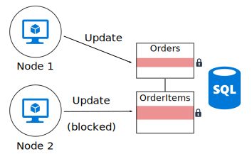
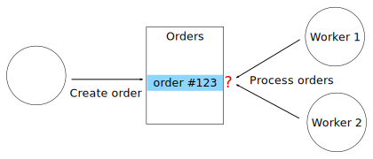

# Minimize coordination between application services

**Minimize coordination between application services to achieve scalability.**

Most cloud applications consist of multiple application services &mdash; web front ends, databases, business processes, reporting and analysis, and so on. To achieve scalability and reliability, each of those services should run on multiple instances. 

What happens when two instances try to perform concurrent operations that affect some shared state? In some cases, there must be coordination across nodes, for example to preserve ACID guarantees. In this diagram, `Node2` is waiting for `Node1` to release a database lock:

Coordination limits the benefits of horizontal scale and creates bottlenecks. In this example, as you scale out the application and add more instances, you'll see increased lock contention. In the worst case, the front-end instances will spend most of their time waiting on locks.

"Exactly once" semantics are another frequent source of coordination. For example, an order must be processed exactly once. Two workers are listening for new orders. `Worker1` picks up an order for processing. The application must ensure that `Worker2` doesn't duplicate the work, but also if `Worker1` 
crashes, the order isn't dropped.

You can use a pattern such as [Scheduler Agent Supervisor][sas-pattern] to coordinate between the workers, but in this case a better approach might be to partition the work. Each worker is assigned a certain range of orders (say, by billing region). If a worker crashes, a new instance picks up where the previous instance left off, but multiple instances aren't contending.

## Examples

**Embrace eventual consistency.** When data is distributed, it takes coordination to enforce strong consistency guarantees. For example, suppose an operation updates two databases. Instead of putting it into a single transaction scope, it's better if the system can accommodate eventual consistency, perhaps by using the [Compensating Transaction][compensating-transaction] pattern to logically roll back after a failure.

**Use domain events to synchronize state.**
<!-- When Events are delivered to interested parties, in either local or foreign systems, they are generally used to facilitate eventual consistency. This is purposeful and by design. It can eliminate the need for two-phase commits (global transactions) and support of the rules of Aggregates (10). One rule of Aggregates states that only a single instance should be modified in a single transaction, and all other dependent changes must occur in separate transactions. So other Aggregate instances in the local Bounded Context may be synchronized using this approach. We also bring remote dependencies into a consistent state with latency. The decoupling helps provide a highly scalable and peak-performing set of cooperating services. It also allows us to achieve loose coupling between systems.-->

**Consider patterns such as CQRS and event sourcing**. These two patterns can help to reduce contention between read workloads and write workloads. 

- The [CQRS pattern][cqrs-pattern] separates read operations from write operations. In some implementations, the read data is physically separated from the write data. 

- In the [Event Sourcing pattern][event-sourcing], state changes are recorded as a series of events to an append-only data store. Appending an event to the stream is an atomic operation, requiring minimal locking. 

These two patterns complement each other. If the write-only store in CQRS uses event sourcing, the read-only store can listen for the same events to create a readable snapshot of the current state, optimized for queries. Before adopting CQRS or event sourcing, however, be aware of the challenges of this approach. For more information, see [CQRS architecture style][cqrs-style].

**Partition data.**  Avoid putting all of your data into one relational DB schema that is shared across many application services. (Microservices architectures enforce this principle by**Partition for availability.** Database partitioning is often used to improve scalability, but it can also improve availability. If one shard goes down, the other shards can still be reached. A failure in one shard will only disrupt a subset of the total transactions. 

 making each service responsible for its own data store.) Within a single database, partitioning the data can improve concurrency, because a service writing to one partition does not affect a service writing to a different partition.

**Design idempotent operations.** When possible, design operations to be idempotent. That way, they can be handled using at-least-once semantics. For example, you can put work items on a queue. If a worker crashes in the middle of an operation, another worker simply picks up the work item.

**Use asynchronous parallel processing**. If an operation requires multiple steps that are performed asynchronously (such as remote service calls), you might be able to call them in parallel, and then aggregate the results. This approach assumes that each step does not depend on the results of the previous step.	

**Use optimistic concurrency control.** Pessimistic concurrency causes excessive locking.

**Use multiversion concurrency control (MVCC)** when the database engine supports it. MVCC isolates reads from write transactions without locking. 

**Consider MapReduce or other parallel, distributed algorithms.** Depending on the data and type of work to be performed, you may be able to split the work into independent tasks that can be performed by multiple nodes working in parallel. See [Big Compute architecture style][big-compute].

**Use leader election** for operations that do require coordination. In cases where you need to coordinate operations, make sure the coordinator does not become a single point of failure in the application. Using the [Leader Election pattern][leader-election], one instance is the leader at any time, and acts as the coordinator. If the leader fails, a new instance is elected to be the leader. 

<!-- links -->

[big-compute]: ../architecture-styles/big-compute.md
[compensating-transaction]: ../../patterns/compensating-transaction.md
[cqrs-style]: ../architecture-styles/cqrs.md
[cqrs-pattern]: ../../patterns/cqrs.md
[event-sourcing]: ../../patterns/event-sourcing.md
[leader-election]: ../../patterns/leader-election.md
[sas-pattern]: ../../patterns/scheduler-agent-supervisor.md