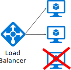
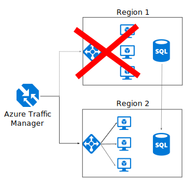

# Make all things redundant

## Build redundancy into your application, to avoid having single points of failure

A resilient application routes around failure. Identify the critical paths in your application. Is there redundancy at each point in the path? When a subsystem fails, will the application fail over to something else?

## Recommendations

**Consider business requirements**. The amount of redundancy built into a system can affect both cost and complexity. Your architecture should be informed by your business requirements, such as recovery time objective (RTO) and recovery point objective (RPO). You should also consider your performance requirements, and your team's ability to manage complex sets of resources.

**Consider multi-zone and multi-region architectures.** Ensure that you understand how [availability zones and regions](/azure/reliability/availability-zones-overview) provide resiliency and different sets of architectural tradeoffs.

Azure availability zones are isolated sets of data centers within a region. By using availability zones, you can be resilient to failures of a single data center or an entire availability zone. You can use availability zones to make tradeoffs between cost, risk mitigation, performance, and recoverability. For example, when you use zone redundant services in your architecture, Azure provides automatic data replication and failover between geographically separated instances, which mitigates many different types of risks.

If you have a mission-critical workload and need to mitigate the risk of a region-wide outage, consider a multi-region deployment. While multi-region deployments insulate you against regional disasters, they come at a cost. Multi-region deployments are more expensive than a single-region deployment, and are more complicated to manage. You'll need operational procedures to handle failover and failback. Depending on your RPO requirements, you might need to accept slightly lower performance to enable cross-region data replication. The additional cost and complexity might be justified for some business scenarios.

> [!TIP]
> For many workloads, a zone-redundant architecture provides the best set of tradeoffs. Consider a multi-region architecture if your business requirements indicate that you need to mitigate the unlikely risk of a region-wide outage, and if you're prepared to accept the tradeoffs involved in such an approach.

**Place VMs behind a load balancer**. Don't use a single VM for mission-critical workloads. Instead, place multiple VMs behind a load balancer. If any VM becomes unavailable, the load balancer distributes traffic to the remaining healthy VMs. To learn how to deploy this configuration, see [Multiple VMs for scalability and availability][multi-vm-blueprint].

**Replicate databases**. Azure SQL Database and Azure Cosmos DB automatically replicate the data within a region, and can be configured to replicate across availability zones for higher resiliency. You can also choose to enable geo-replication across regions. Geo-replication for [Azure SQL Database][sql-geo-replication] and [Azure Cosmos DB][cosmos-db-geo-replication] creates secondary readable replicas of your data in one or more secondary regions. If an outage occurs in the primary region, the database can fail over to the secondary region for writes. Depending on the replication configuration you might experience some data loss from unreplicated transactions.

If you use an IaaS database solution, choose one that supports replication and failover, such as [SQL Server Always On availability groups][sql-always-on].

**Partition for availability**. Database partitioning is often used to improve scalability, but it can also improve availability. If one shard goes down, the other shards can still be reached. A failure in one shard will only disrupt a subset of the total transactions.

### Multi-region solutions

The following diagram shows a multi-region application that uses Azure Traffic Manager to handle failover.

If you use Traffic Manager in a multi-region solution, consider the following recommendations:

**Synchronize front and backend failover**. Use Traffic Manager to fail over the front end. If the front end becomes unreachable in one region, Traffic Manager will route new requests to the secondary region. Depending on your backend components and database solution, you may need to coordinate failing over your backend services and databases.

**Use automatic failover but manual failback**. Use Traffic Manager for automatic failover, but not for automatic failback. Automatic failback carries a risk that you might switch to the primary region before the region is completely healthy. Instead, verify that all application subsystems are healthy before manually failing back. Also, depending on the database, you might need to check data consistency before failing back.

To achieve this, disable the primary endpoint of Traffic Manager after failover. Note that if the monitoring interval of probes is short and the tolerated number of failures is small, failover as well as failback will take place in a short time. In some cases, disabling won't be completed in time. To avoid unconfirmed failback, consider also implementing a health endpoint that can verify that all subsystems are healthy. See the [Health Endpoint Monitoring pattern].

**Include redundancy for Traffic Manager**. Traffic Manager is a possible failure point. Review the Traffic Manager SLA, and determine whether using Traffic Manager alone meets your business requirements for high availability. If not, consider adding another traffic management solution as a failback. If the Azure Traffic Manager service fails, change your CNAME records in DNS to point to the other traffic management service.

<!-- links -->

[multi-vm-blueprint]: ../../reference-architectures/n-tier/n-tier-sql-server.yml

[cosmos-db-geo-replication]: /azure/cosmos-db/distribute-data-globally
[sql-always-on]: /sql/database-engine/availability-groups/windows/always-on-availability-groups-sql-server?view=sql-server-ver15&preserve-view=true
[sql-geo-replication]: /azure/sql-database/sql-database-geo-replication-overview
[Health Endpoint Monitoring pattern]: ../../patterns/health-endpoint-monitoring.yml
