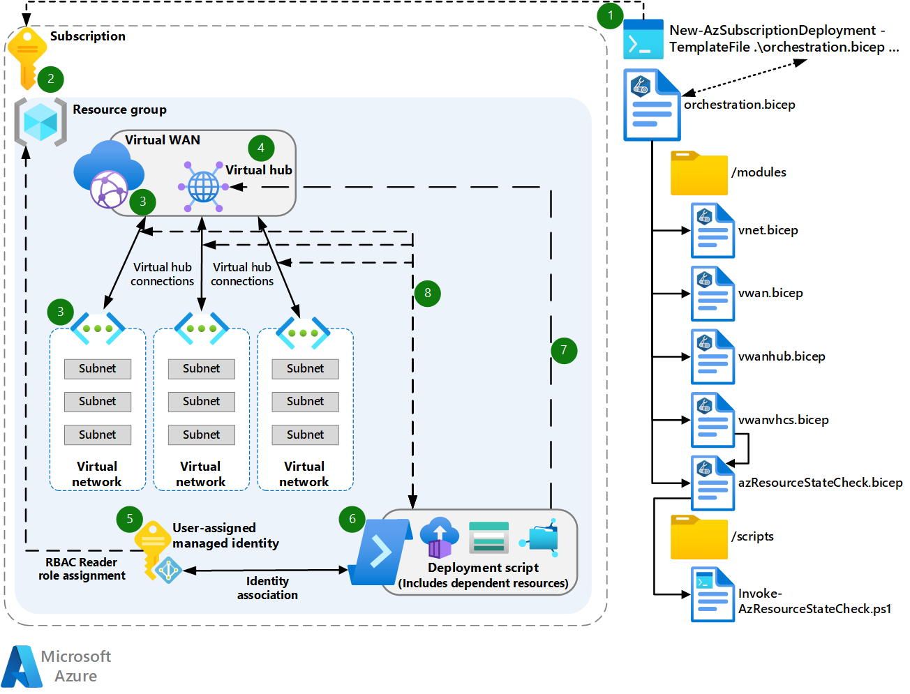
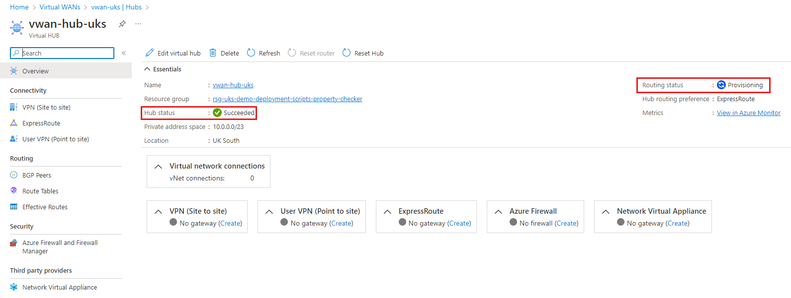
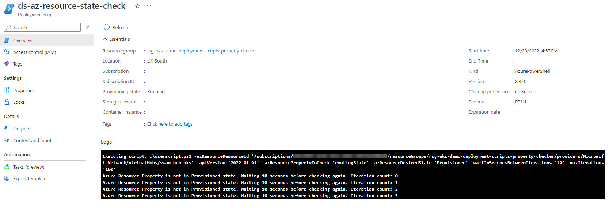

This article describes how to use Bicep and a deployment script to pause a deployment in order to wait for a resource property to return a specific value. You can use this technique to ensure that a deployment succeeds when the resource that's being deployed reports to Resource Manager that it's ready but the underlying resources aren't. When this happens, the resource that's being deployed isn't yet ready to interact with the remainder of the deployment, so a pause is required.

This article uses an Azure Virtual WAN scenario to illustrate the technique. The resource check and pause is implemented in these files:

> - [orchestration.bicep](https://github.com/Azure/CAE-Bits/blob/main/infra/samples/deployment-scripts-property-check/orchestration.bicep)
> - [azResourceStateCheck.bicep](https://github.com/Azure/CAE-Bits/blob/main/infra/samples/deployment-scripts-property-check/modules/azResourceStateCheck.bicep)
> - [Invoke-AzResourceStateCheck.ps1](https://github.com/Azure/CAE-Bits/blob/main/infra/samples/deployment-scripts-property-check/scripts/Invoke-AzResourceStateCheck.ps1)

You can adapt the files for your deployment. The azResourceStateCheck.bicep module is parameterized for ease of reuse. Be sure to note how the **dependsOn** property is used in orchestration.bicep to make the vwanvhcs.bicep module deployment depend on the azResourceStateCheck.bicep nodule deployment.

## Architecture

[](images/deployment-scripts-property-check.png#lightbox)

*Download a [Visio file](https://arch-center.azureedge.net/deployment-scripts-property-check.vsdx) of this architecture.*

*Review and download the [code samples in GitHub](https://github.com/Azure/CAE-Bits/tree/main/infra/samples/deployment-scripts-property-check) for this architecture.*

### Workflow

1. Submit the [orchestration.bicep](https://github.com/Azure/CAE-Bits/blob/main/infra/samples/deployment-scripts-property-check/orchestration.bicep) file for deployment to Resource Manager at the subscription scope.
   > [!NOTE]
   > You can get this Bicep file and the other files that are used for this example from the [infra/samples/deployment-scripts-property-check directory](https://github.com/Azure/CAE-Bits/tree/main/infra/samples/deployment-scripts-property-check) in the Azure/CAE-Bits GitHub repo. The organization of the files in the repo is shown in part on the right-hand side of the architecture diagram.
1. The orchestration.bicep file creates a resource group at the subscription scope.
1. The orchestration.bicep file deploys the Virtual WAN and the spoke virtual networks:
   - It deploys the [vwan.bicep](https://github.com/Azure/CAE-Bits/blob/main/infra/samples/deployment-scripts-property-check/modules/vwan.bicep) module, which deploys the WAN at resource group scope.
   - It deploys the [vnet.bicep](https://github.com/Azure/CAE-Bits/blob/main/infra/samples/deployment-scripts-property-check/modules/vnet.bicep) module, which deploys the virtual networks at resource group scope.

   The virtual WAN and spoke virtual networks are deployed in parallel, which means that Bicep regards them as independent of one another. Dependencies determine the order of deployment in Bicep. A resource is deployed before any resource that depends on it. For more information about resource dependencies in Bicep, including explicit and implicit dependencies, see [Resource dependencies in Bicep](/azure/azure-resource-manager/bicep/resource-dependencies).
1. The orchestration.bicep file deploys the [vwanhub.bicep](https://github.com/Azure/CAE-Bits/blob/main/infra/samples/deployment-scripts-property-check/modules/vwanhub.bicep) module, which deploys the virtual WAN hub at resource group scope. The hub depends implicitly on the virtual WAN, so deployment of the hub is guaranteed to occur only after deployment of the virtual WAN completes.
1. The orchestration.bicep file deploys the [azResourceStateCheck.bicep](https://github.com/Azure/CAE-Bits/blob/main/infra/samples/deployment-scripts-property-check/modules/azResourceStateCheck.bicep) module, which creates a user-assigned managed identity and assigns the Azure role-based access control (RBAC) Reader role on the resource group.
1. The azResourceStateCheck.bicep module deploys the [deployment script resource](/azure/templates/microsoft.resources/deploymentscripts?pivots=deployment-language-bicep).
1. The deployment script resource uses the user-assigned managed identity to authenticate itself against Resource Manager. It then runs the deployment script, [Invoke-AzResourceStateCheck.ps1](https://github.com/Azure/CAE-Bits/blob/main/infra/samples/deployment-scripts-property-check/scripts/Invoke-AzResourceStateCheck.ps1), which is a PowerShell script. For more information about deployment scripts, see [Use deployment scripts in Bicep](/azure/azure-resource-manager/bicep/deployment-script-bicep).

   The script polls the Virtual WAN hub **routingStatus** property to determine whether it has the value of **Provisioned**:
   1. If the property value isn't **Provisioned**, the script pauses for a duration that's specified by a parameter that's set in the orchestration.bicep file and passed to the azResourceStateCheck.bicep module. The script then checks the value of the **routingStatus** property value again.

      The script repeats the pause and check cycle for a maximum number of iterations, a number that's specified by a parameter that's set in the orchestration.bicep file. If the property value isn't **Provisioned** after the maximum number of iterations, the script throws an exception and exits, which causes the remainder of the Bicep deployment to stop and fail.
   1. If the property value is **Provisioned**, no matter how many iterations it takes, the deployment script exits with a success code (0).
1. If the deployment script succeeds, the orchestration.bicep file deploys the [vwanvhcs.bicep](https://github.com/Azure/CAE-Bits/blob/main/infra/samples/deployment-scripts-property-check/modules/vwanhub.bicep) module, which creates the connections between the spoke virtual networks and the Virtual WAN hub.

   The definition of the vwanvhcs.bicep module that's in orchestration.bicep has a **dependsOn** clause that causes vwanvhcs.bicep to depend explicitly on the successful completion of the azResourceStateCheck.bicep module. Therefore, the connections are created only if the **routingStatus** property is **Provisioned**.

   The vwanvhcs.bicep module deploys the Virtual WAN hub connections sequentially rather than in parallel, because parallel deployment isn't supported on a single Virtual WAN hub. The module uses the Bicep **batchSize** decorator to set the batch size to 1: `@batchSize(1)`. This means that the connections are deployed one at a time.

### Scenario details

The key parts of this architecture are the azResourceStateCheck.bicep module, which deploys the deployment script resource, and the associated deployment script Invoke-AzResourceStateCheck.ps1, a PowerShell file. The module uses the deployment script to check the value of a resource property. In this example, the resource is a Virtual WAN hub.

Because this environment is all deployed from a single file that uses Bicep modules, we can use **dependsOn** to make one module depend explicitly on another. In this example, **dependsOn** makes the vwanvhcs.bicep module depend on the azResourceStateCheck.bicep module.

The following excerpt from orchestration.bicep shows the use of **dependsOn**:

<!--

The following is not currently supported in the architecture-center-pr repo:

:::code language="bicep" source="~/azure-cae-bits/infra/samples/deployment-scripts-property-check/orchestration.bicep" range="57-68,98-134" highlight="110,125-127":::

-->

```Bicep
@description('The API Version of the Azure Resource you wish to use to check a properties state.')
param parAzResourceApiVersion string = '2022-01-01'

@description('The property of the resource that you wish to check. This is a property inside the `properties` bag of the resource that is captured from a GET call to the Resource ID.')
param parAzResourcePropertyToCheck string = 'routingState'

@description('The value of the property of the resource that you wish to check.')
param parAzResourceDesiredState string = 'Provisioned'

@description('How long in seconds the deployment script should wait between check/polling requestes to check the property, and its state, if not in its desired state. Defaults to `30`')
param parWaitInSecondsBetweenIterations int = 30

module modVWANHub 'modules/vwanHub.bicep' = {
  scope: rsg
  name: 'deployVWANHub'
  params: {
    region: region
    regionNamePrefix: regionNamePrefix
    defaultTags: defaultTags
    vwanHubCIDR: vwanHubCIDR
    vwanName: modVWAN.outputs.vwanName
  }
}

module modVWANHubRouterCheckerDeploymentScript 'modules/azResourceStateCheck.bicep' = {
  scope: rsg
  name: 'deployVWANHubRouterChecker'
  params: {
    parLocation: region
    parAzResourceId: modVWANHub.outputs.outVwanVHubId
    parAzResourceApiVersion: parAzResourceApiVersion
    parAzResourcePropertyToCheck: parAzResourcePropertyToCheck
    parAzResourceDesiredState: parAzResourceDesiredState
    parMaxIterations: parMaxIterations
    parWaitInSecondsBetweenIterations: parWaitInSecondsBetweenIterations
  }
}

module modVWanVhubVnetConnections 'modules/vwanVhcs.bicep' = {
  dependsOn: [
    modVWANHubRouterCheckerDeploymentScript
  ]
  scope: rsg
  name: 'deployConnectVnetsToVWANVHub'
  params: {
    vnets: vnets
    regionNamePrefix: regionNamePrefix
  }
}
```

The resource check is required because, when a Virtual WAN hub is deployed, it's not ready for use until the **routingStatus** property has the value of **Provisioned**. When the hub is created, it reports to the Resource Manager that deployment succeeded, so the deployment engine continues deploying. However, the hub isn't ready right away. The Virtual WAN hub router is still being provisioned into the created hub, which takes 15 minutes or so to complete.

This behavior can be seen in the following screenshot of a newly created Virtual WAN hub. The screenshot shows a hub status of **Succeeded** but a routing status of **Provisioning** (not yet **Provisioned**):

[](images/vwan-hub-routing-status-provisioning.png#lightbox)

If you try to deploy the vwanvhcs.bicep module to create the Virtual WAN hub connections before the **routingStatus** value is **Provisioned**, the attempt to create connections fails and so does the overall deployment. Until the router is provisioned, attempts to redeploy fail.

The following screenshot shows an example of the log that the deployment script creates as it checks the **routingStatus** property of the Virtual WAN hub. The log shows repeated checks of the property that show a value other than **Provisioned**:

[](images/deployment-script-in-action.png#lightbox)

The following screenshot shows that, after more than 10 minutes of checking, the value becomes **Provisioned**:

[](images/deployment-script-complete.png#lightbox)

If the value doesn't become **Provisioned** after the maximum number of iterations, the script throws an exception, which signals to Resource Manager that the script resource failed. The Resource Manager deployment engine fails and stops the deployment, because the exception suggests that there's an issue with the Azure resource that requires troubleshooting.

The Invoke-AzResourceStateCheck.ps1 script is as follows:

<!--

The following is not currently supported in the architecture-center-pr repo:

:::code language="powershell" source="~/azure-cae-bits/infra/samples/deployment-scripts-property-check/scripts/Invoke-AzResourceStateCheck.ps1" :::

-->

```Bicep
[CmdletBinding()]
param (
  [string]
  $azResourceResourceId,

  [string]
  $apiVersion = "2022-05-01",

  [string]
  $azResourcePropertyToCheck = "provisioningState",

  [string]
  $azResourceDesiredState = "Provisioned",

  [int]
  $waitInSecondsBetweenIterations = 30,

  [int]
  $maxIterations = 30
)

$totalTimeoutCalculation = $waitInSecondsBetweenIterations * $maxIterations

$azResourcePropertyExistenceCheck = Invoke-AzRestMethod -Method GET -Path "$($azResourceResourceId)?api-version=$($apiVersion)"

if ($azResourcePropertyExistenceCheck.StatusCode -ne "200") {
  $DeploymentScriptOutputs["azResourcePropertyState"] = "Not Found"
  throw "Unable to get Azure Resource - $($azResourceResourceId). Likely it doesn't exist. Status code: $($azResourcePropertyExistenceCheck.StatusCode) Error: $($azResourcePropertyExistenceCheck.Content)"
}

$azResourcePropertyStateResult = "Unknown"
$iterationCount = 0

do {
  $azResourcePropertyStateGet = Invoke-AzRestMethod -Method GET -Path "$($azResourceResourceId)?api-version=$($apiVersion)"
  $azResourcePropertyStateJsonConverted = $azResourcePropertyStateGet.Content | ConvertFrom-Json -Depth 10
  $azResourcePropertyStateResult = $azResourcePropertyStateJsonConverted.properties.$($azResourcePropertyToCheck)

  if ($azResourcePropertyStateResult -ne $azResourceDesiredState) {
    Write-Host "Azure Resource Property ($($azResourcePropertyToCheck)) is not in $($azResourceDesiredState) state. Waiting $($waitInSecondsBetweenIterations) seconds before checking again. Iteration count: $($iterationCount)"
    Start-Sleep -Seconds $waitInSecondsBetweenIterations
    $iterationCount++
  }
} while (
  $azResourcePropertyStateResult -ne $azResourceDesiredState -and $iterationCount -ne $maxIterations
)

if ($azResourcePropertyStateResult -eq $azResourceDesiredState) {
  Write-Host "Azure Resource Property ($($azResourcePropertyToCheck)) is now in $($azResourceDesiredState) state."
  $DeploymentScriptOutputs["azResourcePropertyState"] = "$($azResourceDesiredState)"
}

if ($iterationCount -eq $maxIterations -and $azResourcePropertyStateResult -ne $azResourceDesiredState) {
  $DeploymentScriptOutputs["azResourcePropertyState"] = "Azure Resource Property ($($azResourcePropertyToCheck)) is still not in desired state of $($azResourceDesiredState). Timeout reached of $($totalTimeoutCalculation) seconds."
  throw "Azure Resource Property ($($azResourcePropertyToCheck)) is still not in $($azResourceDesiredState) state after $($totalTimeoutCalculation) seconds."
}
```

## Contributors

*This article is maintained by Microsoft. It was originally written by the following contributors.*

Principal author:

- [Jack Tracey](https://www.linkedin.com/in/jacktracey93) | Senior Cloud Solutions Architect

Other contributor:

- [Gary McMahon](https://www.linkedin.com/in/gmcmaho1/) | Senior Cloud Solutions Architect

*To see non-public LinkedIn profiles, sign in to LinkedIn.*

## Next steps

- [Files for the example in the Azure/CAE-Bits repo](https://github.com/Azure/CAE-Bits/tree/main/infra/samples/deployment-scripts-property-check)
- [Use deployment scripts in Bicep](/azure/azure-resource-manager/bicep/deployment-script-bicep)
- [Learn module: Extend Bicep and ARM templates using deployment scripts](/training/modules/extend-resource-manager-template-deployment-scripts/)
- [Everything you wanted to know about exceptions](/powershell/scripting/learn/deep-dives/everything-about-exceptions)
- [Migrate to Azure Virtual WAN](/azure/virtual-wan/migrate-from-hub-spoke-topology)
- [Resource dependencies in Bicep](/azure/azure-resource-manager/bicep/resource-dependencies)
- [Bicep documentation](/azure/azure-resource-manager/bicep)

## Related resources

- [Hub-spoke network topology with Azure Virtual WAN](../../networking/hub-spoke-vwan-architecture.yml)
- [Enterprise infrastructure as code using Bicep and Azure Container Registry](../azure-resource-manager/advanced-templates/enterprise-infrastructure-bicep-container-registry.yml)
- [Architectural approaches for the deployment and configuration of multitenant solutions](../multitenant/approaches/deployment-configuration.yml)
- [DevSecOps for infrastructure as code (IaC)](../../solution-ideas/articles/devsecops-infrastructure-as-code.yml)
