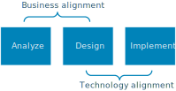

# Analyze the business domain

The first step, before making any decisions about architecture or technology, is to analyze the business domain to derive functional and non-functional requirements.

## Functional requirements

(something here)

Considering using domain driven design (DDD) 

to identity bounded contexts. A *bounded context* is an explicit boundary around a domain model. It defines which parts of the domain the model applies to. Ideally, a bounded context maps directly to a subdomain of the business domain. (That might not always be the case. If the application integrates with legacy systems, for example, the bounded contexts may be messier than ideal.) 

Bounded contexts are the starting point when decomposing an application into services. Generally, application services should not cross bounded contexts. There might be multiple services within a bounded context. Throughout this guide, many of the decision points are applied within a bounded context. For example, when you select an architecture style, you should be looking at a bounded context. You might adopt a different style for another context.

> Does every application require a DDD approach? Not necessarily. If you're building a simple web application that mostly does CRUD operations on a data set, you may feel that DDD is superfluous. That said, DDD is compatible with agile development. There's no reason that DDD needs be a heavyweight process.

## Non-functional requirements

Non-functional requirements will influence many of the technical decisions that you make along the way. 

| Requirement | Leads to... |
|-------------|------------|
| Recovery time objective (RTO) |  Failover period |
| Recovery point objective (RPO) | Backup interval  |
| Service level agreement (SLA) and service level objectives (SLO) | Choice of Azure services and level of redundancy |
| Throughput and latency | Choice of SKU or service tier |
