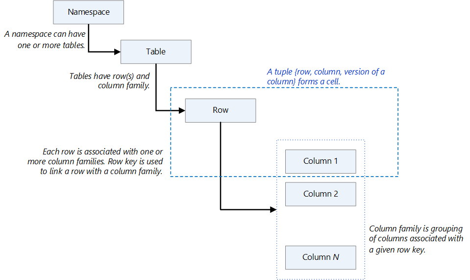
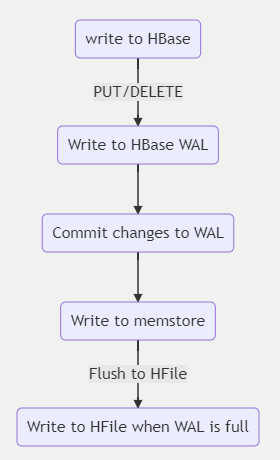
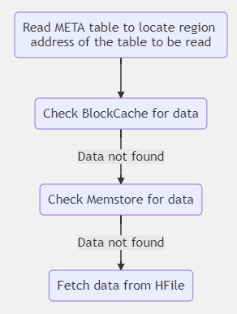
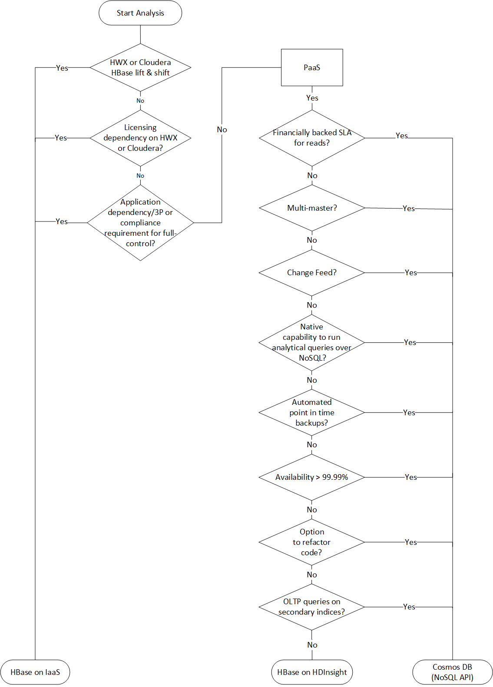
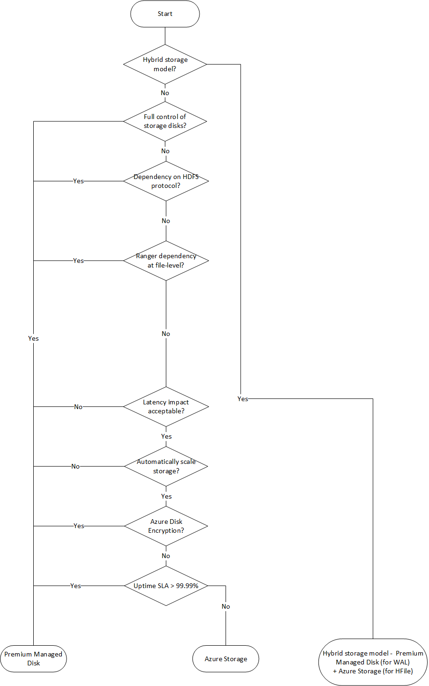
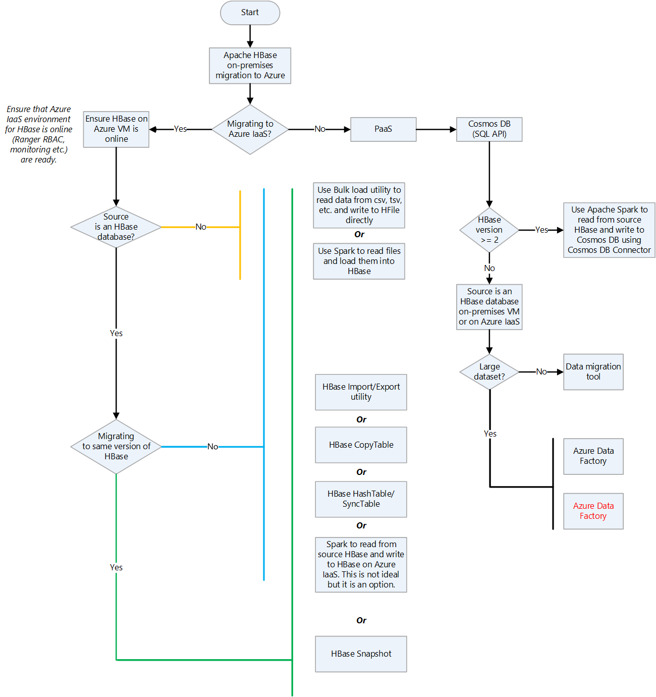
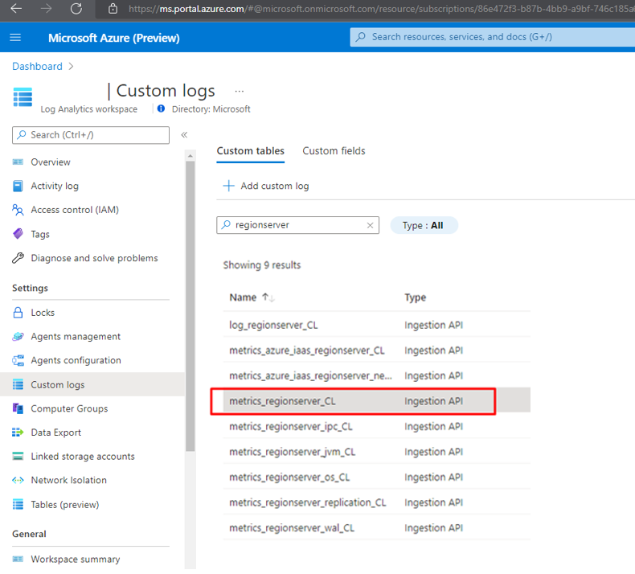

[Apache HBase](https://hbase.apache.org) is a Java-based, NoSQL column-store, distributed application that's built on top of the Hadoop Distributed File System (HDFS). It's modeled after Google's Bigtable and brings most of the Bigtable capabilities to the Hadoop ecosystem.

HBase is a distributed system. From a [CAP theorem](/dotnet/architecture/cloud-native/relational-vs-nosql-data#the-cap-theorem) perspective, it's designed for consistency and partitioning. In terms of workload profile, it's designed to serve as a datastore for data-intensive applications that require low-latency and near real-time random reads and writes.

This article discusses components and principles that play a role in planning and building an HBase cluster on Azure for a migration. The discussion is especially pertinent for these migration targets:

- Apache HBase in Azure HDInsight
- Azure IaaS by doing a lift and shift to virtual machines (VMs)
- Azure Cosmos DB.

*[Apache](https://www.apache.org), [Apache Spark®](https://spark.apache.org), [Apache Hadoop®](https://hadoop.apache.org), [Apache HBase](https://hbase.apache.org), [Apache Ranger®](https://ranger.apache.org), [Apache ZooKeeper®](https://zookeeper.apache.org),  [Apache Sqoop®](https://sqoop.apache.org), [Apache Kafka®](https://kafka.apache.org), and the flame logo are either registered trademarks or trademarks of the Apache Software Foundation in the United States and/or other countries. No endorsement by The Apache Software Foundation is implied by the use of these marks.*

## HBase components, core concepts, and architecture

HBase follows a leader/follower model. This section discusses the components and nodes that are in an HBase deployment.

### Components

The main HBase components are the Master server, the ZooKeeper nodes, and the RegionServers.

#### Master server

The [Master server](https://HBase.apache.org/book.html#architecture.master) is responsible for all metadata operations for an HBase cluster. This includes creation and deletion of objects, monitoring of RegionServers, and other operations. There are usually two Master servers deployed for high availability.

#### ZooKeeper nodes

[ZooKeeper](https://zookeeper.apache.org) is a centralized service for maintaining configuration information, naming, providing distributed synchronization, and providing group services. These capabilities are needed for coordination in a distributed application environment such as HBase.

#### RegionServers

[RegionServers](https://HBase.apache.org/book.html#regionserver.arch) are responsible for serving and managing regions or partitions. A RegionServer does most of the processing of a client read or write request. In a distributed deployment of HBase, a RegionServer runs on an HDFS DataNode.

### Core concepts

It's important that you understand the core concepts of the HBase architecture and data model so that you can optimize an HBase deployment.

- [Data model](#data-model)
- [Write path](#write-path)
- [Read path](#read-path)
- [Off-heap read and write paths](#off-heap-read-and-write-paths)

#### Data model

- **Namespace:** A logical grouping of tables, like a database in a relational database system. Namespaces make possible several features that are related to multi-tenancy.
- **Table:** A grouping or collection of rows. Tables are stored in regions or partitions that are spread across RegionServers.
- **Row:** A row consists of a row key and a grouping of columns that's called a *column family*. Rows are sorted and stored based on the row key.
- **Column family:** A grouping of columns that have the same prefix.
- **Cell:** A data location that's uniquely identified by a {row, column, version} tuple.
- **Data model operations:** There are four primary data model operations:
  - **Get** returns attributes for a specified row.
  - **Put** either adds new rows to a table or updates existing rows.
  - **Scan** allows iteration over multiple rows for specified attributes.
  - **Delete** removes a row from a table. A marker, called a *tombstone* is placed on records to mark them for deletion. The tombstones and deleted rows are removed during major compactions.
  
The following diagram illustrates these concepts.



#### Write path

HBase uses a combination of data structures that reside in memory and in persistent storage to deliver fast writes. When a write occurs, the data is first written to a write-ahead log (WAL), which is a data structure that's stored on persistent storage. The role of the WAL is to track changes so that logs can be replayed in case of a server failure. The WAL is only used for resiliency.
After data is committed to the WAL, it's written to MemStore, which is an in-memory data structure. At this stage, a write is complete.

For long-term data persistence, HBase uses a data structure called an *HBase file* (HFile). An HFile is stored on HDFS. Depending on MemStore size and the data flush interval, data from MemStore is written to an HFile. For information about the format of an HFile, see [Appendix G: HFile format](https://HBase.apache.org/book.html#_hfile_format_2).

The following diagram shows the steps of a write operation.



To summarize, the components on the write path are:

- The **WAL** is a data structure that's stored on persistent storage.
- **MemStore** is an in-memory, on-heap data structure.
- **HFile** is an HBase file that's stored on HDFS and used for data persistence.

#### Read path

HBase uses several data structures to deliver fast random and sequential reads. HBase tries to fulfill read requests from data that's cached in BlockCache and, failing that, from MemStore. Both are stored on-heap. If the data isn't available from cache, It's fetched from an HFile and cached in BlockCache.

The following diagram shows the steps of a read operation.



> [!NOTE]
> For situations that require low read latency, there's an option to cache data in BucketCache, which is an in-memory data structure and is usually off-heap. Data that's stored in BucketCache needn't be stored in BlockCache, so heap activity is reduced and reads are faster. For more information, see [BucketCache](https://hbase.apache.org/book.html#offheap.blockcache).

#### Off-heap read and write paths

To reduce read and write latencies, HBase versions 2.x and later have a pool of off-heap buffers that are used for writing and reading. The workflow for writing and reading data does its best to avoid on-heap memory allocations in order to reduce the amount of work that garbage collection must do to complete reads and writes. The buffers must be optimized, because their use depends greatly on factors such as the number of regions and RegionServers, memory size, and premium storage that's attached to the HBase cluster on Azure. These parameters are not necessarily the same on the migrated system as on the source system.

## Challenges of running HBase on-premises

These common challenges of on-premises HBase deployments can be reasons for wanting, or needing, to migrate HBase to the cloud:

- Achieving scalability, which can be difficult depending on hardware and data center capacity.
- Having to replace hardware or migrate applications because of end of support for aging infrastructure.
- Achieving high availability and disaster recovery, for reasons such as:
  - Lack of data-center sites
  - Failure of the HBase cluster when the Master, a single point of failure, fails.
- Achieving high productivity, because an on-premises Hadoop ecosystem is complex, hard to manage, and prone to failures.
- The lack of native tools for:
  - Cost transparency
  - Monitoring
  - DevOps
  - Automation

## Considerations for an HBase migration

- If HBase infrastructure as a service (IaaS) migration is your first workload on Azure, we strongly recommend that you the invest time and effort needed to build a strong foundation for hosting workloads on Azure. You do this by using Cloud Adoption Framework enterprise-scale landing zone guidance. Enterprise-scale is an architectural approach and a reference implementation that makes it possible to effectively construct and operationalize landing zones on Azure, at scale. For more information, see [What is an Azure landing zone?](/azure/cloud-adoption-framework/ready/enterprise-scale/architecture).
- We strongly recommend that all workloads that you run on Azure are designed and deployed according to the [Well-Architected Framework](/azure/architecture/framework), which is a set of guiding tenets that you can use to improve the quality of a workload. The framework consists of five pillars of architecture excellence: Cost Optimization, Operational Excellence, Performance Efficiency, Reliability, and Security.
- When you design and choose Azure compute and storage, consider service limits. Compute and storage have limits that can affect the sizing of infrastructure for a data-intensive application such as HBase. For more information, see [Azure subscription and service limits, quotas, and constraints](/azure/azure-resource-manager/management/azure-subscription-service-limits).
- A subscription should be used as a unit of scale. You add more instances of a service to scale out as required. Taking from Cloud Adoption Framework enterprise-scale design principles, use the subscription as a unit of management and scale. Align subscriptions to business needs and priorities, and support business areas and portfolio owners to encourage migrating current applications and developing new ones.
- An HBase deployment on Azure can use various types of storage for caching and persistent storage. Evaluate the options when you deploy HBase solutions on Azure.
- After you migrate to Azure IaaS, you need to optimize performance and right-size the infrastructure. There are many factors that affect performance, including the size of the infrastructure, the storage types, and the distribution of regions. Even if you minimize application changes when you migrate, an Azure environment is fundamentally different from an on-premises one. There are Azure features and limits to consider in order to meet performance requirements.

## Migration approaches

Azure has several landing targets for Apache HBase. Depending on requirements and product features, you can choose between Azure IaaS (lift and shift to VMs), HBase in HDInsight, and Azure Cosmos DB (SQL API).

Here's a decision flowchart for selecting a target environment:

  

These targets are discussed in the following sections:

- [Migrate to Azure IaaS](#migrate-to-azure-iaas)
- [Migrate to HBase in HDInsight](#migrate-to-hbase-in-hdinsight)
- [Migrate to Azure Cosmos DB (SQL API)](#migrate-to-azure-cosmos-db-sql-api)

### Migrate to Azure IaaS

Migrating HBase to Azure IaaS requires the following activities:

- [Assess the existing deployment and decide on requirements](#assess-the-existing-deployment-and-decide-on-requirements)
- [Consider VM options](#consider-vm-options)
- [Consider storage options](#consider-storage-options)
- [Migrate data](#migrate-data)
- [Establish security](#establish-security)
- [Monitor the HBase deployment](#monitor-the-hbase-deployment)

#### Assess the existing deployment and decide on requirements

The following table provides guidance on assessing the existing deployment of HBase and on establishing a set of requirements for an HBase migration to Azure.

|Layer|Characteristic|Background|
|---|---|---|
|**Infrastructure**|Number of servers for each type of role:<br>HBase Master, RegionServer, ZooKeeper node|Understand the scale and design of the existing solution.|
||Number of cores per server|Use the `lscpu` or the `cat /proc/cpuinfo` command to list cores per server.|
||Memory per server|On Linux, use `free -mg` or `cat /proc/meminfo` to report on memory on each server.|
||Is the existing environment virtualized, or deployed on bare-metal servers?|This information is used for sizing and for understanding the performance characteristics of the on-premises HBase environment.|
||Network configuration|Understand the network bandwidth that each VM can support, and whether a special NIC configuration is used to support high bandwidth between HBase servers.<br>Use the following commands to extract details of VM network configuration: `ifconfig -a` or `ethtool <name of the interface>`.|
||Storage configuration|What is the total size of the data including replicas? Usually, the default configuration of HDFS replicates data three times. The HDFS CLI can be used to extract the total size of data persisted by HBase: <br>`hdfs dfs -du -h hdfs://<data node address>/HBase`<br>Also, establish storage performance targets (IOPS and throughput). This information is used to provision storage and to understand the level of throughput required to support the Azure deployment.|
|**Operating system**|Version and distribution type|The following command prints out details of the Linux distribution and version:<br>`uname -a`|
||Kernel parameters|See the note that follows this table.|
|**Application**|The versions of HBase and Hadoop distributions, such as Hortonworks and Cloudera, that are in use|The distribution is usually one of the following: HortonWorks, Cloudera, MapR, or an open-source version of Hadoop and HBase.<br>To find out the versions of HBase and Hadoop, use the following commands:<br>`hbase version` and `hdfs version`.|
||HBase-specific information: the number of tables, the metadata for each table (regions, column-family)|You can extract information related to HBase deployment by using the Ambari UI. If that's not available, you can use CLI:<br>`scan 'hbase:meta' {FILTER=>"PrefixFilter('tableName')", COLUMNS=>['info:regioninfo']}}`<br>To list all the regions associated with a given table, use:<br>`list_regions '<table name>'`|
||JAVA (JDK) version|`java -version`}|
||HBase garbage collection configuration|What garbage collection strategy is used? The most common are concurrent mark sweep (CMS) and garbage first (G1). The strategy is specified in the `hbase-env.sh` configuration file. Recent research shows G1 to be more efficient for large heap sizes.|
|**Security & administration**|The ways that HBase is accessed|How do users access the data in HBase? Is it by using APIs or directly by using the HBase shell?<br>How do applications consume data?<br>How is data written to HBase and how far away is HBase? Is it in the same data center?|
||User provisioning|How are users authenticated and authorized? The possibilities include:<br>• Ranger<br>• Knox<br>• Kerberos|
||Encryption|Is there a requirement to encrypt data? In transport? At rest? What encryption solutions are used?|
||Tokenization|Is there a requirement to tokenize data? If so, how? Popular tokenization applications include Protegrity and Vormetric.|
||Compliance|Are there any special regulatory requirements applicable to HBase workloads, such as CI-DSS or HIPAA?|
||Management policies for keys, certificates, and secrets|What policies and tools are used to manage secrets?|
|**High availability and disaster recovery**|What is the service level agreement (SLA) and what are the recovery point objectives (RPO) and recovery time objectives (RTO) of the source HBase deployment?|The answers affect the design of the target deployment on Azure. For instance, should there be a hot standby or an active-active regional deployment?|
||What are the business continuity (BC) and data recovery (DR) strategies for HBase workloads?|Describe BC and DR strategies and the impact if HBase isn't available.|
|**Data**|Data size and growth|How much data is migrated to HBase initially? What is the expected growth after 6, 12, and 18 months? This information is used for capacity planning and for sizing the cluster. Eventually, it's also used to optimize deployment costs.|
||Ingestion|How is data written to HBase?|
||Consumption|How is HBase data used? Is it by using APIs, or by a compute engine such as HDInsight Spark or Databricks Spark?|
||Access pattern|Is traffic on HBase read-heavy or write-heavy? This affects the fine-tuning of the HBase configuration parameters that are defined in the `hbase-site.xml` and `hdfs-site.xml` files.|

> [!NOTE]
> Kernel-level parameters may have been applied to improve HBase performance on the source system. Because the performance characteristics of the migrated system aren't the same, we recommend against changing default parameters to match the source system except to follow recommendations from your operating system vendor or your application vendor. In most cases, it's best to adjust kernel parameters during the performance optimization phase of the migration.<br>**Linux memory and block device parameters**<br>`cat /sys/kernel/mm/transparent_hugepage/enabled`<br>`cat /sys/kernel/mm/transparent_hugepage/defrag`<br>`cat /sys/block/sda/queue/scheduler`<br>`cat /sys/class/block/sda/queue/rotational`<br>`cat /sys/class/block/sda/queue/read_ahead_kb`<br>`cat /proc/sys/vm/zone_reclaim_mode`<br>**Linux network stack parameters**<br>`sudo sysctl -a \ grep -i "net.core.rmem_max\|net.core.wmem_max\|net.core.rmem_default\|net.core.wmem_default\|net.core.optmem_max\|net.ipv4.tcp_rmem\|net.ipv4.tcp_wmem"`|

There are several partner solutions that can assist with assessment. [Unravel](https://www.unraveldata.com/cloud-migration-assessment) has solutions that can help you fast-track assessment for data migrations to Azure.

#### Consider VM options

**[Azure Virtual Machines](/azure/virtual-machines/linux/overview)** is one of several types of on-demand, scalable compute resources that Azure offers. Typically, you choose a VM when you need more control over the computing environment than other choices offer.

As you design your migration and select VMs, consider the following:

- The names of your application resources
- The location where the resources are stored
- The size of the VM
- The maximum number of VMs that can be created
- The operating system that the VM runs
- The configuration of the VM after it starts
- The related resources that the VM needs

For more information, see [What do I need to think about before creating a VM?](/azure/virtual-machines/linux/overview#what-do-i-need-to-think-about-before-creating-a-vm).

Azure VM families are optimized to suit different use cases and to provide a balance of compute (virtual cores) and memory.

|Type|Size|Description|
|---|---|---|
|[Entry Level](/azure/virtual-machines/sizes-general)|A, Av2|A-series VMs have CPU performance and memory configurations that are best suited for entry level workloads such as development and test. They are a low-cost option for getting started with Azure.|
|[General Purpose](/azure/virtual-machines/sizes-general)|D, DSv2, Dv2|These VMs have balanced CPU-to-memory ratios. They're ideal for testing and development, for small to medium databases, and for web servers that have low to medium traffic.|
|[Compute Optimized](/azure/virtual-machines/sizes-compute)|F|These VMs have a high CPU-to-memory ratio. They're good for medium traffic web servers, network appliances, batch processes, and application servers.|
|[Memory Optimized](/azure/virtual-machines/sizes-memory)|Esv3, Ev3|These VMs have a high memory-to-CPU ratio. They're good for relational database servers, medium to large caches, and in-memory analytics.|

For more information, see [Virtual machines in Azure](/azure/virtual-machines/linux/overview).

HBase is designed to use memory and premium storage (such as SSDs) in order to optimize database performance.

- It ships with features like BucketCache, which can significantly improve read performance. BucketCache is stored off-heap, so we recommend VMs that have higher memory-to-CPU ratios.
- The HBase write path writes changes to a WAL, which is a data structure that's persisted on a storage medium. Storing the WAL on a fast storage medium such as SSDs improves write performance.
- HBase is designed to scale out as performance and storage requirements grow.

For more information about sizing Azure VMs, see [Sizes for virtual machines in Azure](/azure/virtual-machines/sizes).

Based on considerations of compute and memory needs, we recommend using the following Azure compute family types for the various HBase node types:

- **HBase Master** – For enterprise deployments, we recommend at least two Masters for high availability. For a large HBase cluster, a DS5_v2 Azure VM with 16 virtual CPUs (vCPUs) and 56 GiB of memory should suffice for most deployments. For medium-sized clusters, we recommend at least 8 vCPUs and 20 to 30 GiB of memory.
- **HDFS NameNode** – We recommend hosting HDFS NameNodes on different VMs than those that the Masters use. Two NameNodes should be deployed for high availability. For the Masters, we recommend DS5_v2 VMs for large production-grade clusters.
- **HBase RegionServer** – We recommend using Azure VMs with a high memory-to-CPU ratio. HBase has several features that use memory to improve read and write times. VMs such as DS14_v2 or DS15_v2 are good starting points. HBase is designed to scale out by adding RegionServers to improve performance.
- **ZooKeeper** – HBase relies on ZooKeeper for operations. An Azure VM with 4 to 8 vCPUs and 4 to 8 GiB memory is a good starting point. Ensure that there's local storage available. ZooKeeper nodes should be deployed on their own set of VMs.

#### Consider storage options

Azure offers several storage options that are suitable for hosting an IaaS deployment of HBase. The following flowchart uses features of various options to select a storage option. Each storage option on Azure has different performance, availability, and cost targets.



See these articles for additional information:

- [Azure Managed Disks](/azure/virtual-machines/managed-disks-overview)
- [Azure Premium SSD](/azure/virtual-machines/disks-types#premium-ssd)
- [Azure Disk Encryption](/azure/virtual-machines/linux/disk-encryption-overview)

In a hybrid storage model, we use a mix of local storage and remote storage to strike a balance between performance and cost. The most common pattern is to place the HBase WAL, which is on the write path, to locally attached Azure Premium SSD Managed Disk. The long term data or HFiles are stored on Premium SSD or Standard SSD depending on cost and performance targets.

>[!NOTE]
> The open source version of Apache Ranger can't apply policies and access control at the file level for Azure Storage (Azure Blob Storage or Azure Data Lake Storage). This capability is supported by the Ranger version that ships with [Cloudera Data Platform (CDP)](https://blog.cloudera.com/access-control-for-azure-adls-cloud-object-storage).

There are two key factors that influence the sizing of HBase storage: data volume and throughput of reads and writes. These factors also affect the choice of Azure VM size and numbers, and Azure Storage (Managed Disk or Data Lake Storage).

- **Volume of data**

  This is the data that must be persisted on HBase. The data is persisted to underlying storage. When we refer to volume of data, for sizing and planning purposes, volume includes the raw data and 3x replication. Total storage size is the metric that we use to drive volume.
- **Throughput of reads and writes**

  This is the rate at which that HBase writes and reads data. IOPS and I/O size are the two metrics that drive this.

If you're planning a greenfield deployment of HBase on Azure IaaS and there's no reference point in terms of existing deployments, our recommendation is to go with the following sizing and then add RegionServers as the volume of data or the need for higher throughput grows. Ds-series and Es-series VMs are well suited for an HBase RegionServer. For HBase Master and ZooKeeper nodes, we recommend using smaller Ds-series VMs.

For better sizing accuracy and for establishing a performance baseline, we recommend that you run tests on Azure IaaS by using the HBase dataset, model, and workload pattern. If moving the data isn't possible, we recommend using benchmarking tools such as the Yahoo! Cloud Serving Benchmark (YCSB) to generate synthetic data and simulate sequential and random I/O traffic. The intent of this exercise is to gain an understanding of the level of performance to expect by using a combination of Azure compute and Premium SSD. The tests should include day-to-day workload patterns and special cases such as workloads that can cause a spike in resource usage, like month-end and year-end activities. For example, a retailer that uses HBase observes spikes in resource usage during holiday periods, whereas a provider of financial services observes spikes during key financial periods.

Inputs from assessment activities and performance baselines should provide a fairly accurate view of sizing on Azure IaaS. Due to the nature of the workloads, there's room to optimize operations by scaling-out or scaling-in clusters after going live. We recommend that you familiarize yourself with various [cost optimization](/azure/architecture/framework/cost/overview) techniques for optimizing costs and operations.

#### Migrate data

> [!NOTE]
> We recommend against directly copying HFiles to migrate data files from one HBase deployment to another. Instead, use one of the out-of-the-box HBase features.

The following table shows data migration approaches for various situations.

|**Pattern**|**Migration approach**|**Considerations**|
|---|---|---|
|**Bulk load scenarios where source data isn't being read from an HBase instance.**<br><br>For example, the source data is in a file format such as CSV, TSV, or Parquet, or it's in a database or proprietary format.|Build a pipeline using tools such as WANDisco and Databricks to read the source data and write it to HBase.<br><br>If the data is sitting on a file system or on HDFS, then use tools such as WANDisco, HDInsight Spark, or Databricks Spark to read from the source and write to HBase on Azure.<br><br>At a high-level, migration pipelines can be built—one per target table on HBase—that extract data from the source and write it first to Azure HDFS. Then a separate pipeline can be built to read from Azure HDFS and write to Azure HBase.|Need for separate infrastructure for the migration tool runtime.<br><br>Handling encryption and tokenization requirements during data migration.<br><br>Network latency between source and target (Azure HBase).|
|**The source is an HBase instance but it's not the same HBase version as that of the Azure target HBase.**|Since the source is also an HBase datastore, consider direct HBase cluster-to-cluster data migration options such as:<br><br>• HBase CopyTable<br>• Spark on HDInsight or Databricks Spark<br>• HBase Export Utility and HBase Import Utility<br>• The HashTable/SyncTable tool<br><br>*Note* - CopyTable supports full and delta table copy features.|The same considerations as for bulk loads, plus a few related to specific migrations tools.<br><br>For HBase CopyTable, consider the HBase versions on the source and target deployments.<br><br>Clusters must be online for both the source and target.<br><br>Additional resources are needed on the source side to support additional read traffic on the source HBase instance.<br><br>The CopyTable feature, by default, only copies the latest version of a row cell. It also copies all cells within a specified time range. There might be changes on the source HBase while CopyTable runs. When this happens, the changes are either completely copied or completely ignored.<br><br>Spark on HDInsight and Databricks Spark require additional resources or a separate cluster for migrating data, but it's a tried and tested approach.<br><br>The HBase Export Utility, by default, always copies the latest version of a cell to the HBbase target.<br><br>HashTable/SyncTable is more efficient than the CopyTable feature.|
|**The source is an HBase database with the same HBase version as that of the HBase target.**|The same options that are used when the versions differ<br><br>HBase Snapshots|The considerations that were already mentioned for the case where the versions differ.<br><br>For HBase Snapshots, the considerations are as follows.<br><br>• Snapshots doesn’t create a copy of the data, but it does create a reference back to HFiles. The referenced HFiles are archived separately in case compaction is triggered on the parent table that's referenced in a snapshot.<br><br>• The footprint on the source and target HBases when a snapshot restore is triggered.<br><br>• Keeping the data source and target HBases in-sync during migration and then planning for the final cutover.<br><br>• Network latency between the source and target.|

Here's a decision flowchart to aid you in choosing data migration techniques when you migrate HBase to Azure:



Further reading:

- [Bulk Loading (Apache HBase Reference Guide)](http://hbase.apache.org/book.html#arch.bulk.load)
- [Import (Apache HBase Reference Guide)](https://hbase.apache.org/book.html#import)
- [CopyTable (Apache HBase Reference Guide)](https://hbase.apache.org/book.html#copy.table)
- [HashTable/SyncTable (Apache HBase Reference Guide)](https://hbase.apache.org/book.html#hashtable.synctable)
- [HBase Snapshots (Apache HBase Reference Guide)](https://hbase.apache.org/book.html#ops.snapshots)
- [Core (SQL) API](/azure/cosmos-db/choose-api#coresql-api)
- [Tutorial: Use data migration tool to migrate your data to Azure Cosmos DB](/azure/cosmos-db/import-data)
- [Copy data from HBase using Azure Data Factory or Synapse Analytics](/azure/data-factory/connector-hbase)

#### Establish security

For an HBase cluster to operate, it must be able to communicate with other VMs in the cluster. This includes VMs that host Master, RegionServers, and ZooKeeper.

There are various ways to make it possible for servers to authenticate to each other seamlessly. The most common patterns are:

- [Kerberized Linux servers that are domain-joined to a Windows domain controller](#kerberized-linux-servers-domain-joined-to-a-windows-domain-controller)
- [A Kerberized Linux environment that uses Azure Active Directory Domain Services (Azure AD DS)](#a-kerberized-linux-environment-that-uses-azure-active-directory-domain-services-azure-ad-ds)
- [A standalone MIT Kerberos domain controller](#a-standalone-mit-kerberos-domain-controller)
- [Authorization by using Apache Ranger](#authorization-by-using-apache-ranger)

##### Kerberized Linux servers domain-joined to a Windows domain controller

 Linux servers hosting Apache Hadoop are domain-joined to an Active Directory domain. In this setup, we see that there's no need to have a separately hosted Kerberos, as this capability sits within a Windows domain controller.

Considerations:

- Location of the domain controller.
- Roles assigned to the domain controller.

If the domain controller is located on-premises or outside of an Azure region or in a non-Azure cloud, latency must be considered for operations that require interaction with the domain controller. One option is to host a second [domain controller on Azure](/azure/architecture/reference-architectures/identity/adds-extend-domain). The Azure-based domain controller is then used for all authentication and authorization scenarios for workloads that run on Azure. We recommend against assigning [operations masters roles](/windows-server/identity/ad-ds/plan/planning-operations-master-role-placement) to the domain controllers that are deployed in Azure. In such a scenario, the primary domain controller is hosted on-premises.

##### A Kerberized Linux environment that uses Azure Active Directory Domain Services (Azure AD DS)

[Azure Active Directory Domain Services](/azure/active-directory-domain-services/overview) provides managed domain services such as domain join, group policy, lightweight directory access protocol (LDAP), and Kerberos and NTLM authentication. You can use Azure AD DS without the need to deploy, manage, and patch domain controllers in the cloud.

Considerations:

- Regional availability of Azure AD DS
- Networking requirements for Azure AD DS
- High availability, disaster recovery, and uptime SLA for Azure AD DS

##### A standalone MIT Kerberos domain controller

There are some deployments of Hadoop that use a standalone Kerberos domain controller—such as the MIT Kerberos domain controller—that's deployed on a separate set of Azure VMs for high availability. For information about deployment on Linux servers, see [Installing KDCs](https://web.mit.edu/kerberos/krb5-1.13/doc/admin/install_kdc.html).

Considerations for deployment of an MIT Kerberos domain controller:

- Managing the controller
- High availability and disaster recovery
- Well-Architected Framework guidelines

##### Authorization by using Apache Ranger

[Apache Ranger](https://ranger.apache.org) provides comprehensive security across the Apache Hadoop ecosystem. In the context of Apache HBase, Ranger is used to build and deploy policy-based authorization.

#### Monitor the HBase deployment

For a lift and shift migration to Azure IaaS, you can use the same monitoring techniques that you used on the source system. For other migrations,
there are several options available for monitoring a full HBase stack on Azure IaaS:

- [Apache Ambari for monitoring the Hadoop and HBase stack](#apache-ambari-for-monitoring-the-hadoop-and-hbase-stack)
- [Java Management Extensions (JMX) monitoring and Azure Monitor](#java-management-extensions-jmx-monitoring-and-azure-monitor)
- [Infrastructure (VM, storage disks, and networking) logging and metrics](#infrastructure-vm-storage-disks-and-networking-logging-and-metrics)

##### Apache Ambari for monitoring the Hadoop and HBase stack

Apache Ambari is a project for managing distributed applications such as Hadoop and HBase. It uses the Ambari Metrics System to provide metrics in Ambari-managed clusters. Ambari can report on metrics that are specific to HBase, such as cluster load, network usage, memory usage, and HBase Master heap. Ambari-managed clusters ship with dashboards for monitoring clusters.

For more information, see [Apache Ambari](https://ambari.apache.org/index.html). For detailed guidance on deploying Ambari-managed Hadoop and HBase clusters, see [3. Install Options](https://ambari.apache.org/1.2.2/installing-hadoop-using-ambari/content/ambari-chap3-3.html).

##### Java Management Extensions (JMX) monitoring and Azure Monitor

HBase and Hadoop processes run in a Java virtual machine (JVM). A JVM has built-in instrumentation to provide monitoring data via the Java Management Extensions (JMX) API. You can instrument applications to provide data via the JMX API.

In addition to exporting HBase metrics to the standard output options that the Hadoop metrics package supports, you can also export via the JMX API. This makes it possible to view HBase stats in JConsole and other JMX clients.

You can use a Log Analytics agent to capture custom JSON data sources and store the output in Log Analytics for reporting by Azure Monitor:

- After Linux servers have been deployed, can install and configure the Log Analytics agent for Linux. For more information, see [Monitor virtual machines with Azure Monitor](/azure/azure-monitor/vm/quick-collect-linux-computer).
- Configure the Log Analytics agent to [collect custom JSON data](/azure/azure-monitor/agents/data-sources-json). Many JMX endpoints provide JSON that can be collected and parsed using various FluentD plugins.
- Here’s a sample of how to configure input and output plugins to collect metrics for writing to HBase RegionServer WALs.

```xml
<source>
  type exec
  command 'curl -XGET http://<regionServerName>:16030/jmx?qry=Hadoop:service=hbase,name=RegionServer,sub=WAL'
  format json
  tag oms.api.metrics_regionserver
  run_interval 1m
</source>

<filter oms.api.metrics_regionserver>
  type filter_flatten
  select record['beans'][0]
</filter>

<match oms.api.metrics*>
  type out_oms_api
  log_level info

  buffer_chunk_limit 5m
  buffer_type file
  buffer_path /var/opt/microsoft/omsagent/state/out_oms_api*.buffer
  buffer_queue_limit 10
  flush_interval 20s
  retry_limit 10
  retry_wait 5s
  max_retry_wait 5m

  compress true
</match>
```

By using the example above, you can create input and output plugins for the list below. The list contains JMX endpoints that you can query to extract metrics for HBase Master and RegionServer.

```xml
curl -XGET http://<region_server>:16030/jmx?qry=Hadoop:service=hbase,name=RegionServer,sub=Server
curl -XGET http://<region_server>:16030/jmx?qry=Hadoop:service=hbase,name=RegionServer,sub=Replication
curl -XGET http://<rest_server>:8085/jmx?qry=Hadoop:service=hbase,name=REST
curl -XGET http://<rest_server>:8085/jmx?qry=Hadoop:service=hbase,name=JvmMetrics
curl -XGET http://<region_server>:16030/jmx?qry=Hadoop:service=hbase,name=RegionServer,sub=WAL
curl -XGET http://<region_server>:16030/jmx?qry=Hadoop:service=hbase,name=RegionServer,sub=IPC
curl -XGET http://<region_server>:16030/jmx?qry=Hadoop:service=hbase,name=JvmMetrics
curl -XGET http://<region_server>:16030/jmx?qry=java.lang:type=OperatingSystem
curl -XGET http://<HBase_master>:16010/jmx?qry=Hadoop:service=hbase,name=Master,sub=AssignmentManger
curl -XGET http://<HBase_master>:16010/jmx?qry=Hadoop:service=hbase,name=Master,sub=IPC
curl -XGET http://<HBase_master>:16010/jmx?qry=java.lang:type=OperatingSystem
curl -XGET http://<HBase_master>:16010/jmx?qry=Hadoop:service=hbase,name=Master,sub=Balancer
curl -XGET http://<HBase_master>:16010/jmx?qry=Hadoop:service=hbase,name=JvmMetrics
curl -XGET http://<HBase_master>:16010/jmx?qry=Hadoop:service=hbase,name=Master,sub=Server
curl -XGET http://<HBase_master>:16010/jmx?qry=Hadoop:service=hbase,name=Master,sub=FileSystem
```

After it's configured, a source appears under the Custom Logs blade. In the snippet above, we use the name oms.api.metrics_regionservers for the input. Log Analytics uses the following format for displaying the custom table name with a suffix_CL.



##### Infrastructure (VM, storage disks and networking) logging and metrics

> [!NOTE]
> For an HBase migration from a non-Azure cloud deployment that uses a native monitoring solution, we recommend using the native Azure monitoring solution in the new environment. Application and infrastructure monitoring together provide a complete picture.

Linux distributions ship with several tools, such as sar, for capturing and reporting on metrics. Although they're good for monitoring the health of an individual VM, you can't rely on them for a large enterprise-grade deployment of Apache HBase. We recommend that you use Azure Monitor instead. It provides dashboards for monitoring all the VMs.

Azure Monitor relies on [Log Analytics agents](/azure/azure-monitor/agents/log-analytics-agent?context=/azure/virtual-machines/context/context). There should be an agent on every VM. The agent captures the data that's written to Syslog and the performance data from individual VMs. It sends the data to Azure Log Analytics for storage and indexing. Azure Monitor dashboards then pull data from a configured Log Analytics Workspace and present administrators a view of overall health of all the VMs. This is a native option that can be enabled seamlessly for Linux-based Azure VMs.

For instructions on setting up Azure Monitor to collect data from Linux, see [Monitor virtual machines with Azure Monitor](/azure/azure-monitor/vm/quick-collect-linux-computer). After data has been written to Log Analytics, you can use Kusto to analyze it. For more information, see [Log Analytics tutorial](/azure/azure-monitor/logs/log-analytics-tutorial).

### Migrate to HBase in HDInsight

You can download a detailed guide to migrating HBase to an HDInsight HBase cluster. The download page is [Guide to Migrating Big Data Workloads to Azure HDInsight](https://azure.microsoft.com/resources/migrating-big-data-workloads-hdinsight).

### Migrate to Azure Cosmos DB (SQL API)

The guide to migrating to Cosmos SQL API is [Migrate data from Apache HBase to Azure Cosmos DB SQL API account](/azure/cosmos-db/sql/migrate-hbase-to-cosmos-db).

## Contributors

*This article is maintained by Microsoft. It was originally written by the following contributors.*

Principal authors:

- [Namrata Maheshwary](https://www.linkedin.com/in/namrata0104) | Senior Cloud Solution Architect
- [Raja N](https://www.linkedin.com/in/nraja) | Director, Customer Success
- [Hideo Takagi](https://www.linkedin.com/in/hideo-takagi) | Cloud Solution Architect
- [Ram Yerrabotu](https://www.linkedin.com/in/ram-reddy-yerrabotu-60044620) | Senior Cloud Solution Architect

Other contributors:

- [Ram Baskaran](https://www.linkedin.com/in/ram-baskaran) | Senior Cloud Solution Architect
- [Jason Bouska](https://www.linkedin.com/in/jasonbouska) | Senior Software Engineer
- [Eugene Chung](https://www.linkedin.com/in/eugenesc) | Senior Cloud Solution Architect
- [Pawan Hosatti](https://www.linkedin.com/in/pawanhosatti) | Senior Cloud Solution Architect - Engineering
- [Daman Kaur](https://www.linkedin.com/in/damankaur-architect) | Cloud Solution Architect
- [Danny Liu](https://www.linkedin.com/in/geng-liu) | Senior Cloud Solution Architect - Engineering
- [Jose Mendez](https://www.linkedin.com/in/jos%C3%A9-m%C3%A9ndez-de-la-serna-946985aa) Senior Cloud Solution Architect
- [Ben Sadeghi]( https://www.linkedin.com/in/bensadeghi) | Senior Specialist
- [Sunil Sattiraju](https://www.linkedin.com/in/sunilsattiraju) | Senior Cloud Solution Architect
- [Amanjeet Singh](https://www.linkedin.com/in/amanjeetsingh2004) | Principal Program Manager
- [Nagaraj Seeplapudur Venkatesan](https://www.linkedin.com/in/nagaraj-venkatesan-b6958b6) | Senior Cloud Solution Architect - Engineering

*To see non-public LinkedIn profiles, sign in to LinkedIn.*

## Next steps

### Azure product introductions

- [Introduction to Azure Data Lake Storage Gen2](/azure/storage/blobs/data-lake-storage-introduction)
- [What is Apache Spark in Azure HDInsight](/azure/hdinsight/spark/apache-spark-overview)
- [What is Apache Hadoop in Azure HDInsight?](/azure/hdinsight/hadoop/apache-hadoop-introduction)
- [What is Apache HBase in Azure HDInsight](/azure/hdinsight/hbase/apache-hbase-overview)
- [What is Apache Kafka in Azure HDInsight](/azure/hdinsight/kafka/apache-kafka-introduction)

### Azure product reference

- [Azure Active Directory documentation](/azure/active-directory)
- [Azure Cosmos DB documentation](/azure/cosmos-db)
- [Azure Data Factory documentation](/azure/data-factory)
- [Azure Databricks documentation](/azure/databricks)
- [Azure Event Hubs documentation](/azure/event-hubs)
- [Azure Functions documentation](/azure/azure-functions)
- [Azure HDInsight documentation](/azure/hdinsight)
- [Microsoft Purview data governance documentation](/azure/purview)
- [Azure Stream Analytics documentation](/azure/stream-analytics)
- [Azure Synapse Analytics](/azure/synapse-analytics)

### Other

- [Enterprise Security Package for Azure HDInsight](/azure/hdinsight/enterprise-security-package)
- [Develop Java MapReduce programs for Apache Hadoop on HDInsight](/azure/hdinsight/hadoop/apache-hadoop-develop-deploy-java-mapreduce-linux)
- [Use Apache Sqoop with Hadoop in HDInsight](/azure/hdinsight/hadoop/hdinsight-use-sqoop)
- [Overview of Apache Spark Streaming](/azure/hdinsight/spark/apache-spark-streaming-overview)
- [Structured Streaming tutorial](/azure/databricks/getting-started/spark/streaming)
- [Use Azure Event Hubs from Apache Kafka applications](/azure/event-hubs/event-hubs-for-kafka-ecosystem-overview)

## Related resources

- [Hadoop migration to Azure](overview.md)
- [Apache HDFS migration to Azure](apache-HDFS-migration.yml)
- [Apache Kafka migration to Azure](apache-kafka-migration.yml)
- [Apache Sqoop migration to Azure](apache-sqoop-migration.yml)

