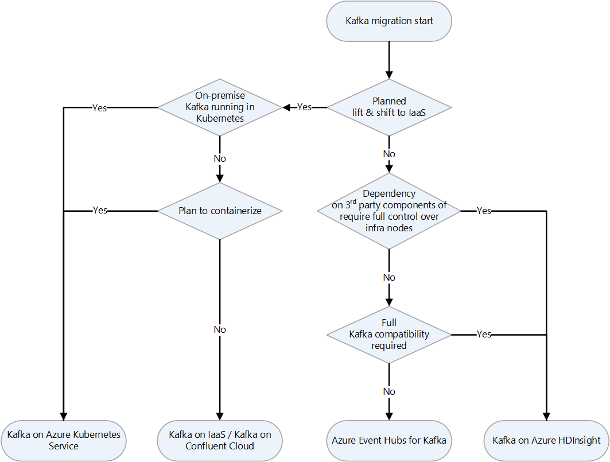

[Apache Kafka](https://kafka.apache.org) is a highly scalable and fault tolerant distributed messaging system that implements a publish-subscribe architecture. It's used as an ingestion layer in real-time streaming scenarios, such as IoT and real-time log monitoring systems. It's also used increasingly as the immutable append-only data store in Kappa architectures.

*[Apache](https://www.apache.org)®, [Apache Spark®](https://spark.apache.org), [Apache Hadoop®](https://hadoop.apache.org), [Apache HBase](https://hbase.apache.org), [Apache Storm®](https://storm.apache.org), [Apache Sqoop®](https://sqoop.apache.org), [Apache Kafka®](https://kafka.apache.org), and the flame logo are either registered trademarks or trademarks of the Apache Software Foundation in the United States and/or other countries. No endorsement by The Apache Software Foundation is implied by the use of these marks.*

## Migration approach

This article presents various strategies for migrating Kafka to Azure:

- [Migrate Kafka to Azure infrastructure as a service (IaaS)](#migrate-kafka-to-azure-infrastructure-as-a-service-iaas)
- [Migrate Kafka to Azure Event Hubs for Kafka](#migrate-kafka-to-azure-event-hubs-for-kafka)
- [Migrate Kafka on Azure HDInsight](#migrate-kafka-on-azure-hdinsight)
- [Use AKS with Kafka on HDInsight](#use-aks-with-kafka-on-hdinsight)

Here's a decision flowchart for deciding which to use:

### Migrate Kafka to Azure infrastructure as a service (IaaS)

For one way to migrate Kafka to Azure IaaS, see [Kafka on Ubuntu VMs](https://github.com/Azure/azure-quickstart-templates/tree/master/application-workloads/kafka/kafka-ubuntu-multidisks).

### Migrate Kafka to Azure Event Hubs for Kafka

Event Hubs provides an endpoint that's compatible with the Apache Kafka producer and consumer APIs. This endpoint can be used by most Apache Kafka client applications, so it's an alternative to running a Kafka cluster on Azure. The endpoint supports clients that use versions 1.0 and later of the APIs. For more information about this feature, see [Azure Event Hubs for Apache Kafka overview](/azure/event-hubs/azure-event-hubs-kafka-overview). 

To learn how to migrate your Apache Kafka applications to use Azure Event Hubs, see [Migrate to Azure Event Hubs for Apache Kafka Ecosystems](/azure/event-hubs/apache-kafka-migration-guide).

#### Kafka and Event Hubs feature differences

|How are Kafka and Event Hubs similar?|How are Kafka and Event Hubs different?|
|-------------------------------|----------------------------------------
|Both use partitions.|There are differences in these areas:|
|Partitions are independent.|• PaaS vs. software|
|Both use a client-side cursor concept.|• Partitioning|
|Both can scale to very high workloads.|• APIs|
|Conceptually they are nearly the same.|• Runtime|
|Neither uses the HTTP protocol for receiving.|• Protocols|
||• Durability|
||• Security|
||• Throttling|

##### Partitioning differences

|Kafka|Event Hubs|
|-----------------------------------|-------------------------------------------------|
|Scale is managed by partition count.|Scale is managed by throughput units.|
|You must load-balance partitions across machines.|Load balancing is automatic.|
|You must manually re-shard by using split and merge.|Repartitioning isn't required.|

##### Durability differences

|Kafka|Event Hubs|
|----------------------------------|--------------------------------------------------|
|Volatile by default|Always durable|
|Replicated after ACK|Replicated before ACK|
|Depends on disk and quorum|Provided by storage|

##### Security differences

|Kafka|Event Hubs|
|----------------------------------|---------------------------------------------------|
|SSL and SASL|SAS and SASL/PLAIN RFC 4618|
|File-like ACLs|Policy|
|Optional transport encryption|Mandatory TLS|
|User based|Token based (unlimited)|

##### Other differences

|Kafka|Event Hubs|
|-----------------------------------|--------------------------------------------------|
|Kafka doesn't throttle.|Event Hubs supports throttling.|
|Kafka uses a proprietary protocol.|Event Hubs uses AMQP 1.0 protocol.|
|Kafka doesn't use HTTP for send.|Event Hubs uses HTTP Send and Batch Send.|

### Migrate Kafka on Azure HDInsight

You can migrate Kafka to Kafka on Azure HDInsight. For more information, see [What is Apache Kafka in Azure HDInsight?](/azure/hdinsight/kafka/apache-kafka-introduction).

### Use AKS with Kafka on HDInsight

See [Use Azure Kubernetes Service with Apache Kafka on HDInsight](/azure/hdinsight/kafka/apache-kafka-azure-container-services).

#### Kafka Data Migration

You can use Kafka's [MirrorMaker tool](/azure/hdinsight/kafka/apache-kafka-mirroring) to replicate topics from one cluster to another. This technique can help you migrate data after a Kafka cluster is provisioned. For more information, see [Use MirrorMaker to replicate Apache Kafka topics with Kafka on HDInsight](/azure/hdinsight/kafka/apache-kafka-mirroring).

Here's a migration approach that uses mirroring:

- Move producers first and then move consumers. When you migrate the producers you prevent production of new messages on the source Kafka.
- After the source Kafka consumes all remaining messages, you can migrate the consumers.

Here are the implementation steps:

1. Change the Kafka connection address of the producer client to point to the new Kafka instance.
1. Restart the producer business services and send new messages to the new Kafka instance.
1. Wait for the data in the source Kafka to be consumed.
1. Change the Kafka connection address of the consumer client to point to the new Kafka instance.
1. Restart the consumer business services to consume messages from the new Kafka instance.
1. Verify that consumers succeed in getting data from the new Kafka instance.

### Monitor the Kafka cluster

You can use Azure Monitor logs to analyze logs that are generated by Apache Kafka on HDInsight. For more information, see:
[Analyze logs for Apache Kafka on HDInsight](/azure/hdinsight/kafka/apache-kafka-log-analytics-operations-management).

### Apache Kafka Streams API

The Kafka Streams API makes it possible to process data in near real-time, and it provides the ability to join and aggregate data. There are many more features of the API worth knowing about. For more information, see [Introducing Kafka Streams: Stream Processing Made Simple - Confluent](https://www.confluent.io/blog/introducing-kafka-streams-stream-processing-made-simple).

### The Microsoft and Confluent partnership

Confluent provides a cloud-native service for Apache Kafka. Microsoft and Confluent have a strategic alliance. For more information, see:

- [Confluent and Microsoft Announce Strategic Alliance](https://www.confluent.io/ja-jp/press-release/confluent-strategic-alliance-with-microsoft)
- [Introducing seamless integration between Microsoft Azure and Confluent Cloud](https://azure.microsoft.com/blog/introducing-seamless-integration-between-microsoft-azure-and-confluent-cloud)

## Contributors

*This article is maintained by Microsoft. It was originally written by the following contributors.*

Principal authors:

- [Namrata Maheshwary](https://www.linkedin.com/in/namrata0104) | Senior Cloud Solution Architect
- [Raja N](https://www.linkedin.com/in/nraja) | Director, Customer Success
- [Hideo Takagi](https://www.linkedin.com/in/hideo-takagi) | Cloud Solution Architect
- [Ram Yerrabotu](https://www.linkedin.com/in/ram-reddy-yerrabotu-60044620) | Senior Cloud Solution Architect

Other contributors:

- [Ram Baskaran](https://www.linkedin.com/in/ram-baskaran) | Senior Cloud Solution Architect
- [Jason Bouska](https://www.linkedin.com/in/jasonbouska) | Senior Software Engineer
- [Eugene Chung](https://www.linkedin.com/in/eugenesc) | Senior Cloud Solution Architect
- [Pawan Hosatti](https://www.linkedin.com/in/pawanhosatti) | Senior Cloud Solution Architect - Engineering
- [Daman Kaur](https://www.linkedin.com/in/damankaur-architect) | Cloud Solution Architect
- [Danny Liu](https://www.linkedin.com/in/geng-liu) | Senior Cloud Solution Architect - Engineering
- [Jose Mendez](https://www.linkedin.com/in/jos%C3%A9-m%C3%A9ndez-de-la-serna-946985aa) Senior Cloud Solution Architect
- [Ben Sadeghi]( https://www.linkedin.com/in/bensadeghi) | Senior Specialist
- [Sunil Sattiraju](https://www.linkedin.com/in/sunilsattiraju) | Senior Cloud Solution Architect
- [Amanjeet Singh](https://www.linkedin.com/in/amanjeetsingh2004) | Principal Program Manager
- [Nagaraj Seeplapudur Venkatesan](https://www.linkedin.com/in/nagaraj-venkatesan-b6958b6) | Senior Cloud Solution Architect - Engineering

*To see non-public LinkedIn profiles, sign in to LinkedIn.*

## Next steps

### Azure product introductions

- [Introduction to Azure Data Lake Storage Gen2](/azure/storage/blobs/data-lake-storage-introduction)
- [What is Apache Spark in Azure HDInsight](/azure/hdinsight/spark/apache-spark-overview)
- [What is Apache Hadoop in Azure HDInsight?](/azure/hdinsight/hadoop/apache-hadoop-introduction)
- [What is Apache HBase in Azure HDInsight](/azure/hdinsight/hbase/apache-hbase-overview)
- [What is Apache Kafka in Azure HDInsight](/azure/hdinsight/kafka/apache-kafka-introduction)

### Azure product reference

- [Azure Active Directory documentation](/azure/active-directory)
- [Azure Cosmos DB documentation](/azure/cosmos-db)
- [Azure Data Factory documentation](/azure/data-factory)
- [Azure Databricks documentation](/azure/databricks)
- [Azure Event Hubs documentation](/azure/event-hubs)
- [Azure Functions documentation](/azure/azure-functions)
- [Azure HDInsight documentation](/azure/hdinsight)
- [Microsoft Purview data governance documentation](/azure/purview)
- [Azure Stream Analytics documentation](/azure/stream-analytics)
- [Azure Synapse Analytics](/azure/synapse-analytics)

### Other

- [Enterprise Security Package for Azure HDInsight](/azure/hdinsight/enterprise-security-package)
- [Develop Java MapReduce programs for Apache Hadoop on HDInsight](/azure/hdinsight/hadoop/apache-hadoop-develop-deploy-java-mapreduce-linux)
- [Use Apache Sqoop with Hadoop in HDInsight](/azure/hdinsight/hadoop/hdinsight-use-sqoop)
- [Overview of Apache Spark Streaming](/azure/hdinsight/spark/apache-spark-streaming-overview)
- [Structured Streaming tutorial](/azure/databricks/getting-started/spark/streaming)
- [Use Azure Event Hubs from Apache Kafka applications](/azure/event-hubs/event-hubs-for-kafka-ecosystem-overview)

## Related resources

- [Hadoop migration to Azure](overview.md)
- [Apache HDFS migration to Azure](apache-hdfs-migration.yml)
- [Apache HBase migration to Azure](apache-hbase-migration.yml)
- [Apache Sqoop migration to Azure](apache-sqoop-migration.yml)
- [Apache Storm migration to Azure](apache-storm-migration.yml)
