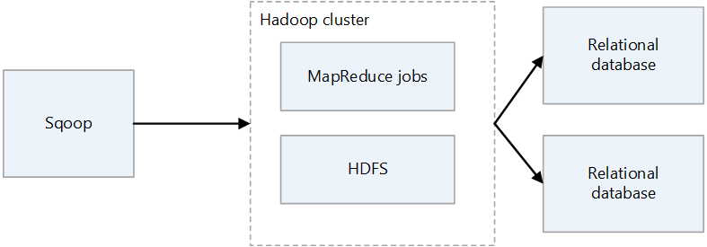
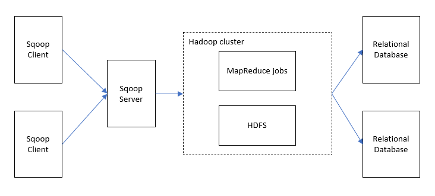
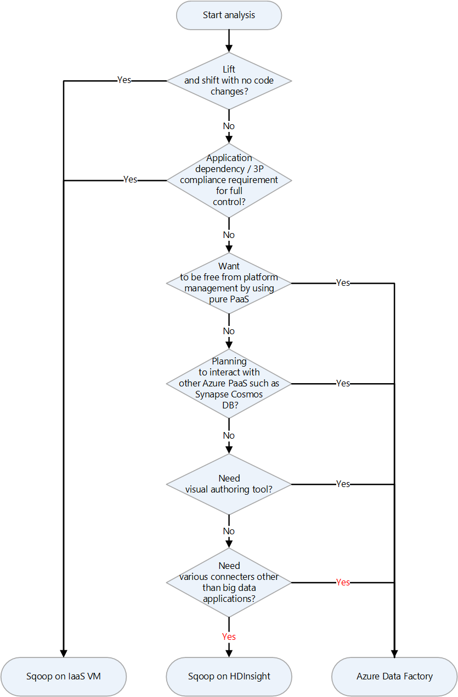
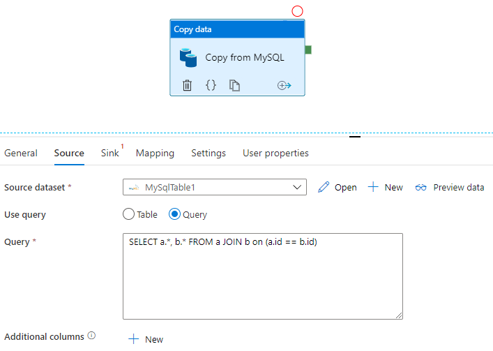

 [Apache Sqoop](https://sqoop.apache.org) is a tool for transferring data between Apache Hadoop clusters and relational databases. It has a command-line interface.

You can use Sqoop to import data to HDFS from relational databases such as MySQL, PostgreSQL, Oracle, and SQL Server, and to export HDFS data to such databases. Sqoop can use MapReduce and Apache Hive to convert data on Hadoop. Advanced features include incremental loading, formatting by using SQL, and updating datasets. Sqoop operates in parallel to achieve high-speed data transfer.

> [!NOTE]
> The Sqoop project has retired. Sqoop was moved into the Apache Attic in June, 2021. The website, downloads, and issue tracker all remain open. See [Apache Sqoop in the Apache Attic](https://attic.apache.org/projects/sqoop.html) for more information.

*[Apache](https://www.apache.org)®, [Apache Spark®](https://spark.apache.org), [Apache Hadoop®](https://hadoop.apache.org), [Apache HBase](https://hbase.apache.org), [Apache Hive](https://hive.apache.org), [Apache Ranger®](https://ranger.apache.org), [Apache Storm®](https://storm.apache.org), [Apache Sqoop®](https://sqoop.apache.org), [Apache Kafka®](https://kafka.apache.org), and the flame logo are either registered trademarks or trademarks of the Apache Software Foundation in the United States and/or other countries. No endorsement by The Apache Software Foundation is implied by the use of these marks.*

## Sqoop architecture and components

There are two versions of Sqoop: Sqoop1 and Sqoop2. Sqoop1 is a simple client tool, whereas Sqoop2 has a client/server architecture. They aren't compatible with one another, and they differ in usage. Sqoop2 isn't feature complete, and isn't intended for production deployment.

### Sqoop1 architecture



#### Sqoop1 import and export

- **Import**

  Reads data from relational databases and outputs data to HDFS. Each record in the relational databases table is output as a single row in HDFS. Text, SequenceFiles, and Avro are the file formats that can be written to HDFS.
- **Export**

  Reads data from HDFS and transfers it to relational databases. The target relational databases support both insert and update.

### Sqoop2 architecture



- **Sqoop server**

  Provides an entry point for Sqoop clients.
- **Sqoop client**

  Interacts with the Sqoop server. The client can be on any node, provided that the client can communicate with the server. Because the client needs only to communicate with the server, there's no need to make settings as you would with MapReduce.

## Challenges of Sqoop on-premises

Here are some common challenges of an on-premises Sqoop deployment:

- It can be difficult to scale, depending on the hardware and datacenter capacity.
- It can't be easily scaled on demand.
- When support ends for aging infrastructure, you can be forced to replace and upgrade.
- There's a lack of native tools to provide:
  - Cost transparency
  - Monitoring
  - DevOps
  - Automation

## Considerations

- When you migrate Sqoop to Azure, if your data source remains on-premises, you need to consider its connectivity. You can establish a VPN connection over the internet between Azure and your existing on-premises network, or you can use Azure ExpressRoute to make a private connection.
- When you migrate Sqoop to Azure HDInsight, consider your Sqoop version. HDInsight supports only Sqoop1, so if you're using Sqoop2 in your on-premises environment, you have to replace it with Sqoop1 on HDInsight, or keep Sqoop2 independent.
- When you migrate Sqoop to Azure Data Factory, you need to consider data file formats. Data Factory doesn't support the SequenceFile format. The lack of support can be a problem if your Sqoop implementation imports data in SequenceFile format. For more information, see [File format](#file-format).

## Migration approach

Azure has several migration targets for Apache Sqoop. Depending on requirements and product features, you can choose between Azure IaaS virtual machines (VMs), Azure HDInsight, and Azure Data Factory.

Here's a decision chart for selecting a migration target:



The migration targets are discussed in the following sections:

- [Lift and shift migration to Azure IaaS](#lift-and-shift-migration-to-azure-iaas)
- [Migrate to HDInsight](#migrate-to-hdinsight)
- [Migrate to Data Factory](#migrate-to-data-factory)

### Lift and shift migration to Azure IaaS

If you choose Azure IaaS VMs as the migration destination for your on-premises Sqoop, you can do a lift and shift migration. You use the same version of Sqoop to create a completely controllable environment. Therefore, you don't have to make any changes to the Sqoop software. Sqoop works with a Hadoop cluster and is usually migrated along with a Hadoop cluster.
The following articles are guides for a lift and shift migration of a Hadoop cluster. Choose the article that's applies to the service to be migrated.

- [Apache Hive](https://github.com/Azure/Hadoop-Migrations/blob/main/docs/hive/migration-approach.md#lift-and-shift---iaas)
- [Apache Ranger](https://github.com/Azure/Hadoop-Migrations/blob/main/docs/ranger/migration-approach.md#lift-and-shift--iaas-infrastructure-as-a-service)
- [Apache HBase](apache-hbase-migration.yml)

#### Preparation for migration

To prepare for migration, you plan for migration and you establish a network connection.

##### Plan for migration

Gather the following information to prepare for the migration of your on-premises Sqoop. The information helps you to determine the size of the destination virtual machine and to plan the software components and network configurations.

|Item|Background|
|----|----------|
|Current host size|Get information about the CPU, memory, disk, and other components of the host or virtual machine on which the Sqoop client or server is running. You use this information to estimate the base size required for your Azure virtual machine.|
Host and application metrics|Get the resource usage information (CPU, memory, disk, and other components) of the machine that runs the Sqoop client and estimate the resources actually used. If you're using less resources than what's allocated to your host, consider downsizing when you migrate to Azure. After you identify the required amount of resources, select the type of virtual machine to migrate to by referring to [Azure virtual machine size](/azure/virtual-machines/sizes).|
|Sqoop version|Check the version of the on-premises Sqoop to determine which version of Sqoop to install on the Azure virtual machine. If you're using a distribution such as Cloudera or Hortonworks, the version of the component depends on the version of that distribution.|
|Running jobs and scripts|Identify the jobs that run Sqoop and the methods of scheduling them. The jobs and methods are candidates for migration.|
|Databases to connect|Identify the databases that Sqoop connects to, as specified by import and export commands in the Sqoop jobs. After you identify them, you need to see if you can connect to those databases after you migrate Sqoop to your Azure virtual machines. If some of the databases you connect to are still on-premises, you need a network connection between on-premises and Azure. For more information, see the [Establish a network connection](#establish-a-network-connection) section.
|Plugins|Identify the Sqoop plugins that you use and determine whether you can migrate them.|
|High availability, business continuity, disaster recovery|Determine whether the troubleshooting techniques that you use on-premises can be used on Azure. For example, if you have an active/standby configuration on two nodes, prepare two Azure virtual machines for Sqoop clients that have the same configuration. The same applies when configuring disaster recovery.|

##### Establish a network connection

If some of the databases that you connect to remain on-premises, you need a network connection between on-premises and Azure.

There are two main options for connecting on-premises and Azure on a private network:

- **VPN Gateway**

  You can use Azure VPN Gateway to send encrypted traffic between your Azure virtual network and your on-premises location over the public internet. This technique is inexpensive and easy to set up. However, due to the encrypted connection over the internet, the communication bandwidth isn't guaranteed. If you need to guarantee bandwidth, you should choose ExpressRoute, which is the second option. For more information about the VPN option, see [What is VPN Gateway?](/azure/vpn-gateway/vpn-gateway-about-vpngateways) and [VPN Gateway design](/azure/vpn-gateway/design).
- **ExpressRoute**

  ExpressRoute can connect your on-premises network to Azure or to Microsoft 365 by using a private connection that's provided by a connectivity provider. ExpressRoute doesn't go through the public internet, so it's more secure, more reliable, and has more consistent latencies than connections over the internet. In addition, the bandwidth options of the line that you purchase can guarantee stable latencies. For more information, see [What is Azure ExpressRoute?](/azure/expressroute/expressroute-introduction).

If these private connection methods don't meet your needs, consider Azure Data Factory as a migration destination. The self-hosted integration runtime in Data Factory makes it possible for you to transfer data from on-premises to Azure without having to configure a private network.

#### Migrate data and settings

When you migrate on-premises Sqoop to Azure virtual machines, include the following data and settings:

- **Sqoop config files:** It depends on your environment, but the following files are often included:
  - sqoop-site.xml
  - sqoop-env.xml
  - password-file
  - oraoop-site.xml, if you use Oraoop
- **Saved jobs**: If you saved jobs in the Sqoop metastore by using the `sqoop job --create` command, you need to migrate them. The save destination of metastore is defined in sqoop-site.xml. If the shared metastore isn't set, look for the saved jobs in the .sqoop subdirectory of the home directory of the user that runs metastore.

  You can use the following commands to see information about the saved jobs.

  - Get the saved job list:

    `sqoop job --list`
  - View parameters for saved jobs

    `sqoop job --show <job-id>`
- **Scripts:** If you have script files that run Sqoop, you need to migrate them.
- **Scheduler:** If you schedule the execution of Sqoop, you need to identify its scheduler, such as a Linux cron job or a job management tool. Then you need to consider whether the scheduler can be migrated to Azure.
- **Plugins:** If you're using any custom plugins in Sqoop, for example a connector to an external database, you need to migrate them. If you created a patch file, apply the patch to the migrated Sqoop.

### Migrate to HDInsight

HDInsight bundles Apache Hadoop components and the HDInsight platform into a package that's deployed on a cluster. Instead of migrating Sqoop itself to Azure, it's more typical to run Sqoop on an HDInsight cluster. For more information about using HDInsight to run open-source frameworks such as Hadoop and Spark, see [What is Azure HDInsight?](/azure/hdinsight/hdinsight-overview) and [Guide to Migrating Big Data Workloads to Azure HDInsight](https://azure.microsoft.com/resources/migrating-big-data-workloads-hdinsight).

See the following articles for the component versions in HDInsight.

- [HDInsight 4.0 component versions](/azure/hdinsight/hdinsight-40-component-versioning)
- [HDInsight 3.6 component versions](/azure/hdinsight/hdinsight-36-component-versioning)

### Migrate to Data Factory

Azure Data Factory is a fully managed, serverless, data integration service. It can be scaled on demand according to factors such as volume of data. It has a GUI for intuitive editing and development by using Python, .NET, and Azure Resource Manager templates (ARM templates).

#### Connection to data sources

See the appropriate article for a list of the standard Sqoop connectors:

- [Sqoop1 connectors](https://sqoop.apache.org/docs/1.4.7/SqoopUserGuide.html#connectors)
- [Sqoop2 connectors](https://sqoop.apache.org/docs/1.99.7/user/Connectors.html)

Data Factory has a large number of connectors. For more information, see [Azure Data Factory and Azure Synapse Analytics connector overview](/azure/data-factory/connector-overview).

The following table is an example that shows the Data Factory connectors to use for Sqoop1 version 1.4.7 and Sqoop2 version 1.99.7. Be sure to refer to the latest documentation, because the list of supported versions can change.

|Sqoop1 - 1.4.7|Sqoop2 - 1.99.7|Data Factory|Considerations|
|--------------|---------------|------------|--------------|
|MySQL JDBC Connector|Generic JDBC Connector|MySQL, Azure Database for MySQL||
|MySQL Direct Connector|N/A|N/A|Direct Connector uses mysqldump to input and output data without going through JDBC. The method is different in Data Factory, but the MySQL connector can be used instead.|
|Microsoft SQL Connector|Generic JDBC Connector|SQL Server, Azure SQL Database, Azure SQL Managed Instance||
|PostgreSQL Connector|PostgreSQL, Generic JDBC Connector|Azure Database for PostgreSQL||
|PostgreSQL Direct Connector|N/A|N/A|Direct Connector doesn't go through JDBC and uses the **COPY** command to input and output data. The method is different in Data Factory, but the PostgreSQL connector can be used instead.|
|pg_bulkload connector|N/A|N/A|Load into PostgreSQL by using pg_bulkload. The method is different in Data Factory, but the PostgreSQL connector can be used instead.|
|Netezza Connector|Generic JDBC Connector|Netteza||
|Data Connector for Oracle and Hadoop|Generic JDBC Connector|Oracle||
|N/A|FTP Connector|FTP||
|N/A|SFTP Connector|SFTP||
|N/A|Kafka Connector|N/A|Data Factory can't connect directly to Kafka. Consider using Spark Streaming such as Azure Databricks or HDInsight to connect to Kafka.|
|N/A|Kite Connector|N/A|Data Factory can't connect directly to Kite.|
|HDFS|HDFS|HDFS|Data Factory supports HDFS as a source, but not as a sink.|

#### Connect to databases on-premises

If, after you migrate Sqoop to Data Factory, you still need to copy data between a data store in your on-premises network and Azure, consider using these methods:

- [Self-hosted integration runtime](#self-hosted-integration-runtime)
- [Managed virtual network by using a private endpoint](#managed-virtual-network-by-using-a-private-endpoint)

##### Self-hosted integration runtime

If you're trying to integrate data in a private network environment where there's no direct communication path from the public cloud environment, you can do the following to improve security:

- Install a self-hosted integration runtime in the on-premises environment, either in the internal firewall or in the virtual private network.
- Make an HTTPS-based outbound connection from the self-hosted integration runtime to Azure in order to establish a connection for data movement.

Self-hosted integration runtime is only supported on Windows. You can also achieve scalability and high availability by installing and associating self-hosted integration runtimes on multiple machines. Self-hosted integration runtime is also responsible for dispatching data transformation activities to resources that aren't on-premises or in the Azure virtual network.

For |information about how to set up self-hosted integration runtime, see [Create and configure a self-hosted integration runtime](/azure/data-factory/create-self-hosted-integration-runtime).

##### Managed virtual network by using a private endpoint

If you have a private connection between on-premises and Azure (such as ExpressRoute or VPN Gateway), you can use managed virtual network and private endpoint in Data Factory to make a private connection to your on-premises databases. You can use virtual networks to forward traffic to your on-premises resources, as shown in the following diagram, to access your on-premises resources without going through the internet.

:::image type="content" source="images/managedvnet-privateendpoint.png" alt-text="Diagram of an architecture to access on-premises SQL Server from Data Factory managed virtual network by using a private endpoint." lightbox="images/managedvnet-privateendpoint.png" border="false":::

*Download a [Visio file](https://arch-center.azureedge.net/US-1952879-apache-sqoop-migration.vsdx) of this architecture.*

For more information, see [Tutorial: How to access on-premises SQL Server from Data Factory Managed VNet using Private Endpoint](/azure/data-factory/tutorial-managed-virtual-network-on-premise-sql-server).

#### Network options

Data Factory has two network options:

- [Managed virtual network](#managed-virtual-network)
- [Private link](#private-link)

Both build a private network and help secure the process of data integration. They can be used at the same time.

##### Managed virtual network

You can deploy the integration runtime, which is the Data Factory runtime, within a managed virtual network. By deploying a private endpoint such as a data store that connects to the managed virtual network, you can improve data integration safety within a closed private network.

:::image type="content" source="images/managed-vnet-architecture-diagram.png" alt-text="Diagram of an architecture that shows a managed virtual network and a private endpoint." lightbox="images/managed-vnet-architecture-diagram.png" border="false":::

*Download a [Visio file](https://arch-center.azureedge.net/US-1952879-apache-sqoop-migration.vsdx) of this architecture.*

For more information, see [Azure Data Factory managed virtual network](/azure/data-factory/managed-virtual-network-private-endpoint).

##### Private link

You can use [Azure Private Link for Azure Data Factory
](/azure/data-factory/data-factory-private-link) to connect to Data Factory.

:::image type="content" source="images/private-link-architecture.png" alt-text="Diagram of an architecture that includes the integration runtime, a managed virtual network, and a private endpoint." lightbox="images/private-link-architecture.png" border="false":::

*Download a [Visio file](https://arch-center.azureedge.net/US-1952879-apache-sqoop-migration.vsdx) of this architecture.*

For more information, see [What is a private endpoint?](/azure/private-link/private-endpoint-overview) and [Private Link documentation](/azure/private-link).

#### Performance of data copy

Sqoop improves data transfer performance by using MapReduce for parallel processing. After you migrate Sqoop, Data Factory can adjust performance and scalability for scenarios that perform large-scale data migrations.

 A *data integration unit* (DIU) is a Data Factory unit of performance. It's a combination of CPU, memory, and network resource allocation. Data Factory can adjust up to 256 DIUs for copy activities that use the Azure integration runtime. For more information, see [Data Integration Units](/azure/data-factory/copy-activity-performance#data-integration-units).

If you use self-hosted integration runtime, you can improve performance by scaling the machine that hosts the self-hosted integration runtime. The maximum scale-out is four nodes.

For more information about making adjustments to achieve your desired performance, see [Copy activity performance and scalability guide](/azure/data-factory/copy-activity-performance).

#### Apply SQL

Sqoop can import the result set of a SQL query, as shown in this example:

```sqoop
$ sqoop import \
  --query 'SELECT a.*, b.* FROM a JOIN b on (a.id == b.id) WHERE $CONDITIONS' \
  --split-by a.id --target-dir /user/foo/joinresults
```

Data Factory can also query the database and copy the result set:



See [Copy activity properties](/azure/data-factory/connector-mysql#copy-activity-properties) for an example that gets the result set of a query on a MySQL database.

#### Data transformation

Both Data Factory and HDInsight can perform various data transformation activities.

##### Transform data by using Data Factory activities

Data Factory can perform a variety of data transformation activities, such as data flow and data wrangling. For both, you define the transformations by using a visual UI. You can also use the activities of various Hadoop components of HDInsight, Databricks, stored procedures, and other custom activities. Consider using these activities when you migrate Sqoop and want to include data transformations in the process.
See [Transform data in Azure Data Factory](/azure/data-factory/transform-data) for more information.

##### Transform data by using HDInsight activities

The various HDInsight activities in an Azure Data Factory pipeline, including Hive, Pig, MapReduce, Streaming, and Spark, can run programs and queries on either your own cluster or on an [on-demand HDInsight cluster](/azure/hdinsight/hdinsight-hadoop-create-linux-clusters-adf). If you migrate a Sqoop implementation that uses data transformation logic of the Hadoop ecosystem, it's easy to migrate the transformations to HDInsight activities. For details, see the following articles.

- [Transform data using Hadoop Hive activity in Azure Data Factory or Synapse Analytics](/azure/data-factory/transform-data-using-hadoop-hive)
- [Transform data using Hadoop MapReduce activity in Azure Data Factory or Synapse Analytics](/azure/data-factory/transform-data-using-hadoop-map-reduce)
- [Transform data using Hadoop Pig activity in Azure Data Factory or Synapse Analytics](/azure/data-factory/transform-data-using-hadoop-pig)
- [Transform data using Spark activity in Azure Data Factory and Synapse Analytics](/azure/data-factory/transform-data-using-spark)
- [Transform data using Hadoop Streaming activity in Azure Data Factory or Synapse Analytics](/azure/data-factory/transform-data-using-hadoop-streaming)

#### File format

Sqoop supports text, SequenceFile, and Avro as file formats when it imports data into HDFS. Data Factory doesn't support HDFS as a data sink, but it does use Azure Data Lake Storage or Azure Blob Storage as file storage. For more information on HDFS migration, see [Apache HDFS migration](apache-hdfs-migration.yml).

The supported formats for Data Factory to write to file storage are text, binary, Avro, JSON, ORC, and Parquet, but not SequenceFile. You can use an activity such as Spark to convert a file to SequenceFile by using `saveAsSequenceFile`:

```java
data.saveAsSequenceFile(<path>)
```

#### Scheduling jobs

Sqoop doesn't provide scheduler functionality. If you're running Sqoop jobs on a scheduler, you need to migrate that functionality to Data Factory. Data Factory can use triggers to schedule the execution of the data pipeline. Choose a Data Factory trigger according to your existing scheduling configuration. Here are the types of triggers.

- **Schedule trigger:** A schedule trigger runs the pipeline on a wall-clock schedule.
- **Tumbling window trigger:** A tumbling window trigger runs periodically from a specified start time while maintaining its state.
- **Event-based trigger:** An event-based trigger triggers the pipeline in response to the event. There are two types of event-based triggers:
  - **Storage event trigger:** A storage event trigger triggers the pipeline in response to a storage event such as creating, deleting, or writing to a file.
  - **Custom event trigger:** A custom-event trigger triggers the pipeline in response to an event that's sent to a custom topic in an event grid. For information about custom topics, see [Custom topics in Azure Event Grid](/azure/event-grid/custom-topics).

For more |information about triggers, see [Pipeline execution and triggers in Azure Data Factory or Azure Synapse Analytics](/azure/data-factory/concepts-pipeline-execution-triggers).

## Contributors

*This article is maintained by Microsoft. It was originally written by the following contributors.*

Principal authors:

- [Namrata Maheshwary](https://www.linkedin.com/in/namrata0104) | Senior Cloud Solution Architect
- [Raja N](https://www.linkedin.com/in/nraja) | Director, Customer Success
- [Hideo Takagi](https://www.linkedin.com/in/hideo-takagi) | Cloud Solution Architect
- [Ram Yerrabotu](https://www.linkedin.com/in/ram-reddy-yerrabotu-60044620) | Senior Cloud Solution Architect

Other contributors:

- [Ram Baskaran](https://www.linkedin.com/in/ram-baskaran) | Senior Cloud Solution Architect
- [Jason Bouska](https://www.linkedin.com/in/jasonbouska) | Senior Software Engineer
- [Eugene Chung](https://www.linkedin.com/in/eugenesc) | Senior Cloud Solution Architect
- [Pawan Hosatti](https://www.linkedin.com/in/pawanhosatti) | Senior Cloud Solution Architect - Engineering
- [Daman Kaur](https://www.linkedin.com/in/damankaur-architect) | Cloud Solution Architect
- [Danny Liu](https://www.linkedin.com/in/geng-liu) | Senior Cloud Solution Architect - Engineering
- [Jose Mendez](https://www.linkedin.com/in/jos%C3%A9-m%C3%A9ndez-de-la-serna-946985aa) Senior Cloud Solution Architect
- [Ben Sadeghi]( https://www.linkedin.com/in/bensadeghi) | Senior Specialist
- [Sunil Sattiraju](https://www.linkedin.com/in/sunilsattiraju) | Senior Cloud Solution Architect
- [Amanjeet Singh](https://www.linkedin.com/in/amanjeetsingh2004) | Principal Program Manager
- [Nagaraj Seeplapudur Venkatesan](https://www.linkedin.com/in/nagaraj-venkatesan-b6958b6) | Senior Cloud Solution Architect - Engineering

*To see non-public LinkedIn profiles, sign in to LinkedIn.*

## Next steps

### Azure product introductions

- [Introduction to Azure Data Lake Storage Gen2](/azure/storage/blobs/data-lake-storage-introduction)
- [What is Apache Spark in Azure HDInsight](/azure/hdinsight/spark/apache-spark-overview)
- [What is Apache Hadoop in Azure HDInsight?](/azure/hdinsight/hadoop/apache-hadoop-introduction)
- [What is Apache HBase in Azure HDInsight](/azure/hdinsight/hbase/apache-hbase-overview)
- [What is Apache Kafka in Azure HDInsight](/azure/hdinsight/kafka/apache-kafka-introduction)

### Azure product reference

- [Azure Active Directory documentation](/azure/active-directory)
- [Azure Cosmos DB documentation](/azure/cosmos-db)
- [Azure Data Factory documentation](/azure/data-factory)
- [Azure Databricks documentation](/azure/databricks)
- [Azure Event Hubs documentation](/azure/event-hubs)
- [Azure Functions documentation](/azure/azure-functions)
- [Azure HDInsight documentation](/azure/hdinsight)
- [Microsoft Purview data governance documentation](/azure/purview)
- [Azure Stream Analytics documentation](/azure/stream-analytics)
- [Azure Synapse Analytics](/azure/synapse-analytics)

### Other

- [Enterprise Security Package for Azure HDInsight](/azure/hdinsight/enterprise-security-package)
- [Develop Java MapReduce programs for Apache Hadoop on HDInsight](/azure/hdinsight/hadoop/apache-hadoop-develop-deploy-java-mapreduce-linux)
- [Use Apache Sqoop with Hadoop in HDInsight](/azure/hdinsight/hadoop/hdinsight-use-sqoop)
- [Overview of Apache Spark Streaming](/azure/hdinsight/spark/apache-spark-streaming-overview)
- [Structured Streaming tutorial](/azure/databricks/getting-started/spark/streaming)
- [Use Azure Event Hubs from Apache Kafka applications](/azure/event-hubs/event-hubs-for-kafka-ecosystem-overview)

## Related resources

- [Hadoop migration to Azure](overview.md)
- [Apache HDFS migration to Azure](apache-hdfs-migration.yml)
- [Apache HBase migration to Azure](apache-hbase-migration.yml)
- [Apache Kafka migration to Azure](apache-kafka-migration.yml)
