[Apache Storm](https://storm.apache.org) is an open source, distributed computing system that can process streams of data in real time. Storm is used for real-time analytics, online machine learning, and extract, transform, and load (ETL) processing. It's scalable, fault tolerant, and guarantees data processing.

This article provides an introduction to Storm architecture, and a guide to migrating Storm to Azure.

*[Apache](https://www.apache.org)®, [Apache Spark®](https://spark.apache.org), [Apache Hadoop®](https://hadoop.apache.org), [Apache HBase](https://hbase.apache.org), [Apache Hive](https://hive.apache.org), [Apache Ranger®](https://ranger.apache.org), [Apache ZooKeeper®](https://zookeeper.apache.org), [Apache Storm®](https://storm.apache.org), [Apache Sqoop®](https://sqoop.apache.org), [Apache Kafka®](https://kafka.apache.org), and the flame logo are either registered trademarks or trademarks of the Apache Software Foundation in the United States and/or other countries. No endorsement by The Apache Software Foundation is implied by the use of these marks.*

## Storm architecture and components

The next two sections discuss the components of Storm, how they are arranged to define a topology, and the processing nodes.

### Topology components of Storm

A Storm topology consists of multiple components that are arranged as a directed acyclic graph (DAG). Because it's acyclic, a path that follows the directed arcs doesn't include any component more than one time. The arcs indicate how data flows in streams between the components of the graph. Each component acts on one or more data streams. There are two component types: spouts and bolts.

- **Topology:** A package of real-time application logic that defines a directed acyclic graph that comprises one or more spouts and one or more bolts.
- **Spout:** A component that creates one or more data streams for use by bolts.
- **Bolt:** A component that accepts one or more data streams from spouts or from other bolts, and emits zero or more streams for use by other bolts. A bolt can write data to external services or storage such as HDFS, Kafka, and HBase.

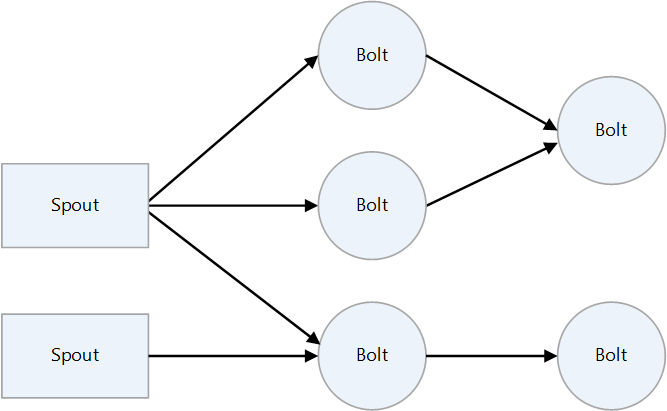

### Daemons

The daemon configuration for Storm clusters is similar to that of Hadoop clusters. There are two types of nodes in a Storm cluster: master and worker. There's one master node. It runs a daemon called *Nimbus*, which assigns tasks to the cluster, and monitors execution. This is similar to Hadoop's JobTracker. There are one or more worker nodes. Each one runs a daemon called *Supervisor*, which runs a worker process based on the task that Nimbus assigned. Apache ZooKeeper makes the adjustments between Nimbus and Supervisor. The statuses of the nodes should be kept in ZooKeeper and monitored.

- **Nimbus:** Plays the role of a master node. It assigns tasks to other nodes in the cluster and monitors their execution by using ZooKeeper.
- **ZooKeeper:** Coordinates the nodes and assists in communication between the Nimbus node and the Supervisor nodes.
- **Supervisor:** Listens for work assigned to its machine and starts and stops worker processes based on directives from Nimbus. Each worker process runs a subset of a topology. User application logic (spouts and bolts) runs here. It can be restarted quickly and fails over quickly.

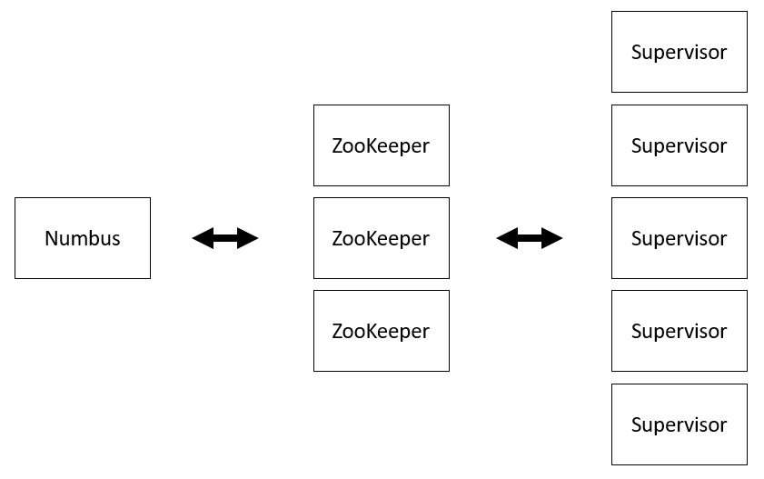

## Considerations

- Storm does real-time event processing and at-least-once processing. As an option, you can use the [Trident API](https://storm.apache.org/releases/current/Trident-API-Overview.html) to implement micro-batch processing and exactly-once processing. Review your business requirements to determine the level of stream processing that you need.
- Azure HDInsight 3.6 provides a Storm cluster, but HDInsight 4.0 doesn't, so this article doesn't discuss migrations to HDInsight 3.6. However, HDInsight 4.0 does provide Spark Streaming, which can be used to migrate Storm functionality. This approach is discussed in [Migrate to Spark Streaming on HDInsight or Azure Databricks](#migrate-to-spark-streaming-on-hdinsight-or-azure-databricks).
- If it's unacceptable for your stream processing to have a long outage, you need to plan carefully to achieve a quick and safe migration.
- When you migrate Storm to Azure, consider migrating the data sources also, to minimize latency and avoid connectivity issues.

## Migration approach

Azure has several landing targets for Apache Storm. Depending on requirements and product features, customers can choose between Azure IaaS virtual machines (VMs), Spark Streaming on HDInsight or Azure Databricks, Azure Stream Analytics, and Azure Functions.

Here's a decision flowchart for choosing a landing target for Storm on Azure.


The migration approaches are described in the following sections:

- [Lift and shift migration to Azure IaaS VMs](#lift-and-shift-migration-to-azure-iaas-vms)
- [Migrate to Spark Streaming on HDInsight or Azure Databricks](#migrate-to-spark-streaming-on-hdinsight-or-azure-databricks)
- [Migrate to Stream Analytics](#migrate-to-stream-analytics)
- [Migrate to Functions](#migrate-to-functions)

For a detailed comparison of technology choices for real-time stream processing in Azure, see [Choose a stream processing technology in Azure](/azure/architecture/data-guide/technology-choices/stream-processing).

### Lift and shift migration to Azure IaaS VMs

By using virtual machines on Azure, you can emulate the environment of your on-premises Storm implementation. This is the way to migrate to Azure with a minimum of changes.

#### Prerequisites

- Create and deploy a cluster on Azure IaaS. For more information, see [Setting up a Storm cluster](https://storm.apache.org/releases/2.1.0/Setting-up-a-Storm-cluster.html).
- Implement an SSH client so that you can connect to the cluster.

#### Create the topology

1. Connect to your Storm cluster. Edit the command below by replacing \<clustername\> with the name of your Storm cluster, and then enter the command.

   ```Bash
   ssh sshuser@<clustername>-ssh.clusterdomian.net
   ```

1. Deploy the topology in the new cluster (for example, a word counting topology):

   ``` Bash
   storm jar /usr/hdp/current/storm-client/contrib/storm-starter/storm-starter-topologies-*.jar org.apache.storm.starter.WordCountTopology wordcount
   ```

#### Monitor the topology

See [Quickstart: Create and monitor an Apache Storm topology in Azure HDInsight](/azure/hdinsight/storm/apache-storm-quickstart) for topology monitoring information.

### Migrate to Spark Streaming on HDInsight or Azure Databricks

Spark provides primitives for in-memory cluster computing. A Spark job can load and cache data into memory and query it repeatedly. In-memory computing is much faster than disk-based applications such as Hadoop, which shares data by storing it in the Hadoop distributed file system (HDFS).

You can use the Scala programming language with Spark to manipulate distributed data sets as you would local collections. There's no need to structure everything as map and reduce operations.

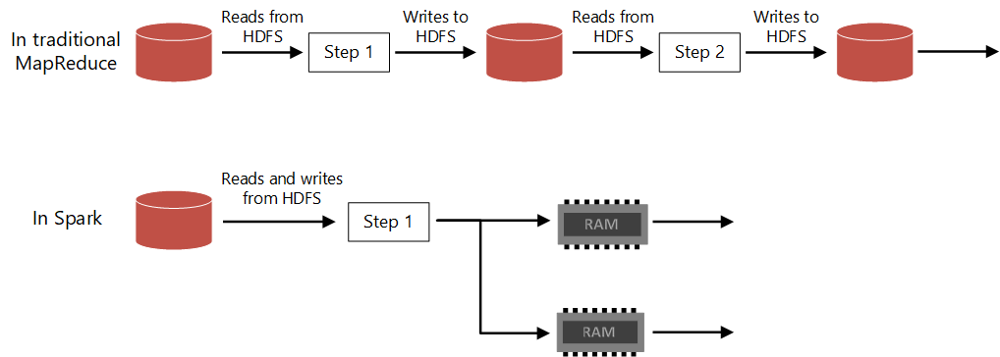

#### Migrate from Storm to Spark

This section describes how to migrate from Storm to Spark, and applies whether your target is Spark Streaming on HDInsight, or Spark Streaming on Azure Databricks.

##### Comparison of Apache Storm to Spark Streaming and Spark Structured Streaming

Apache Storm can provide different levels of guaranteed message processing. For example, a basic Storm application can guarantee at-least-once processing. As an option, you can use the [Trident API](https://storm.apache.org/releases/current/Trident-API-Overview.html) to implement micro-batch processing and exactly-once processing. Spark Streaming and Spark Structured Streaming guarantee that any input event is processed exactly once, even if a node failure occurs. Storm has a model that processes events as they arrive. You can also use the Trident API to implement a micro-batch model. Spark Streaming and Spark Structured Streaming both provide the micro-batch processing model.

| |Storm|Spark Streaming|Spark Structured Streaming|
|---|---|---|---|
|Event processing guarantee|At-least-once, exactly-once (by using Trident)|[exactly-once](https://spark.apache.org/docs/latest/streaming-programming-guide.html)|[exactly-once](https://spark.apache.org/docs/latest/structured-streaming-programming-guide.html)|
|Processing model|Real-time, micro-batch (by using Trident)|micro-batch|micro-batch|
|Event-time support|[Yes](https://storm.apache.org/releases/2.0.0/Windowing.html)|No|[Yes](https://spark.apache.org/docs/latest/structured-streaming-programming-guide.html)|
|Languages|Java and others|Scala, Java, Python|Python, R, Scala, Java, SQL|

##### Stream (single-event) processing vs. micro-batch processing

Storm processes events one at a time as they arrive. Spark Streaming applications wait for a fraction of a second to collect a micro-batch of events before processing the micro-batch. In contrast, an event-driven application processes each event immediately. Spark Streaming latency is typically less than a few seconds. The benefits of the micro-batch approach are more efficient data processing and simpler aggregate calculations.

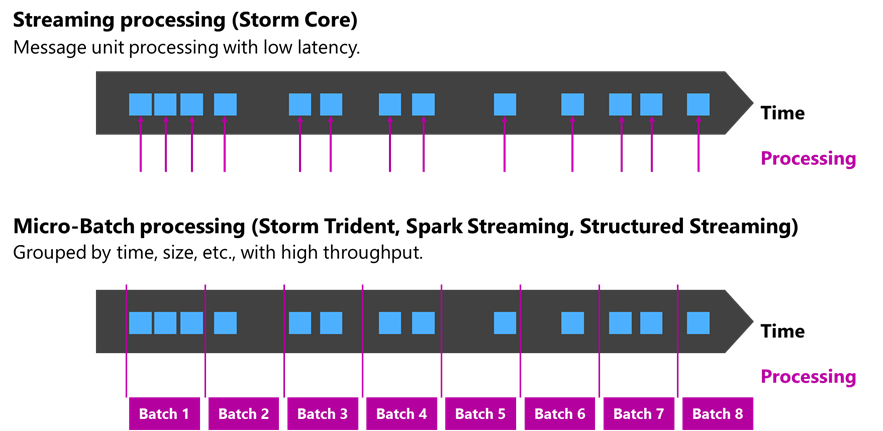

##### Spark Streaming and Spark Structured Streaming

- When Spark Streaming is launched, the driver launches the task in Executor.
- Executor receives a stream from a streaming data source.
- When Executor receives data streams, it splits the stream into blocks and keeps them in memory.
- Blocks of data are replicated to other Executors.
- The processed data is stored in the target data store.

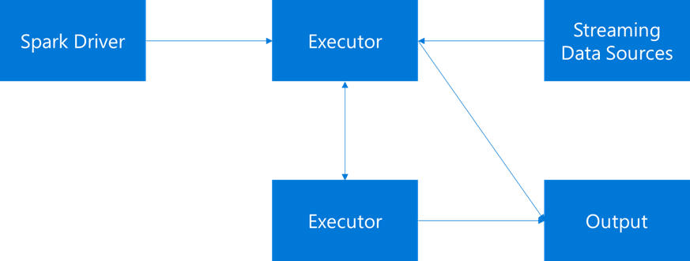

##### Spark Streaming and DStreams

The architectural foundation of Spark is the resilient distributed dataset (RDD), a read-only multiset of data items that's distributed over a cluster of machines. As each batch interval elapses, a new RDD is produced that contains all the data from that interval. The continuous set of RDDs is collected into a discretized stream (DStream). For example, if the batch interval is one second long, the DStream emits a batch every second containing one RDD that comprises all the data ingested during that second. A Spark Streaming application processes the batches that contain the events and ultimately acts on the data stored in each RDD.

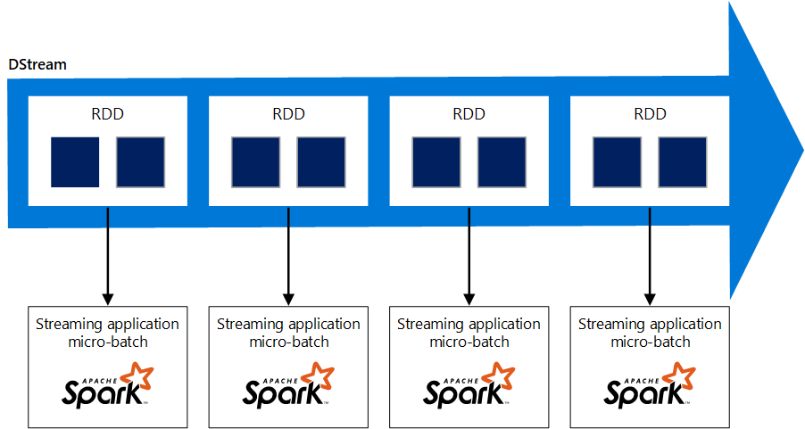

##### Data transformations on Spark Streaming


The following lists show some of the functions that are available for processing DStreams. For more information, see [Overview of Apache Spark Streaming](/azure/hdinsight/spark/apache-spark-streaming-overview).

Transformations on DStreams:

- map(func)
- flatMap(func)
- filter(func)
- repartition(numPartitions)
- union(otherStream)
- count()
- reduce(func)
- countByValue()
- reduceByKey(func, [numTasks])
- join(otherStream, [numTasks])
- cogroup(otherStream, [numTasks])
- transform(func)
- updateStateByKey(func)

Window functions:

- window(windowLength, slideInterval)
- countByWindow(windowLength, slideInterval)
- reduceByWindow(func, windowLength, slideInterval)
- reduceByKeyAndWindow(func, windowLength, slideInterval, [numTasks])
- countByValueAndWindow(windowLength, slideInterval, [numTasks])

If the built-in functions don't meet your data transformation requirements, you can use user-defined functions (UDFs). For more information, see [Window Operations](https://spark.apache.org/docs/latest/streaming-programming-guide.html#window-operations).

##### Spark Structured Streaming

In Spark Structured Streaming, data arrives at the system and is immediately ingested into an input table. The table is unbounded—it grows as new data arrives. It's continuously processed by a long-running query, and the query output is collected in another table, the output table, which can provide data for an external datastore such as a relational database.

You write queries by using the DataFrame and Dataset APIs. The timing of when data is processed from the input table is controlled by the trigger interval. By default, the trigger interval is zero.

Structured Streaming tries to process the data as soon as it arrives. In practice, this means that as soon as Structured Streaming is done processing the run of the previous query, it starts another processing run against any newly received data. You can configure the trigger to run at an interval, so that the streaming data is processed in time-based batches.

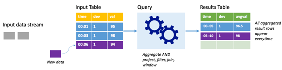

##### Structured Streaming programming

You can write the basic operations of Spark Structured Streaming code as follows. For more information, see [Overview of Apache Spark Structured Streaming](/azure/hdinsight/spark/apache-spark-structured-streaming-overview).

```scala
case class DeviceData(device: String, deviceType: String, signal: Double, time: DateTime)
val df: DataFrame = ... // streaming DataFrame with IOT device data with schema { device: string, deviceType: string, signal: double, time: string }
val ds: Dataset[DeviceData] = df.as[DeviceData] // streaming Dataset with IOT device data
// Select the devices which have signal more than 10
df.select("device").where("signal > 10")
// using untyped APIs
ds.filter(_.signal > 10).map(_.device)  // using typed APIs
// Running count of the number of updates for each device type
df.groupBy("deviceType").count() // using untyped API
// Running average signal for each device type
import org.apache.spark.sql.expressions.scalalang.typed
ds.groupByKey(_.deviceType).agg(typed.avg(_.signal)) // using typed API 
```

SQL commands:

```SQL
df.createOrReplaceTempView("updates")
spark.sql("select count(*) from updates") // returns another streaming DF
```

Window operation:

```scala
val windowedCounts = words.groupBy(
 window($"timestamp", "10 minutes", "5 minutes"),
 $"word“
 ).count() 
```

If the built-in operations don't meet your data transformation requirements, you can use UDFs.

##### Spark Streaming vs Spark Structured Streaming

Spark Structured Streaming is replacing Spark Streaming (DStreams). Going forward, Structured Streaming will receive enhancements and maintenance, while DStreams will be in maintenance mode only. Structured Streaming is currently not as feature-complete as DStreams for the sources and sinks that it supports out of the box, so evaluate your requirements to choose the appropriate Spark stream processing option.

#### General migration flow

The following steps assume that HDInsight is your migration target. The steps are similar for an Azure Databricks target.

1. **Current system**

   We consider a system in which:

    - Kafka is the source for streaming data.
    - Kafka and Storm are deployed on the same virtual network.
    - The data that Storm processes is written to a data sink such as Azure Storage or Azure Data Lake Storage.

   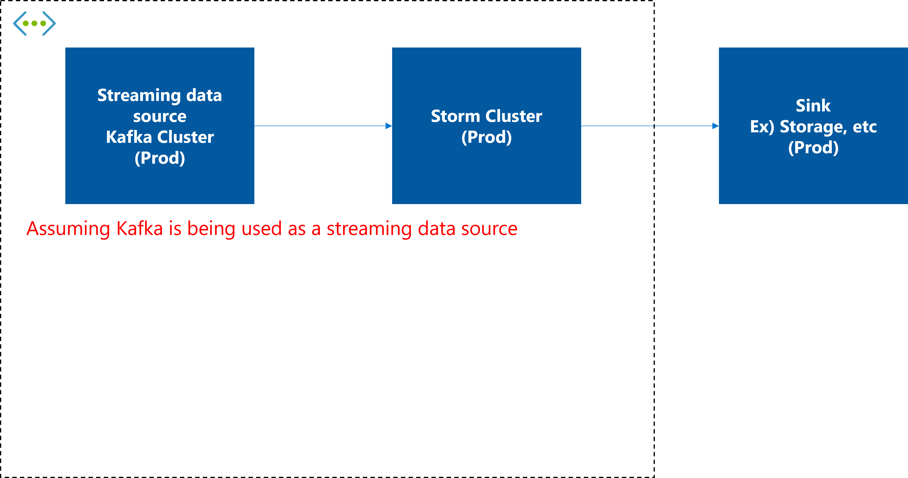

1. **Deploy a new HDInsight 4.0 Spark cluster, deploy code, and test**

   Deploy an HDInsight 4.0 Spark cluster in the same virtual network, and deploy Spark Streaming or Spark Structured Streaming on the cluster and test thoroughly.

   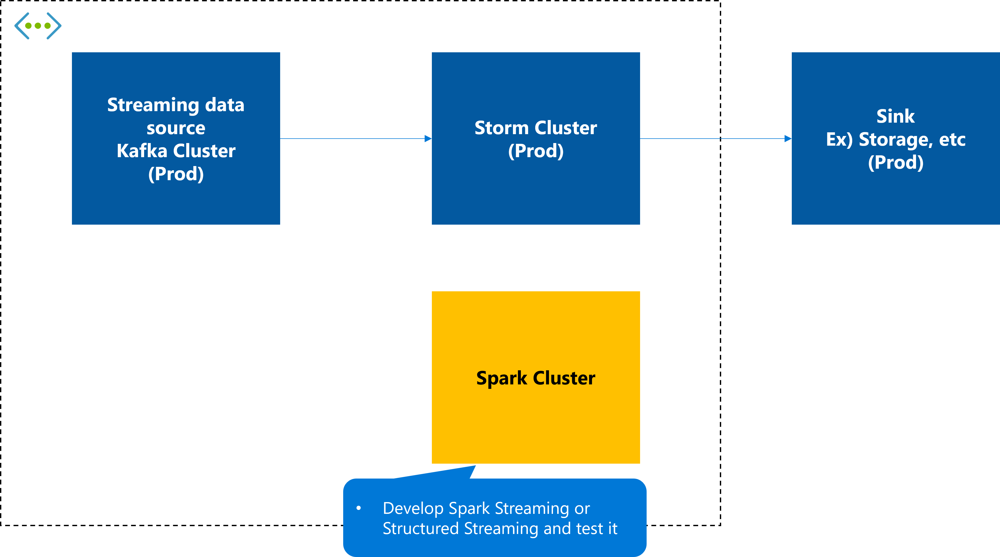

1. **Stop consuming on the current Storm cluster**

   In your Storm system, stop consuming data from the streaming data source and wait for the system to finish writing to the target sink.

   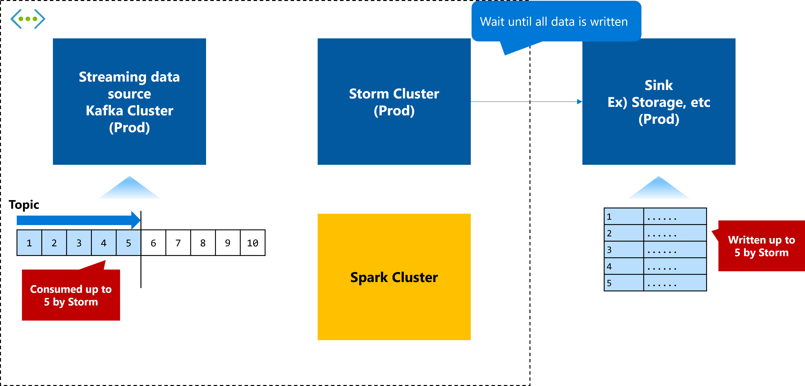

1. **Start consuming on the new Spark cluster**

   Start streaming data from the HDInsight 4.0 Spark cluster that you deployed in step 2. Spark begins processing data from the point where Storm stopped.

   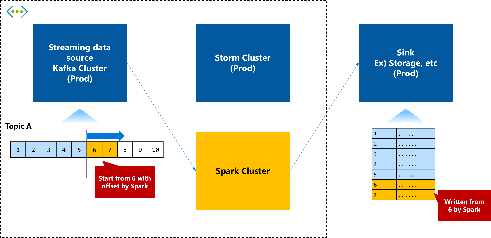

1. **Remove the old cluster as needed**

   After the switch is complete and working properly, remove the Storm cluster.

   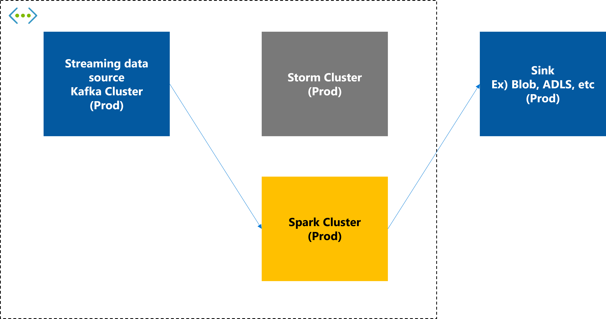

For more information, see [Guide to Migrating Big Data Workloads to Azure HDInsight](https://azure.microsoft.com/resources/migrating-big-data-workloads-hdinsight).

#### Migrate from Spark to Azure Databricks

To migrate from Spark to Azure Databricks, use the techniques described in these articles:

- [Migrate production workloads to Azure Databricks](/azure/databricks/migration/production)
- [Guide to Migrating Big Data Workloads to Azure HDInsight](https://azure.microsoft.com/resources/migrating-big-data-workloads-hdinsight)

### Migrate to Stream Analytics

Stream Analytics is a real-time analytics and complex-event processing engine for large amounts of streaming data. It consists of inputs, queries, and outputs. With just a few clicks, you can connect to an input source for streaming data, enter a query, and connect to an output destination to create an end-to-end pipeline. You can use SQL-based queries to easily filter, sort, aggregate, and join streaming data over a period of time. You can extend the SQL language by creating user-defined functions that you write in either JavaScript or C#.

For guidance on whether to choose Stream Analytics, see [Choose a real-time analytics and streaming processing technology on Azure](/azure/stream-analytics/streaming-technologies).

#### Stream Analytics architecture

Stream Analytics is a platform as a service (PaaS) service, so you don't need to be aware of internal components or infrastructure. As shown in the following diagram, you can configure it by defining input, query, and output, and arranging the streaming data in pipelines for data transformation and analytics.

:::image type="content" source="images/stream-analytics-e2e-pipeline.png" alt-text="Diagram that shows a Stream Analytics pipeline that ingests data, processes it, and delivers the results." lightbox="images/stream-analytics-e2e-pipeline.png" border="false":::

*Download a [Visio file](https://arch-center.azureedge.net/US-1952879-apache-storm-migration.vsdx) of this architecture.*

For more information, see [Welcome to Azure Stream Analytics](/azure/stream-analytics/stream-analytics-introduction).

Storm provides a fail-fast, fault-tolerant system with Nimbus, ZooKeeper, and supervisor configurations. In contrast, Stream Analytics is a fully managed service that's highly fault tolerant. For availability information, see [SLA for Azure Stream Analytics](https://azure.microsoft.com/support/legal/sla/stream-analytics/v1_0).

#### Differences between Storm and Stream Analytics

The following subsections highlight some differences between Storm and Stream Analytics.

##### Components

|Storm topology|Stream Analytics|
|--------------|----------------|
|Tuple|Event|
|Spout|Input|
|Bolt|Query, output|

##### Connectors

The following tables describe correspondences between Storm spouts and bolts, which are its typical connectors, and the typical input and output destinations of Stream Analytics.

###### Storm spouts and Stream Analytics input

|Storm spouts|Stream Analytics input|Description|
|--|--|--|
|Kafka|N/A|You can use an Event Hubs for Kafka endpoint.|
|HDFS|N/A|You need to configure Azure Blob Storage or Azure Data Lake Storage instead because Stream Analytics can't deal with HDFS directly.|
|Azure Event Hub|Azure Event Hub||
|N/A|Azure IoT Hub||
|N/A|Blob Storage||
|N/A|Data Lake Storage||

###### Storm bolt and Stream Analytics output

|Storm bolt|Stream Analytics output|Description|
|--|--|--|
|Kafka|N/A|You can use an Event Hubs for Kafka endpoint.|
|HDFS|N/A|Stream Analytics can't output data directly to HDFS. Design to output to Blob Storage or Data Lake Storage. Or, use Functions and write custom code to output to HDFS.|
|HBase|N/A|Use Functions and write custom code to output to HBase.|
|Hive|N/A|Use Functions and write custom code to output to Hive.|
|Cassandra|N/A|Use Functions and write custom code to output to Cassandra.|
|Solr|N/A|Use Functions and write custom code to output to Solr.|
|MongoDB|N/A|Use Functions and write custom code to output to MongoDB.|
|Elasticsearch|N/A|Use Functions and write custom code to output to Elasticsearch.|
|N/A|Data Lake Storage Gen1||
|N/A|Azure SQL Database||
|N/A|Azure Synapse Analytics||
|N/A|Azure Blob Storage||
|Azure Event Hubs|Azure Event Hubs||
|N/A|Power BI||
|N/A|Azure Table Storage||
|N/A|Azure Service Bus queues||
|N/A|Azure Service Bus topics||
|N/A|Azure Cosmos DB||
|N/A|Functions||

##### Lookup tables

If your Storm application references external tables or files by using operations such as joins and filters, then you need to migrate the tables and files into SQL Database, Blob Storage, or Data Lake Storage, in order to access them from Stream Analytics.

The following code is a sample query in a Stream Analytics job that references an external table on SQL Database:

```sql
With Step1 as (
    --JOIN input stream with reference data to get 'Desc'
    SELECT streamInput.*, refData1.Desc as Desc
    FROM streamInput
    JOIN refData1 ON refData1.key = streamInput.key
)
--Now Join Step1 with second reference data
SELECT *
INTO output
FROM Step1
JOIN refData2 ON refData2.Desc = Step1.Desc
```

See [Use reference data for lookups in Azure Stream Analytics](/azure/stream-analytics/stream-analytics-use-reference-data) for more information.

##### Event delivery guarantee

|Storm|Stream Analytics|
|-|-|
|The basic abstraction of Apache Storm provides an at-least-once processing guarantee. This is the same guarantee that a queuing system provides. The message is only replayed in the event of a failure. You can use the Trident API to implement exactly-once processing.|Stream Analytics guarantees exactly-once processing if you use one of the following as the output destination: <br><br>• Azure Cosmos DB<br>• SQL Database<br>• Table Storage<br><br>Exactly-once processing is achieved because the Stream Analytics output adapter writes transactionally.|

When it comes to event handling and delivery assurance, migrating from Storm to Stream Analytics can provide the same level as Storm or better. However, at-least-once processing typically has higher transaction rates than exactly-once processing. For more information, see [Event delivery guarantees (Azure Stream Analytics)](/stream-analytics-query/event-delivery-guarantees-azure-stream-analytics).

##### Event processing model

|Storm|Stream Analytics|
|-|-|
|Storm implements real-time event processing and at-least-once processing. It processes events as soon as they arrive. You can use the Trident API to implement micro-batch processing and exactly-once processing. Carefully review your business requirements to determine the type of processing that you need.|Stream Analytics adjusts batch size as needed to balance latency and throughput. Typically, it doesn't write one message at a time, but uses batches for efficiency. If both inbound and outbound event rates are high, it uses large batches. If the egress rate is low, it uses smaller batches to keep the latency low. The minimum batch size is one. Stream Analytics can provide end-to-end latency of less than 100 ms from input to output.|

##### Distribution

|Storm|Stream Analytics|
|-|-|
|Storm stream grouping defines how a stream should be partitioned among the tasks. It's mainly used to determine how to distribute the processing for the purpose of improving performance. The following stream grouping methods are available.<br><br>• **Shuffle grouping:** Tuples are randomly distributed throughout the bolt task. It's guaranteed that each bolt gets the same number of tuples.<br>• **Fields grouping:** The stream is divided into groups according to the specified fields.<br>• **Partial key grouping:** Grouping is by specified fields in the same way as fields grouping, but with load balancing between the two bolts to deal with data skew.<br>• **All grouping:** The stream is replicated across all bolt tasks.<br>• **Global grouping:** All tuples in the stream are routed to one task, and the task with the lowest task ID value is selected.<br>• **None grouping:** You don't care how the stream is grouped.<br>• **Direct grouping:** The producer of the tuple decides which task of the consumer receives this tuple.<br>• **Local or shuffle grouping:** If the target bolt has more than one task in the same worker process, the tuple is shuffled only to those in-process tasks.|Stream Analytics partitions the data into subsets to scale out query processing, like fields grouping in Storm. Queries are distributed across multiple nodes to reduce the number of events that each node processes. The result can be better total performance. The more input partitions you have, the more compute resources that your job consumes. You can optimize job performance by adjusting the number of streaming units and partitions.

The following image shows input partitioning. If the input, such as Event Hubs, is partitioned by Partition ID, we recommend partitioning with that key in Stream Analytics.

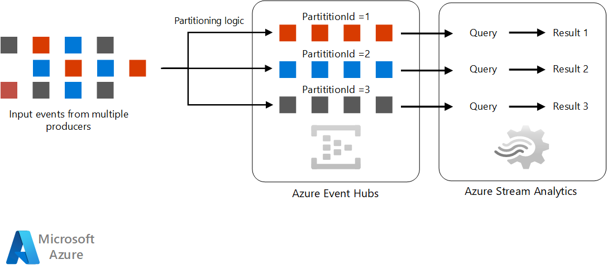

When no partitions are available in the input stream, Stream Analytics can partition the stream or reshuffle the events.

Here's an example of a query that partitions the input partition:

```sql
WITH RepartitionedInput AS
(
SELECT *
FROM input PARTITION BY DeviceID
)

SELECT DeviceID, AVG(Reading) as AvgNormalReading
INTO output
FROM RepartitionedInput
GROUP BY DeviceId, TumblingWindow(minute, 1)
```

##### Configure Stream Analytics for performance

There are various ways to improve performance on Storm, such as scaling up or out, tuning memory usage, and adjusting the number of worker threads. In contrast, Stream Analytics provides a single, simple way: adjust the allocation of streaming units (SUs). An SU is a performance unit that includes both CPU and memory. Stream Analytics can handle approximately 1 MB/s of input per SU.

Stream Analytics jobs do all their work in memory. If you run out of memory, the job fails. To avoid this problem, ensure that enough resources are allocated.

Choosing the number of SUs required for a particular job depends on the partitioning configuration of the input and the queries defined in the job. A good approach is to start with six SUs for queries that don't use `PARTITION BY`. Then, adjust the number of SUs step-by-step and monitor the SU usage rate and the data flow. For more information, see [Understand and adjust Stream Analytics streaming units](/azure/stream-analytics/stream-analytics-streaming-unit-consumption). The maximum number of SUs depends on both the number of query steps defined in the job and the number of partitions in each step. For more information about restrictions, see [Calculate the maximum streaming units of a job](/azure/stream-analytics/stream-analytics-parallelization#calculate-the-maximum-streaming-units-of-a-job).

These are the factors that can increase the SU requirements of a job:

- **Complex query logic:** Complex queries are more likely to keep the state in memory.
- **Stateful query logic:** Stateful processing such as window aggregation, joins, and analytic functions, increases SU usage.
- **Number of input partitions:** More input partitions means more buffers and more resources that the job consumes.
- **Reference data:** Reference data is loaded into memory for fast retrieval, which increases memory requirements.
- **Using UDFs:** UDFs cause the JavaScript runtime to be loaded into memory, which increases memory requirements.

##### Stream Analytics clusters

A Stream Analytics cluster is a single-tenant environment for complex and demanding scenarios. A fully scaled cluster environment can process data at 200 MB/s or more. If your sizing estimates tell you that you need more processing power than Stream Analytics provides, consider using a Stream Analytics cluster. A cluster can use private endpoints to connect to a private virtual network. For more information, see [Overview of Azure Stream Analytics clusters](/azure/stream-analytics/cluster-overview).

##### Programming languages

Storm applications are developed in Java and other languages. Stream Analytics uses SQL-based queries to describe the process. For more information, see [Stream Analytics Query Language Reference](/stream-analytics-query/stream-analytics-query-language-reference). You can increase flexibility by creating user-defined functions (UDFs) for your queries to call. You can write UDFs in JavaScript and C#. For more information, see [User-defined functions in Azure Stream Analytics](/azure/stream-analytics/functions-overview).

##### Windowing

The following table shows the stream windowing differences between Storm core and Stream Analytics. Stream Analytics supports the Storm core sliding window and tumbling window techniques. Stream Analytics also supports other windowing techniques.

|Storm core|Stream Analytics|Description|
|----------|----------------|-----------|
|Sliding|Hopping|Sliding windowing in Storm is equivalent to hopping windowing in Stream Analytics. Set the window length and interval, and the window-based processing starts at each interval. Events can belong to multiple sliding windows.|
|Tumbling|Tumbling|The stream is divided into the equal-length time segments and the process runs. There are no duplicate windows.|
|N/A|Sliding|Sliding windowing in Stream Analytics differs from sliding windowing in Storm. The windowing in Stream Analytics depends on the occurrence of the event. It processes events between the time the event occurred and the specified past time.|
|N/A|Session|If the event continues to occur within the specified timeout period, the session window continues to grow until the maximum period is reached. The maximum period check interval is set to the same size as the specified maximum period. If no event occurs within the timeout period, the window is closed at the timeout.|
|N/A|Snapshot|Events with the same timestamp are grouped together. You can apply a snapshot window by adding System.Timestamp() to the GROUP BY clause.|

##### Disaster recovery for a Stream Analytics migration

If you configured disaster recovery in Storm and want to configure it in your migrated version, you can. Stream Analytics doesn't provide automatic geo-failover, but can you achieve it by deploying the same Stream Analytics job in multiple Azure regions and configuring input and output. The application that generates the event can ensure data redundancy by sending data to both regions. For more information, see [Achieve geo-redundancy for Azure Stream Analytics jobs](/azure/stream-analytics/geo-redundancy).

##### Security for a Stream Analytics migration

Data security is a responsibility that's shared between you and the service provider. On-premises solutions require you to provide everything from endpoint protection to physical hardware security, which isn't easy. If you use a PaaS cloud service provider, your responsibilities are significantly reduced. For information about the Microsoft shared responsibility model for security, see [Azure security baseline for Stream Analytics](/security/benchmark/azure/baselines/stream-analytics-security-baseline?toc=/azure/stream-analytics/TOC.json). Stream Analytics runs on the Azure platform and, unlike Storm, doesn't require any additional components to be installed for security. We recommend that you use the following checklist to guide you as you migrate your stream processing system security implementation:

||Storm|Stream Analytics|
|---|---|---|
|**Network security**|Control traffic by using security tools such as network devices.|Stream Analytics jobs establish outbound connections to I/O resources, process data in real time, and produce results. The Stream Analytics service runs from networks that normally can't be included directly in network rules. When you have a Stream Analytics cluster, you can use Azure Private Link to create Stream Analytics endpoints within a virtual network to communicate with private addresses. For more information, see [Connect Stream Analytics jobs to resources in an Azure virtual network](/azure/stream-analytics/connect-job-to-vnet).|
|**Identity and access control**|Storm offers pluggable authentication support through Thrift and SASL. It also has an authorization mechanism for access control for jobs.|Authenticate with Azure Active Directory (Azure AD) and control access by using Azure role-based access control (RBAC).|
|**Data protection**|Storm doesn't have encryption capabilities.|Stream Analytics holds query definitions, user-defined custom functions, checkpoint data, reference data snapshots, and input and output connection information. It automatically encrypts your data. For more information, see [Data protection in Azure Stream Analytics](/azure/stream-analytics/data-protection).|
|**Regulatory compliance controls**|You can set policies by using security components such as Apache Ranger.|Regulatory Compliance in Azure Policy provides initiative definitions, known as built-ins, for the compliance domains and security controls related to different compliance standards. The definitions are created and managed by Microsoft. For more information, see [Azure Policy Regulatory Compliance controls for Azure Stream Analytics](/azure/stream-analytics/security-controls-policy).|
|**Data recovery**|There's no backup feature. You need to implement data backup yourself.|Stream Analytics makes it possible for you to [copy, back up, and move your Azure Stream Analytics jobs between regions](/azure/stream-analytics/copy-job).|

#### Migration

This section presents procedures for doing the migration from Storm to Stream Analytics.

##### Assessment

Before you migrate your existing Storm implementation to Stream Analytics, collect the following information that can help you plan your migration:

|Item|Description|
|---|---|
|Stream jobs|Identify all streaming jobs that run on Storm. You can see the currently running jobs on the Storm UI. Identify other jobs that are in your inventory or code repository.|
|Source and sink in topology|Identify all the data sources and sinks in the topology of each Storm streaming job. Ensure that you can map the data sources and sinks to the inputs and outputs that Stream Analytics supports. These are listed in [Connectors](#connectors). If such a mapping isn't possible, consider migration targets other than Stream Analytics.|
|Applications that send data to sources|Identify the applications that send data to the sources in the Storm jobs. These applications must be included in your migration planning.|
|Lookup tables|Identify the lookup tables that storm jobs reference. These tables must be included in your migration planning. Stream Analytics uses Blob Storage, Data Lake Storage, and SQL Database for storing reference data.|
|Applications that use sink data|Identify the applications in your Storm implementation that use the sink data. These applications must be included in your migration planning.|
|Processing logic|Identify all the processing logic that's in the Storm streaming jobs.|
|Current sizing|Get information about performance metrics such as CPU, memory, disk, and the number of nodes of the host or VMs on which the Storm client or server is running. This allows you to estimate the base size required for your Azure VM.|
|High availability, business continuity, and disaster recovery|If you have some troubleshooting measures on your Storm implementation, determine whether they work on Azure. For example, if you have a disaster recovery configuration on two data centers that are separated, you need to consider a geo-redundancy deployment. For more information, see [Achieve geo-redundancy for Azure Stream Analytics jobs](/azure/stream-analytics/geo-redundancy).|

##### Planning

For successful migration, it's important to understand the characteristics of your business. Select offline migration if you can completely shut down the system, perform migration, and restart the system at the destination. If your system is always busy and you can't afford a long outage, consider migrating online.

If you don't want to migrate all your dependent applications to Azure, they need to be able to communicate between on-premises and Azure. Design by selecting the connection method, such as communication via the internet using public endpoints, VPN connection via the Internet, and closed network connection using ExpressRoute. Choose a method that fits the policies and requirements of the corporate network.

##### Storm migration

When you migrate the sources and sinks to Azure, you must also migrate the applications that send data to the sources and those that use the data received by the sinks. Consider preparing, migrating, and switching by using the steps listed in the following sections.

##### Preparation and migration

Do the following steps in the test environment:

1. Prepare the applications that send data to the sources to send data to Stream Analytics input [connectors](#connectors).
1. Prepare the applications that use the data from the sinks to receive data from Stream Analytics output [connectors](#connectors).
1. Deploy the input and output resources and Stream Analytics in Azure. If you have lookup tables for Storm jobs, deploy them in Blob Storage, Data Lake Storage, or SQL Database.
1. Migrate the Storm topologies to Stream Analytics jobs.
1. Test the streaming processes by running the applications that send data to the sources.
1. Adjust configurations and applications to ensure that the sequence of processes works properly in terms of business and system requirements.

##### Switching to the migrated system

Do the following steps in the production environment:

1. Launch a migrated Stream Analytics job.
1. Connect the applications that use the data from the sinks to the Stream Analytics output [connectors](#connectors). Run the applications.
1. Connect the applications that send data to the sources to Stream Analytics input [connectors](#connectors). Run the applications.
1. Monitor how the system works.

If possible, plan to run Storm and Stream Analytics in parallel by sending data from the applications that are the sources of the data to the existing one and then to Azure at the same time. This allows you to quickly switch back to a working Storm if something goes wrong, making your migration safer. When you have confidence in your migrated system, you can retire the source system.

##### Job migration examples

No code is required to connect Stream Analytics inputs and outputs. Here are a few examples of code that does data transformations on Storm and on Stream Analytics. Java is used for the Storm code examples, which are based on code from [Storm documentation](https://storm.apache.org/releases/2.2.0/Stream-API.html).

##### Filter

Storm

```java
Stream<String> errors = logs.filter(line -> line.contains("ERROR"));
```

Stream Analytics

```sql
SELECT * INTO erroroutput FROM input WHERE status = "ERROR"
```

##### Map

Storm

```java
Stream<Integer> wordLengths = words.map(String::length);
```

Stream Analytics

Select the function according to the processing used by Storm. Here's an example of using the **LEN** function.

```sql
SELECT LEN (word) INTO lengthoutput FROM input
```

##### Aggregation

Storm

```java
// Aggregate the numbers and produce a stream of the last 10 seconds of sums.
Stream<Long> sums = numbers.window(TumblingWindows.of(Duration.seconds(10)).aggregate(new Sum());

// Use reduce to compute the last 10 seconds of sums.
Stream<Long> sums = numbers.window(...).reduce((x, y) -> x + y);
```

Stream Analytics

```sql
SELECT SUM (number) INTO numberoutput
FROM input TIMESTAMP BY EntryTime
GROUP BY TumblingWindow(seconds,10)
```

### Migrate to Functions

[Functions](/azure/azure-functions) is an event-driven, serverless compute service that runs small, single-task code without requiring new infrastructure. The cloud infrastructure provides servers to run the functions at scale. With triggers and bindings, Functions can react to changes in Azure services like Blob Storage and Azure Cosmos DB. You can use it to process bulk data, integrate systems, work with IoT, and build simple APIs and microservices. For more information, see [Introduction to Azure Functions](/azure/azure-functions/functions-overview).

#### Differences between Storm and Functions

Functions, like Stream Analytics, makes it possible to easily connect to various Azure services. Because it runs on custom code, it's flexible.
Unlike the other migration targets, Functions isn't a service that's dedicated to stream processing, so there are significant functional differences between Storm and Functions. Before you plan your migration to Functions, familiarize yourself with the differences between Storm and Functions that are described in this section.

##### Storm topology and Functions

|Storm topology|Functions|
|---|---|
|Tuple|Event|
|Spout|Input|
|Bolt|Output|

##### Storm connectors and Functions inputs and outputs

The following is a comparison of Storm's typical connector and Functions inputs and outputs. Note that the table doesn't show all Storm and Functions connectivity.

##### Storm spout and Functions input

|Storm spout|Functions input|Description|
|--|--|--|
|Kafka|N/A|You can connect in your code to the Kafka client. If you host the Functions Premium plan, there's a Kafka extension for reading and writing Kafka topics. For more information, see [Announcing Preview of the Azure Functions Kafka extension](https://techcommunity.microsoft.com/t5/apps-on-azure/announcing-preview-of-the-azure-functions-kafka-extension/ba-p/1342348) and [Azure Functions hosting options](/azure/azure-functions/functions-scale#premium-plan).|
|HDFS|N/A|Functions doesn't have a built-in HDFS input. Configure Blob Storage to hold the data or use custom code to consume HDFS data.|
|Azure Event Hubs|Azure Event Hubs||
|N/A|Azure IoT Hub||
|N/A|Blob Storage||
|N/A|Azure Cosmos DB||
|N/A|HTTP and Webhook|Run as a trigger.|
|N/A|Service bus|Run as a trigger.|
|N/A|Queue storage|Run as a trigger.|

##### Storm bolt and Functions output

|Storm bolt|Functions output|Description|
|--|--|--|
|Kafka|Kafka|You can connect in your code to the Kafka client. If you host the Functions Premium plan, there's also a Kafka extension for reading and writing Kafka topics. For more information, see [Announcing Preview of the Azure Functions Kafka extension](https://techcommunity.microsoft.com/t5/apps-on-azure/announcing-preview-of-the-azure-functions-kafka-extension/ba-p/1342348) and [Azure Functions hosting options](/azure/azure-functions/functions-scale#premium-plan).|
|HDFS|N/A|Functions doesn't have a built-in HDFS output. Output instead to Blob Storage or use custom code to output HDFS data.|
|HBase|N/A|Functions doesn't have a built-in connector for HBase. Use custom code to output to HBase.|
|Hive|N/A|Functions doesn't have a built-in connector for Hive. Use custom code to output to the Hive table.|
|Cassandra|N/A|Functions doesn't have a built-in connector for Cassandra. Use custom code to output to Cassandra.|
|Solr|N/A|Functions doesn't have a built-in connector for Solr. Use custom code to output to Solr.|
|MongoDB|N/A|Functions doesn't have a built-in connector for MongoDB. Use custom code to output to MongoDB.|
|Elasticsearch|N/A|Functions doesn't have a built-in connector for Elasticsearch. Use custom code to output to Elasticsearch.|
|N/A|Blob Storage||
|Azure Event Hubs|Azure Event Hubs||
|N/A|Table Storage||
|N/A|Azure Service Bus||
|N/A|Azure Cosmos DB||
|N/A|HTTP and Webhook||

##### Functions event delivery guarantee

Functions provides an at-least-once guarantee when the message input is a message queuing system like Event Hubs. For more information, see [Azure Functions reliable event processing](/azure/azure-functions/functions-reliable-event-processing).

###### Distribution of requests

For triggers such as HTTP, Functions are evenly distributed among the nodes for each request. For Event Hub triggers, there's an event processor host (EPH) instance for each function that's triggered by the event. Event Hubs triggers allow only one EPH instance to lease a particular partition. This policy works to evenly allocate Event Hubs partitions according to the number of EPH instances.
Functions can be processed in parallel by using up to 200 instances. For more information, see [Azure Functions hosting options](
/azure/azure-functions/functions-scale).

##### Performance and reliability considerations

Storm performance is improved by techniques such as scaling hardware up or out, tuning memory, and adjusting the number of worker threads. Storm provides a fail-fast, fault-tolerant system by using Nimbus, ZooKeeper, and Supervisor configurations. For more information, see [Best practices for reliable Azure Functions](/azure/azure-functions/functions-best-practices).

###### Event Driven Scaling

The event-driven scaling feature of Functions monitors the event rate and scales in and out to match demand. The unit of scale for Functions is a function app. To scale out the function app, additional resources are allocated. The following diagram illustrates the process:

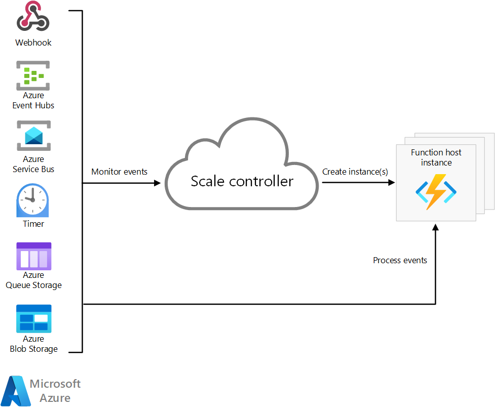

For more information, see [Event-driven scaling in Azure Functions](/azure/azure-functions/event-driven-scaling).

##### Disaster recovery for a Functions migration

A Functions implementation doesn't provide automatic geo-failover, but you can apply a geo-disaster recovery strategy to include disaster recovery in your migrated system. For more information, See [Azure Functions geo-disaster recovery](/azure/azure-functions/functions-geo-disaster-recovery).

##### Security for a Functions migration

Data security is a responsibility that's shared between you and the service provider. On-premises solutions require you to provide everything from endpoint protection to physical hardware security, which isn't easy. If you use a PaaS cloud service provider, your responsibilities are significantly reduced. We recommend that you use the following checklist to guide you as you migrate your stream processing system security implementation:

||Storm|Functions|
|---|---|---|
|**Network security**|Control traffic using security functions such as network devices.|Incoming IP restrictions, virtual network integration, hybrid connectivity, and outbound IP restrictions to Functions endpoints are available. Different Functions hosting plans have different features. For more information, see [Azure Functions networking options](/azure/azure-functions/functions-networking-options).|
|**Identity and access control**|Storm offers pluggable authentication support through thrift and SASL. It also has an authorization mechanism for access control for jobs.|You can authenticate with the Functions key. The App Service platform can use Azure Active Directory (Azure AD) and several third-party identity providers to authenticate clients. You can use this method to implement custom authorization rules for your function and manipulate the user information in your function code. You can also use Azure API Management (APIM) to authenticate your request.|
|**Data protection**|Storm doesn't have encryption capabilities.|Functions uses Azure Storage, which encrypts all the data in your stored storage account.|
|**Regulatory compliance controls**|You can set policies by using security components such as Apache Ranger.|Regulatory Compliance in Azure Policy provides initiative definitions, known as built-ins, for the compliance domains and security controls related to different compliance standards. The definitions are created and managed by Microsoft. For more information, see [Regulatory Compliance in Azure Policy](/azure/governance/policy/concepts/regulatory-compliance).|
|**Data recovery**|There's no backup feature. You need to implement data backup yourself.|Data in Azure Storage can be protected by the backup feature of Azure Storage. For Functions applications, App Service features can only be backed up if host the App Service Plan. We recommend that you manage application code by using a code repository.|

#### Storm to Functions migration

Migrating from Storm to Functions is basically the same as migrating to Stream Analytics. For more information, see [Migrate to Stream Analytics](#migrate-to-stream-analytics).

## Contributors

*This article is maintained by Microsoft. It was originally written by the following contributors.*

Principal authors:

- [Namrata Maheshwary](https://www.linkedin.com/in/namrata0104) | Senior Cloud Solution Architect
- [Raja N](https://www.linkedin.com/in/nraja) | Director, Customer Success
- [Hideo Takagi](https://www.linkedin.com/in/hideo-takagi) | Cloud Solution Architect
- [Ram Yerrabotu](https://www.linkedin.com/in/ram-reddy-yerrabotu-60044620) | Senior Cloud Solution Architect

Other contributors:

- [Ram Baskaran](https://www.linkedin.com/in/ram-baskaran) | Senior Cloud Solution Architect
- [Jason Bouska](https://www.linkedin.com/in/jasonbouska) | Senior Software Engineer
- [Eugene Chung](https://www.linkedin.com/in/eugenesc) | Senior Cloud Solution Architect
- [Pawan Hosatti](https://www.linkedin.com/in/pawanhosatti) | Senior Cloud Solution Architect - Engineering
- [Daman Kaur](https://www.linkedin.com/in/damankaur-architect) | Cloud Solution Architect
- [Danny Liu](https://www.linkedin.com/in/geng-liu) | Senior Cloud Solution Architect - Engineering
- [Jose Mendez](https://www.linkedin.com/in/jos%C3%A9-m%C3%A9ndez-de-la-serna-946985aa) Senior Cloud Solution Architect
- [Ben Sadeghi]( https://www.linkedin.com/in/bensadeghi) | Senior Specialist
- [Sunil Sattiraju](https://www.linkedin.com/in/sunilsattiraju) | Senior Cloud Solution Architect
- [Amanjeet Singh](https://www.linkedin.com/in/amanjeetsingh2004) | Principal Program Manager
- [Nagaraj Seeplapudur Venkatesan](https://www.linkedin.com/in/nagaraj-venkatesan-b6958b6) | Senior Cloud Solution Architect - Engineering

*To see non-public LinkedIn profiles, sign in to LinkedIn.*

## Next steps

### Azure product introductions

- [Introduction to Azure Data Lake Storage Gen2](/azure/storage/blobs/data-lake-storage-introduction)
- [What is Apache Spark in Azure HDInsight](/azure/hdinsight/spark/apache-spark-overview)
- [What is Apache Hadoop in Azure HDInsight?](/azure/hdinsight/hadoop/apache-hadoop-introduction)
- [What is Apache HBase in Azure HDInsight](/azure/hdinsight/hbase/apache-hbase-overview)
- [What is Apache Kafka in Azure HDInsight](/azure/hdinsight/kafka/apache-kafka-introduction)

### Azure product reference

- [Azure Active Directory documentation](/azure/active-directory)
- [Azure Cosmos DB documentation](/azure/cosmos-db)
- [Azure Data Factory documentation](/azure/data-factory)
- [Azure Databricks documentation](/azure/databricks)
- [Azure Event Hubs documentation](/azure/event-hubs)
- [Azure Functions documentation](/azure/azure-functions)
- [Azure HDInsight documentation](/azure/hdinsight)
- [Microsoft Purview data governance documentation](/azure/purview)
- [Azure Stream Analytics documentation](/azure/stream-analytics)
- [Azure Synapse Analytics](/azure/synapse-analytics)

### Other

- [Enterprise Security Package for Azure HDInsight](/azure/hdinsight/enterprise-security-package)
- [Develop Java MapReduce programs for Apache Hadoop on HDInsight](/azure/hdinsight/hadoop/apache-hadoop-develop-deploy-java-mapreduce-linux)
- [Use Apache Sqoop with Hadoop in HDInsight](/azure/hdinsight/hadoop/hdinsight-use-sqoop)
- [Overview of Apache Spark Streaming](/azure/hdinsight/spark/apache-spark-streaming-overview)
- [Structured Streaming tutorial](/azure/databricks/getting-started/spark/streaming)
- [Use Azure Event Hubs from Apache Kafka applications](/azure/event-hubs/event-hubs-for-kafka-ecosystem-overview)

## Related resources

- [Apache HDFS migration to Azure](apache-hdfs-migration.yml)
- [Apache HBase migration to Azure](apache-hbase-migration.yml)
- [Apache Kafka migration to Azure](apache-kafka-migration.yml)
- [Apache Sqoop migration to Azure](apache-sqoop-migration.yml)
- [Apache Storm migration to Azure](apache-storm-migration.yml)
