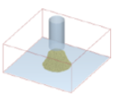
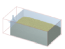
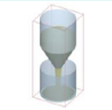
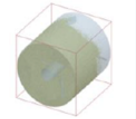
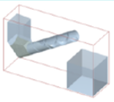
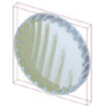
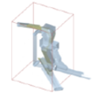
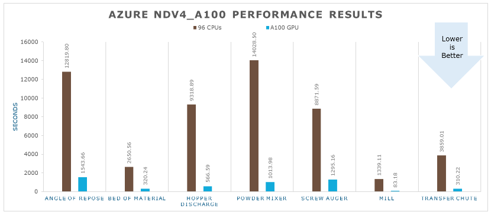
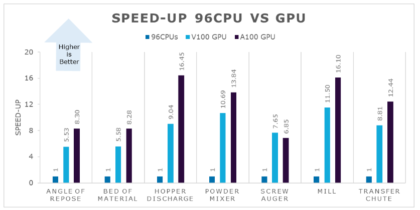

This article briefly describes the steps for running [Altair
EDEM](https://www.altair.com/edem) on a virtual machine (VM) that\'s
deployed on Azure. It also presents the performance results of running
EDEM on Azure.

EDEM is high-performance software for bulk and granular material simulation. Powered by DEM, EDEM quickly and accurately simulates and analyzes the behavior of coal, mined ores, soils, fibers, grains, tablets, powders, and more.

EDEM simulation provides engineers with crucial insight into how those materials will interact with their equipment during a range of operation and process conditions. It can be used stand-alone or combined with other CAE tools.

Leading companies in the heavy equipment, off-road, mining, steelmaking, and process manufacturing industries use EDEM to understand and predict granular material behaviors, evaluate equipment performance, and optimize processes.

## Why deploy EDEM on Azure?

- Model particle shape using the highly validated and computationally efficient multi-sphere method.
- Cutting edge DEM solver, highly parallelized for use on multi-core shared memory workstations, GPU hardware, and multi-GPU systems.
- Solver engine is fully double precision across all platforms.
- Simulate large and complex particle systems.
- Advanced and powerful post-processing capability

## Architecture

:::image type="content" source="media/altair-edem/hpc-edem.svg" alt-text="Diagram that shows an architecture for deploying Altair EDEM." lightbox="media/altair-edem/hpc-edem.svg" border="false":::

*Download a [Visio file](https://arch-center.azureedge.net/hpc-edem.vsdx) of this architecture.*

### Components

-   [Azure Virtual
    Machines](https://azure.microsoft.com/services/virtual-machines) is
    used to create Windows VMs. 
    -   For information about deploying the VM and installing the
        drivers, see [Windows VMs on Azure](../../reference-architectures/n-tier/windows-vm.yml).
-   [Azure Virtual
    Network](https://azure.microsoft.com/services/virtual-network) is
    used to create a private network infrastructure in the cloud. 
    -   [Network security
        groups](/azure/virtual-network/network-security-groups-overview)
        are used to restrict access to the VMs.  
    -   A public IP address connects the internet to the VM.   
-   A physical SSD is used for storage.   

## Compute sizing and drivers

Performance tests of Altair EDEM on Azure used [NCv3-series], [NC A100 v4-series] and [ND A100 v4-series] VMs running on Windows. The following table provides the configuration details.

|  Size|               vCPU    | Memory, in GiB |  Temporary storage (SSD), in GiB|   GPUs |    GPU  memory, in GiB     | Maximum data disks|Max uncached disk throughput: IOPS / MBps |Max network bandwidth|Max NICs|
|--|--|--|--|--|--|--|-|-|-|
|Standard_ND96asr_v4|   96   |    900|       6,000|      8 A100 40 GB GPUs (NVLink 3.0)|   40|        32|80,000 / 800|24,000 Mbps|8|
|Standard_NC24ads_A100_v4|24|220|1123|1|80|12|30000/1000|20,000|2|
|Standard_NC48ads_A100_v4|48|440|2246|2|160|24|60000/2000|40,000|4|
|Standard_NC96ads_A100_v4|96|880|4492|4|320|32|120000/4000|80,000|8|
|  Standard_NC6s_v3   |   6 |       112     |  736         |1    |16        |12|20000/200||4|

### Required drivers

To use Altair EDEM  on the above mentioned VMs as described in this article, you need to install NVIDIA and AMD drivers.

## EDEM installation

Before you install EDEM, you need to deploy and connect a VM and install the required NVIDIA and AMD drivers.

For information about deploying the VM and installing the drivers, see one of these articles:

- [Run a Windows VM on Azure]
- [Run a Linux VM on Azure]

To download EDEM:
1.	Open Altair one Marketplace in web browser and sign in
2.	Select EDEM in the product list.
3.	Select appropriate operating system and download.
4.	Download the license manager.

See the documents in [Altair one Marketplace](https://altairone.com/Marketplace?queryText=edem&app=EDEM&tab=Download) for instructions for installing EDEM.

## Performance results of EDEM on an Azure VM
### EDEM performance results

Seven real-world scenarios were used to test the performance of EDEM on
Azure VMs. Particle simulations were tested. The following table provides the details.

| Model | Angle of repose |Bed of material  |Hopper discharge  |Powder mixer|Screw augur|Mill|Transfer chute|
|---------|---------|---------|---------|--|--|--|--|
|   Description  |Cylinder angle of repose         |  Bed of material with tillage tool      |Hopper emptying into container         |Powder mixer operation|Screw augur operation|Mill operation| Transfer chute with dynamic factory|
|     |         |         |           | | | | |
|  Particle radius (m)| 0.0005 - 0.001|0.002 - 0.004 |0.003|0.0005|0.001|0.005|0.0045 - 0.009|
| Number of spheres    | 3        |3         |3         |1|1|1|3|
|   Size distribution  |Random         |Random         |Fixed|Fixed |    Fixed|Fixed|Random
| Number of particles    |  1,000,000 |  1,000,000 | 1,000,000 | 1,000,000| 1,000,000| 1,000,000| 1,000,000|
|  Physics|Hertz-Mindlin  |Hertz-Mindlin with JKR |Hertz-Mindlin  |Hertz-Mindlin|Hertz-Mindlin|Hertz-Mindlin|Hertz-Mindlin with JKR|
|Time steps|5.73E-06 |5.00E-05 |4.00E-05 |9.20E-06|1.40E-05|0.00016|5.97E-05|
| Total time |   0.5 | 1 |1 |1|1 |1|1 |
|Save interval |0.1|0.1|0.1  |0.1 |0.1 |0.1 |0.1|
| Grid cell size (x Rmin)| 3|3|3|3| 3 |3 |5|
| Factory |No|No| No|No|No|No|Yes|
|  Periodic boundaries   |No|No| No|No|No|No|No|

The following table shows the elapsed wall-clock time required to complete each of
the simulations, in seconds.

| Model               | 96 CPUs     | 8 A100 GPUs (ND96asr_v4)        | V100 GPU (NC6s_v3)     |
|     --               |--         |--                  |--              |
| Angle of repose     | 12819.80    | 1543.66          | 2319.39      |
| Bed of material     | 2650.56     | 320.24           | 475.04       |
| Hopper discharge    | 9318.89     | 566.59           | 1030.38      |
| Powder mixer        | 14028.50    | 1013.98          | 1312.27      |
| Screw auger         | 8871.59     | 1295.16          | 1158.98      |
| Mill                | 1339.11     | 83.18            | 116.49       |
| Transfer chute      | 3859.01     | 310.22           | 437.92       |

This graph shows the elapsed seconds for A100 GPUs, compared to the
results for 96 CPUs.

The following table shows the relative speed increases for A100 GPUs and
the V100 GPU, as compared to 96 CPUs.

| Model               | 96 CPUs     | 8 A100 GPUs (ND96asr_v4)      | V100 GPU (NC6s_v3)      |
|   --                  | --         |    -              |    -          |
| Angle of repose     | 1           | 8.30             | 5.53         |
| Bed of material     | 1           | 8.28             | 5.58         |
| Hopper discharge    | 1           | 16.45            | 9.04         |
| Powder mixer        | 1           | 13.84            | 10.69        |
| Screw auger         | 1           | 6.85             | 7.65         |
| Mill                | 1           | 16.10            | 11.50        |
| Transfer chute      | 1           | 12.44            | 8.81         |

This graph shows the relative speeds:

## Azure cost

Only rendering time is considered for these cost calculations.
Application installation time isn't considered.

You can use the wall-clock time presented in the following table and the
Azure hourly rate to calculate costs. For the current hourly costs,
see [Windows Virtual Machines
Pricing](https://azure.microsoft.com/pricing/details/virtual-machines/windows/#pricing).

You can use the [Azure pricing
calculator](https://azure.microsoft.com/pricing/calculator) to estimate
the costs for your configuration.

VM size      |              Model|                         Wall-clock time, in seconds|
|-|-|-|
|Standard_ND96asr_v4|        Angle of repose|               1543.66|
|Standard_ND96asr_v4|  Bed of material       |        320.244|
|Standard_ND96asr_v4|  Hopper discharge        |      566.587|
|Standard_ND96asr_v4|  Powder mixer           |       1013.98|
|Standard_ND96asr_v4|  Screw auger           |        1295.16|
|Standard_ND96asr_v4|  Mill            |              83.1794|
|Standard_ND96asr_v4|  Transfer chute       |         310.224|
|  Standard_NC6s_v3 |Angle of repose               |2319.39|
|  Standard_NC6s_v3 |Bed of material               |475.04|
|  Standard_NC6s_v3 | Hopper discharge       |       1030.38|
|  Standard_NC6s_v3 |Powder mixer           |       1312.27|
|  Standard_NC6s_v3 |Screw auger           |        1158.98|
|  Standard_NC6s_v3 |Mill                 |         116.49|
|  Standard_NC6s_v3 | Transfer chute     |           437.92|

## Summary

-   Altair EDEM was successfully tested on ND A100 v4 and NCv3 series
    VMs on Azure.
-   The highest speeds are achieved on ND96asr_v4 VMs.
-   Simulations for complex workloads are solved in a few hours on
    ND96asr_v4 VMs.

## Contributors

*This article is maintained by Microsoft. It was originally written by
the following contributors.*

Principal authors:

-   [Hari Bagudu](https://www.linkedin.com/in/hari-bagudu-88732a19) |
    Senior Manager
-   [Gauhar Junnarkar](https://www.linkedin.com/in/gauharjunnarkar) |
    Principal Program Manager
-   [Vinod
    Pamulapati](https://www.linkedin.com/in/vinod-reddy-20481a104) |
    HPC Performance Engineer

Other contributors:

-   [Mick Alberts](https://www.linkedin.com/in/mick-alberts-a24a1414) |
    Technical Writer
-   [Guy Bursell](https://www.linkedin.com/in/guybursell) | Director
    Business Strategy
-   [Sachin
    Rastogi](https://www.linkedin.com/in/sachin-rastogi-907a3b5) |
    Manager

*To see non-public LinkedIn profiles, sign in to LinkedIn.*

## Next steps

-   [GPU-optimized virtual machine
    sizes](/azure/virtual-machines/sizes-gpu)
-   [Windows virtual machines on
    Azure](/azure/virtual-machines/windows/overview)
-   [Virtual networks and virtual machines on
    Azure](/azure/virtual-network/network-overview)
-   [Learning path: Run high-performance computing (HPC) applications on
    Azure](/training/paths/run-high-performance-computing-applications-azure)

## Related resources

-   [Run a Windows VM on Azure](../../reference-architectures/n-tier/windows-vm.yml)
-   [HPC system and big-compute solutions](../../solution-ideas/articles/big-compute-with-azure-batch.yml)
-   [HPC cluster deployed in the cloud](../../solution-ideas/articles/hpc-cluster.yml)
