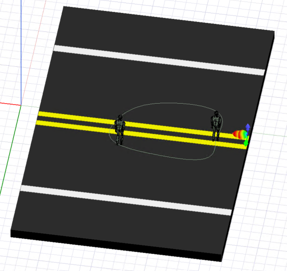
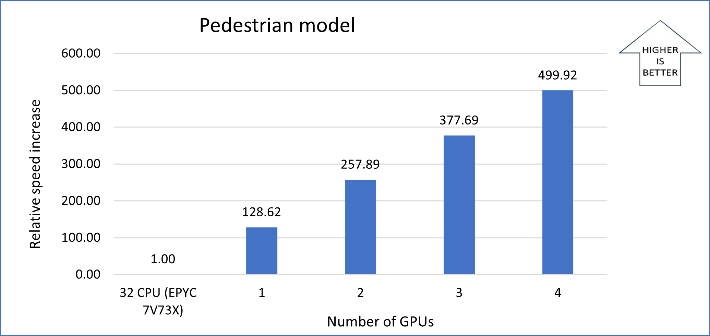
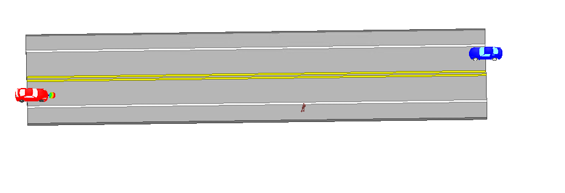
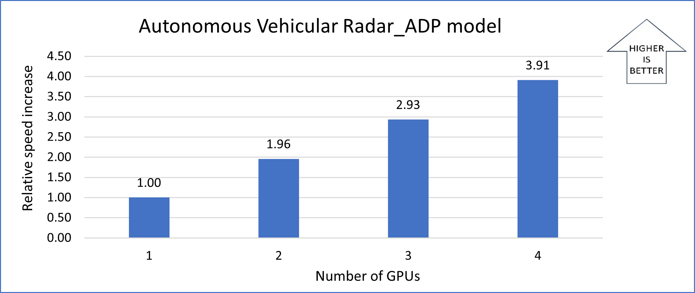
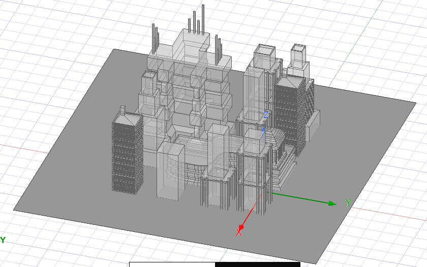

This article describes the steps for installing and running [Ansys HFSS](https://www.ansys.com/products/electronics/ansys-hfss) on a virtual machine (VM) that's deployed on Azure. It also presents the performance results of running HFSS.

Ansys HFSS is a 3D electromagnetic simulation application for designing and simulating high-frequency electronic products. HFSS enables engineers to address RF, microwave, IC, PCB, and EMI problems for most complex systems.

HFSS is used in simulations of high-frequency electronic products like antennas, antenna arrays, RF or microwave components, high-speed interconnects, IC packages, and printed circuit boards. Engineers use HFSS to design high-frequency, high-speed electronics found in communications systems, advanced driver assistance systems (ADAS), satellites, and IoT products.

## Benefits of deploying HFSS on Azure

Azure offers:

- Modern and diverse compute options, like VM SKUs, to align to your workload requirements.
- The flexibility to create customized VMs within seconds by defining an operating system, language, and workload.
- Rapid provisioning.
- Strong GPU acceleration, with increased performance as GPUs are added.

## Architecture

*Download a [Visio file](https://arch-center.azureedge.net/hpc-ansys-hfss.vsdx) of this architecture.*

### Components

- [Azure Virtual Machines](https://azure.microsoft.com/services/virtual-machines) is used to create a Windows VM. 
   - For information about deploying the VM and installing the drivers, see [Windows VMs on Azure](../../reference-architectures/n-tier/windows-vm.yml).
   - A physical solid-state drive (SSD) is used to store data that's related to the VM.
- [Azure Virtual Network](https://azure.microsoft.com/services/virtual-network) is used to create a private network infrastructure in the cloud. [Network security groups](/azure/virtual-network/network-security-groups-overview) are used to restrict access to the VM.
- [Azure Bastion](https://azure.microsoft.com/products/azure-bastion) provides improved-security Remote Desktop Protocol (RDP) and Secure Shell Protocol (SSH) access to VMs without any exposure through public IP addresses.

## Compute sizing and drivers

[NC A100 v4](/azure/virtual-machines/nc-a100-v4-series) series VMs were used to test the performance of HFSS on Azure.

The following table provides the configuration details:

| Size | vCPU | Memory, in GiB | Temporary storage (with NVMe), in GiB | GPU | GPU memory, in GiB | Maximum data disks | Maximum uncached disk throughput, in IOPS / MBps | Maximum NICs / network bandwidth, in MBps |
|---|---|---|---|---|---|---|---|---|
| Standard_NC24ads_A100_v4 | 24 | 220 | 1,123 | 1 | 80 | 12 | 30,000 / 1,000 | 2 / 20,000 |
| Standard_NC48ads_A100_v4 | 48 | 440 | 2,246 | 2 | 160 | 24 | 60,000 / 2,000 | 4 / 40,000 |
| Standard_NC96ads_A100_v4 | 96 | 880 | 4,492 | 4 | 320 | 32 | 120,000 / 4,000 | 8 / 80,000 |

### Required drivers

To take advantage of the GPU capabilities of [NC A100 v4](/azure/virtual-machines/nc-a100-v4-series) series VMs, you need to install NVIDIA GPU drivers.

## Ansys HFSS installation

Before you install HFSS, you need to deploy a VM and use the NVIDIA GPU Driver Extension provided by Azure to install NVIDIA drivers.

For information about deploying the VM and installing the drivers, see [Run a Windows VM on Azure](../../reference-architectures/n-tier/windows-vm.yml).

For information about installing HFSS, see the [Ansys website](https://www.ansys.com/products/electronics/ansys-hfss).

## Ansys HFSS performance results

The following table describes the VM that was used for testing:

> [!Note] 
> These performance tests were conducted on Windows 10 Pro, 22H2. HFSS can also be deployed on newer versions of Windows.

| Operating system | OS architecture | GPU driver version | CUDA version |
|---|---|---|---|
| Windows 10 Pro, 22H2 | x64 | 527.41 | 12 |

HFSS 2021 R2 was used to test the scalability performance of HFSS on Azure. Three models were used for the tests. The following sections describe the test models and provide the performance results for each.

### Pedestrian model

The following image shows the detection and classification of vulnerable road users, such as pedestrians, via a sensor. [HFFS SBR+](https://www.ansys.com/products/electronics/ansys-hfss) is an asymptotic ray tracing electromagnetic solver that solves large problems.

The following table provides details about the model:

| Model name | Solver | Ray density | Maximum bounces | Distribution | Solution frequency | Far field observation points |
|---|---|---|---|---|---|---|
| Pedestrian | HFSS SBR+ | 2 | 3 | Single point | 77 GHz | 519,841 |

This table shows the total elapsed times recorded for running the simulation with varying numbers of GPUs on the NC A100 v4 series VM:

| VM/processor | Number of cores | Number of GPUs | Total elapsed time, in seconds | Relative speed increase |
|---|---|---|---|---|
| EPYC 7V73X | 32 | 0 | 154,475 | N/A |
| NC A100 v4  | 8 | 1 | 1,201 | 128.62 |
| NC A100 v4  | 8 | 2 | 599 | 257.89 |
| NC A100 v4  | 8 | 3 | 409 | 377.69 |
| NC A100 v4 | 8 | 4 | 309 | 499.92 |

> [!note] 
> The time it takes to complete the simulation with only CPUs is used as a baseline to calculate the relative speed increases.

The following graph shows the relative speed increase as the number of GPUs increases:

### Autonomous Vehicular Radar_ADP model

In the following image, one of the two vehicles uses automotive radar to detect obstacles or pedestrians before they're visible to the driver. Because radar uses electromagnetic waves to sense the environment, it can operate over long distances and in poor visibility or inclement weather conditions. Designing automotive radar that accurately captures diverse traffic situations is essential to making autonomous operations safe.

The following table provides details about the model:

| Model name | Solver | Ray density | Maximum bounces | Distribution | Solution frequency | Far field observation points |
|---|---|---|---|---|---|---|
| Autonomous Vehicular Radar_ADP | HFSS SBR+ | 4 | 5 | Single point | 77 GHz | 260,281 |

This table shows the total elapsed times recorded for running the simulation with varying number of GPUs on the NC A100 v4 series VM:

| VM | Number of cores | Number of GPUs | Total elapsed time, in seconds | Relative speed increase |
|---|---|---|---|---|
|  NC A100 v4  | 8 | 1 | 15,164 | N/A|
| NC A100 v4  | 8 | 2 | 7,750 | 1.96 |
| NC A100 v4  | 8 | 3 | 5,175 | 2.93 |
| NC A100 v4  | 8 | 4 | 3,879 | 3.91 |

> [!note] 
> The time it takes to complete the simulation with one GPU is used as a baseline to calculate the relative speed increases.

The following graph shows the relative speed increase as the number of GPUs increases:

### Urban_city model

The following image shows a 3D view of an urban city, with buildings adjacent to each other. HFSS is used to simulate the design and testing of various city features.

The following table provides details about the model:

| Model name | Solver | Ray density | Maximum bounces | Distribution | Solution frequency | Far field observation points |
|---|---|---|---|---|---|---|
| Urban_city | HFSS SBR+ | 1 | 5 | Single point | 35 GHz | 519,841 |

This table shows the total elapsed times recorded for running the simulation with varying number of GPUs on the NC A100 v4 series VM.

| VM | Number of cores | Number of GPUs | Total elapsed time, in seconds | Relative speed increase |
|---|---|---|---|---|
| NC A100 v4  | 8 | 1 | 4,635 | N/A |
| NC A100 v4  | 8 | 2 | 2,753 | 1.68 |
| NC A100 v4  | 8 | 3 | 2,181 | 2.13 |
| NC A100 v4  | 8 | 4 | 1,886 | 2.46 |

> [!note] 
> The time it takes to complete the simulation with one GPU is used as a baseline to calculate the relative speed increases.

The following graph shows the relative speed increase as the number of GPUs increases:

### Notes about the tests

The tests for the Pedestrian model compare the use of CPUs to the use of GPUs.
The 32-vCPU EPYC 7V73X processor is used as a baseline for these tests. The tests for the Autonomous Vehicular Radar_ADP and Urban_city models, for which step sizes are smaller, require more computation time. Only GPU scale-up is shown for these two models. The elapsed time with one GPU is used as a baseline. 

## Azure cost

Only simulation running time is considered for these cost calculations. Installation time, simulation setup time, and software costs aren't considered.

You can use the [Azure pricing calculator](https://azure.microsoft.com/pricing/calculator) to estimate VM costs for your configurations.

The following tables provide elapsed times in hours. To compute the cost, multiply the elapsed time by the [Azure VM hourly cost for Windows](https://azure.microsoft.com/pricing/details/virtual-machines/windows/). The Azure VM hourly rates are subject to change.

### Elapsed times for the Pedestrian model

| Number of GPUs | Elapsed time, in hours |
|---|---|
| 0 (CPUs are used) | 42.91 |
| 1 | 0.33 |
| 2 | 0.17 |
| 3 | 0.11 |
| 4 | 0.09 |

### Elapsed times for the Autonomous Vehicular Radar_ADP model

| Number of GPUs | Elapsed time, in hours |
|---|---|
| 1 | 4.21 |
| 2 | 2.15 |
| 3 | 1.44 |
| 4 | 1.08 |

### Elapsed times for the Urban_city model

| Number of GPUs | Elapsed time, in hours |
|---|---|
| 1 | 1.29 |
| 2 | 0.76 |
| 3 | 0.61 |
| 4 | 0.52 |

## Summary

- HFSS was successfully deployed and tested on NC A100 v4 series VMs on Azure.
- Running the Pedestrian model simulation with the SBR+ solver is 128 times faster with one GPU than running it without using GPUs. With four GPUs, it's as much as 500 times faster than it is without using GPUs. 
- When four GPUs are used to run the Autonomous Vehicular Radar_ADP model, it runs 97% more efficiently than it does with one GPU.
- HFSS and the SBR+ solver use the power of GPUs to accelerate simulations. Azure provides VMs that are equipped with the latest GPUs.

## Contributors

*This article is maintained by Microsoft. It was originally written by the following contributors.*

Principal authors:

- [Hari Bagudu](https://www.linkedin.com/in/hari-bagudu-88732a19) | Senior Manager
- [Gauhar Junnarkar](https://www.linkedin.com/in/gauharjunnarkar) | Principal Program Manager
- [Preetham Y M](https://www.linkedin.com/in/preetham-y-m-6343a6212/) | HPC Performance Engineer

Other contributors:

- [Mick Alberts](https://www.linkedin.com/in/mick-alberts-a24a1414) | Technical Writer
- [Guy Bursell](https://www.linkedin.com/in/guybursell) | Director of Business Strategy
- [Sachin Rastogi](https://www.linkedin.com/in/sachin-rastogi-907a3b5) | Manager

*To see non-public LinkedIn profiles, sign in to LinkedIn.* 

## Next steps

- [GPU-optimized virtual machine sizes](/azure/virtual-machines/sizes-gpu)
- [Virtual machines on Azure](/azure/virtual-machines/windows/overview)
- [Virtual networks and virtual machines on Azure](/azure/virtual-network/network-overview)
- [Learning path: Run high-performance computing (HPC) applications on Azure](/training/paths/run-high-performance-computing-applications-azure)

## Related resources

- [HPC system and big-compute solutions](../../solution-ideas/articles/big-compute-with-azure-batch.yml)