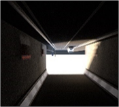
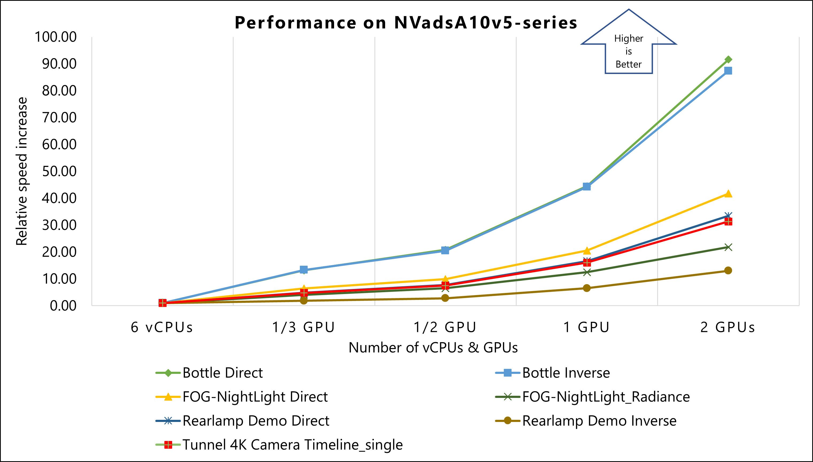
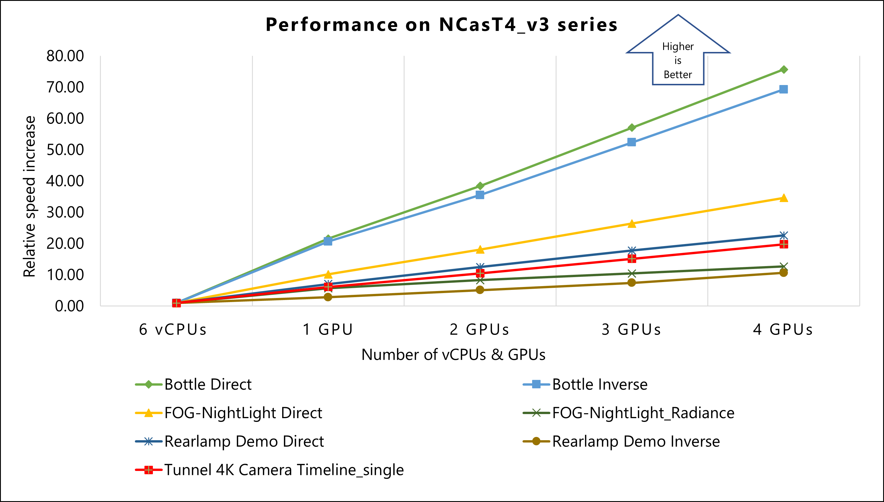
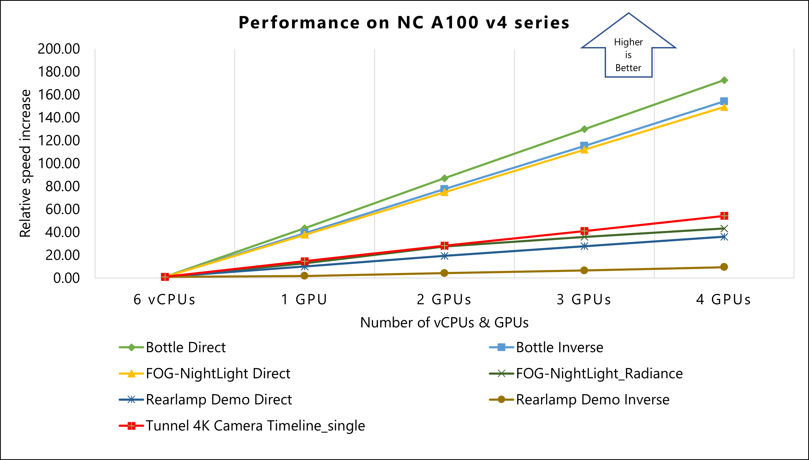
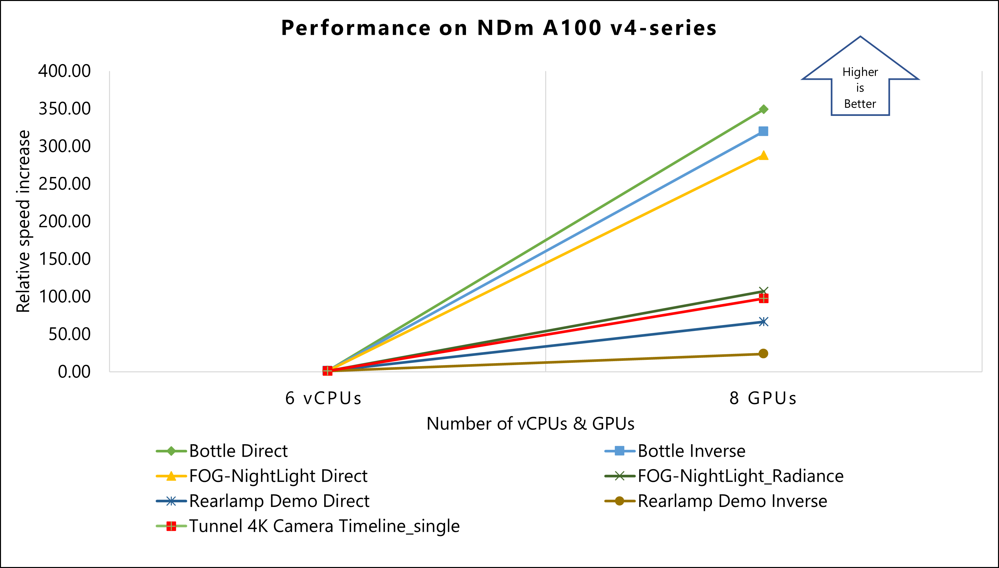
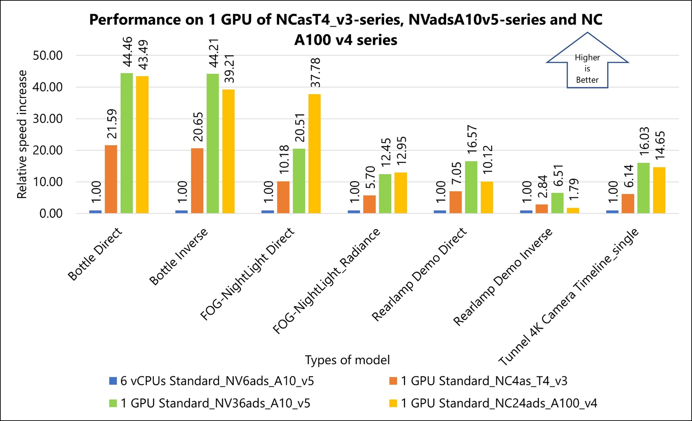

This article describes the steps for running [Ansys Speos](https://www.ansys.com/products/optics/ansys-speos) on a virtual machine (VM) deployed on Azure. It also presents the performance results of running Ansys Speos on Azure.

Ansys Speos is a high-precision simulation tool for optical systems based on human visual perception. Integrated into virtual product development, Ansys Speos can realistically simulate the real-life individual user experience for improved and even more precise optimization of the product design.

Ansys Speos delivers an intuitive and comprehensive user interface, enhanced productivity with the use of GPUs for simulation previews, and easy access to the Ansys ecosystem. Ansys Speos offers a wide range of advanced innovative tools for Aerospace, Automotive, Healthcare, Energy, and Defense engineering disciplines.

## Why deploy Ansys Speos on Azure?

- Modern and diverse compute options to meet your workload's needs
- The flexibility of virtualization without the need to buy and maintain physical hardware
- Rapid provisioning
- Complex simulations with varying level of complexity, solved by adding a greater number of GPUs

## Architecture

:::image type="content" source="media/ansys-speos/ansys-speos-architecture.svg" alt-text="Diagram that shows an architecture for deploying Ansys Speos." lightbox="media/ansys-speos/ansys-speos-architecture.svg" border="false":::

*Download a [Visio file](https://arch-center.azureedge.net/ansys-speos.vsdx) of this architecture.*

### Components

- [Azure Virtual Machines](https://azure.microsoft.com/services/virtual-machines) is
    used to create a Windows VM. For information about deploying the VM and installing the drivers, see [Run a Windows VMs on Azure](../../reference-architectures/n-tier/windows-vm.yml).
- [Azure Virtual Network](https://azure.microsoft.com/products/virtual-network/) is
    used to create a private network infrastructure in the cloud.
  - [Network security groups](/azure/virtual-network/network-security-groups-overview) are used to restrict access to the VM.  
  - A public IP address connects the internet to the VM.
- [Azure Disk Storage](https://azure.microsoft.com/products/storage/disks) provides a physical solid-state drive (SSD) for storage.

## Compute sizing and drivers

The following table provides the configuration details of [NVadsA10 v5-series](/azure/virtual-machines/nva10v5-series) VMs:

|VM size|vCPU|Memory, in GiB| Temp storage (SSD) GiB | GPU partition | GPU memory, in GiB|Maximum data disks | Maximum uncached disk throughput, in IOPS / MBps | Maximum NICs / Expected network bandwidth (Mbps) |
|-|-|-|-|-|-|-|-|-|
|Standard_NV6ads_A10_v5|6|55|180 |1/6|4|4|6,400 / 100|2 / 5,000|
|Standard_NV12ads_A10_v5|12|110|360|1/3|8|4|12,800 / 200|2 / 10,000|
|Standard_NV18ads_A10_v5|18|220|720|1/2|12|8|25,600 / 384|4 / 20,000|
|Standard_NV36ads_A10_v5|36|440|1440|1|24|16|51,200 / 768|4 / 40,000|
|Standard_NV72ads_A10_v5|72|880|2880|2|48|32|80,000 / 1,200|8 / 80,000|

The following table provides the configuration details of [NCasT4_v3-series](/azure/virtual-machines/nct4-v3-series) VMs:

|VM size|vCPU|Memory, in GiB| Temp storage (SSD) GiB | GPU partition | GPU memory, in GiB|Maximum data disks | Maximum NICs / Expected network bandwidth (Mbps) |
|-|-|-|-|-|-|-|-|
|Standard_NC4as_T4_v3|4|28|180 |1|16|8|2 / 8,000|
|Standard_NC64as_T4_v3|64|440|2880|4|64|32|8 / 32,000|

The following table provides the configuration details of [NC A100 v4-series](/azure/virtual-machines/nc-a100-v4-series) VMs:

|VM size|vCPU|Memory, in GiB| Temp storage (SSD) GiB | NVMe Disks | GPU partition | GPU memory, in GiB|Maximum data disks | Maximum uncached disk throughput, in IOPS / MBps | Maximum NICs / Expected network bandwidth (Mbps) |
|-|-|-|-|-|-|-|-|-|-|
|Standard_NC24ads_A100_v4|24|220|64|960 GB|1|80|12|30,000 / 1,000|2 / 20,000|
|Standard_NC48ads_A100_v4|48|440|128|2x960 GB|2|160|24|60,000 / 2,000|4 / 40,000|
|Standard_NC96ads_A100_v4|96|880|256|4x960 GB|4|320|32|120,000 / 4,000|8 / 80,000|

The following table provides the configuration details of a [NDm A100 v4-series](/azure/virtual-machines/ndm-a100-v4-series) VM:

|VM size|vCPU|Memory, in GiB| Temp storage (SSD) GiB | GPU | GPU memory, in GiB|Maximum data disks | Maximum uncached disk throughput, in IOPS / MBps | Maximum network bandwidth | Maximum NICs |
|-|-|-|-|-|-|-|-|-|-|
|Standard_ND96amsr_A100_v4|96|1900|6400|8 A100 80-GB GPUs (NVLink 3.0)|80|32|80,000 / 800|24,000 Mbps|8|

## Ansys Speos installation

- **Deploy Azure VMs**. Use NVadsA10 v5-series, NCasT4_v3-series, NC A100 v4-series, and NDm A100 v4-series VMs to run Ansys Speos.
- **Create and configure the supporting infrastructure**. Configure a public IP address for inbound connectivity. Use network security groups to provide security for the subnet.
- **Install NVIDIA drivers**. To take advantage of the GPU capabilities of NVadsA10 v5-series, NCasT4_v3-series, NC A100 v4-series, and NDm A100 v4-series VMs, install NVIDIA GPU drivers. You need to deploy and connect a VM via Remote Desktop Protocol (RDP) to install the required NVIDIA drivers. For information about deploying VMs and installing the drivers, see [Run a Windows VM on Azure](/azure/virtual-machines/windows/n-series-driver-setup).
- **Install Ansys Speos**. You can install Ansys Speos from the [Ansys portal](https://www.ansys.com/). For information about the installation process, see the [Ansys Speos website](https://www.ansys.com/products/optics/ansys-speos).

## Ansys Speos performance results

A set of test case models are used for testing the performance of Ansys Speos on Azure NVadsA10 v5-series, NCasT4_v3-series, NC A100 v4-series, and NDm A100 v4-series VMs. The following table shows the model details.

| Model | Model description | Analysis Type | Wavelength range | Wavelength number | Resolution |
|-|-|-|-|-|-|
|  **Bottle Direct**| The model image shows a perfume bottle, Tangent transparent bodies, and caustics. | Speos Core Direct Monte-Carlo Hybrid Simulation | 400 nm – 700 nm | 13 | 2048 x 2048 |
|  **Bottle Inverse** | The model image shows a perfume bottle and Tangent transparent bodies. | Speos Core Inverse Monte Carlo Hybrid Simulation | 400 nm – 700 nm | 13 | 2048 x 2048 |
|  **FOG-Nightlight Direct** | The model image shows road lighting. Volume scattering fog is gathered towards sensor. | Speos Core Direct Monte-Carlo Hybrid simulation | 400 nm – 700 nm | 13 | 1280 x 960 |
|  **FOG-Nightlight Radiance** | The model image shows road lighting. Volume scattering fog gathered towards source. | Speos Core Inverse Monte-Carlo Hybrid simulation | 400 nm – 700 nm | 13 | 1280 x 960 |
|  **RearLamp Demo Direct** | The model image shows automotive lightings, faceted mirrors, stripped light guide, and volume scattering diffusors. | Speos Core Direct Monte-Carlo Hybrid simulation | 400 nm – 700 nm | 13 | 1920 x 1080 |
|  **RearLamp Demo Inverse** | The model image shows automotive lightings, faceted mirrors, stripped light guide, and volume scattering diffusors. | Speos Core Inverse Monte-Carlo Hybrid simulation | 400 nm – 700 nm | 13 | 1920 x 1080 |
|  **Tunnel 4K Camera Timeline_single** | The model image shows tunnel exit, indirect lighting with strong dynamics, and spectral physical camera sensor. | Speos Core Inverse Monte-Carlo Hybrid simulation | 400 nm – 700 nm | 13 | 3856 x 2176 |

### Results for NVadsA10 v5-series VMs

The performance tests on Ansys Speos 2023 R2 used NVadsA10 v5-series VMs. The following table provides the operating system and GPU details of NVadsA10 v5-series VMs:

| Operating system version | OS Architecture | GPU driver version | CUDA version | Processor |
|-|-|-|-|-|
| Windows 11 22H2 pro | x64 | 528.89 | 12.0 | AMD EPYC 74F3V(Milan) |

The following table shows relative speed increase on NVadsA10 v5-series VMs.

The cells below each model show the **Number of Rays (Computation time)** / **Relative Speed Increase** for each of the specified VMs. For example, for the Standard_NV6ads_A10_v5 VM in the Bottle Direct model, the **Number of Rays (Computation time)** is 5.35789E+05 and the **Relative Speed Increase** is 1.00 (displayed in the table as 5.35789E+05 / 1.00).

| Size | Number of vCPUs/ GPUs  used | Bottle Direct | Bottle Inverse | FOG-NightLight Direct | FOG-NightLight_Radiance | Rearlamp Demo Direct | Rearlamp Demo Inverse | Tunnel 4K Camera Timeline_single |
|-|-|-|-|-|-|-|-|-|
| Standard_NV6ads_A10_v5 | 6 vCPUs | 5.35789E+05 / 1.00 | 4.75517E+05 / 1.00 | 2.15933E+04 / 1.00 | 1.06543E+04 / 1.00 | 4.45442E+04 / 1.00 | 2.16231E+05 / 1.00 | 2.03505E+05 / 1.00 |
| Standard_NV12ads_A10_v5 | 1/3 GPU | 7.05502E+06 / 13.17 | 6.33147E+06 / 13.31 | 1.38082E+05 / 6.39 | 4.32866E+04 / 4.06 | 2.15824E+05 / 4.85 | 3.93593E+05 / 1.82 | 9.72960E+05 / 4.78 |
| Standard_NV18ads_A10_v5 | 1/2 GPU | 1.11367E+07 / 20.79 | 9.72984E+06 / 20.46 | 2.13309E+05 / 9.88 | 6.95355E+04 / 6.53 | 3.44093E+05 / 7.72 | 6.02317E+05 / 2.79 | 1.52759E+06 / 7.51 |
| Standard_NV36ads_A10_v5 | 1 GPU | 2.38216E+07 / 44.46 | 2.10233E+07 / 44.21 | 4.42797E+05 / 20.51 | 1.32615E+05 / 12.45 | 7.38095E+05 / 16.57 | 1.40697E+06 / 6.51 | 3.26173E+06 / 16.03 |
| Standard_NV72ads_A10_v5 | 2 GPUs | 4.90611E+07 / 91.57 | 4.15515E+07 / 87.38 | 9.00568E+05 / 41.71 | 2.32190E+05 / 21.79 | 1.48949E+06 / 33.44 | 2.81894E+06 / 13.04 | 6.37847E+06 / 31.34 |

This graph shows the relative speed increase of models on NVadsA10 v5-series VMs. The result of six vCPUs on a Standard_NV6ads_A10_v5 VM is used as a baseline to calculate relative speed increase.

### Results for NCasT4_v3-series VMs

The performance tests of Ansys Speos 2023 R1 on Azure used NCasT4_v3-series VMs running on the Windows Operating System. The following table provides the operating system and GPU details of NCasT4_v3-series VMs:

| Operating system version | OS Architecture | GPU driver version | CUDA version | Processor |
|-|-|-|-|-|
| Windows 10 pro 21H2 | x64 | 514.08 | 11.6 | AMD EPYC 7V12 64-Core |

The following table shows relative speed increase on NCasT4_v3-series VMs.

The cells below each model show the **Number of Rays (Computation time)** / **Relative Speed Increase** for each of the specified VMs. For example, for the Standard_NV6ads_A10_v5 VM in the Bottle Direct model, the **Number of Rays (Computation time)** is 5.35789E+05 and the **Relative Speed Increase** is 1.00 (displayed in the table as 5.35789E+05 / 1.00).

| Size | Number of vCPUs/ GPUs  used | Bottle Direct | Bottle Inverse | FOG-NightLight Direct | FOG-NightLight_Radiance | Rearlamp Demo Direct | Rearlamp Demo Inverse | Tunnel 4K Camera Timeline_single |
|-|-|-|-|-|-|-|-|-|
| Standard_NV6ads_A10_v5 | 6 vCPUs  | 5.35789E+05 / 1.00 | 4.75517E+05 / 1.00 | 2.15933E+04 / 1.00 | 1.06543E+04 / 1.00 | 4.45442E+04 / 1.00 | 2.16231E+05 / 1.00 | 2.03505E+05 / 1.00 |
| Standard_NC4as_T4_v3 | 1 GPU | 1.15676E+07 / 21.59 | 9.82054E+06 / 20.65 | 2.19771E+05 / 10.18 | 6.07761E+04 / 5.70 | 3.14097E+05 / 7.05 | 6.14171E+05 / 2.84 | 1.25053E+06 / 6.14 |
| Standard_NC64as_T4_v3 | 2 GPUs | 2.05815E+07 / 38.41 | 1.68694E+07 / 35.48 | 3.90930E+05 / 18.10 | 8.83341E+04 / 8.29 | 5.57085E+05 / 12.51 | 1.10311E+06 / 5.10 | 2.13832E+06 / 10.51 |
| Standard_NC64as_T4_v3 | 3 GPUs | 3.05910E+07 / 57.10 | 2.48829E+07 / 52.33 | 5.70076E+05 / 26.40 | 1.11019E+05 / 10.42 | 7.91452E+05 / 17.77 | 1.60324E+06 / 7.41 | 3.07666E+06 / 15.12 |
| Standard_NC64as_T4_v3 | 4 GPUs | 4.05449E+07 / 75.67 | 3.29510E+07 / 69.30 | 7.47098E+05 / 34.60 | 1.34858E+05 / 12.66 | 1.00682E+06 / 22.60 | 2.29814E+06 / 10.63 | 4.02254E+06 / 19.77 |

This graph shows the relative speed increase of models on NCasT4_v3-series VMs. The result of six vCPUs on a Standard_NV6ads_A10_v5 VM is used as a baseline to calculate relative speed increase.

### Results for NC A100 v4-series VMs

The performance tests of Ansys Speos 2023 R1 on Azure used NC A100 v4-series VMs running on the Windows Operating System. The following table provides the operating system and GPU details of NC A100 v4-series VMs:

| Operating system version | OS Architecture | GPU driver version | CUDA version | Processor |
|-|-|-|-|-|
| Windows 10 pro 21H2 | x64 | 514.08 | 11.6 | AMD EPYC 7V13 (Milan) |

The following table shows relative speed increase on NC A100 v4-series VMs.

The cells below each model show the **Number of Rays (Computation time)** / **Relative Speed Increase** for each of the specified VMs. For example, for the Standard_NV6ads_A10_v5 VM in the Bottle Direct model, the **Number of Rays (Computation time)** is 5.35789E+05 and the **Relative Speed Increase** is 1.00 (displayed in the table as 5.35789E+05 / 1.00).

| Size | Number of vCPUs/ GPUs  used | Bottle Direct | Bottle Inverse | FOG-NightLight Direct | FOG-NightLight_Radiance | Rearlamp Demo Direct | Rearlamp Demo Inverse | Tunnel 4K Camera Timeline_single |
|-|-|-|-|-|-|-|-|-|
| Standard_NV6ads_A10_v5 | 6 vCPUs  | 5.35789E+05 / 1.00 | 4.75517E+05 / 1.00 | 2.15933E+04 / 1.00 | 1.06543E+04 / 1.00 | 4.45442E+04 / 1.00 | 2.16231E+05 / 1.00 | 2.03505E+05 / 1.00 |
| Standard_NC24ads_A100_v4 | 1 GPU | 2.33018E+07 / 43.49 | 1.86462E+07 / 39.21 | 8.15852E+05 / 37.78 | 1.38023E+05 / 12.95 | 4.50625E+05 / 10.12 | 3.88061E+05 / 1.79 | 2.98161E+06 / 14.65 |
| Standard_NC48ads_A100_v4 | 2 GPUs | 4.66461E+07 / 87.06 | 3.68599E+07 / 77.52 | 1.61657E+06 / 74.86 | 2.94178E+05 / 27.61 | 8.61722E+05 / 19.35 | 9.27807E+05 / 4.29 | 5.75947E+06 / 28.30 |
| Standard_NC96ads_A100_v4 | 3 GPUs | 6.95990E+07 / 129.90 | 5.48402E+07 / 115.33 | 2.41858E+06 / 112.01 | 3.82667E+05 / 35.92 | 1.24048E+06 / 27.85 | 1.42305E+06 / 6.58 | 8.34561E+06 / 41.01 |
| Standard_NC96ads_A100_v4 | 4 GPUs | 9.25311E+07 / 172.70 | 7.33142E+07 / 154.18 | 3.22258E+06 / 149.24 | 4.60494E+05 / 43.22 | 1.60306E+06 / 35.99 | 2.05639E+06 / 9.51 | 1.10394E+07 / 54.25 |

This graph shows the relative speed increase of models on NC A100 v4-series VMs. The result of six vCPUs on a Standard_NV6ads_A10_v5 VM is used as a baseline to calculate relative speed increase.

### Results for NDm A100 v4-series VMs

The performance tests of Ansys Speos 2023 R2 on Azure used NDm A100 v4-series VMs. The following table provides the operating system and GPU details of NDm A100 v4-series VMs:

| Operating system version | OS Architecture | GPU driver version | CUDA version | Processor |
|-|-|-|-|-|
| Windows 11 22H2 pro | x64 | 529.11 | 12.0 | AMD EPYC 7V12 (Rome) |

The following table shows relative speed increase on NDm A100 v4-series VMs.

The cells below each model show the **Number of Rays (Computation time)** / **Relative Speed Increase** for each of the specified VMs. For example, for the Standard_NV6ads_A10_v5 VM in the Bottle Direct model, the **Number of Rays (Computation time)** is 5.35789E+05 and the **Relative Speed Increase** is 1.00 (displayed in the table as 5.35789E+05 / 1.00).

| Size | Number of vCPUs/ GPUs  used | Bottle Direct | Bottle Inverse | FOG-NightLight Direct | FOG-NightLight_Radiance | Rearlamp Demo Direct | Rearlamp Demo Inverse | Tunnel 4K Camera Timeline_single |
|-|-|-|-|-|-|-|-|-|
| Standard_NV6ads_A10_v5 | 6 vCPUs  | 5.35789E+05 / 1.00 | 4.75517E+05 / 1.00 | 2.15933E+04 / 1.00 | 1.06543E+04 / 1.00 | 4.45442E+04 / 1.00 | 2.16231E+05 / 1.00 | 2.03505E+05 / 1.00 |
| Standard_ND96amsr_A100_v4 | 8 GPUs | 1.87027E+08 / 349.07 | 1.51959E+08 / 319.57 | 6.21946E+06 / 288.03 | 1.13890E+06 / 106.90 | 2.95877E+06 / 66.42 | 5.13853E+06 / 23.76 | 1.98535E+07 / 97.56 |

This graph shows the relative speed increase of models on NDm A100 v4-series VMs. The result of six vCPUs on a Standard_NV6ads_A10_v5 VM is used as a baseline to calculate relative speed increase.

### Comparison of performance results

The following graph shows the performance on one GPU of NCasT4_v3-series (NVIDIA Tesla T4 GPU), NVadsA10 v5-series (NVIDIA A10 GPU), and NC A100 v4-series (NVIDIA A100 GPU) VMs:

### Other notes about tests on Ansys Speos

Running Ansys Speos on Azure reveals significant performance enhancements for different GPU configurations compared to the Standard_NV6ads_A10_v5 baseline.

- **NCasT4_v3-series (one GPU)**: Shows approximately 22X improvement in performance.
- **NVadsA10 v5-series (one GPU)**: Exhibits around 45X enhancement in performance.
- **NC A100 v4-series (one GPU)**: Demonstrates an approximately 44X increase in performance.

These results indicate notable performance gains across various configurations, highlighting the efficiency of using more advanced GPU setups in Azure's VMs for running Ansys Speos simulations.

## Azure Cost

Only model running time is considered for the cost calculations. Application installation time isn't considered. The calculations are indicative. The [summary](#summary) details the cost consumption on various SKUs used for the validation.

### NVadsA10 v5-series (NVIDIA A10 GPU)

- A Standard_NV12ads_A10_v5 1/3 GPU configuration serves as a baseline for cost performance evaluation of other VMs.
- A linear increase in Azure cost is noted with each GPU size increment in the NVadsA10 v5-series (from 1/3 GPU to two GPUs).

### NCasT4_v3-series (NVIDIA Tesla T4 GPU)

- A NCasT4_v3-series one GPU configuration is the baseline for cost performance evaluation.
- The cost remains consistent across NCasT4_v3-series VMs for two to four GPU simulations.
- The NCasT4_v3-series VM with one GPU offers the best cost performance among its configurations.
- The NVadsA10 v5-series VMs are more cost-effective than the NCasT4_v3-series for multi-GPU simulations.

### A100 GPU based VMs: NC A100 v4-series and NDm A100 v4-series

- A NCasT4_v3-series one GPU configuration is the baseline for cost performance evaluation.
- The cost remains consistent across NCasT4_v3-series VMs for two to four GPU simulations.
- The NCasT4_v3-series VM with one GPU offers the best cost performance among its configurations.
- The NVadsA10 v5-series VMs are more cost-effective than the NCasT4_v3-series for multi-GPU simulations.

For the latest pricing details in each region, see [Azure pricing calculator](https://azure.microsoft.com/pricing/calculator).

## Summary

This document evaluates the price-performance advantages of the Azure HPC platform for running Ansys Speos simulations. It highlights the efficient performance of Ansys Speos on Azure HPC instances, utilizing the advanced technology and flexible usage options of Azure.

The study focuses on four Azure VM series: NVadsA10 v5, NCasT4_v3, NC A100 v4, and NDm A100 v4, each powered by NVIDIA graphics cards (A10, Tesla T4, and A100, respectively). These machines demonstrate high scalability and are assessed based on their relative performance against the NVadsA10 v5-series 6 CPU, which serves as the baseline.

Key findings include:

- **NVadsA10 v5-series**: Exhibits up to 90X performance scalability when upgrading from partial to two GPUs. Best suited for less complex models and when cost is the primary concern.
- **NCasT4_v3-series**: Shows up to 70X performance increase with each extra GPU, up to four GPUs.
- **NC A100 v4-series**: Demonstrates up to 170X performance scalability with each added GPU, up to four GPUs.
- **NDm A100 v4-series**: Achieves remarkable performance scalability of up to 350X with eight GPUs, outperforming other series when prioritizing performance.

Additionally, a comparative analysis between Standard_NC96ads_A100_v4 and Standard_ND96amsr_A100_v4 in a four GPU scenario showed equivalent computation times and performance levels.

Overall, the use of the latest NVIDIA graphics card-enabled VMs on Azure showed significant performance improvements, effectively balancing both cost and performance.

## Contributors

*This article is maintained by Microsoft. It was originally written by the following contributors.*

Principal authors:

- [Hari Bagudu](https://www.linkedin.com/in/hari-bagudu-88732a19) | Senior Manager
- [Gauhar Junnarkar](https://www.linkedin.com/in/gauharjunnarkar) | Principal Program Manager
- [Aashay Anjankar](https://www.linkedin.com/in/aashay-anjankar-6a44291ba) | HPC Performance Engineer
- Shivakumar Tallolli | HPC Performance Engineer

Other contributors:

- [Guy Bursell](https://www.linkedin.com/in/guybursell) | Director Business Strategy
- [Sachin Rastogi](https://www.linkedin.com/in/sachin-rastogi-907a3b5) | Manager

*To see non-public LinkedIn profiles, sign in to LinkedIn.*

## Next steps

- [GPU-optimized virtual machine sizes](/azure/virtual-machines/sizes-gpu)
- [Windows virtual machines in Azure](/azure/virtual-machines/windows/overview)
- [Linux virtual machines in Azure](/azure/virtual-machines/linux/overview)
- [Virtual networks and virtual machines on Azure](/azure/virtual-network/network-overview)
- [Learning path: Run high-performance computing (HPC) applications on Azure](/learn/paths/run-high-performance-computing-applications-azure)

## Related resources

- [Run a Windows VM on Azure](../../reference-architectures/n-tier/windows-vm.yml)
- [Run a Linux VM on Azure](../../reference-architectures/n-tier/linux-vm.yml)
- [HPC system and big-compute solutions](../../solution-ideas/articles/big-compute-with-azure-batch.yml)