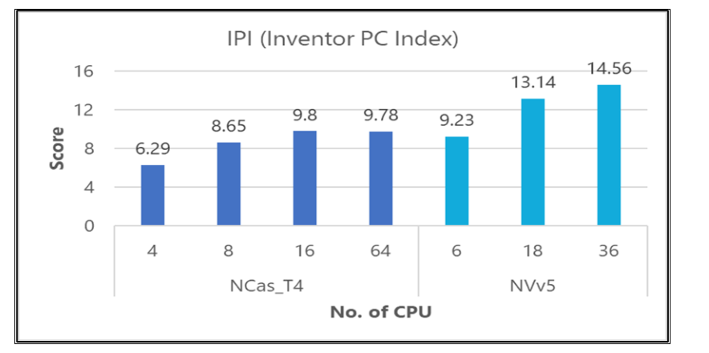
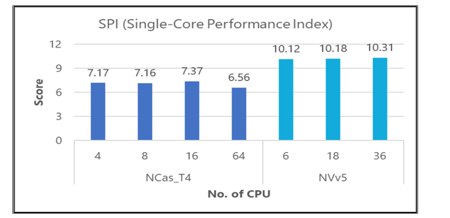
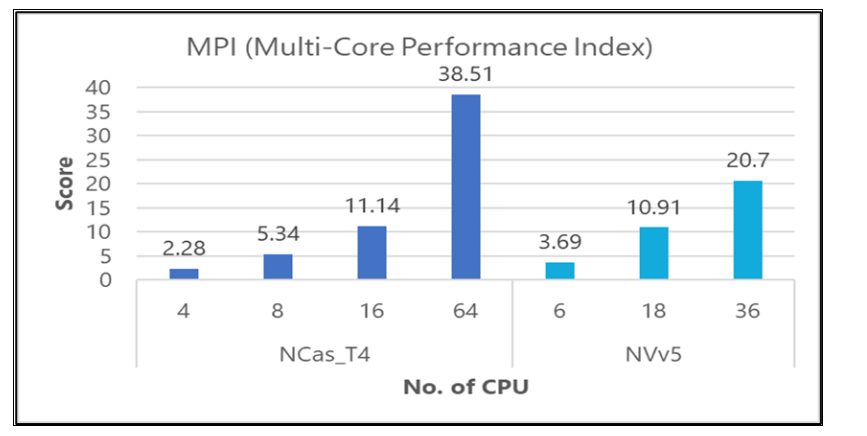
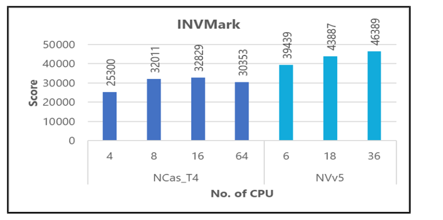
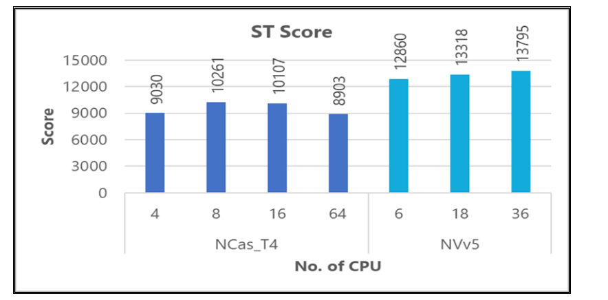
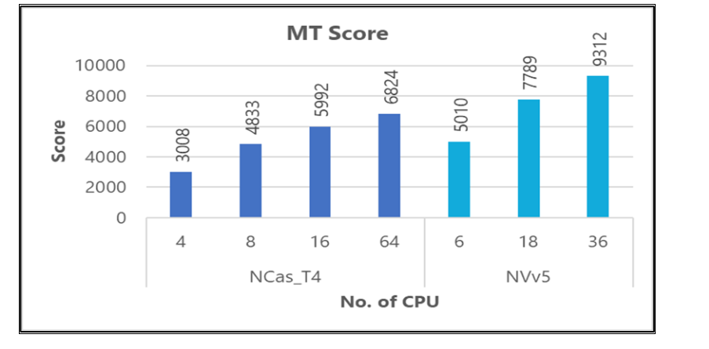

This article briefly describes the steps for running [Autodesk Inventor](https://www.autodesk.com/products/inventor/overview) on a virtual machine (VM) that's deployed on Azure. It also presents the performance results of running Inventor on Azure.

Inventor is a 3D CAD application that provides professional-grade mechanical design, documentation, and product simulation tools. Inventor:

- Is rules-based and includes parametric, direct, freeform design capabilities.
- Integrates tools for sheet metal, frame design, tube and pipe, cable and harness, presentations, rendering, simulation, and machine design.
- Accesses the Forge Design Automation API for running job processes in the cloud.
- Enables Fusion 360/Revit/MCAD interoperability.
 
Inventor software is primarily used by mechanical engineers to quickly model, simulate, and communicate design ideas. It's well-suited to engineers who need automated and specialized tools to design components and prepare them for manufacturing. One of the main use cases is GPU ray tracing, which supports the hardware ray tracing that's used on recent graphics cards (GPUs).

## Why deploy Inventor on Azure?

- Modern and diverse compute options to align to your workload's needs 
- The flexibility of virtualization without the need to buy and maintain physical hardware
- Rapid provisioning

## Architecture

:::image type="content" source="media/hpc-inventor.svg" alt-text="Diagram that shows an architecture for deploying Autodesk Inventor." lightbox="media/hpc-inventor.svg" border="false":::

*Download a [Visio file](https://arch-center.azureedge.net/hpc-inventor.vsdx) of this architecture.*

### Components
- [Azure Virtual Machines](https://azure.microsoft.com/services/virtual-machines) is used to create Windows VMs.
  - For information about deploying the VM and installing the drivers, see [Windows VMs on Azure](../../reference-architectures/n-tier/windows-vm.yml).
- [Azure Virtual Network](https://azure.microsoft.com/services/virtual-network) is used to create a private network infrastructure in the cloud.
  - [Network security groups](/azure/virtual-network/network-security-groups-overview) are used to restrict access to the VMs.
  - A public IP address connects the internet to the VM.  
- A physical SSD is used on the host for storage.  

## Compute sizing and drivers

[NCasT4_v3](/azure/virtual-machines/nct4-v3-series) and [NVadsA10_v5](/azure/virtual-machines/nva10v5-series) series VMs running Windows were used to test the performance of Inventor on Azure. The following table provides the configuration details:

|VM size|	vCPU|	Memory, in GiB|	Temporary storage (SSD), in GiB|	Number of GPUs|	GPU memory, in GiB|	Maximum data disks|
|--|--|--|--|--|--|--|
|Standard_NC4as_T4_v3|	4	|28|	180|	1|	16|	8|
|Standard_NC8as_T4_v3	|8	|56	|360	|1|	16	|16|
|Standard_NC16as_T4_v3	|16	|110	|360|	1	|16	|32|
|Standard_NC64as_T4_v3|	64|	440|	2880|	4|	64|	32|
|Standard_NV6ads_A10_v5|	6	|55	|180	|1/6|	4	|4|
|Standard_NV18ads_A10_v5	|18	|220	|720	|1/2	|12	|8|
|Standard_NV36ads_A10_v5	|36|	440|	720|	1|	24|	16|

[NCasT4_v3-series](/azure/virtual-machines/nct4-v3-series) VMs are powered by [NVIDIA Tesla T4](https://www.nvidia.com/en-us/data-center/tesla-t4) GPUs and AMD EPYC 7V12 (Rome) CPUs. The VMs have as many as 4 NVIDIA Tesla T4 GPUs with 16 GB of memory each, and as many as 64 non-multithreaded AMD processor cores at a base frequency of 2.45 GHz, with a total memory of 440 GB.

[NVadsA10 v5-series](/azure/virtual-machines/nva10v5-series) virtual machines are powered by [NVIDIA A10](https://www.nvidia.com/en-us/data-center/products/a10-gpu) GPUs and AMD EPYC 74F3V (Milan) CPUs with a base frequency of 3.2 GHz. NVadsA10 v5-series VMs have partial NVIDIA GPUs.

### Required drivers
 
To use Inventor on NCasT4_v3 and NVadsA10_v5 VMs, you need to install NVIDIA and AMD drivers.

## Inventor installation

Before you install Inventor, you need to deploy and connect a VM, install an eligible Windows 10 or Windows 11 image, and install the required NVIDIA and AMD drivers.

For information about eligible Windows images, see [How to deploy Windows 10 on Azure](/azure/virtual-machines/windows/windows-desktop-multitenant-hosting-deployment) and [Use Windows client in Azure for dev/test scenarios](/azure/virtual-machines/windows/client-images).

For information about deploying the VM and installing the drivers, see [Run a Windows VM on Azure](../../reference-architectures/n-tier/windows-vm.yml).

For installation instructions, see the [Autodesk download and install page](https://www.autodesk.in/support/download-install/individuals).

## Inventor performance results

Inventor 2022.2.2 Professional and the free trial version of Inventor Professional 2023 were tested.

The [BenchMark HD](https://apps.autodesk.com/INVNTOR/en/Detail/Index?id=4347689425693068386&appLang=en&os=Win64&autostart=true) and [InvMark ](https://invmark.cadac.com/#) Inventor add-ons were used to measure specific performance parameters of Inventor Professional on Azure.

### Results for Inventor Professional 2022, using BenchMark HD

The following table shows elapsed times in seconds for tests on various sizes of NCasT4 and NVadsA10 v5 VMs:

|VM series|	VM size|	Modeling| 	Graphics|	Drawing|	Ray tracing|	File export|	Save|
|--|--|--|--|--|--|--|--|
|NCasT4|4 vCPU (1 GPU)|	48.545|	31.93|	53.11|	175.731|	32.692|	12.614|
|NCasT4|	8 vCPU (1 GPU)|	48.615|	31.106|	47.056|	74.841|	32.794|	10.143|
|NCasT4|	16 vCPU (1 GPU)|	46.773|	35.121|	45.429|	35.893|	32.822|	10.328|
|NCasT4|64 vCPU (4 GPU)|	53.927	|37.467	|51.671	|10.387|	33.668|	11.746|
|NVadsA10 v5	|6 vCPU (1/6 GPU)|	33.981|	29.889|	38.807|	108.275|	24.203|	6.646|
|NVadsA10 v5|	18 vCPU (1/2 GPU)|	33.811|	23.957|	33.96	|36.669|	23.915|	6.547|
|NVadsA10 v5|	36 vCPU (1 GPU)|	33.599|	24.426|	33.163|	19.324|	23.134|	6.139|

The following table provides results for various BenchMark HD performance indices. A higher number indicates better performance.

|VM series|	VM size| Inventor PC Index (IPI)| Single-core Performance Index (SPI)| Multi-core Performance Index (MPI)|
|--|--|--|--|	--|
|NCasT4	|4 vCPU (1 GPU)|	6.29|	7.17|	2.28|
|NCasT4	|	8 vCPU (1 GPU)|	8.65|	7.16|	5.34|
|NCasT4	|16 vCPU (1 GPU)|	9.8|	7.37|	11.14|
|NCasT4	|64 vCPU (4 GPU)|	9.78|	6.56|	38.51|
|NVadsA10 v5|	6 vCPU (1/6 GPU)|	9.23|	10.1|	3.69|
|NVadsA10 v5|	18 vCPU (1/2 GPU)|	13.1|	10.2	|10.91|
|NVadsA10 v5|	36 vCPU (1 GPU)|	14.6|	10.3|	20.7|

#### Comparisons, BenchMark HD

Overall, performance is better on NVadsA10 v5 VMs. The following graphs provide details.

### Results for Inventor Professional 2022, using InvMark

The following table shows the scores of InvMark tests on various sizes of NCasT4 and NVadsA10 v5 VMs:

|VM series|	VM size|	Graphics|	Drawing|	FEA|	Dynamic simulation|	Assembly constraint|	Ray tracing|	Data translation|	Assembly pattern|
|--|--|--|--|--|--|--|--|--|--|
|NCasT4|	4 vCPU (1 GPU)	|1412|	567|	901|	1100|	1108|	458	|362	|1003|
|NCasT4|	8 vCPU (1 GPU)|	1440|	733|	928|	1239	|1144|	897|	622|	1047|
|NCasT4|	16 vCPU (1 GPU)|	1358|	800|	915|	1217|	1167|	1655	|650	|947|
|NCasT4|	64 vCPU (4 GPU)|	1060|	848|	810|	953|	1090|	4016|	596|	905|
|NVadsA10 v5	|6 vCPU (1/6 GPU)|	1629|	844|	1122|	1495|	1439|	695|	891|	1308|
|NVadsA10 v5	|	18 vCPU (1/2 GPU)|	2934|	1097|	1080|	1588|	1468|	1768|	934|	1145|
|NVadsA10 v5	|	36 vCPU (1 GPU)	|3180|	1213|	1098|	1608|	1602|	2987|	980|	1252|

 The following table provides results for various InvMark performance indices. A higher number indicates better performance.

|VM series|	VM size|InvMark	|ST score|MT score|
|--|--|--|--|--|
|NCasT4	|4 vCPU (1 GPU)|	25300|	9030|	3008|
|NCasT4	|	8 vCPU (1 GPU)|	32011|	10261|	4833|
|NCasT4	|	16 vCPU (1 GPU)|	32829|	10107|	5992|
|NCasT4	|	64 vCPU (4 GPU)|	30353|	8903|	6824|
|NVadsA10 v5	|6 vCPU (1/6 GPU)|	39439	|12860|	5010|
|NVadsA10 v5	|	18 vCPU (1/2 GPU)|	43887	|13318|	7789|
|NVadsA10 v5	|	36 vCPU (1 GPU)|	46389|	13795|	9312|

#### Comparisons, InvMark

Overall, performance is better on NVadsA10 v5 VMs. The following graphs provide details.

## Azure cost

Only total elapsed times, as measured by BenchMark HD, are considered for these cost calculations. Application installation time isn't considered.  

You can use the [Azure pricing calculator](https://azure.microsoft.com/pricing/calculator) to estimate the costs for your configuration.

|VM series|	VM size|	Number of GPUs|	Total time|
|--|--|--|--|
|NCasT4	|NC4as_T4_v3|	1	|6 minutes|
|NCasT4	|	NC8as_T4_v3|	1	|4 minutes|
|NCasT4	|	NC16as_T4_v3|	1	|3 minutes, 44 seconds|
|NCasT4	|	NC64as_T4_v3|	4	|3 minutes, 31 seconds|
|NVadsA10 v5|	6 vCPU	|1/6|	4 minutes, 2 seconds|
|NVadsA10 v5|	18 vCPU|	1/2	|2 minutes, 38 seconds|
|NVadsA10 v5|	36 vCPU	|1	|2 minutes, 19 seconds|

You can use the total time and the Azure hourly cost to compute the total cost. For the current hourly costs, see [Windows Virtual Machines Pricing](https://azure.microsoft.com/pricing/details/virtual-machines/windows/#pricing).

## Summary

- Inventor Professional was successfully tested on NCasT4_v3 and NVadsA10_v5 series VMs on Azure.
- Performance is better on NVadsA10_v5 VMs than it is on NCasT4_v3 VMs. NVadsA10_v5 VMs are also less expensive.

## Contributors

*This article is maintained by Microsoft. It was originally written by the following contributors.*

Principal authors:

- [Hari Bagudu](https://www.linkedin.com/in/hari-bagudu-88732a19) | Senior Manager
- [Gauhar Junnarkar](https://www.linkedin.com/in/gauharjunnarkar) | Principal Program Manager
- [Vinod Pamulapati](https://www.linkedin.com/in/vinod-reddy-20481a104) | HPC Performance Engineer

Other contributors:

- [Mick Alberts](https://www.linkedin.com/in/mick-alberts-a24a1414) | Technical Writer
- [Guy Bursell](https://www.linkedin.com/in/guybursell) | Director Business Strategy
- [Sachin Rastogi](https://www.linkedin.com/in/sachin-rastogi-907a3b5) | Manager

*To see non-public LinkedIn profiles, sign in to LinkedIn.*

## Next steps

- [GPU-optimized virtual machine sizes](/azure/virtual-machines/sizes-gpu)
- [Windows virtual machines in Azure](/azure/virtual-machines/windows/overview)
- [Virtual networks and virtual machines in Azure](/azure/virtual-network/network-overview)
- [Learning path: Run HPC applications on Azure](/training/paths/run-high-performance-computing-applications-azure)

## Related resources 

- [Run a Windows VM on Azure](../../reference-architectures/n-tier/windows-vm.yml)
- [HPC system and big-compute solutions](../../solution-ideas/articles/big-compute-with-azure-batch.yml)
- [HPC cluster deployed in the cloud](../../solution-ideas/articles/hpc-cluster.yml)
