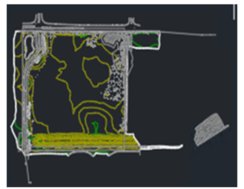
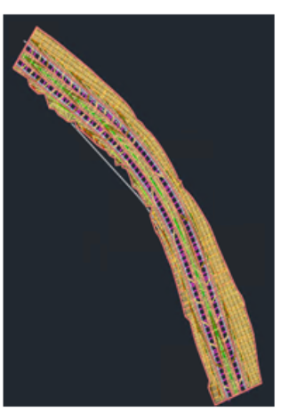
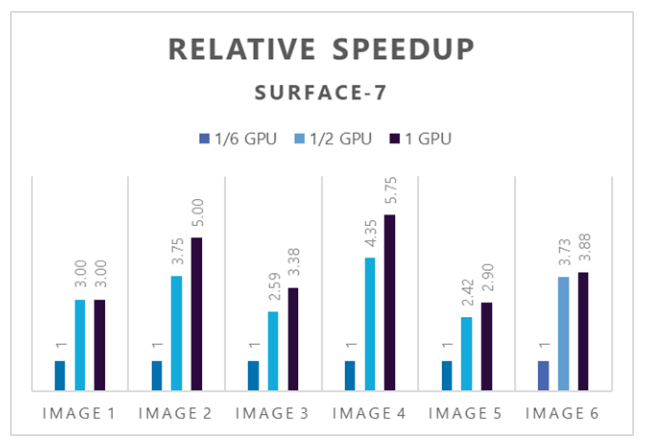
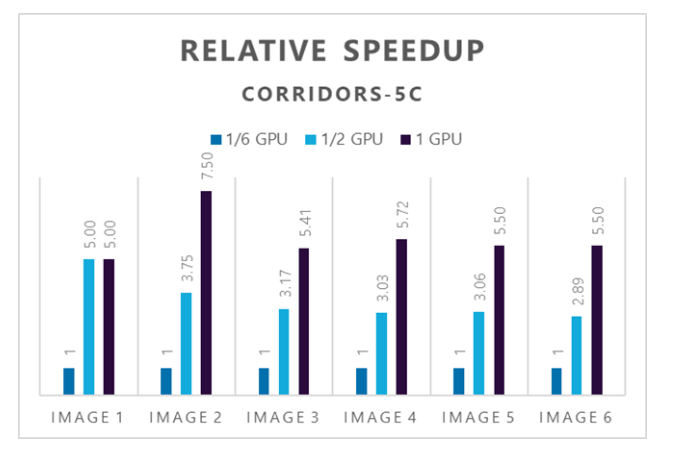

This article briefly describes the steps for running [Autodesk Civil 3D](https://www.autodesk.com/products/civil-3d/overview?term=1-YEAR&tab=subscription&plc=CIV3D) on a virtual machine (VM) that's deployed on Azure. It also presents the performance results of running Civil 3D on Azure.

Civil 3D is a 3D model-based design solver that civil engineers can use for design automation and production, enabling multidisciplinary team coordination. Civil 3D:
- Includes purpose-built tools for critical civil engineering disciplines.
- Integrates automation and analysis with support for building information modeling throughout a project lifecycle.  
- Connects project teams (when used with Collaboration for Civil 3D and BIM Collaborate Pro). 
- Enables effective visualization and analysis of geospatial/geotechnical data from ArcGIS.

Civil 3D was originally designed as an AutoCAD add-on. Civil 3D extensions now incorporate grading optimization, rail switch, and crossing enhancements.  

Civil 3D is used primarily to plan, design, and deliver land development, water, and transportation projects, including roads and highways, rail, bridges and tunnels, site development, and storm and sanitary networks. One of the main use cases is grading optimization. It's ideal for the automotive, energy, environment, construction, and facilities industries.

## Why deploy Civil 3D on Azure?  

- Modern and diverse compute options to align to your workload's needs 
- The flexibility of virtualization without the need to buy and maintain physical hardware 
- Rapid provisioning 
- Strong GPU acceleration, with increased performance as GPUs are added 

## Architecture

:::image type="content" source="media/hpc-civil-3d.png" alt-text="Diagram that shows an architecture for running Civil 3D on a virtual machine." lightbox="media/hpc-civil-3d.png" border="false":::

*Download a [Visio file](https://arch-center.azureedge.net/hpc-civil-3d.vsdx) of this architecture.*

### Components

- [Azure Virtual Machines](https://azure.microsoft.com/services/virtual-machines) is used to create Windows VMs. 
   - For information about deploying the VM and installing the drivers, see [Windows VMs on Azure](../../reference-architectures/n-tier/windows-vm.yml). 
- [Azure Virtual Network](https://azure.microsoft.com/services/virtual-network) is used to create a private network infrastructure in the cloud. 
  - [Network security groups](/azure/virtual-network/network-security-groups-overview) are used to restrict access to the VMs.  
  - A public IP address connects the internet to the VM.
- A physical SSD is used for storage.

## Compute sizing and drivers

[NVadsA10 v5](/azure/virtual-machines/nva10v5-series) series VMs were used to test the performance of Civil 3D on Azure. The following table provides configuration details:

|VM name |vCPU  |Memory (GiB)  |SSD (GiB) |GPU|GPU memory (GiB)|Maximum data disks |
|---------|---------|---------|---------|--|--|--|
|  Standard_NV6ads_A10_v5  |    6 |55    |180         |1/6|4|4|
|   Standard_NV18ads_A10_v5  |   18  |220         |720         |1/2|12|8|
|   Standard_NV36ads_A10_v5  |   36|  440       |      720   |1|24|16|

### Required drivers

To take advantage of the GPU capabilities of [NVadsA10 v5](/azure/virtual-machines/nva10v5-series) series VMs, you need to install NVIDIA GPU drivers.

## Civil 3D installation

Before you install Civil 3D, you need to deploy and connect a VM, install an eligible Windows 10 or Windows 11 image, and install the required NVIDIA GPU drivers.

For information about eligible Windows images, see [How to deploy Windows 10 on Azure](/azure/virtual-machines/windows/windows-desktop-multitenant-hosting-deployment) and [Use Windows client in Azure for dev/test scenarios](/azure/virtual-machines/windows/client-images).

For information about deploying the VM and installing the drivers, see [Run a Windows VM on Azure](../../reference-architectures/n-tier/windows-vm.yml).

For detailed instructions, see the [Autodesk installation instructions](https://www.autodesk.in/support/download-install/individuals).  

## Civil 3D performance results

For this performance analysis, we used the Civil 3D 2023 trial version on Windows, on [NVadsA10 v5 series](/azure/virtual-machines/nva10v5-series) VMs.

We performed the [Surfaces](https://help.autodesk.com/view/CIV3D/2023/ENU/?guid=GUID-F6A629B7-EB6B-443A-91EE-491076F71440) and [Corridors](https://help.autodesk.com/view/CIV3D/2023/ENU/?guid=GUID-DE41CF86-9A42-4F1F-B880-767F810CE0EB) tutorials for these tests.

In the Surfaces Tutorial, we performed the [Rendering a Surface](https://help.autodesk.com/view/CIV3D/2023/ENU/?guid=GUID-9087C6F6-9B87-4703-A987-64C92506A017) exercise.

Here's an example of a rendered surface:

In the Corridors Tutorial, we performed the [Visualizing a Corridor](https://help.autodesk.com/view/CIV3D/2023/ENU/?guid=GUID-6D746CF2-E33F-4964-BEEF-6589AB2F9287) exercise.

Here's an example of a rendered corridor:

The following table shows the rendering sizes of the images created in the tests:

|Image number  | Rendering size|
|---------|---------|
|  Image 1   | 800 x 600 px, SVGA        |
|  Image 2  | 1920 x 1080 px, Full HDTV        |
|  Image 3   |3300 x 2500 px  (11 x 8.5 in @300 dpi)         |
| Image 4    |5100 x 3300 px  (17 x 11 in @300 dpi)         |
|  Image 5   |2480 x 3508 px  (ISO A4 @300 dpi)        |
|Image 6      |3508 x 4961 px  (ISO A3 @300 dpi)         |

### Results on NVadsA10 v5

The following tables and graphs show the rendering times and relative speed increases achieved during the tests.

This table shows the rendering time, in seconds, for the six Surface-7 images:

|Number of GPUs|	Number of CPUs|	Image 1|	Image 2|	Image 3|	Image 4|	Image 5|	Image 6|
|--|--|--|--|--|--|--|--|
1/6 GPU	|6|	3|	15|	44|	161|	29|	97|
1/2 GPU	|18	|1	|4	|17	|37	|12	|26|
|1 GPU|	36|	1	|3	|13|	28|	10|	25|

This graph shows the relative speed increases for the Surface-7 drawings as the number of GPUs increases:

This table shows the rendering time, in seconds, for the six Corridor-5c images:

|Number of GPUs|	Number of CPUs|	Image 1|	Image 2|	Image 3|	Image 4|	Image 5|	Image 6|
|--|--|--|--|--|--|--|--|
1/6 GPU	|6|	5|	30|	92|206	|55	|110	|
1/2 GPU	|18	|1	|8	|	29|68|18|38|
|1 GPU|	36|	1	|4	|17|36	|10	|	20|

This graph shows the relative speed increases for the Corridor-5c drawings as the number of GPUs increases:

## Azure cost

Only rendering time is considered for these cost calculations. Application installation time isn't considered.  

You can use the [Azure pricing calculator](https://azure.microsoft.com/pricing/calculator) to estimate the costs for your configuration.

### Surface-7 drawing on NVadsA10 v5

|VM size |	Number of GPUs|	Total time in hours|
|--|--|--|
|6 vCPU	|1/6|	0.10|
|18 vCPU	|1/2|	0.03|
|36 vCPU|	1	|0.02|

### Corridors-5c drawing on NVadsA10 v5

|VM size| 	Number of GPUs|	Total time in hours|
|--|--|--|
|6 vCPU	|1/6|	0.14|
|18 vCPU	|1/2|	0.05|
|36 vCPU|	1|	0.02|

To compute the cost, multiply the total time by the Azure hourly cost. For the current hourly costs, see [Windows Virtual Machines Pricing](https://azure.microsoft.com/pricing/details/virtual-machines/windows/#pricing).

## Summary

- Civil 3D was successfully tested on NVadsA10_v5 series VMs on Azure.
- NVadsA10 v5 series VMs demonstrated good GPU acceleration. Adding GPUs generally increases the speed. 

## Contributors

*This article is maintained by Microsoft. It was originally written by the following contributors.*

Principal authors:

* [Hari Bagudu](https://www.linkedin.com/in/hari-bagudu-88732a19) | Senior Manager
* [Gauhar Junnarkar](https://www.linkedin.com/in/gauharjunnarkar) | Principal Program Manager
* [Vinod Pamulapati](https://www.linkedin.com/in/vinod-reddy-20481a104) | HPC Performance Engineer

Other contributors:

* [Mick Alberts](https://www.linkedin.com/in/mick-alberts-a24a1414) | Technical Writer
* [Guy Bursell](https://www.linkedin.com/in/guybursell) | Director Business Strategy
* [Sachin Rastogi](https://www.linkedin.com/in/sachin-rastogi-907a3b5) | Manager

  
 *To see non-public LinkedIn profiles, sign in to LinkedIn.*

## Next steps

- [GPU optimized virtual machine sizes](/azure/virtual-machines/sizes-gpu)
- [Windows virtual machines on Azure](/azure/virtual-machines/windows/overview)
- [Virtual networks and virtual machines on Azure](/azure/virtual-network/network-overview)
- [Learning path: Run high-performance computing (HPC) applications on Azure](/training/paths/run-high-performance-computing-applications-azure)

## Related resources

- [Run a Windows VM on Azure](../../reference-architectures/n-tier/windows-vm.yml)
- [HPC system and big-compute solutions](../../solution-ideas/articles/big-compute-with-azure-batch.yml)
- [HPC cluster deployed in the cloud](../../solution-ideas/articles/hpc-cluster.yml)
