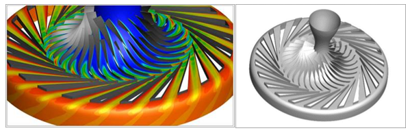
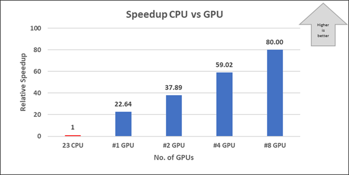
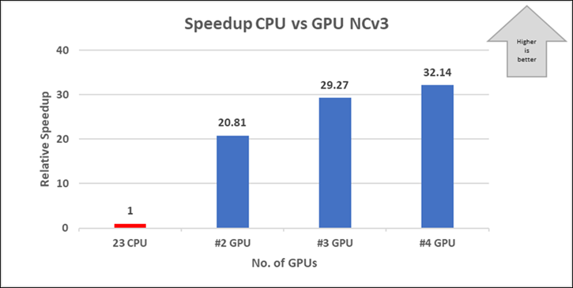

This article briefly describes the steps for running [ADS CFD's](https://new.aerodynamic-solutions.com) Code Leo application on a virtual machine (VM) that's deployed on Azure. It also presents the performance results of running Code Leo on Azure.

Code Leo is a URANS-based flow solver that delivers accurate and fast flow simulations for general flow configurations. Code Leo:

- Is density based and compressible and has explicit time marching and convergence acceleration.
- Is second-order accurate in time and space with low numerical smoothing.
- Runs both steady-state and unsteady simulations.
- Handles structured multi-block meshes and unstructured meshes with mixed tetrahedrons, pyramids, prisms, and hex elements.
- Allows the use of various turbomachinery rotor/stator interaction models, including sliding mesh, mixing plane, and frozen rotor models.
- Is HPC-aware and uses MPI+MP for parallel computing.

Code Leo was originally designed for CPUs, but ADS CFD extended it to take advantage of the advanced GPU architecture when GPUs became more cost-effective. It's been validated for decades by industry leaders like Air Force Research Laboratory and NASA. Code Leo users can switch easily between CPU and GPU solvers.

ADS CFD software is used primarily in the aerospace and turbomachinery (energy) industries for performance and durability assessments of jet engines and aircraft. One of the main use cases is the analysis and optimization of integrated engine/aircraft configurations so that next-generation aircraft designs can be completed on time and with confidence.

## Architecture

:::image type="content" source="media/hps-code-leo.svg" alt-text="Diagram that shows an architecture for running Code Leo on Azure." lightbox="media/hps-code-leo.png" border="false":::

*Download a [Visio file](https://arch-center.azureedge.net/hpc-code-leo.vsdx) of this architecture.*

## Components

 - [Azure Virtual Machines](https://azure.microsoft.com/services/virtual-machines). Create Linux and Windows virtual machines in seconds.
 - [Azure Virtual Network](https://azure.microsoft.com/services/virtual-network). Use Virtual Network to create your own private network infrastructure in the cloud.

## Install Code Leo on a VM

Before you install Code Leo, you need to deploy and connect a VM and install the required NVIDIA and AMD drivers.

> [!IMPORTANT]
> NVIDIA Fabric Manager installation is required for VMs that use NVLink or NVSwitch.

For information about deploying the VM and installing the drivers, see one of these articles:

- [Run a Windows VM on Azure](../../reference-architectures/n-tier/windows-vm.yml)
- [Run a Linux VM on Azure](../../reference-architectures/n-tier/linux-vm.yml)

To download Code Leo products from the ADS CFD portal:

1. Open the ADS CFD portal in a web browser and sign in.
1. Select the **Support** tab on the home page.
1. Select **Download**.
1. Select the download link for the latest version of Linux.

The package contains one run file.

 See the [ADS CFD website](https://new.aerodynamic-solutions.com/support) for instructions for installing Code Leo.

## Performance results of Code Leo on an Azure VM

Code Leo was used to run both the steady state and unsteady simulations. 

### Code Leo V8.21.08 performance results

The CC3 wheel model is used for this performance evaluation. This model has two parts, the impeller and the diffuser, as shown here:

|Model  |Number of elements |Number of nodes  |
|---------|---------|---------|
|Impeller     |   670848      |     742968    |
|Diffuser     |     914688    |     1012095    |

Full wheel time analyses were performed on ND96asr_v4 and NC24s_v3 Azure VMs.

ADS CFD provided CPU results, which provide a baseline for comparing GPU runs on both VM instances.

The elapsed time for CPU simulation is 3,600 minutes. The simulation was performed on a server with Xeon 23 CPUs with a clock speed of 2.4 GHz.

#### Performance results for NDv4 A100, diffuser and impeller

|Number of GPUs |Elapsed time in minutes|Relative improvement  |
|---------|---------|---------|
|1     |    159     |22.64         |
|2     |       95  | 37.89        |
|4     |         61|  59.02       |
|8     |         45|   80.00      |

Simulations were performed on Xeon 23 CPUs with 2.4 GHz on A100, which has 8 GPUs, each with 40 GB of memory.

#### Performance results for NCv3 V100, diffuser and impeller

|Number of GPUs |Elapsed time in minutes|Relative improvement  |
|---------|---------|---------|
|1     |    -     |-        |
|2     |   173      |  20.81       |
|4     |   123      |  29.27      |
|8     |   112      |  32.14     |

> [!NOTE]
> The model requires high GPU memory, so the 1-GPU VM couldn't perform the run.

 

Simulations were performed on Xeon 23 CPUs with 2.4 GHz on V100, which has 4 GPUs, each with 16 GB of memory.

## Pricing

Only model running time (wall clock time) is considered for these cost calculations. Application installation time isn't considered. The calculations are indicative. The actual numbers depend on the size of the model.

You can use the [Azure pricing calculator](https://azure.microsoft.com/pricing/calculator) to estimate costs for your configuration.

The following tables provide elapsed times in hours. To compute the total cost, multiply by the Azure VM hourly cost, which you can find [here for Windows](https://azure.microsoft.com/pricing/details/virtual-machines/windows/#pricing) and [here for Linux](https://azure.microsoft.com/pricing/details/virtual-machines/linux/#pricing).

### ND96asr_v4

|Number of GPUs  |Elapsed time in hours  |
|---------|---------|
|1  |2.65         |  
|2     |1.58         |  
|4     | 1.02        |  
|8      | 0.75        | 

### NC24s_v3

|Number of GPUs  |Elapsed time in hours  |
|---------|---------|
|2 | 2.88      | 
|4    | 2.05        |  
|8      |  1.87      |  

## Additional notes about tests

- Code Leo was successfully tested on NDv4 and NCv3 VMs on Azure.
- The NDv4 A100 VM demonstrated good GPU acceleration. Every added GPU provides speed improvements. The peak performance of 80x is attained with 8 GPUs.
- The NCv3 V100 VM also demonstrated good GPU acceleration. Every added GPU provides good improvements. The peak performance of 32x is attained with 4 GPUs. For complex problems, the 1 GPU memory of 16 GB might not be sufficient, so we recommend 2 GPUs for this scenario.
- The GPU technology in Code Leo provides unprecedented processing power on Azure.

## Contributors

*This article is maintained by Microsoft. It was originally written by the following contributors.*

Principal authors:

- [Hari Bagudu](https://www.linkedin.com/in/hari-bagudu-88732a19) | Senior Manager
- [Gauhar Junnarkar](https://www.linkedin.com/in/gauharjunnarkar) | Principal Program Manager
- [Vinod Pamulapati](https://www.linkedin.com/in/vinod-reddy-20481a104) | HPC Performance Engineer

Other contributors:

- [Mick Alberts](https://www.linkedin.com/in/mick-alberts-a24a1414) | Technical Writer 
- [Guy Bursell](https://www.linkedin.com/in/guybursell) | Director Business Strategy 
- [Sachin Rastogi](https://www.linkedin.com/in/sachin-rastogi-907a3b5) | Manager

*To see non-public LinkedIn profiles, sign in to LinkedIn.*

## Next steps

- [GPU optimized virtual machine sizes](/azure/virtual-machines/sizes-gpu)
- [Windows virtual machines in Azure](/azure/virtual-machines/windows/overview)
- [Linux virtual machines in Azure](/azure/virtual-machines/linux/overview)
- [Virtual networks and virtual machines in Azure](/azure/virtual-network/network-overview)
- [Learning path: Run high-performance computing (HPC) applications on Azure](/training/paths/run-high-performance-computing-applications-azure)
- [Code Leo case studies](https://new.aerodynamic-solutions.com/case-studies)

## Related resources

- [Run a Windows VM on Azure](../../reference-architectures/n-tier/windows-vm.yml)
- [Run a Linux VM on Azure](../../reference-architectures/n-tier/linux-vm.yml)
- [HPC system and big-compute solutions](../../solution-ideas/articles/big-compute-with-azure-batch.yml)
- [HPC cluster deployed in the cloud](../../solution-ideas/articles/hpc-cluster.yml)
