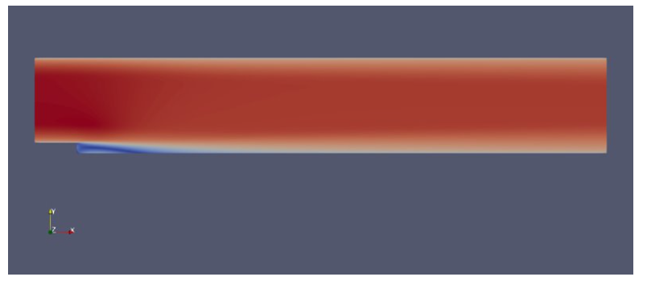
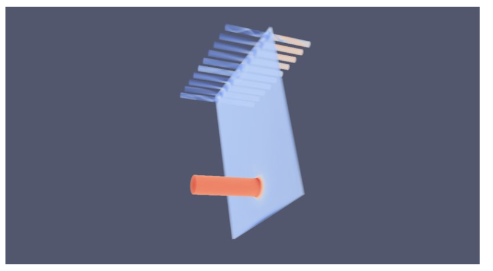
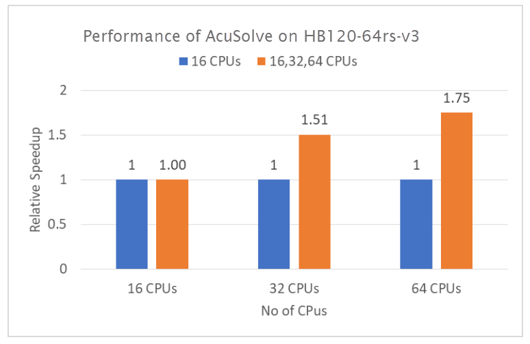

This article briefly describes the steps for running [Altair
AcuSolve](https://www.altair.com/altair-cfd-capabilities) on a virtual
machine (VM) that's deployed on Azure. It also presents the performance
results of running AcuSolve on Azure.

AcuSolve is a computational fluid dynamics (CFD) analyzer. It provides comprehensive software and tools to solve fluid mechanics problems like thermal analysis, aerodynamics, and noise reduction. 

AcuSolve is finite-element based and uses distinct methods to solve all fluid problems: Navier-Stokes, smoothed-particle hydrodynamic, and Lattice Boltzmann. It enables simulations that involve flow, heat transfer, turbulence, and non-Newtonian materials. Engineers and scientists use AcuSolve for the automotive, aerospace, and energy industries, including for chemical processing and electronics cooling.

## Why deploy AcuSolve on Azure?

- Modern and diverse compute options to align to your workload's
    needs 
- The flexibility of virtualization without the need to buy and
    maintain physical hardware 
- Rapid provisioning 
- On a single node, performance improvements of as much as 2.47 times
    over that of 16 CPUs

## Architecture

This diagram shows a multi-node configuration:

:::image type="content" source="media/acusolve-cluster-architecture.png" alt-text="Diagram that shows a multi-node configuration." lightbox="media/acusolve-cluster-architecture.png" border="false":::

*Download a* *[Visio file](https://arch-center.azureedge.net/acusolve-cluster-architecture.vsdx) of this architecture.*

This diagram shows a single-node configuration:

:::image type="content" source="media/hpc-acusolve.png" alt-text="Diagram that shows a single-node configuration." lightbox="media/hpc-acusolve.png" border="false":::

*Download a [Visio file](https://arch-center.azureedge.net/hpc-acusolve.vsdx) of this
architecture.*

### Components

-   [Azure Virtual
    Machines](https://azure.microsoft.com/services/virtual-machines) is
    used to create Linux VMs. 
    -   For information about deploying the VM and installing the
        drivers, see [Linux VMs on Azure](../../reference-architectures/n-tier/linux-vm.yml).
-   [Azure Virtual
    Network](https://azure.microsoft.com/services/virtual-network) is
    used to create a private network infrastructure in the cloud. 
    -   [Network security
        groups](/azure/virtual-network/network-security-groups-overview)
        are used to restrict access to the VMs.  
    -   A public IP address connects the internet to the VM.   
-   [Azure
    CycleCloud](https://azuremarketplace.microsoft.com/marketplace/apps/azurecyclecloud.azure-cyclecloud)
    is used to create the cluster in the multi-node configuration.
-   A physical SSD is used for storage.   

## Compute sizing 

[HBv3-series](/azure/virtual-machines/hbv3-series) VMs were used to test the performance of AcuSolve on Azure. The following table provides configuration details:

|Size|	vCPU	|RAM memory (GiB)|	Memory bandwidth (GBps)|	Base CPU frequency (GHz)|	All-cores frequency (GHz, peak)|	Single-core frequency (GHz, peak)|	RDMA performance (GBps)|	Maximum data disks|
|--|--|--|--|--|--|--|--|--|
|Standard_HB120rs_v3|	120|	448|	350	|2.45|	3.1|	3.675|	200|	32|
|Standard_HB120-64rs_v3|	64	|448	|350|	2.45|	3.1	|3.675|	200|	32|
 
[HBv3-series VMs](/azure/virtual-machines/hbv3-series) are optimized for high-performance computing (HPC) applications like fluid dynamics, explicit and implicit finite-element analysis, weather modeling, seismic processing, reservoir simulation, and RTL simulation.

## AcuSolve installation

Before you install AcuSolve, you need to deploy and connect a Linux VM.

For information about deploying the VM, see [Run a Linux VM on Azure](../../reference-architectures/n-tier/linux-vm.yml).

You can install AcuSolve from [Altair One
Marketplace](https://altairone.com/Marketplace?queryText=acusolve). You
also need to install Altair License Manager and activate your license
via Altair Units Licensing. You can find more information about
installing AcuSolve and License Manager and activating your license on
Altair One Marketplace. For multi-node installation, see the next
section.

## Multi-node configuration

You can easily deploy an HPC cluster on Azure by using [Azure
CycleCloud](/azure/cyclecloud/overview).

Azure CycleCloud is a tool for orchestrating and managing HPC
environments on Azure. You can use CycleCloud to provision
infrastructure for HPC systems, deploy HPC schedulers, and automatically
scale the infrastructure to run jobs efficiently at any scale.

Azure CycleCloud is a Linux-based web application. We recommend that you
set it up by deploying an Azure VM that's based on a preconfigured
Azure Marketplace image.

To set up an HPC cluster on Azure, complete these steps:

1.  [Install and configure Azure
    CycleCloud](/training/modules/azure-cyclecloud-high-performance-computing/4-exercise-install-configure)
2.  [Create an HPC cluster from built-in
    templates](/training/modules/azure-cyclecloud-high-performance-computing/5-exercise-create-cluster)
3.  [Connect to the head node (the
    scheduler)](/azure/cyclecloud/how-to/connect-to-node)

For multi-node configurations, the AcuSolve installation process is the
same as the process described previously for a single node, except for
the path to the installation directory:

-   You need to select **/shared** for the Installation directory path
    so that the directory is accessible for all nodes.
-   The shared folder path depends on your network attached storage
    service, like an NFS server, BeeGFS cluster, [Azure NetApp
    Files](https://azure.microsoft.com/services/netapp), [Azure
    HPC Cache](https://azure.microsoft.com/services/hpc-cache),
    or [Azure Active Directory Domain
    Services](https://azure.microsoft.com/services/active-directory-ds).
-   To authorize multi-node VMs to access License Manager, you need to
    include your authorization code in the job script. For more
    information about installing AcuSolve, see [Altair One
    Marketplace](https://altairone.com/Marketplace?queryText=acusolve).

## AcuSolve performance results

AcuSolve was tested in single-node and multi-node configurations. Computation time (wall-clock time) was measured. The Linux platform was used, with an Azure Marketplace CentOS 8.1 HPC Gen2 image. The following table provides details:

|  Operating system version  | OS architecture   |Processor  |  MPI|
|---------|---------|---------|---------|
|    CentOS Linux 8.1.19 (Core) |  x86-64       |     AMD EPYC 7003-series (Milan)    |     Intel MPI    |

### Results for a single-node configuration

Two models were used to test the single-node configuration:

-   Backward-facing step (0.27 million elements)

-   Impinging nozzle (7.6 million elements)

The following table provides details about the backward-facing step
model:

| Analysis type     |  Turbulence model  | Number of elements   | Number of nodes   | Maximum time steps |
|---------|---------|---------|---------|--|
|    Steady state  |   Spalart-Allmaras      |     276,936    |     279,270    |300|

This table provides details about the impinging nozzle model:

| Analysis type   | Turbulence model  | Number of elements   | Number of nodes  |Maximum time steps |
|---------|----|-----|---------|---------|
|   Steady  |   Spalart-Allmaras      |  7,690,844|     7,855,017    |    200     |

#### Results for backward-facing step, single node

In this benchmarking exercise, AcuSolve simulates turbulent flow over a
backward-facing step. The following table shows total consumption times
for varying numbers of CPUs on Standard_HB120rs_v3 VMs:

|VM size           |         Number of processors |  Wall-clock time                                               (seconds)|
|-|-|-|
|Standard_HB120rs_v3  |      120       |             130.8|
|Standard_HB120rs_v3    |    641         |            188.7|
|Standard_HB120rs_v3     |   321     |           196.4|
|Standard_HB120rs_v3      |  161           |          322.9|

*1. In these cases, the number of processors was artificially limited. This VM has 120 processors.*  
  
The following graph shows the relative speed increases on the
Standard_HB120rs_v3 VM:

This table shows total consumption times for varying numbers of
CPUs on Standard_HB120-64rs_v3 VMs:

|VM size           |         Number of processors |  Wall-clock time                                               (seconds)|
|-|-|-|
|Standard_HB120-64rs_v3     |    64         |   127.7         |
| Standard_HB120-64rs_v3    |   322          |     199.88      |
| Standard_HB120-64rs_v3      |  162           |  266.2        |

*2.  In these cases, the number of processors was artificially limited. This VM has 64 processors.*

The following graph shows the relative speed increases on the
Standard_HB120-64rs_v3 VM:

#### Results for impinging nozzle, single node

As the preceding performance results show, the Standard_HB120-64rs_v3 VM
with 64 cores provides the best performance. For the impinging nozzle
model, which has more elements, we used that VM for the performance
evaluation.

The following table shows total consumption times for varying numbers of
CPUs on Standard_HB120-64rs_v3 VMs:

 
|VM size|                   Number of processors|    Wall-clock time  (hours)|
|-|-|-|
|Standard_HB120-64rs_v3   | 163|                     13.48|
|Standard_HB120-64rs_v3 |   323                     |8.95|
|Standard_HB120-64rs_v3  |  64                    | 7.7|

*3. In these cases, the number of processors was artificially limited. This VM has 64 processors.*

The following graph shows the relative speed increases on the
Standard_HB120-64rs_v3 VM:

### Results for a multi-node configuration

As the preceding performance results show, the Standard_HB120-64rs_v3 VM
with 64 cores provides the best performance. For the multi-node
configuration, we tested the impinging nozzle model, which has 7.6
million elements, on 1, 2, 4, 8, and 16 nodes of
the Standard_HB120-64rs_v3 VM in an Azure HPC cluster.

| VM size|  Number of nodes| Number of cores|  Wall-clock time (seconds)    |Relative increase|
|-|-|-|-|-|
|Standard_HB120-64rs_v3|   1|          64|          24,054 |         1.15
|Standard_HB120-64rs_v3 |  2|          128|         9,794 |          2.83|
|Standard_HB120-64rs_v3|   4   |       256 |        4,241       |    6.53|
|Standard_HB120-64rs_v3 |  8  |        512  |       2,160        |   12.83|
|Standard_HB120-64rs_v3  | 16|         1,024 |      2,250         |  12.31|

## Azure cost

Only rendering time is considered for these cost calculations.
Application installation time isn't considered.

To calculate total costs, multiply the wall-clock time by the Azure hourly
cost. For the current hourly costs, see [Linux Virtual Machines
Pricing](https://azure.microsoft.com/pricing/details/virtual-machines/linux/#pricing).

You can use the [Azure pricing
calculator](https://azure.microsoft.com/pricing/calculator) to estimate
the costs for your configuration.

### Single node on Standard_HB120rs_v3

|  Number of CPUs|                      Wall-clock time (hours)|
|-|-|
|  120 |                                0.04|

### Single node Standard_HB120-64rs_v3

|  Number of CPUs|                      Wall-clock time (hours)|
|-|-|
|64 |                                 7.74|

### Multi-node on Standard_HB120-64rs_v3

|Number of nodes|   Number of CPUS|        Wall-clock time (hours)|
|-|-|-|
|1  |               64                    |6.68|
|2   |              128                   |2.72|
|4    |             256                  | 1.18|
|8     |            512                 |  0.60|
|16     |           1,024              |   0.63|

## Summary

-  AcuSolve was successfully tested on Standard_HB120rs_v3 and
    Standard_HB120-64rs_v3 VMs.
-  On a single node, on Standard_HB120rs_v3 VMs with 120 vCPUs,
    performance increases as much as 2.47 times over that of 16 CPUs,
    based on wall-clock time.
-  On a single node, on Standard_HB120-64rs_v3 VMs with 64 vCPUs,
    performance increases as much as 2.08 times over that of 16 CPUs,
    based on wall-clock time.
-  AcuSolve scales up linearly with impressive numbers up to 8 nodes on
    an Azure HPC cluster with Standard_HB120-64rs_v3 VM instances that
    have 64 cores on each node. Performance increases 12.83 times with
    an 8-node (512-core) configuration on AMD Milan-X processors, an
    excellent scale-up value for AcuSolve. Scalability increases beyond
    8 nodes when a higher number of finite-element nodes are simulated.

## Contributors

*This article is maintained by Microsoft. It was originally written by
the following contributors.*

Principal authors:

-   [Hari Bagudu](https://www.linkedin.com/in/hari-bagudu-88732a19) |
    Senior Manager
-   [Gauhar Junnarkar](https://www.linkedin.com/in/gauharjunnarkar) |
    Principal Program Manager
-   [Vinod
    Pamulapati](https://www.linkedin.com/in/vinod-reddy-20481a104) |
    HPC Performance Engineer

Other contributors:

-   [Mick Alberts](https://www.linkedin.com/in/mick-alberts-a24a1414) |
    Technical Writer
-   [Guy Bursell](https://www.linkedin.com/in/guybursell) | Director
    Business Strategy
-   [Sachin
    Rastogi](https://www.linkedin.com/in/sachin-rastogi-907a3b5) |
    Manager

*To see non-public LinkedIn profiles, sign in to LinkedIn.*

## Next steps

-   [GPU-optimized virtual machine
    sizes](/azure/virtual-machines/sizes-gpu)
-   [Linux virtual machines on
    Azure](/azure/virtual-machines/linux/overview)
-   [Virtual networks and virtual machines on
    Azure](/azure/virtual-network/network-overview)
-   [Learning path: Run high-performance computing (HPC) applications on
    Azure](/training/paths/run-high-performance-computing-applications-azure)
-   [What is Azure
    CycleCloud?](/azure/cyclecloud/overview)

## Related resources

-   [Run a Linux VM on Azure](../../reference-architectures/n-tier/linux-vm.yml)
-   [HPC system and big-compute solutions](../../solution-ideas/articles/big-compute-with-azure-batch.yml)
-   [HPC cluster deployed in the cloud](../../solution-ideas/articles/hpc-cluster.yml)
