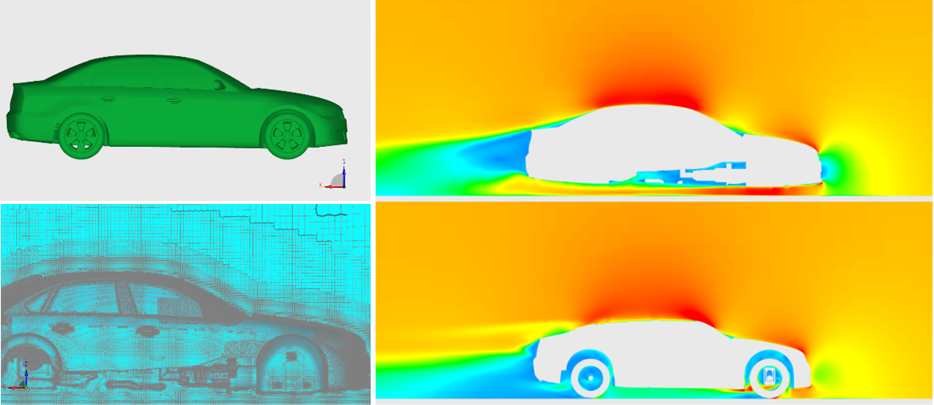
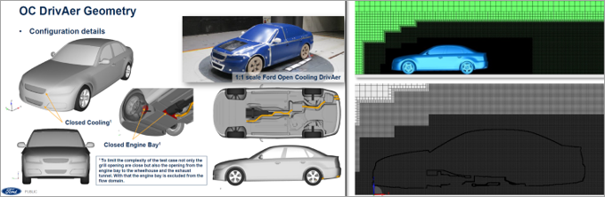
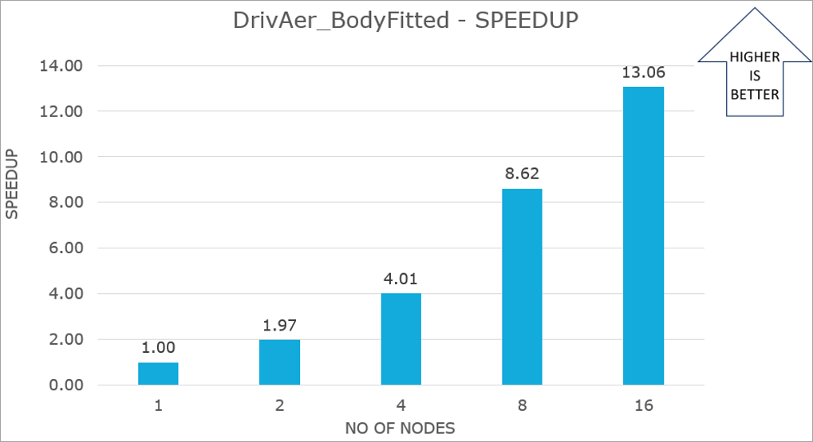
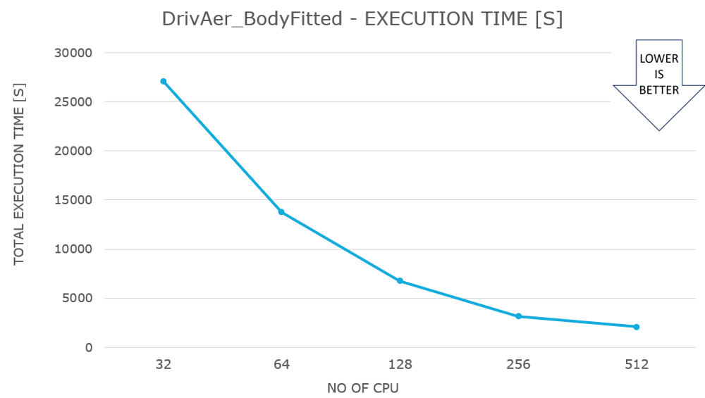
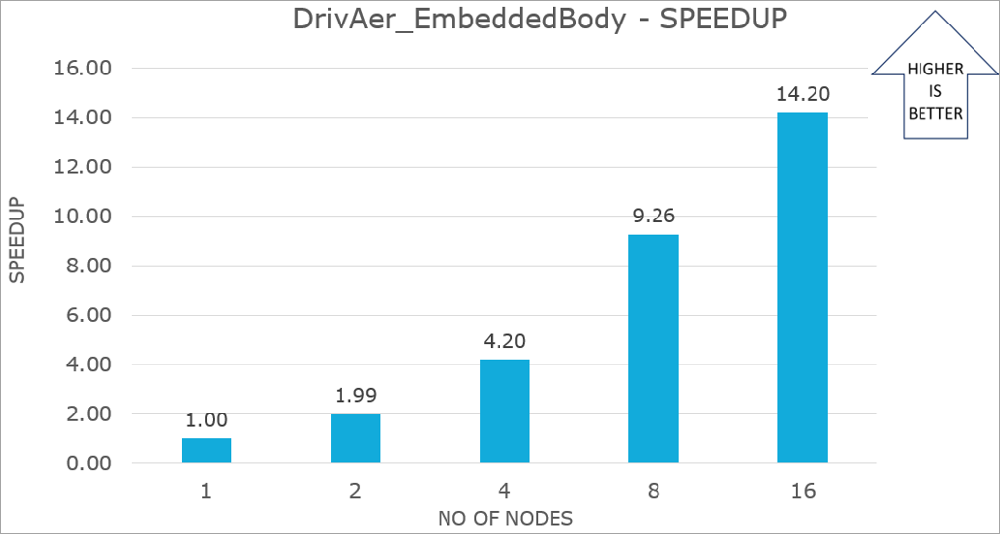
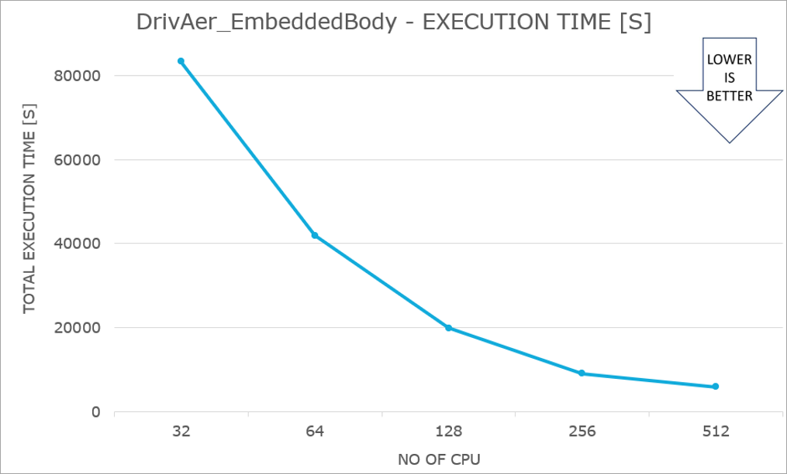

This article describes the steps for running the [AVL FIRE M](https://www.avl.com/fire-m) application on a virtual machine (VM) and a high-performance computing (HPC) cluster that's deployed on Azure. The article also shows the performance results of running AVL FIRE M on Azure CycleCloud (an Azure HPC cluster).

AVL FIRE M is the leading computational fluid dynamics (CFD) simulation package for internal-combustion engines. In the new era of electromobility, it has evolved into a comprehensive software tool offering solutions for a wide spectrum of applications. It simulates:

- Fluid flow and thermal load in power train and vehicle components.
- Vehicle aerodynamics.
- Complex multi-fluid and multiphase flows.
- Efficient and reliable solutions for electrification, such as virtual development and integration of electric driveline, battery, and fuel cells.

Designed to accurately simulate relevant physics and chemistry, AVL FIRE M enables predictive simulations of fuel sprays, ignition, combustion, and engine-out emissions. It also shows how to tailor components of exhaust gas aftertreatment systems. And it provides models for electrochemistry and thermal behavior of batteries and fuel cells.

AVL FIRE M provides:

- Efficient solutions to solve demanding flow problems in various applications and industries.
- Accurate simulation of heat transfer and thermal load problems.
- Qualified and task-oriented software support along with application method development.

## Why deploy AVL Fire M on Azure?

The following list describes the benefits of deploying AVL FIRE M on Azure:

- Modern and diverse compute options align with your workload's needs
- Flexibility for virtualization without the need to buy and maintain physical hardware
- Rapid provisioning

## Architecture

This diagram shows a multi-node configuration:

:::image type="content" source="media/fire-m/fire-m-cluster-architecture.svg" alt-text="Diagram that shows a multi-node configuration architecture." lightbox="media/fire-m/fire-m-cluster-architecture.svg" border="false":::

*Download a* *[Visio file](https://arch-center.azureedge.net/fire-m-cluster-architecture.vsdx) of this architecture.*

### Components

- [Azure Virtual Machines](https://azure.microsoft.com/services/virtual-machines) creates Linux and Windows VMs in seconds.
- [Azure Virtual Network](https://azure.microsoft.com/services/virtual-network) creates a private network infrastructure in the cloud.
- [Azure CycleCloud](https://azuremarketplace.microsoft.com/marketplace/apps/azurecyclecloud.azure-cyclecloud) creates the cluster in the multi-node configuration.

## Compute sizing and drivers

Performance tests of AVL FIRE M on Azure use [HBv3-series VMs](/azure/virtual-machines/hbv3-series) running the Linux CentOS operating system. The following table provides the configuration details:

|Size|	vCPU	|RAM memory (GiB)|	Memory bandwidth (GBps)|	Base CPU frequency (GHz)|	All-cores frequency (GHz, peak)|	Single-core frequency (GHz, peak)|	RDMA performance (GBps)|	Maximum data disks|
|--|--|--|--|--|--|--|--|--|
|Standard_HB120rs_v3|	120|	448|	350	|1.9|	3.0|	3.5|	200|	32|
|Standard_HB120-96rs_v3|	96	|448	|350|	1.9|	3.0	|3.5|	200|	32|
|Standard_HB120-64rs_v3|	64	|448	|350|	1.9|	3.0	|3.5|	200|	32|
|Standard_HB120-32rs_v3 |	32	|448	|350|	1.9|	3.0	|3.5|	200|	32|
|Standard_HB120-32rs_v3 |	16	|448	|350|	1.9|	3.0	|3.5|	200|	32|

### Required drivers

To use InfiniBand, you need to [enable InfiniBand drivers](/azure/virtual-machines/workloads/hpc/enable-infiniband).

## AVL FIRE M 2022 R1 installation

Before you install AVL FIRE M, you deploy and connect a VM or an Azure HPC cluster.

For more information about deploying the VM and installing the drivers, see either [Run a Windows VM on Azure](/azure/architecture/reference-architectures/n-tier/windows-vm) or [Run a Linux VM on Azure](../../reference-architectures/n-tier/linux-vm.yml).

For more information on deploying the Azure CycleCloud and Azure HPC cluster, see these resources.

- [Install and configure Azure CycleCloud](/training/modules/azure-cyclecloud-high-performance-computing/4-exercise-install-configure)
- [Create an Azure HPC cluster](/training/modules/azure-cyclecloud-high-performance-computing/5-exercise-create-cluster)

You can download AVL FIRE M products on the AVL self-service portal. Alternately, you can install the application without downloading the large installation image by running the installer executable (AVL SETUP.run). For more information on how to download, install, and license AVL FIRE M, see the [AVL Fire M website](https://www.avl.com/fire-m).

## AVL FIRE M 2022 R1 performance results

For the performance results, AVL FIRE M ran steady state simulations. The following are details on the models used for AVL FIRE M performance validation on Virtual Machines.

DrivAer_BodyFitted: Open Cooling DrivAer Notchback is a realistic test case that's relevant to the automotive industry and accepted as the standard for automotive CFD correlation. For more information, see the [DrivAer_BodyFitted SAE technical paper](https://doi.org/10.4271/2021-01-0958) by Hupertz, B., Chalupa, K., Krueger, L., Howard, K. et al., _On the Aerodynamics of the Notchback Open Cooling DrivAer: A Detailed Investigation of Wind Tunnel Data for Improved Correlation and Reference_, (SAE Int. J. Adv. & Curr. Prac. in Mobility 3(4):1726-1747,- 2021).

DrivAer_EmbeddedBody: Embedded body approach in AVL FIRE M, requires practically no conventional meshing and is an alternative to the standard (body-fitted) for the comparative assessment. For more information, see the [DrivAer_EmbeddedBody SAE technical paper](https://doi.org/10.4271/2022-01-0889) by Basara, B., Zunic, Z., Pavlovic, Z., Sampl, P. et al., _Performance Analysis of Immersed Boundary Method for Predicting External Car Aerodynamics_ (SAE Technical Paper 2022-01-0889, 2022).

> [!NOTE]
> Analysis steady state RANS simulation is run with decomposed mesh.

The following table provides details:

|  Model  | Pressure correction equation   | Pressure boundary values | Embedded bodies| Flow category |
|---------|---------|---------|---------|-----------------------------|
| DrivAer_BodyFitted |  Simple       |     Mirrored    |     No   | Incompressible |
| DrivAer_EmbeddedBody | Simple | Extrapolated | Yes | Incompressible |

The DrivAer_BodyFitted and DrivAer_EmbeddedBody models were used for this performance evaluation.

### DrivAer_BodyFitted model results

The following figure shows the DrivAer_BodyFitted model results.
 

### DrivAer_EmbeddedBody model results

The following figure shows the DrivAer_EmbeddedBody model results.

|  Model  | Internal cells   | Run mode | Linear solver| Iterations |
|---------|---------|---------|---------|-----------------------------|
| DrivAer_BodyFitted |  128,103,525       |    Steady State    |     Pressure GSTB   | 300 |
| DrivAer_EmbeddedBody | 87,365,510 | Steady State    |     Pressure GSTB   | 500 |

The steady state CFD analyses were performed on an Azure CycleCloud multi-node setup with [HBv3 AMD EPYC™ 7V73X](/azure/virtual-machines/hbv3-series) (Milan-X) VMs. The single node result is considered the baseline for comparing multi-node CPU runs.

### Performance results for DrivAer_BodyFitted

This table shows the speedup performance results for DrivAer_BodyFitted.

|  Number of nodes  | Number of CPUs   | Solver running time (seconds) | Relative speed increase |
|---------|---------|---------|---------|
| 1 |  32       |    27,098    |   1.00 |
| 2 | 64 | 13,754    | 1.97 |
| 4 | 128 | 6,757 | 4.01 |
| 8 | 256 | 3,145 | 8.62 |
| 16 | 512 | 2,076 | 13.06 |

The following graph shows the DrivAer_BodyFitted speedup performance results.

The following graph shows the DrivAer_BodyFitted execution time results.

### Performance results for DrivAer_EmbeddedBody

This table shows the speedup performance results for DrivAer_EmbeddedBody.

|  Number of nodes  | Number of CPUs   | Solver running time (seconds) | Relative speed increase |
|---------|---------|---------|---------|
| 1 |  32  | 83,387  |   1.00 |
| 2 | 64 | 41,918    | 1.99 |
| 4 | 128 | 19,851 | 4.20 |
| 8 | 256 | 9,004 | 9.26 |
| 16 | 512 | 5,872 | 14.20 |

The following graph shows the speedup performance results for DrivAer_EmbeddedBody.
 

The following graph shows the DrivAer_EmbeddedBody execution time results.

> [!NOTE]
> To get a better speedup, there must be a minimum of 20,000 cells per CPU for a single-phase incompressible flow simulation.

More notes about the tests:

- Both models demonstrate good CPU acceleration in all multi-node setups.
- This research is limited to a few iterations. But in real-world circumstances, iterations can be more numerous, so you can minimize decomposition time in the total run time, allowing performance to be improved even further.
- For small problems, we recommend using fewer CPUs to get better performance.

## Azure cost

Only elapsed solver running time (total run time) was considered for these cost calculations. Application installation time isn't considered. The calculations are relative. The actual numbers depend on the size of the model.

You can use the [Azure pricing calculator](https://azure.microsoft.com/pricing/calculator) to estimate costs for your configuration. The following tables provide elapsed times in hours. To compute the total cost, multiply by the number of nodes and Virtual Machine hourly costs. For the current hourly costs, see [Linux Virtual Machines pricing](https://azure.microsoft.com/pricing/details/virtual-machines/linux/#pricing).

### DrivAer_BodyFitted

|  Number of nodes|                      Solver running time (hours) *|
|-|-|
|  1 |                                7.5|
|  2 |                                3.8|
|  4 |                                1.9|
|  8 |                                0.9|
|  16 |                                0.6|

### DrivAer_EmbeddedBody

|  Number of nodes|                      Solver running time (hours) **|
|-|-|
|  1 |                                23.2|
|  2 |                                11.6|
|  4 |                                5.5|
|  8 |                                2.5|
|  16 |                                1.6|

> [!NOTE]
> *The total run time presented here is for 300 iterations only. The analysis time for a fully converged solution can differ. **The total run time presented here is for 500 iterations only. The analysis time for a fully converged solution can differ.

## Summary

- HPC on Azure provides fully managed platform services and a robust architecture to run HPC workloads and applications.
- Azure offers robust compute services that provide unlimited scalability options for HPC applications. You can use HB-series VMs for memory-bound applications and N-series VMs for graphic-intensive applications.
- Azure CycleCloud lets you manage and orchestrate workloads, define access controls with Azure Active Directory, and customize cluster policies.
- AVL FIRE M was successfully tested on HBv3 AMD EPYC™ 7V73X (Milan-X) series on Azure CycleCloud multi-node setup.
- AVL FIRE M demonstrates good upscale with an increase in the number of CPUs in a multi-node setups.
- For improved performance, there must be a minimum of 20,000 cells per CPU for single-phase incompressible flow simulations.
- For small problems, we recommend that you use fewer CPUs to improve performance.

## Contributors

*This article is maintained by Microsoft. It was originally written by the following contributors.*

Principal authors:

- [Hari Bagudu](https://www.linkedin.com/in/hari-bagudu-88732a19) | Senior Manager
- [Gauhar Junnarkar](https://www.linkedin.com/in/gauharjunnarkar) | Principal Program Manager
- [Vivi Richard](https://www.linkedin.com/in/vivi-richard) | HPC Performance Engineer

Other contributors:

- [Liz Casey](https://www.linkedin.com/in/elizabethhlizfloriocasey) | Technical Writer
- [Guy Bursell](https://www.linkedin.com/in/guybursell) | Director Business Strategy
- [Sachin Rastogi](https://www.linkedin.com/in/sachin-rastogi-907a3b5) | Manager

*To see non-public LinkedIn profiles, sign in to LinkedIn.*

## Next steps

- [GPU-optimized virtual machine sizes](/azure/virtual-machines/sizes-gpu)
- [Linux virtual machines on Azure](/azure/virtual-machines/linux/overview)
- [Virtual networks and virtual machines on Azure](/azure/virtual-network/network-overview)
- [Learning path: Run high-performance computing (HPC) applications on Azure](/training/paths/run-high-performance-computing-applications-azure)
- [What is Azure CycleCloud?](/azure/cyclecloud/overview)

## Related resources

- [Run a Linux VM on Azure](../../reference-architectures/n-tier/linux-vm.yml)
- [HPC system and big-compute solutions](../../solution-ideas/articles/big-compute-with-azure-batch.yml)
- [HPC cluster deployed in the cloud](../../solution-ideas/articles/hpc-cluster.yml)
