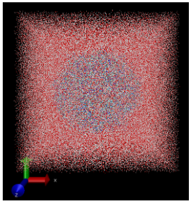
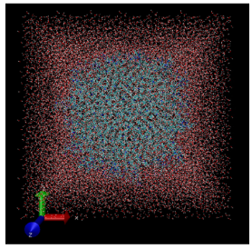
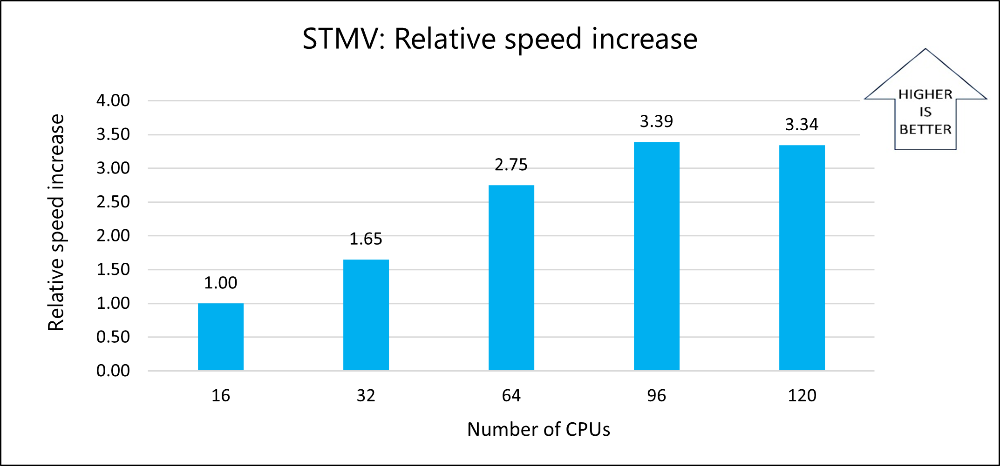
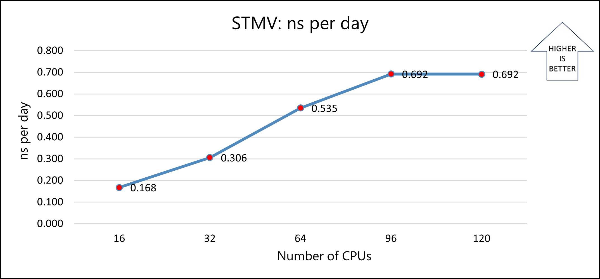
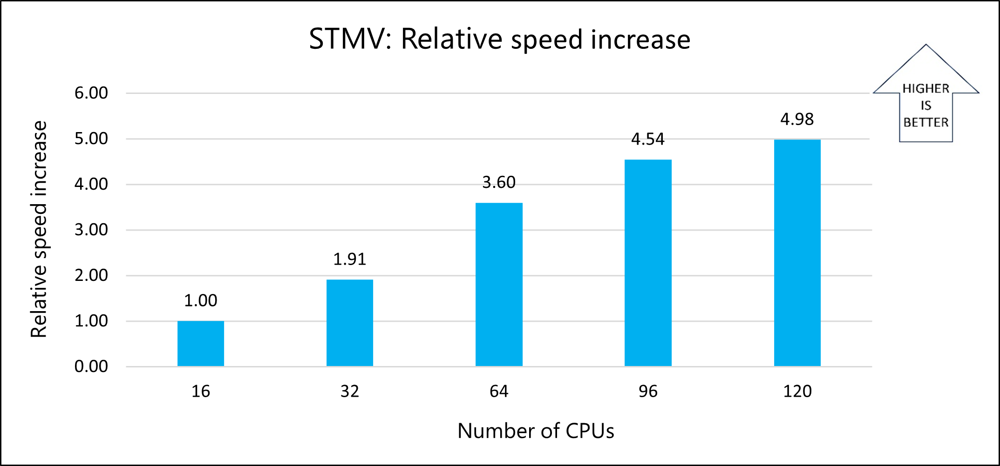
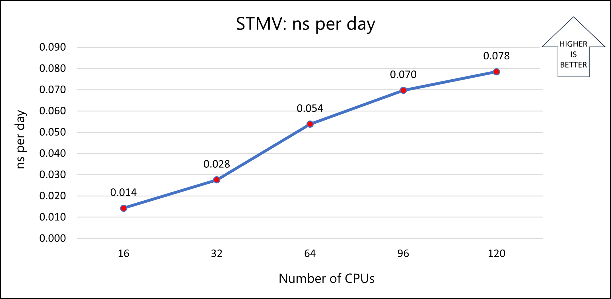
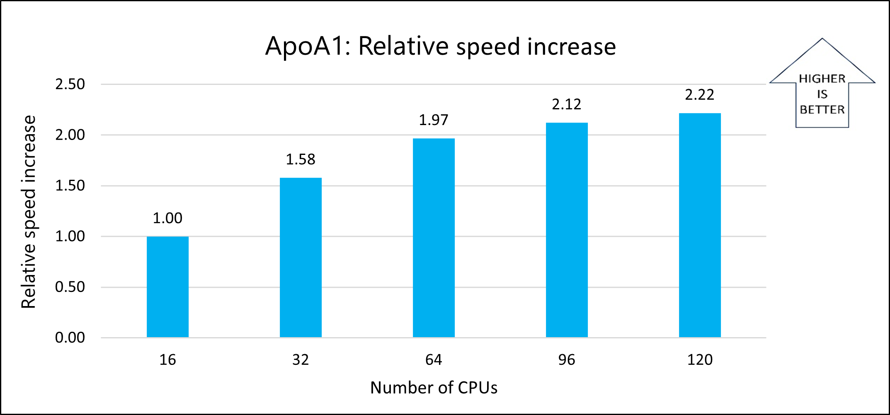
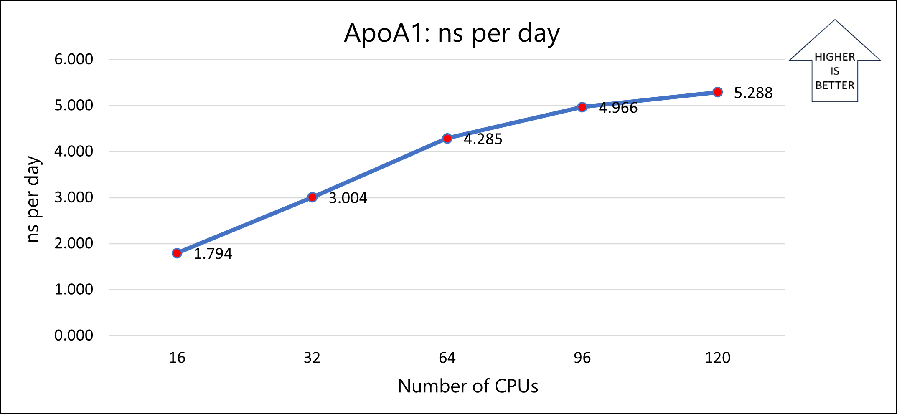
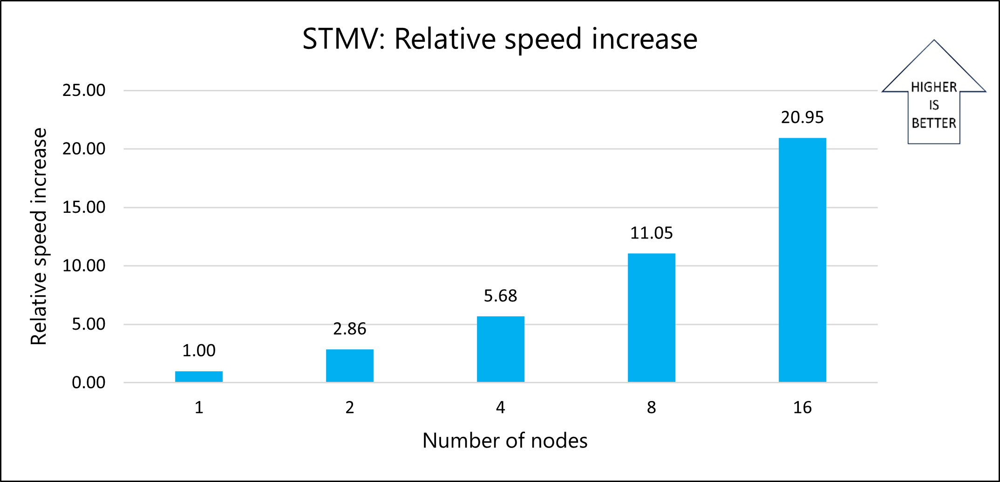
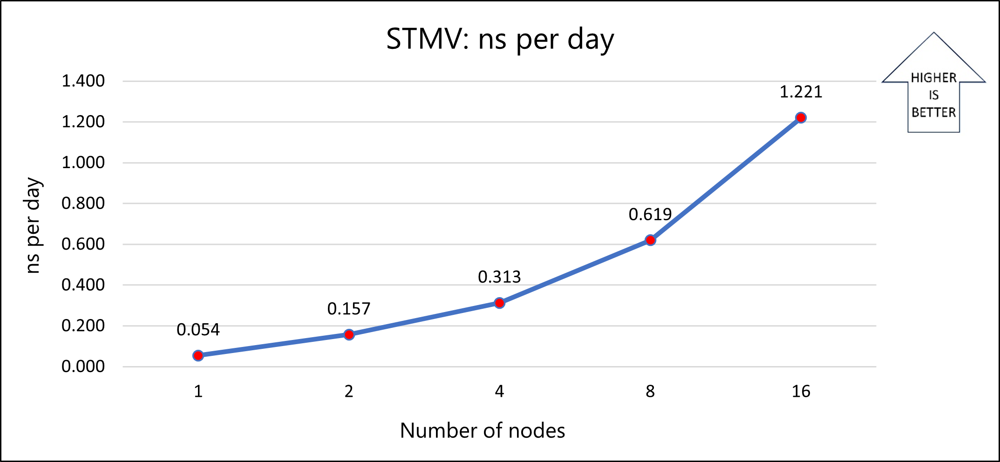

This article describes the steps for running [NAMD](http://www.ks.uiuc.edu/Research/namd/) software on a virtual machine (VM) that's deployed on Azure. It also presents the performance results of running NAMD on single-node and multi-node VM configurations.

NAMD is a computer application for molecular dynamics simulation that's based on the [Charm++](https://en.wikipedia.org/wiki/Charm%2B%2B) parallel programming model. It's often used to simulate systems that comprise millions of atoms. NAMD supports hundreds of cores for typical simulations and can support more than 500,000 cores for the largest simulations. Simulations and trajectory analysis are performed with the popular molecular graphics program VMD, but NAMD is also compatible with AMBER, CHARMM, and X-PLOR. A source code version of NAMD is available for free.

NAMD is used mainly for high-performance simulations of large biomolecular systems. Typical NAMD simulations include all-atom models of proteins, lipids, nucleic acids, and explicit solvents (water and ions).

## Why deploy NAMD on Azure?

- By running NAMD on Azure HB-series VMs, you can reduce the time and cost of your simulations.
- Running molecular simulation and analysis tasks on Azure can make it easier to implement advanced simulation methods and practical solutions for many molecular modeling tasks.
- NAMD and associated tools enable popular research workflows like MDFF structure refinement and QwikMD simulation protocols to be run remotely. You don't need to invest in local computing resources, and the required expertise in high-performance computing (HPC) technologies is reduced.

## Architecture

This diagram shows a multi-node configuration:

:::image type="content" source="media/namd-multi-node-architecture.svg" alt-text="Diagram that shows a multi-node configuration." border="false":::

*Download a [Visio file](https://arch-center.azureedge.net/namd-multi-node-architecture.vsdx) of this architecture.*

This diagram shows a single-node configuration:

:::image type="content" source="media/namd-single-node-architecture.svg" alt-text="Diagram that shows a single-node configuration." border="false":::

*Download a [Visio file](https://arch-center.azureedge.net/namd-single-node-architecture.vsdx) of this architecture.*

### Components

- [Azure Virtual Machines](https://azure.microsoft.com/services/virtual-machines) is used to create Linux VMs. For information about deploying VMs and installing the drivers, see [Linux VMs on Azure](../../reference-architectures/n-tier/linux-vm.yml).
- [Azure Virtual Network](https://azure.microsoft.com/services/virtual-network) is used to create a private network infrastructure in the cloud. 
   - [Network security groups](/azure/virtual-network/network-security-groups-overview) are used to restrict access to the VMs.  
   - A public IP address connects the internet to the VMs.   
- [Azure CycleCloud](https://azuremarketplace.microsoft.com/marketplace/apps/azurecyclecloud.azure-cyclecloud) is used to create the cluster in the multi-node configuration.
- A physical SSD is used for storage.  

## Compute sizing and drivers

[HBv3 AMD EPYC 7V73X (Milan-X)](/azure/virtual-machines/hbv3-series) VMs running Linux CentOS were used to test the performance of NAMD on Azure. The following table provides details about HBv3-series VMs.

| Size | vCPU | Memory (GiB) | Memory bandwidth (GBps) | Base CPU frequency (GHz) | All-cores frequency (GHz, peak) | Single-core frequency (GHz, peak) | RDMA performance (GBps) | Maximum data disks |
|:---|:---|:---|:---|:---|:---|:---|:---|:---|
| Standard_HB120rs_v3 | 120 | 448 | 350 | 1.9 | 3.0 | 3.5 | 200 | 32 |
| Standard_HB120-96rs_v3 | 96 | 448 | 350 | 1.9 | 3.0 | 3.5 | 200 | 32 |
| Standard_HB120-64rs_v3 | 64 | 448 | 350 | 1.9 | 3.0 | 3.5 | 200 | 32 |
| Standard_HB120-32rs_v3 | 32 | 448 | 350 | 1.9 | 3.0 | 3.5 | 200 | 32 |
| Standard_HB120-16rs_v3 | 16 | 448 | 350 | 1.9 | 3.0 | 3.5 | 200 | 32 |

### Required drivers

To use InfiniBand, you need to enable [InfiniBand](/azure/virtual-machines/extensions/enable-infiniband) drivers.

## Install NAMD 2.14 on a VM or HPC cluster

You can download the software from the [NAMD](https://www.ks.uiuc.edu/Development/Download/download.cgi?PackageName=NAMD) website. You just need to untar or unzip the NAMD binary distribution file and run it in the resulting directory. For information about building from source code, see [Compiling NAMD](https://www.ks.uiuc.edu/Research/namd/2.14/notes.html).

Before you install NAMD, you need to deploy and connect to a VM or an HPC cluster.

For information about deploying the VM and installing the drivers, see [Run a Linux VM on Azure](../../reference-architectures/n-tier/linux-vm.yml).

For information about deploying Azure CycleCloud and the HPC cluster, see these articles:

- [Install and configure Azure CycleCloud](/learn/modules/azure-cyclecloud-high-performance-computing/4-exercise-install-configure/)
- [Create an HPC cluster](/learn/modules/azure-cyclecloud-high-performance-computing/5-exercise-create-cluster/)

## NAMD performance results

Two models were used to test the scalability performance of NAMD 2.14 on Azure:

- STMV. A small icosahedral plant virus that worsens the symptoms of infection by tobacco mosaic virus (TMV). 
- ApoA1. A component of high-density lipoprotein (HDL). The ApoA1 gene provides instructions for creating a protein called apolipoprotein A-I. 

The details about each test model are provided in the following sections.

### Model 1: STMV

To validate NAMD 2.14 scaling on Azure HPC systems, STMV is tiled in arrays of 5x2x2 (21 million atoms). The following table provides details about two versions of the model.

| Model  | Number of atoms | Time step | Number of steps | Method |
|:---|:---|:---|:---|:---|
| 1a | 1,066,628   | 1 | 2,000 |  Particle-Mesh Ewald (PME) |
| 1b | 21,000,000   | 2 | 1,200 | PME   |

### Model 2: ApoA1

The following table provides details about the model.

| Model | Number of atoms| Time step | Number of steps | Method |
|:---|:---|:---|:---|:---|
| 2 | 92,224  | 1 | 2,000 | PME |

### NAMD 2.14 performance results on single-node VMs

The following sections provide the performance results of running NAMD on single-node Azure [HBv3 AMD EPYC 7V73X (Milan-X)](/azure/virtual-machines/hbv3-series) VMs.

#### Model 1a: STMV

This table shows the nanoseconds per day and total wall-clock times recorded for varying numbers of CPUs on the Standard HBv3-series VM:

| Number of cores| ns per day | Wall-clock time (seconds) | Relative speed increase |
|:---|:---|:---|:---|
| 16 | 0.168 | 1,046.34 | NA |
| 32 | 0.306 | 633.58 | 1.65 |
| 64 | 0.535 | 380.58 | 2.75 |
| 96 | 0.692 | 308.60 | 3.39 |
| 120 | 0.692 | 312.93 | 3.34 |

The following graph shows the relative speed increases as the number of CPUs increases:

The following graph shows the nanoseconds-per-day for varying numbers of CPUs:

#### Model 1b: STMV

This table shows the nanoseconds per day and total wall-clock times recorded for varying numbers of CPUs on the Standard HBv3-series VM:

| Number of cores| ns per day | Wall-clock time (seconds) | Relative speed increase |
|:---|:---|:---|:---|
| 16 | 0.014 | 14,712.03 | NA |
| 32 | 0.028 | 7,715.94 | 1.91 |
| 64 | 0.054 | 4,092.31 | 3.60 |
| 96 | 0.070 | 3,239.06 | 4.54 |
| 120 | 0.078 | 2,955.45 | 4.98 |

The following graph shows the relative speed increases as the number of CPUs increases:

The following graph shows the nanoseconds-per-day for varying numbers of CPUs:

#### Model 2: ApoA1

This table shows the nanoseconds per day and total wall-clock times recorded for varying numbers of CPUs on the Standard HBv3-series VM:

| Number of cores| ns per day | Wall-clock time (seconds) | Relative speed increase |
|:---|:---|:---|:---|
| 16| 1.794 | 130.61 | NA |
| 32 | 3.004 | 82.67 | 1.58 |
| 64 | 4.285 | 66.36 | 1.97 |
| 96 | 4.966 | 61.51 | 2.12 |
| 120 | 5.288 | 58.89 | 2.22 |

The following graph shows the relative speed increases as the number of CPUs increases:

The following graph shows the nanoseconds per day for varying numbers of CPUs:

#### Notes about the single-node tests

For all single-node tests, the solver time on a Standard_HB120-16rs_v3 VM (16 cores) is used as a reference to calculate the relative speed increase with respect to similar VMs that have more cores. The previously presented results show that parallel performance improves as cores increase from 16 to 64. At 120 cores, the improvement is limited and only occurs on some simulations. This pattern is common with these simulations and other memory-intensive applications because of the saturation of the onboard memory that's available on each processor. Taking VM costs into consideration, the 64-CPU configuration is the best choice. Standard_HB120-64rs_v3 VMs, which have 64 cores, were used for the multi-node tests.

### NAMD 2.14 performance results on a multi-node cluster

The single-node tests confirm that the solver achieves optimal parallel performance with 64 cores on HBv3-series VMs. Based on those results, 64-core configurations on [Standard_HB120-64rs_v3](/azure/virtual-machines/hbv3-series) VMs were used to evaluate the performance of NAMD on multi-node clusters. STMV model 1b was used for the multi-node tests.  

This table shows the nanoseconds per day and total wall-clock times recorded for varying numbers of nodes on Standard HBv3-series VMs:

|Number of nodes | Number of cores | ns per day | Wall-clock time (seconds) | Relative speed increase |
|:---|:---|---|:---|:---|
| 1 | 64 | 0.054 | 3,835.48 | NA |
| 2 | 128 | 0.157 | 1,340.54 | 2.86 |
| 4 | 256 | 0.313 | 675.18 | 5.68 |
| 8 | 512 | 0.619 | 346.97 | 11.05 |
| 16 | 1,024 | 1.221 | 183.09 | 20.95 |

The following graph shows the relative speed increases as the number of nodes increases:

The following graph shows the nanoseconds per day for varying numbers of nodes:

The results show that model 1b scales well as the number of nodes increases. For better performance, use a memory-optimized version of the application. You can optimize the application by compiling the source code. The simulation used for testing is limited to a few iterations. Because real-world applications can use more iterations, you can minimize the total time that's required for decomposition, which further improves performance.

## Azure cost

The following table provides wall-clock times that you can use to calculate Azure costs. To compute the cost, multiply the solver running time by the number of nodes and the Azure VM hourly cost. For the current hourly costs, see [Linux Virtual Machines Pricing](https://azure.microsoft.com/pricing/details/virtual-machines/linux/). The Azure VM hourly rates are subject to change.

Only simulation running time is considered for the cost calculations. Installation time, simulation setup time, and software costs aren't included.

You can use the [Azure pricing calculator](https://azure.microsoft.com/pricing/calculator) to estimate VM costs for your configurations.

STMV model 1b was used to calculate these times. 

|Number  of nodes | Wall-clock time (hours) |
|:---|:---|
| 1 | 1.07 |
| 2 | 0.37 |
| 4 | 0.19 |
| 8 | 0.10 |
| 16 | 0.05 |

## Summary

- NAMD 2.14 was successfully tested on Azure HBv3 standalone VMs and on an Azure CycleCloud multi-node configuration.
- Model 1b scales well on the multi-node configuration. On a 16-node configuration, the speed is 21 times faster than it is on a single node.
- For better performance, we recommend that you use the `+p` option to run one thread per processor. We also recommend that you look for prebuilt ibverbs NAMD binaries or specify ibverbs when you build the Charm++.
- For small simulations, we recommend that you use fewer CPUs.

## Contributors

*This article is maintained by Microsoft. It was originally written by the following contributors.*

Principal authors:

- [Hari Bagudu](https://www.linkedin.com/in/hari-bagudu-88732a19) | Senior Manager
- [Gauhar Junnarkar](https://www.linkedin.com/in/gauharjunnarkar) | Principal Program Manager
- [Preetham Y M](https://www.linkedin.com/in/preetham-y-m-6343a6212/) | HPC Performance Engineer

Other contributors:

- [Mick Alberts](https://www.linkedin.com/in/mick-alberts-a24a1414) | Technical Writer
- [Guy Bursell](https://www.linkedin.com/in/guybursell) | Director, Business Strategy
- [Sachin Rastogi](https://www.linkedin.com/in/sachin-rastogi-907a3b5) | Manager

*To see non-public LinkedIn profiles, sign in to LinkedIn.*

## Next steps

- [GPU-optimized virtual machine sizes](/azure/virtual-machines/sizes-gpu)
- [Virtual machines on Azure](/azure/virtual-machines/windows/overview)
- [Virtual networks and virtual machines on Azure](/azure/virtual-network/network-overview)
- [Learning path: Run HPC applications on Azure](/training/paths/run-high-performance-computing-applications-azure)

## Related resources

- [Run a Linux VM on Azure](../../reference-architectures/n-tier/linux-vm.yml)
- [HPC system and big-compute solutions](../../solution-ideas/articles/big-compute-with-azure-batch.yml)
- [HPC cluster deployed in the cloud](../../solution-ideas/articles/hpc-cluster.yml)
