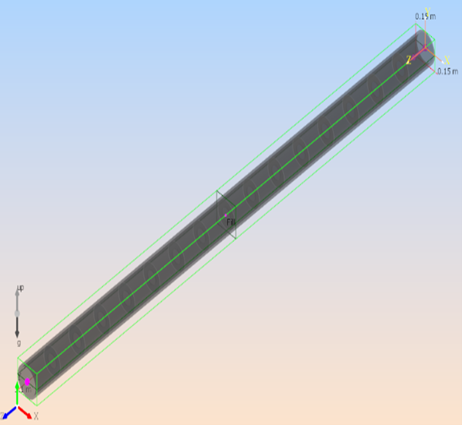
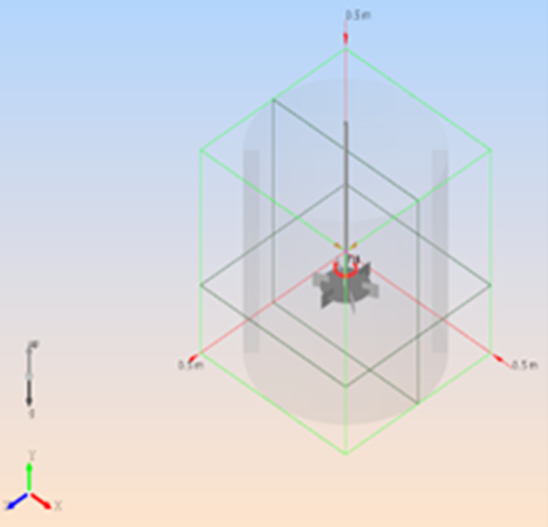

This article briefly describes the steps for running [M-Star](https://mstarcfd.com/) computational fluid dynamics software on an Azure virtual machine (VM). It also presents the performance results of running M-Star on Azure.

M-Star is a multiphysics modeling package that simulates fluid flow, heat transfer, species transport, chemical reactions, particle transport, and rigid-body dynamics. It uses large eddy simulation and advanced lattice-Boltzmann algorithms that run entirely on GPUs. 
M-Star is used in the chemical, biopharmaceutical, and energy industries.

## Why deploy M-Star on Azure?

* Modern and diverse compute options to align with your workload's needs 
* The flexibility of virtualization without the need to buy and maintain physical hardware 
* Rapid provisioning 
* Technology that enables the creation of complex flow fields in a short amount of time 
* Integrated post-processing capabilities, such as creating photorealistic renderings

## Architecture

:::image type="content" source="media/m-star-architecture.svg" alt-text="Diagram that shows an architecture for deploying M-Star." lightbox="media/m-star-architecture.svg" border="false":::

*Download a [Visio file](https://arch-center.azureedge.net/m-star-architecture.vsdx) of this architecture.*

### Components

- [Azure Virtual Machines](https://azure.microsoft.com/services/virtual-machines) is used to create Windows and Linux VMs. For information about deploying VMs and installing drivers, see [Windows VMs on Azure](../../reference-architectures/n-tier/windows-vm.yml) and [Linux VMs on Azure](../../reference-architectures/n-tier/linux-vm.yml).
- [Azure Virtual Network](https://azure.microsoft.com/services/virtual-network) is used to create a private network infrastructure in the cloud.
   - [Network security groups](/azure/virtual-network/network-security-groups-overview) are used to restrict access to the VMs.
   - A public IP address connects the internet to the VMs.
- A physical SSD is used for storage.

## Compute sizing and drivers

For performance tests of M-Star on [NDm A100 v4](/azure/virtual-machines/ndm-a100-v4-series) and [NC A100 v4](/azure/virtual-machines/nc-a100-v4-series) series Azure VMs, the Linux operating system was used. The following table provides the configuration details of these VMs.

|Size | vCPU | Memory: GiB | Temporary storage (SSD): GiB | GPU | GPU memory: GiB | Maximum data disks | Maximum uncached disk throughput: IOPS / MBps | Maximum network bandwidth | Maximum NICs |
|:---|:---|:---|:---|:---|:---|:---|:---|:---|:---|
| Standard_NC48ads_A100_v4 | 48 | 440 | 2,246 | 2 | 160 | 24 | 60,000 / 2,000 | 40,000 Mbps | 4 |
| Standard_ND96amsr_A100_v4 | 96 | 1,900 | 6,400 | 8 A100 80-GB GPUs (NVLink 3.0) | 80 | 32 | 80,000 / 800 | 24,000 Mbps | 8 |

### Required drivers

To take advantage of the GPU capabilities of [NC A100 v4](/azure/virtual-machines/nc-a100-v4-series) and [NDm A100 v4](/azure/virtual-machines/ndm-a100-v4-series) series VMs, you need to install NVIDIA GPU drivers.

## M-Star installation

Before you install M-Star, you need to deploy and connect to a VM and install the required NVIDIA drivers.

For information about deploying the VM and installing the drivers, see one of these articles:

* [Run a Windows VM on Azure](../../reference-architectures/n-tier/windows-vm.yml)
* [Run a Linux VM on Azure](../../reference-architectures/n-tier/linux-vm.yml)

> [!Important] 
> NVIDIA Fabric Manager is required for VMs that use NVLink or NVSwitch.

The following table provides details about the operating system and NVIDIA drivers that were used for the performance tests.

|Operating system version | OS architecture | GPU driver version | CUDA version| MPI |
|:---|:---|:---|:---|:---|
|Linux (Ubuntu HPC 18.04 Gen 2) | x86-64 | 510.85.02 | 11.6 | openmpi-4.1.1 |

You can install M-Star from the [M-Star installation page](https://docs.mstarcfd.com/2_Installation/txt-files/Installation-index.html). For information about the installation process, see [M-Star on Linux](https://docs.mstarcfd.com/2_Installation/txt-files/Linux-single-node.html).

## M-Star performance results

This performance analysis uses M-Star 3.8.27 on the Windows operating system. [NC A100 v4](/azure/virtual-machines/nc-a100-v4-series) and [NDm A100 v4](/azure/virtual-machines/ndm-a100-v4-series) series VMs were used.

 Two models were used to test the performance of M-Star on Azure VMs: 
 
||||
|-|-|-|
|**Model**|Pipe_500|Tank_1000|
|**Number of grid points**|500 million|1,000 million|

### Results on NC A100 v4

#### Pipe_500 model

The following table shows the total runtimes and the relative speed increase as the number of GPUs is increased from one to two.

| VM size | Number of GPUs | Total runtime, in seconds | Speed increase |
|---|---|---|---|
| Standard_NC96ads_A100_v4 | 1 | 15,921.18 | NA |
| Standard_NC96ads_A100_v4 | 2 | 8,347.98 | 1.91 |

:::image type="content" source="media/pipe-500-graph-nc-a100-v4.png" alt-text="Graph that shows the Pipe_500 performance on an NC A100 v4 VM." lightbox="media/pipe-500-graph-nc-a100-v4.png" border="false":::

#### Tank_1000 model

The following table shows the elapsed time for running the Tank_1000 model.

| VM Size | Number of GPUs | Total runtime, in seconds |
|---|---|---|
| Standard_NC96ads_A100_v4 | 1 | NA |
| Standard_NC96ads_A100_v4 | 2 | 1,420.25 |

#### Notes about tests on NC A100 v4

- Because the Tank-1000 model is large, you can't run it on one GPU on the NCv4 VM.
- An NVLink connection is required for M-Star.
- Because the architecture of NCv4 VMs supports only dual GPU connectivity, models were run only on 1-GPU and 2-GPU configurations.

### Results on NDm A100 v4

#### Pipe_500 model

The following table shows the total runtimes and relative speed increases for running the Pipe_500 model.

| VM size | Number of GPUs | Total runtime, in seconds | Speed increase |
|:---|:---|:---|:---|
| Standard_NC96ads_A100_v4 | 1 | 15,921.18 | NA |
| Standard_ND96amsr_A100_v4 | 2 | 8,967.48 | 1.78 |
| Standard_ND96amsr_A100_v4 | 4 | 4,463.21 | 3.57 |
| Standard_ND96amsr_A100_v4 | 8 | 2,276.67 | 6.99 |

:::image type="content" source="media/pipe-500-graph-ndm-a100-v4.png" alt-text="Graph that shows the Pipe_500 performance on an NDm A100 v4 VM." lightbox="media/pipe-500-graph-ndm-a100-v4.png" border="false":::

#### Tank_1000 model

The following table shows the total runtimes and relative speed increases for running the Tank_1000 model.

| VM size | Number of GPUs | Total runtime, in seconds | Speed increase |
|:---|:---|:---|:---|
| Standard_ND96amsr_A100_v4 | 2 | 1,481.36 | NA |
| Standard_ND96amsr_A100_v4 | 4 | 735.31 | 2.01 |
| Standard_ND96amsr_A100_v4 | 8 | 429.69 | 3.45 |

:::image type="content" source="media/tank-1000-graph.png" alt-text="Graph that shows the Tank_1000 performance on an NDm A100 v4 VM." lightbox="media/tank-1000-graph.png" border="false":::

#### Notes about tests on NDm A100 v4

- NC A100 v4 series VMs only have individual pairs of GPUs connected peer to peer, but NDm A100 v4 series VMs have full peer-to-peer connections among all eight GPUs. You should therefore use NC A100 v4 systems for simulations that run on one or two GPUs. For anything that needs more than two GPUs, you should use NDmA100 v4 VMs.
- For the Pipe_500 model, the 1-GPU NCv4 result is used as a baseline.

## Azure cost

Only model running time (wall-clock time) is considered for these cost calculations. Application installation time isn't considered. The results are indicative of your potential results. The actual numbers depend on the size of the model.

You can use the [Azure pricing calculator](https://azure.microsoft.com/pricing/calculator) to estimate the costs for your configuration.

The following tables provide elapsed times in hours. To compute the total cost, multiply by the Azure VM hourly cost, which you can find [here for Windows](https://azure.microsoft.com/pricing/details/virtual-machines/windows/) and [here for Linux](https://azure.microsoft.com/pricing/details/virtual-machines/linux/).

### Cost for the Pipe_500 model

#### NDm A100 v4

| Number of GPUs| Time in, hours |
|---|---|
| 8 | 0.63 |

#### NC A100 v4

| Number of GPUs| Time in, hours |
|---|---|
| 1 | 4.42 |
| 2 | 2.31 |

### Cost for the Tank_1000 model

#### NDm A100 v4

| Number of GPUs| Time in, hours |
|---|---|
| 8 | 0.11 |

#### NC A100 v4

| Number of GPUs| Time in, hours |
|---|---|
| 1 | NA |
| 2 | 0.39 |

## Summary

- M-Star 3.8.27 was successfully tested on NC A100 v4 and NDm A100 v4 VMs on Azure.
- Based on the models tested, M-Star scales almost linearly as the number of GPUs increases.
- For the Pipe_500 model, tests indicate that the speed with eight GPUs is seven times faster than the speed with one GPU.

## Contributors

*This article is maintained by Microsoft. It was originally written by the following contributors.* 

Principal authors:

- [Hari Bagudu](https://www.linkedin.com/in/hari-bagudu-88732a19) | Senior Manager
- [Gauhar Junnarkar](https://www.linkedin.com/in/gauharjunnarkar) | Principal Program Manager
- [Vinod Pamulapati](https://www.linkedin.com/in/vinod-reddy-20481a104) | HPC Performance Engineer

Other contributors:

* [Mick Alberts](https://www.linkedin.com/in/mick-alberts-a24a1414) | Technical Writer
* [Guy Bursell](https://www.linkedin.com/in/guybursell) | Director, Business Strategy
* [Sachin Rastogi](https://www.linkedin.com/in/sachin-rastogi-907a3b5/) | Manager

*To see non-public LinkedIn profiles, sign in to LinkedIn.*

## Next steps

* [GPU-optimized virtual machine sizes](/azure/virtual-machines/sizes-gpu)
* [Virtual machines on Azure](/azure/virtual-machines/windows/overview)
* [Virtual networks and virtual machines on Azure](/azure/virtual-network/network-overview)
* [Learning path: Run HPC applications on Azure](/training/paths/run-high-performance-computing-applications-azure)

## Related resources

* [Run a Linux VM on Azure](../../reference-architectures/n-tier/linux-vm.yml)
* [Run a Windows VM on Azure](../../reference-architectures/n-tier/windows-vm.yml)
* [HPC system and big-compute solutions](../../solution-ideas/articles/big-compute-with-azure-batch.yml)