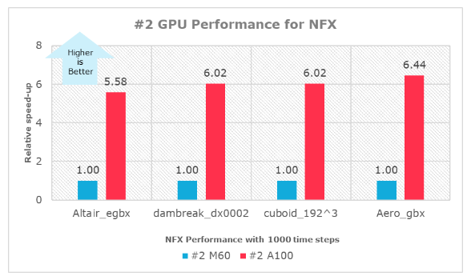

This article briefly describes the steps for running [Altair
nanoFluidX](https://www.altair.com/altair-cfd-capabilities) (NFX) on a
virtual machine (VM) that's deployed on Azure. It also presents the
performance results of running nanoFluidX on Azure.

Altair nanoFluidX simulates single-phase and multiphase flows. It's
based on a weakly compressible Lagrangian smoothed-particle
hydrodynamics (SPH) formulation. Altair nanoFluidX:

-   Enables easy treatment of high-density ratio multiphase flows, like
    water-air.
-   Provides rotating-motion options to prescribe different types of
    motion. These options enable the simulation of rotating gears,
    crankshafts, and connecting rods in powertrain applications.

Altair nanoFluidX is designed for use on clusters of graphical
processing units (GPUs), so it's fast.

It's primarily used in industries like construction, off-highway,
mining (energy), agriculture, space exploration (aerospace), and process/manufacturing. It's best
suited for simulation of free surface oiling, sloshing, and mixing.

## Why deploy nanoFluidX on Azure?

-   Modern and diverse compute options to align with your workload's
    needs 
-   The flexibility of virtualization without the need to buy and
    maintain physical hardware 
-   Rapid provisioning 
-   Complex problems solved within a few hours

## Architecture

:::image type="content" source="media/hpc-nanofluidx.png" alt-text="Diagram that shows an architecture for deploying Altair nanoFluidX." lightbox="media/hpc-nanofluidx.png" border="false":::

*Download a [Visio
file](https://arch-center.azureedge.net/hpc-nanofluidx.vsdx) of this
architecture.*

### Components

-   [Azure Virtual
    Machines](https://azure.microsoft.com/services/virtual-machines) is
    used to create Linux VMs. 
    -   For information about deploying the VM and installing the
        drivers, see [Linux VMs on Azure](../../reference-architectures/n-tier/linux-vm.yml).
-   [Azure Virtual
    Network](https://azure.microsoft.com/services/virtual-network) is
    used to create a private network infrastructure in the cloud. 
    -   [Network security
        groups](/azure/virtual-network/network-security-groups-overview)
        are used to restrict access to the VMs.  
    -   A public IP address connects the internet to the VM.   
-   A physical SSD is used for storage.   

## Compute sizing and drivers

Performance tests of nanoFluidX on Azure used [ND A100
v4](/azure/virtual-machines/nda100-v4-series) and [NVv3
M60](/azure/virtual-machines/nvv3-series) series VMs
running Linux.
The following table provides the configuration details.

|VM size|  vCPU|   Memory, in GiB  | SSD, in GiB| Number of GPUs |GPU memory, in GiB|  Maximum data disks|
|-|-|-|-|-|-|-|
|  Standard_ND96asr_v4|   96|     900 |      6,000 |  8 A100 |   40|          32|
 | Standard_NV12s_v3   |  12 |    112  |     320    | 1  |       8  |         12|
  |Standard_NV24s_v3    | 24  |   224   |    640     |2 |        16  |        24|
  |Standard_NV48s_v3     |48   |  448    |   1,280   |4|         32   |       32|

### Required drivers

To use nanoFluidX on Standard_ND96asr_v4 VMs, you need to install NVIDIA
and AMD drivers.

To use nanoFluidX on NVv3-series VMs, you need to install NVIDIA
drivers.

## nanoFluidX installation

Before you install nanoFluidX, you need to deploy and connect a Linux VM and
install the NVIDIA drivers. On Standard_ND96asr_v4, you need to install
the AMD drivers.

> [!IMPORTANT]
> NVIDIA Fabric Manager installation is required for
Standard_ND96asr_v4 VMs.

For information about deploying the VM and installing the drivers, see
[Run a Linux VM on Azure](../../reference-architectures/n-tier/linux-vm.yml).

Altair nanoFluidX only runs on Linux. You can download nanoFluidX from
[Altair One
Marketplace](https://altairone.com/Marketplace?queryText=nanofluidx&app=nanoFluidX&tab=Info).
You also need to install License Manager. For more information, see
[Altair One
Marketplace](https://altairone.com/Marketplace?queryText=nanofluidx&app=nanoFluidX&tab=Info).

## nanoFluidX performance results

Particle-based (SPH) fluid dynamics simulations were run to test
nanoFluidX. Because nanoFluidX is GPU-based, the results are provided
for a specific number of GPUs.

Six models of three different types were used to test nanoFluidX on
Azure. This image shows some of the models:

The following table shows the number of particles for each model tested.

|  Model|                       Number of particles, in millions|
  --------------------------- |--|
  |Aero_gbx                    |21|
  |Altair_egbx                 |6.5|
  |cuboid_192\^3               |7|
  |cuboid_198\^3               |8|
  |dambreak_dx0001             |54|
  |dambreak_dx0002             |7|

### Results for ND A100 v4 

The following table provides the details of the ND A100 v4 VM that was used for
testing.

 | VM series | Operating system  | OS architecture  | GPU driver version | Cuda version|
 | -----|------|------| -----|------|
 | ND A100 v4 |       CentOS Linux  release 8.1.1911 (Core) | x86-64|    470.57.02   |   11.4|

The following table presents the results in wall-clock time, in seconds,
for 1,000 time steps.

|  Model |Number of particles, in millions |   1 GPU  |  2 GPUs |  4 GPUs  | 8 GPUs|
| -------|------------------------------------ |-------- |-------- |---------|------|
|  Altair_egbx |      6.5|                        81.62|    49.26|    28.88|    17.67|
 | dambreak_dx0002   |7              |            59.58    |35.39  |  19.90   | 12.43|
|cuboid_192\^3     |7               |           47.24    |24.90   | 13.25  |  7.75|
|  cuboid_198\^3    | 8                |          51.73   | 27.20    |14.41 |   8.36|
|  Aero_gbx        |  21                |         263.76 |  149.49 |  76.47    |44.04|
| dambreak_dx0001|   54                 |        413.15|   243.03  | 125.56  | 64.75|
 
This graph shows the relative speed increases for each increase in GPU:

### Results for NVv3 M60

The following table provides the details of the NVv3 M60 VM that was used for
testing.

|  VM series| Operating system | OS architecture  |GPU driver version|    Cuda version|
|  ---------|------------------|----------------| --------------| --------------|
  NVv3 M60         | Red Hat Enterprise Linux release  8.2 (Ootpa)  |  x86-64        | 470.57.02  |    11.4|

The following table presents the results in wall-clock time, in seconds,
for 1,000 time steps.

|  Model      |        Number of particles, in millions |    1 GPU|  2 GPUs|  4 GPUs|
| --------------|--| -----------------------------| ------| -------| 
|  Aero_gbx |          21   |                         1712   |962   |  475|
 | Altair_egbx |       6.5   |                        486  |  275    | 153|
  |cuboid_192\^3|      7      |                       291   | 150     |76|
  |dambreak_dx0002|    7       |                      376|    213|     110|

This graph shows the relative speed increases for each increase in GPU:

### ND A100 v4 vs. NVv3 M60

This table compares the ND A100 v4 and NVv3 M60 results. Results are in
wall-clock time, in seconds, with two GPUs. 1,000 time steps were used.

|  Model                          | NVv3 M60  |          NDV4 A100
  ------------------------------- |-------------------| --------------------|
|  Altair_egbx      |               275       |          49.26|
|dambreak_dx0002   |              213      |           35.39|
 | cuboid_192\^3      |             150     |            24.90|
  |Aero_gbx            |            962    |             149.49|

This graph shows the relative speed increases of ND A100 v4 over NVV3 M60:

Here's the same comparison with four GPUs:

|  Model                           |NVv3 M60|            NDV4 A100|
|------------------------------- |-------------------| --------------------|
 | Altair_egbx         |            153|                 28.88|
|  dambreak_dx0002    |             110 |                19.90|
|  cuboid_192\^3     |              76   |               13.25|
|  Aero_gbx         |               475   |              76.47|
 
And here's a graph that shows the performance increases:

### Additional notes about tests

Altair nanoFluidX 2021.2 was used in these tests. The simulations were
run for 1,000 time steps and 10,000 time steps, not for the full
simulation times. The performance increase in both cases is almost the
same, so the tables and graphs here present only the results for 1,000
time steps.

## Azure cost

Only rendering time is considered for these cost calculations.
Application installation time isn't considered.

You can use the wall-clock time presented in the following tables and
the Azure hourly rate to calculate costs. For the current hourly costs,
see [Linux Virtual Machines
Pricing](https://azure.microsoft.com/pricing/details/virtual-machines/linux/#pricing).

You can use the [Azure pricing
calculator](https://azure.microsoft.com/pricing/calculator) to estimate
the costs for your configuration.

The following tables present the wall-clock time for the simulations on
Standard_ND96asr_v4 VMs, by number of GPUs.

|  VM size   | Model| Time steps |  Number of GPUs |Wall-clock time, in seconds|
|  ---------------------| -----------------| -------| ----------| -------------|
|  Standard_ND96asr_v4 |  Aero_gbx          |1,000  | 1|          263.76|
|  Standard_ND96asr_v4 | Altair_egbx       |1,000  | 1        |  81.62|
|  Standard_ND96asr_v4 |  dambreak_dx0001   |1,000   |1       |   413.15|
|  Standard_ND96asr_v4 |dambreak_dx0002   |1,000   |1       |   59.58|
|  Standard_ND96asr_v4 | cuboid_192\^3     |1,000   |1     |     47.24|
|  Standard_ND96asr_v4 | cuboid_198\^3     |1,000   |1    |      51.73|
 
 |VM size|  Model             |Time steps|   Number of GPUs| Wall-clock time, in seconds|
  |--------------------- |----------------- |-------| ----------| -------------|
  |Standard_ND96asr_v4|   Aero_gbx|          1,000|   2|          149.49|
 |Standard_ND96asr_v4|  Altair_egbx       |1,000   |2     |     49.26|
 |Standard_ND96asr_v4|  dambreak_dx0001   |1,000   |2|          243.03|
 |Standard_ND96asr_v4|   dambreak_dx0002   |1,000   |2|          35.39|
 |Standard_ND96asr_v4|   cuboid_192\^3     |1,000   |2 |         24.90|
 |Standard_ND96asr_v4|  cuboid_198\^3     |1,000   |2   |       27.20|

|  VM size|Model       |Time steps|    Number of GPUs |Wall-clock time, in seconds|
|  ---------------------| -----------------| -------| ----------| -------------|
  |Standard_ND96asr_v4 |  Aero_gbx        |  1,000  | 4    |      76.47|
  |Standard_ND96asr_v4 |    Altair_egbx    |   1,000   |4   |       28.88|
  |Standard_ND96asr_v4 |    dambreak_dx0001 |  1,000   |4    |      125.56|
  |Standard_ND96asr_v4 |   dambreak_dx0002   |1,000   |4      |    19.90|
  |Standard_ND96asr_v4 |    cuboid_192\^3     |1,000  | 4      |    13.25|
  |Standard_ND96asr_v4 |   cuboid_198\^3     |1,000  | 4        |  14.41|

|  VM size|Model       |Time steps|    Number of GPUs |Wall-clock time, in seconds|
|  ---------------------| -----------------| -------| ----------| -------------|
|  Standard_ND96asr_v4  | Aero_gbx                   |1,000  | 8        |44.04|
|  Standard_ND96asr_v4  |Altair_egbx               | 1,000   |    8    |17.67|
|  Standard_ND96asr_v4  | dambreak_dx0001           | 1,000   |8       | 64.75|
|  Standard_ND96asr_v4  | dambreak_dx0002            |1,000  | 8        |12.43|
|  Standard_ND96asr_v4  | cuboid_192\^3            |  1,000 |  8        |7.75|
|  Standard_ND96asr_v4  | cuboid_198\^3             | 1,000   |8        |8.36|

These tables present the wall-clock time for the simulations on various
NVv3 M60 VMs. Each VM has a different number of GPUs.

|  VM size|Model       |Time steps|    Number of GPUs |Wall-clock time, in seconds|
|  ---------------------| -----------------| -------| ----------| -------------|
 | Standard_NV12s_v3\* |  Aero_gbx         | 1,000   |     1         | 1,712|
| Standard_NV12s_v3\* |  Altair_egbx      | 1,000     |   1         | 486|
| Standard_NV12s_v3\* |cuboid_192\^3     |1,000        |1          |291|
| Standard_NV12s_v3\* | dambreak_dx0002  | 1,000        |1         | 376|

\*Because of GPU memory requirements, some test cases didn't run to completion on
the Standard_NV12s_v3Nvv3 VM with one GPU.

|  VM size|Model       |Time steps|    Number of GPUs |Wall-clock time, in seconds|
|  ---------------------| -----------------| -------| ----------| -------------|
|  Standard_NV24s_v3 |  Aero_gbx          |1,000   |     2      |    962|
|  Standard_NV24s_v3 |   Altair_egbx      | 1,000   |     2    |      275|
|  Standard_NV24s_v3 |   cuboid_192\^3     |1,000    |    2   |       150|
|  Standard_NV24s_v3 |   dambreak_dx0002   |1,000     |   2  |        213|

|  VM size|Model       |Time steps|    Number of GPUs |Wall-clock time, in seconds|
|  ---------------------| -----------------| -------| ----------| -------------|
|  Standard_NV48s_v3 |  Aero_gbx         | 1,000   |     4        |  475|
|  Standard_NV48s_v3 |   Altair_egbx    |   1,000   |     4      |    153|
|  Standard_NV48s_v3 |cuboid_192\^3    | 1,000       | 4        |  76|
|  Standard_NV48s_v3 | dambreak_dx0002|   1,000       | 4          |110|

Finally, this table consolidates some of the preceding information.
Standard_ND96asr_v4 provides better performance.

 | VM size  |Number of test cases  | Number of GPUs| Wall-clock time, in hours|
|  --------------------- |-----------------| --------------| --------------------|
 | Standard_ND96asr_v4  | 6      |           1|              0.25|
|  Standard_ND96asr_v4   |6     |            2 |             0.15|
|Standard_ND96asr_v4   |6    |             4  |            0.08|
|  Standard_ND96asr_v4   |6   |              8   |           0.04|
|  Standard_NV12s_v3     |4  |               1    |          0.80|
|  Standard_NV24s_v3     |4 |                2     |         0.44|
|  Standard_NV48s_v3     |4|                 4      |        0.23|

## Summary

-   Altair nanoFluidX was successfully tested on ND A100 v4 and NVv3
    M60 series VMs on Azure.
-   Standard_ND96asr_v4 provides the best performance.
-   Simulations for complex workloads are solved within a few hours on
    ND A100 v4 VMs.
-   Increasing the number of GPUs improves performance.

## Contributors

*This article is maintained by Microsoft. It was originally written by
the following contributors.*

Principal authors:

-   [Hari Bagudu](https://www.linkedin.com/in/hari-bagudu-88732a19) |
    Senior Manager
-   [Gauhar Junnarkar](https://www.linkedin.com/in/gauharjunnarkar) |
    Principal Program Manager
-   [Vinod
    Pamulapati](https://www.linkedin.com/in/vinod-reddy-20481a104) |
    HPC Performance Engineer

Other contributors:

-   [Mick Alberts](https://www.linkedin.com/in/mick-alberts-a24a1414) |
    Technical Writer
-   [Guy Bursell](https://www.linkedin.com/in/guybursell) | Director
    Business Strategy
-   [Sachin
    Rastogi](https://www.linkedin.com/in/sachin-rastogi-907a3b5) |
    Manager

*To see non-public LinkedIn profiles, sign in to LinkedIn.*

## Next steps

-   [GPU-optimized virtual machine
    sizes](/azure/virtual-machines/sizes-gpu)
-   [Linux virtual machines on
    Azure](/azure/virtual-machines/linux/overview)
-   [Virtual networks and virtual machines on
    Azure](/azure/virtual-network/network-overview)
-   [Learning path: Run high-performance computing (HPC) applications on
    Azure](/training/paths/run-high-performance-computing-applications-azure)

## Related resources

-   [Run a Linux VM on Azure](../../reference-architectures/n-tier/linux-vm.yml)
-   [HPC system and big-compute solutions](../../solution-ideas/articles/big-compute-with-azure-batch.yml)
-   [HPC cluster deployed in the cloud](../../solution-ideas/articles/hpc-cluster.yml)
