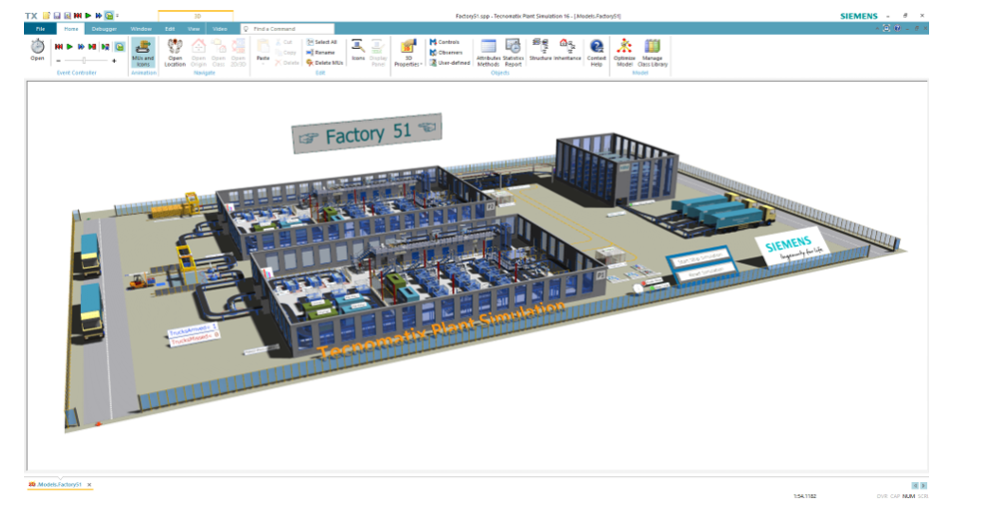
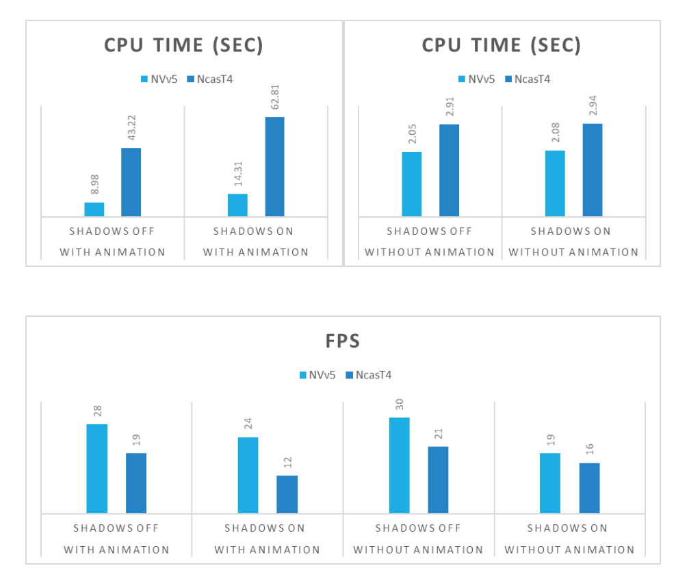

This article briefly describes the steps for running [Siemens Tecnomatix](https://www.plm.automation.siemens.com/global/en/products/tecnomatix/) on a virtual machine (VM) that's deployed on Azure. It also presents the performance results of running Siemens Tecnomatix on Azure.

Siemens Tecnomatix is a comprehensive portfolio of digital manufacturing solutions. It includes part manufacturing, assembly planning, resource planning, plant simulation, human performance, quality, production management, and manufacturing data management. Tecnomatix:

-	Provides discrete event simulation and statistical analysis capabilities to optimize material handling, logistics, machine utilization, and labor requirements. 
-	Uses powerful graphical visualization outputs for automatic bottleneck detection, analysis of throughput, and utilization of machines, resources, and buffers.
-	Includes an integrated energy analyzer that dynamically visualizes energy and that shows current, maximum, and total energy consumption.
-	Provides assembly simulation for virtual verification of all process details before the start of production.

Tecnomatix is used in the automotive, electronics, manufacturing, and aerospace industries. 

## Why deploy Tecnomatix on Azure?

- Modern and diverse compute options to align to your workload's needs
- The flexibility of virtualization without the need to buy and maintain physical hardware
- Rapid provisioning
- Typical workloads easily handled

## Architecture

:::image type="content" source="media/tecnomatix/tecnomatix.svg" alt-text="Diagram that shows an architecture for deploying Tecnomatix." lightbox="media/tecnomatix/tecnomatix.svg" border="false":::

*Download a [Visio file](https://arch-center.azureedge.net/tecnomatix.vsdx) of this
architecture.*

### Components

- [Azure Virtual Machines](https://azure.microsoft.com/services/virtual-machines) is
    used to create a Windows VM.
  - For information about deploying the VM and installing the drivers, see [Windows VMs on Azure](../../reference-architectures/n-tier/windows-vm.yml).
- [Azure Virtual Network](https://azure.microsoft.com/services/virtual-network) is
    used to create a private network infrastructure in the cloud.
  - [Network security groups](/azure/virtual-network/network-security-groups-overview) are used to restrict access to the VM.  
  -  A public IP address connects the internet to the VM.
- A physical solid-state drive (SSD) is used for storage.

## Compute sizing and drivers

Performance tests of Tecnomatix on Azure used [NVadsA10_v5](/azure/virtual-machines/nva10v5-series) and [NCasT4_v3](/azure/virtual-machines/nct4-v3-series) series VMs running Windows 10. The following table provides details about the operating system and NVIDIA drivers.

| 	|NVadsA10_v5|	NCasT4_v3|
|-|-|-|
|Operating system |	Windows 10 Enterprise|	Windows 10 Professional|
|OS architecture	|x86-64|	x86-64|
|NVIDIA driver version	|462.31|	511.65|
|Cuda version	|11.2	|11.6|

### Required drivers

To take advantage of the GPU capabilities of [NVadsA10_v5](/azure/virtual-machines/nva10v5-series) and [NCasT4_v3](/azure/virtual-machines/nct4-v3-series) series VMs, you need to install NVIDIA GPU drivers.

To use AMD CPUs on NVadsA10_v5 and NCasT4_v3 series VMs, you need to install AMD drivers.

## Tecnomatix installation

Before you install Tecnomatix, you need to deploy and connect a VM, install an eligible Windows 10 image, and install the required NVIDIA and AMD drivers.

For information about eligible Windows images, see [How to deploy Windows 10 on Azure](/azure/virtual-machines/windows/windows-desktop-multitenant-hosting-deployment) and [Use Windows client in Azure for dev/test scenarios](/azure/virtual-machines/windows/client-images).

For information about deploying the VM and installing the drivers, see [Run a Windows VM on Azure](../../reference-architectures/n-tier/windows-vm.yml).

To install Tecnomatix and get information about the installation process, see the [Siemens website](https://support.sw.siemens.com/en-US/product/297028302/downloads).

## Tecnomatix performance results

The Factory 51 model was used as a test case for these performance evaluations.

The following scenarios were tested:

- Shadows off, with animation
- Shadows off, without animation
- Shadows on, with animation
- Shadows on, without animation

For these scenarios, frames per second (FPS) and CPU time are noted in the following tables.

|Shadows off, with animation|||
|-|-|-|
||NVadsA10_v5|NCasT4_v3|
|FPS|28|19|
|CPU time (seconds)|8.98|43.22|

|Shadows off, without animation|||
|-|-|-|
||NVadsA10_v5|NCasT4_v3|
|FPS|30|21|
|CPU time (seconds)|2.05|2.91|

|Shadows on, with animation|||
|-|-|-|
||NVadsA10_v5|NCasT4_v3|
|FPS|24|12|
|CPU time (seconds)|14.31|62.81|

|Shadows on, without animation|||
|-|-|-|
||NVadsA10_v5|NCasT4_v3|
|FPS|19|16|
|CPU time (seconds)|2.08|2.94|

This information is presented in the following graphs:

 

### Additional notes about tests

The default time was set for one hour for all tests. Debug was enabled in the Console. Real-time mode was disabled.

 [Fast Forward Simulation](https://docs.plm.automation.siemens.com/content/plant_sim_help/15/plant_sim_all_in_one_html/en_US/tecnomatix_plant_simulation_help/objects_reference_help/material_flow_objects/eventcontroller/dialog_window_of_the_eventcontroller/tab_controls/start_fast_forward_simulation_eventcontroller.html) was used in these tests. Tests performed with this option enabled run without MU Animation or Icon Animation.

## Azure cost

You can use the [Azure pricing calculator](https://azure.microsoft.com/pricing/calculator) to estimate the costs for your configuration.

The times presented in the following table correspond to the times in the tables in the performance results section earlier in this article. You can use these times together with the Azure hourly rates for NVadsA10_v5 and NCasT4_v3 series VMs to calculate costs. For the current hourly costs, see [Windows Virtual Machine Pricing](https://azure.microsoft.com/pricing/details/virtual-machines/windows/#pricing).

Only model running time (CPU time) is considered for these cost calculations. Application installation time isn't considered. The costs are indicative. The actual costs depend on the size of the model.

Because the simulation is set to run for one hour, the runtime is in seconds, so the cost estimations shown here are negligible.

|VM size|	GPU partition|	CPU time (seconds)|
|-|-|-|
|NVadsA10_v5	|1/6 GPU|		2.05|
|NVadsA10_v5	|1/6 GPU|		14.31|
|NVadsA10_v5	|1/6 GPU|		2.08|
|NCasT4_v3|	1 GPU|	43.22|
|NCasT4_v3|	1 GPU|		2.91|
|NCasT4_v3|	1 GPU|		62.81|
|NCasT4_v3|	1 GPU|		2.94|

## Summary

- Tecnomatix was successfully tested on NVadsA10_v5 and NCasT4_v3 series VMs on Azure.
- Performance on NVadsA10_v5 is better, with a good FPS rate and less CPU time.
- Tecnomatix on Azure can easily handle typical workloads.

## Contributors

*This article is maintained by Microsoft. It was originally written by
the following contributors.*

Principal authors:

-   [Hari Bagudu](https://www.linkedin.com/in/hari-bagudu-88732a19) |
    Senior Manager
-   [Gauhar Junnarkar](https://www.linkedin.com/in/gauharjunnarkar) |
    Principal Program Manager
-   [Vinod
    Pamulapati](https://www.linkedin.com/in/vinod-reddy-20481a104) |
    HPC Performance Engineer

Other contributors:

-   [Mick Alberts](https://www.linkedin.com/in/mick-alberts-a24a1414) |
    Technical Writer
-   [Guy Bursell](https://www.linkedin.com/in/guybursell) | Director
    Business Strategy
-   [Sachin
    Rastogi](https://www.linkedin.com/in/sachin-rastogi-907a3b5) |
    Manager

*To see non-public LinkedIn profiles, sign in to LinkedIn.*

## Next steps

-   [GPU-optimized virtual machine
    sizes](/azure/virtual-machines/sizes-gpu)
-   [Virtual machines on Azure](/azure/virtual-machines/overview)
-   [Virtual networks and virtual machines on
    Azure](/azure/virtual-network/network-overview)
-   [Learning path: Run high-performance computing (HPC) applications on
    Azure](/learn/paths/run-high-performance-computing-applications-azure)

## Related resources

-   [Run a Windows VM on Azure](../../reference-architectures/n-tier/windows-vm.yml)
-   [HPC system and big-compute solutions](../../solution-ideas/articles/big-compute-with-azure-batch.yml)
-   [HPC cluster deployed in the cloud](../../solution-ideas/articles/hpc-cluster.yml)
