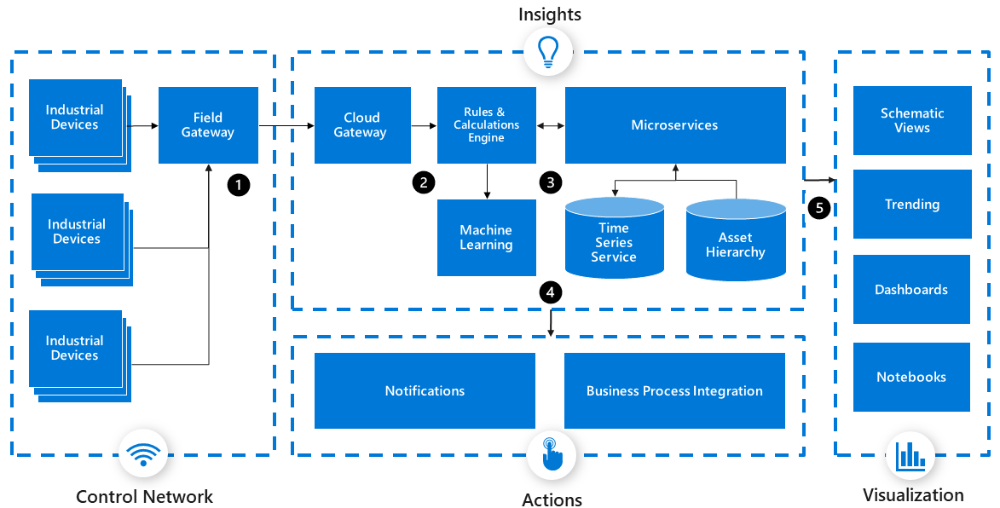
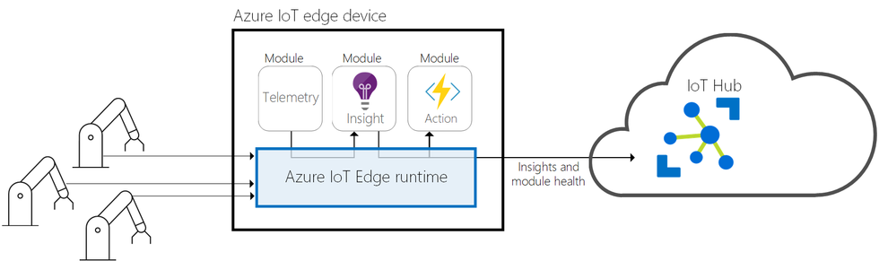

[Industrial internet of things (IIoT)](/azure/industrial-iot/overview-what-is-industrial-iot) is the application of IoT technology to the manufacturing industry. This series of articles discusses a recommended architecture for an IIoT analytics solution that uses Azure [platform as a service (PaaS)](https://azure.microsoft.com/overview/what-is-paas) components.

IIoT goes beyond moving existing manufacturing processes and tools to the cloud. A modern IIoT analytics solution uses PaaS services, machine learning (ML), and intelligent edge computing to transform industrial operations and processes.

IIoT analytics applications can support the following business practices:

- Asset monitoring
- Anomaly detection
- Overall equipment effectiveness (OEE) measurement
- Predictive maintenance
- Forecasting

The IIoT analytics architecture in these articles uses [Azure Industrial IoT](https://github.com/Azure/Industrial-IoT/blob/master/docs/deploy/readme.md) components. Not all Azure IIoT analytics solutions use all these services, and the articles mention alternatives where applicable.

## Architecture

An IIoT analytics architecture is an ingestion-only pattern that doesn't send control commands back to the industrial systems or devices. The following architectural diagram shows the core subsystems that form an IIoT analytics solution.

1. A control network of industrial devices sends data to the cloud through an edge field gateway.
1. In the cloud, the cloud gateway sends data to a rules and calculations engine.
1. The calculation engine sends data to microservices, or to machine learning. Data processing also incorporates time series and asset hierarchy data.
1. Insights trigger actions like notifications and business process integration.
1. Insights also power visualizations, including schematic views, trends, dashboards, and notebooks.

## Industrial systems and devices

An IIoT analytics solution relies on real-time and historical data from industrial devices and control systems. These devices and control systems include:

- Industrial equipment
- Programmable Logic Controllers (PLCs)
- Supervisory Control and Data Acquisition (SCADA) systems
- Manufacturing Execution Systems (MESs)
- Historians, also called process historians or operational historians

In *discrete manufacturing*, PLCs connect and control industrial equipment like factory robots and conveyor systems. Industrial protocols like Modbus might connect one or more PLCs to a central SCADA system.

*Process manufacturing* must often monitor geographically dispersed industrial equipment. Remote Terminal Units (RTUs) connect remote equipment to central SCADA systems. An RTU works well in conditions where connectivity and power supplies are intermittent and unreliable.

SCADA systems can forward and centralize data in an MES or in a data *historian*. Historians are often located in IT-controlled networks with some internet access.

Industrial equipment and SCADA systems are often located in closed *Process Control Networks (PCNs)* behind firewalls, with no direct internet access. Historians that contain industrial data from several facilities are located outside PCNs. Therefore, connecting to a historian is often easier than connecting to a SCADA, MES, or PLC. If no historian is available, connecting to an MES or SCADA system is the next logical choice.

The connection to a historian, MES, or SCADA system depends on what protocols are available and aren't blocked by firewalls. Many systems now support Industry 4.0 standards like [OPC UA](#opc-ua-standard). Older systems might support only legacy protocols like Modbus, ODBC, or SOAP. Older systems often require [protocol translation software](/samples/azure-samples/azure-iotedge-opc-flattener/azure-iot-edge-protocol-translation-sample) running on edge devices to connect to the cloud.

## Intelligent edge devices

Intelligent edge devices process some data on the devices themselves, or on a [field gateway](#field-gateways). Edge devices can operate in offline or intermittent network conditions, providing *store and forward* capabilities.

Edge workloads can:

- Run anomaly detection or ML modules to surface insights in near real-time.
- Reduce bandwidth and costs by cleaning and aggregating data locally, and sending only insights to the cloud.
- Quickly respond to factory floor events by using one module to detect events and another module to respond.
- Use a protocol translation module to convert legacy industrial protocols.

Protocol and identity translation are the most common edge workloads that IIoT analytics solutions use. The [Azure Marketplace](https://azuremarketplace.microsoft.com) offers protocol and identity translation modules and solutions from Microsoft partners.

### Azure IoT Edge

[Azure IoT Edge](https://azure.microsoft.com/services/iot-edge) devices run cloud-native workloads in built-in or custom modules, which are packaged as Docker containers. You can develop custom IoT Edge modules in several languages, with SDKs for Python, Node.js, C#, Java, and C. The [Azure IoT Edge Marketplace](https://azure.microsoft.com/blog/publish-your-azure-iot-edge-modules-in-azure-marketplace) also offers prebuilt Microsoft and partner IoT Edge modules.

The [IoT Edge runtime](/azure/iot-edge/iot-edge-runtime) provides two system modules:

- The *IoT Edge agent* module pulls down the container orchestration manifest from the cloud, so IoT Edge knows which modules to run.  Module configuration is part of the [module twin](/azure/iot-hub/iot-hub-devguide-module-twins).

- The *IoT Edge hub* module manages inter-module communication and communication between the device and [Azure IoT Hub](/azure/iot-hub/about-iot-hub) in the cloud. Messages route from one module to the next with JSON configuration. IoT Edge encrypts and streams real-time industrial data to IoT Hub by using AMQP 1.0 or MQTT 3.1.1 protocols.

The following diagram shows a typical Azure IoT Edge device architecture.

[IoT Edge automatic deployments](https://azure.microsoft.com/blog/new-enhancements-for-azure-iot-edge-automatic-deployments) can specify deployment configuration across thousands of IoT Edge devices. [Azure IoT Hub Device Provisioning Service (DPS)](/azure/iot-dps/about-iot-dps) is an IoT Hub helper service that can provision IoT Edge devices in a secure and scalable way, without human intervention.

## Field gateways

Most industrial equipment can't have software installed on it directly, so it needs a field gateway to connect to the cloud.

IoT Edge free, open source [field gateway software](https://github.com/Azure/iotedge) runs on various [supported devices](/azure/iot-edge/support) or on a virtual machine (VM). Several Microsoft partner IoT Edge gateway devices are in the [Azure Certified for IoT Device Catalog](https://catalog.azureiotsolutions.com/alldevices?filters={%2218%22:[%221%22]}).

To connect industrial equipment and systems to the cloud, you can use IoT Edge as the field gateway for:

- Protocol and identity translation.
- Edge processing and analytics.
- Adherence to network security policies like ISA 95 and ISA 99.

Proper hardware sizing of an IoT Edge gateway is important to ensure good edge module performance. For more information, see [Performance considerations](iiot-considerations.md#performance-efficiency).

### Protocol and identity translation

An IoT Edge field gateway device or VM uses [three patterns](/azure/iot-edge/iot-edge-as-gateway) for connecting devices to Azure:

- *Transparent* devices can already send messages to IoT Hub using AMQP or MQTT. Instead of sending messages directly to IoT Hub, they can send the messages to IoT Edge, which passes them on to IoT Hub. Each device has an [identity](/azure/iot-hub/iot-hub-devguide-identity-registry) and [device twin](/azure/iot-hub/iot-hub-devguide-device-twins) in Azure IoT Hub.

- The *protocol translation* pattern is also called an *opaque gateway* pattern, and connects older brownfield equipment protocols like Modbus to Azure. IoT Edge modules do the protocol conversion. Devices must provide a unique identifier to the gateway.

- The *identity translation* pattern is for devices like OPC UA PubSub or Bluetooth Low Energy (BLE) that can't communicate directly to IoT Hub. The field gateway understands the protocol the downstream devices use, provides the devices with identity, and translates the IoT Hub primitives. Each device has an identity and device twin in Azure IoT Hub.

The protocols your industrial systems use determine which patterns to use in your IIoT analytics solution. For example, if your SCADA system supports ethernet/IP, you need to use protocol translation software to convert ethernet/IP to MQTT or AMQP.

## OPC UA standard

[OPC UA](https://opcfoundation.org/about/opc-technologies/opc-ua) is an open standard that defines the connectivity, interoperability, security, and reliability of industrial devices and systems. The [OPC Foundation](https://opcfoundation.org) maintains the OPC UA standard. The OPC UA protocol is the successor to OPC Classic, DA, AE, and HDA. Microsoft is a member of the OPC Foundation, and supports OPC UA on Azure.

OPC UA bases industry and domain-specific information models on the OPC UA data model. The OPC UA infrastructure can exchange these *companion specifications* to support interoperability at the semantic level. OPC UA can use several transport protocols, including MQTT, AMQP, and UADP.

### Azure Industrial IoT

Microsoft based the following open-source [Azure Industrial IoT](https://github.com/Azure/Industrial-IoT/blob/master/docs/deploy/readme.md) components on OPC UA to implement identity translation:

- [OPC Twin](https://github.com/Azure/Industrial-IoT/tree/main/docs/api/twin) uses microservices and an Azure IoT Edge module to connect the cloud to a factory network. OPC Twin provides discovery, registration, and synchronous remote control of industrial devices through REST APIs. OPC Twin also supports the OPC HDA profile for historical data.

- [OPC Publisher](/azure/industrial-iot/overview-what-is-opc-publisher) is an Azure IoT Edge module that publishes telemetry data from OPC UA servers in OPC UA PubSub format, in both JSON and binary.

- [OPC Vault](https://github.com/Azure/azure-iiot-opc-vault-service/blob/main/docs/opcvault-services-overview.md) is a cloud microservice that can configure, register, and manage certificate lifecycle for OPC UA server and client applications.

- [Discovery Services](https://azure.github.io/Industrial-IoT/web-api/#discovery) is an Azure IoT Edge module that supports network scanning and OPC UA discovery.

See the [Microsoft Azure IIoT solution](https://azure.github.io/Industrial-IoT) on GitHub for more open-source services, REST APIs, deployment scripts, and configuration tools.

## Historian connection

A common pattern in an IIoT analytics solution is to connect to a historian database, and stream real-time data from the historian to IoT Hub. The connection method depends on which protocols are installed and not blocked by firewalls on the historian.

| Historian protocol | Connection options |
|----------------------------|---------------------------|
| OPC UA |• Use Azure IoT Edge, OPC Publisher, OPC Twin, and OPC Vault to send OPC UA data over MQTT to IoT Hub. • Use a Microsoft partner Azure IoT Edge OPC UA module to send OPC UA data over MQTT to IoT Hub.|
| OPC DA |• Use Microsoft partner software to convert OPC DA to OPC UA and send OPC UA data to IoT Hub over MQTT. • Use OPC Publisher, OPC Twin, and OPC Vault to send OPC UA data over MQTT to IoT Hub.|
| Web service |• Use a custom IoT Edge HTTP module to poll the web service. • Use Microsoft partner software that converts HTTP to MQTT 3.1.1 or AMQP 1.0.
 |
| MQTT 3.1.1 that can publish MQTT messages | • Connect the historian directly to IoT Hub using MQTT. • Connect the historian to IoT Edge as a leaf device in the transparent gateway pattern.|
| Other |• Use a custom Azure IoT Edge module. • Use Microsoft partner software to convert to MQTT 3.1.1 or AMQP 1.0.|

Historian vendors such as [PI Integrator for Azure](https://techsupport.osisoft.com/Products/PI-Integrators/PI-Integrator-for-Microsoft-Azure/Overview) also provide first-class capabilities to send data to Azure.

After you establish real-time data streaming between the historian and IoT Hub, export the historian's historical data and import it into the IIoT analytics solution. For more information, see [Historical data ingestion](iiot-services.md#historical-data-ingestion).

## Cloud gateway

A cloud gateway provides a cloud hub for devices and field gateways to connect securely to the cloud and send data. The cloud gateway also provides device management capabilities.

You can use [Azure IoT Hub](https://azure.microsoft.com/services/iot-hub) as a hosted cloud service to provide secure connectivity, event ingestion, bidirectional communication, and device management. IoT Hub uses cloud-based REST APIs that can combine with Azure Industrial IoT components to control your industrial devices.

IoT Hub supports the following [protocols](/azure/iot-hub/iot-hub-devguide-protocols):

- MQTT 3.1.1
- MQTT over WebSockets
- AMQP 1.0
- AMQP over WebSockets
- HTTPS

An industrial device or system that supports any of the preceding protocols can send data directly to IoT Hub. Most industrial environments don't allow this direct connection, because of firewalls and network security policies.

In these cases, you can [install an IoT Edge field gateway in a DMZ](../../reference-architectures/dmz/secure-vnet-dmz.yml) between the PCN and the internet. For more information, see [Security considerations](iiot-considerations.md#security).
  
## Contributors

*This article is maintained by Microsoft. It was originally written by the following contributors.* 

Principal author:

 - [Keith Hill](https://www.linkedin.com/in/keith-hill-072060102/) | Senior PM Manager

*To see non-public LinkedIn profiles, sign in to LinkedIn.*

## Next steps

> [!div class="nextstepaction"]
> [Services in an Azure Industrial IoT (IIoT) analytics solution](iiot-services.md)

## Related resources

- [Extract actionable insights from IoT data](../../industries/manufacturing/extract-insights-iot-data.yml)
- [IoT analytics with Azure Data Explorer](../../solution-ideas/articles/iot-azure-data-explorer.yml)
- [Industry specific Azure IoT reference architectures](../../reference-architectures/iot/industry-iot-hub-page.md)
- [Data analysis workloads for regulated industries](/azure/architecture/example-scenario/data/data-warehouse)
- [IoT and data analytics in manufacturing](../../example-scenario/data/big-data-with-iot.yml)
- [Architectural approaches for IoT in a multitenant solution](../multitenant/approaches/iot.md)