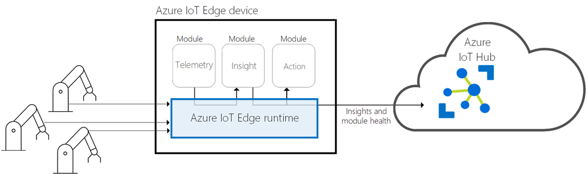

[Industrial internet of things (IIoT)](/azure/industrial-iot/overview-what-is-industrial-iot) is the application of IoT technology to the manufacturing industry. This article series describes a recommended architecture for an IIoT analytics solution that uses Azure [platform as a service (PaaS)](https://azure.microsoft.com/overview/what-is-paas) components.

IIoT goes beyond moving existing processes and tools to the cloud. A modern IIoT analytics solution transforms operations, embraces PaaS services, and uses the power of machine learning (ML) and intelligent edge computing to optimize industrial processes.

The following roles participate in an IIoT analytics solutions:

- The *plant manager* is responsible for all manufacturing plant operations, production, and administrative tasks.
- A *production manager* is responsible for the production of a certain number of components.
- A *process engineer* designs, implements, controls, and optimizes industrial processes.
- An *operations manager* oversees overall operational efficiency in terms of cost reduction, process time, and process improvements.
- A *data scientist* builds and trains predictive ML models using historical industrial telemetry.

IIoT analytics support a variety of applications that provide:

- Asset monitoring
- Process dashboards
- Overall equipment effectiveness (OEE)
- Predictive maintenance
- Forecasting

## Architecture

The following architectural diagram shows the core subsystems that form an IIoT analytics solution. This analytics architecture represents an ingestion-only pattern. No control commands are sent back to the industrial systems or devices.

This architecture consists of a number of subsystems and services that use [Azure Industrial IoT](https://github.com/Azure/Industrial-IoT/blob/master/docs/deploy/readme.md) components. Your solution might not use all these services, or might use other services. The articles list alternative service options where applicable.

> [!IMPORTANT]
> Any preview services are governed by [Supplemental Terms of Use for Microsoft Azure Previews](https://azure.microsoft.com/support/legal/preview-supplemental-terms).

## Industrial systems and devices

An IIoT analytics solution relies on real-time and historical data from industrial devices and control systems in manufacturing facilities. Devices and control systems include Programmable Logic Controllers (PLCs), industrial equipment, Supervisory Control and Data Acquisition (SCADA)  systems, Manufacturing Execution Systems (MES), and process historians. This article series includes guidance for connecting to all these systems.

In process manufacturing, industrial equipment like flow monitors and pumps is often geographically dispersed and must be monitored remotely. Remote Terminal Units (RTUs) connect remote equipment to a central SCADA system. RTUs work well in conditions where connectivity is intermittent, and no reliable continuous power supply exists.

In discrete manufacturing, industrial equipment like factory robots and conveyor systems are connected and controlled by a PLC. One or more PLCs can be connected to a central SCADA system by using industrial protocols such as Modbus.

Sometimes, the data from SCADA systems is forwarded and centralized in an MES or a *historian* program, also called a *process historian* or *operational historian*. These historians are often located in IT-controlled networks and have some access to the internet.

Industrial equipment and SCADA systems are often in a closed Process Control Network (PCN) behind one or more firewalls, with no direct access to the internet. Historians often contain industrial data from multiple facilities and are located outside of a PCN. So, connecting to a historian is often easier than connecting to a SCADA, MES, or PLC. If no historian is available, then connecting to an MES or SCADA system is the next logical choice.

The connection to the historian, MES, or SCADA system depends on what protocols are available on that system. Many systems now include Industry 4.0 standards such as OPC UA. Older systems might only support legacy protocols such as Modbus, ODBC, or SOAP. Such system usually require [protocol translation](/samples/azure-samples/azure-iotedge-opc-flattener/azure-iot-edge-protocol-translation-sample) software running on an intelligent edge device.

## Intelligent edge devices and workloads

Intelligent edge devices process some data on the device itself or on a field gateway. [Azure IoT Edge](https://azure.microsoft.com/services/iot-edge) uses built-in, custom or third-party modules to run cloud-native workloads directly on IoT devices. For example:

- To respond to emergencies as quickly as possible, you can run anomaly detection or ML modules in tight control loops at the edge.
- To reduce bandwidth costs and avoid transferring terabytes of raw data, you can clean and aggregate the data locally, then send only the insights to the cloud for analysis.
- To convert legacy industrial protocols, you can develop a custom module or purchase a third-party protocol translation module.
- To quickly respond to an event on the factory floor, you can use an edge module to detect the event and another module to respond to it.

Protocol and identity translation are the most common edge workloads used within an IIoT analytics solution.

IoT Edge runs edge workloads as Docker container modules. You can develop modules in several languages, with SDKs provided for Python, Node.js, C#, Java, and C. You can get prebuilt IoT Edge modules from Microsoft and third-party partners from the [Azure IoT Edge Marketplace](https://azure.microsoft.com/blog/publish-your-azure-iot-edge-modules-in-azure-marketplace).

Microsoft and our partners have made available on the Azure Marketplace a number of edge modules, which can be used in your IIoT analytics solution.  In the future, expect to see other workloads such as closed loop control using edge ML models.

### Field gateways

Most industrial equipment can't have software installed on it, so needs a field gateway to connect to the cloud.

[Azure IoT Edge](/azure/iot-edge/about-iot-edge) is free, open source [field gateway software](https://github.com/Azure/iotedge) that runs on a variety of [supported devices](/azure/iot-edge/support) or a virtual machine (VM). To connect industrial equipment and systems to the cloud, use IoT Edge as the field gateway for:

- Protocol and identity translation
- Edge processing and analytics
- Adherance to network security policies like ISA 95 and ISA 99

IoT Edge encrypts and streams real-time industrial data to [Azure IoT Hub](/azure/iot-hub/about-iot-hub) by using AMQP 1.0 or MQTT 3.1.1 protocols. IoT Edge can operate in offline or intermittent network conditions, providing *store and forward* capabilities.

The [IoT Edge runtime](/azure/iot-edge/iot-edge-runtime) provides two system modules:

- The *IoT Edge agent* module pulls down the container orchestration specification manifest from the cloud, so IoT Edge knows which modules to run.  Module configuration is provided as part of the [module twin](/azure/iot-hub/iot-hub-devguide-module-twins).

- The *IoT Edge hub* module manages the communication from the device to Azure IoT Hub, as well as inter-module communication. Messages are routed from one module to the next by using JSON configuration.

[Azure IoT Edge automatic deployments](https://azure.microsoft.com/blog/new-enhancements-for-azure-iot-edge-automatic-deployments) can specify a standing configuration for new or existing devices. This provides a single location for deployment configuration across thousands of Azure IoT Edge devices.

A number of third-party IoT Edge gateway devices are available from the [Azure Certified for IoT Device Catalog](https://catalog.azureiotsolutions.com/alldevices?filters={%2218%22:[%221%22]}).

Proper hardware sizing of an IoT Edge gateway is important to ensure good edge module performance. For more information, see [Performance considerations](iiot-considerations.md#performance-considerations).

### Gateway patterns

There are [three patterns for connecting your devices](/azure/iot-edge/iot-edge-as-gateway) to Azure via an IoT Edge field gateway or VM: *transparent*, *protocol translation*, and *identity translation*.

Which of these patterns to use in your IIoT analytics solution is determined by which protocol your industrial systems use. For example, if your SCADA system supports ethernet/IP, you need to use protocol translation software to convert ethernet/IP to MQTT or AMQP. For more information, see [Connecting to historians](#connecting-to-historians).

You can provision IoT Edge gateways at scale by using the [Azure IoT Hub Device Provisioning Service (DPS)](/azure/iot-dps/about-iot-dps). DPS is a helper service for IoT Hub that enables just-in-time provisioning to IoT Hub without requiring human intervention. DPS can provision millions of devices in a secure and scalable manner.

#### Transparent

Devices already have the capability to send messages to IoT Hub using AMQP or MQTT. Instead of sending the messages directly to IoT Hub, they can send the messages to IoT Edge, which passes them on to IoT Hub. Each device has an [identity](/azure/iot-hub/iot-hub-devguide-identity-registry) and [device twin](/azure/iot-hub/iot-hub-devguide-device-twins) in Azure IoT Hub.

#### Protocol translation

This pattern is also called an *opaque gateway* pattern, and is used to connect older brownfield equipment protocols like Modbus to Azure. Deployed IoT Edge modules do the protocol conversion. Devices must provide a unique identifier to the gateway.

#### Identity translation

In this pattern, devices like OPC UA Pub/Sub or BLE devices can't cannot communicate directly to IoT Hub. The gateway understands the protocol the downstream devices use, provides the devices with identity, and translates the IoT Hub primitives. Each device has an identity and device twin in Azure IoT Hub.

## OPC UA

[OPC UA](https://opcfoundation.org/about/opc-technologies/opc-ua/) is the successor to [OPC Classic](https://opcfoundation.org/about/opc-technologies/opc-classic/) (OPC DA, AE, HDA). The OPC UA standard is maintained by the [OPC Foundation](https://opcfoundation.org/). Microsoft has been a member of the OPC Foundation since 1996 and has supported OPC UA on Azure since 2016.

Industry and domain-specific *Information Models* can be created based on the OPC UA *Data Model*. The specifications of such Information Models (also called *industry standard models* since they typically address a dedicated industry problem) are called Companion Specifications. The synergy of the OPC UA infrastructure to exchange such industry information models enables interoperability at the semantic level. OPC UA can use a number of transport protocols including MQTT, AMQP, and UADP.

Microsoft has developed open source [Azure Industrial IoT](https://github.com/Azure/Industrial-IoT/blob/master/docs/deploy/readme.md) components, based on OPC UA, which implement identity translation pattern:

- [OPC Twin](https://github.com/Azure/azure-iiot-opc-twin-module) consists of microservices and an Azure IoT Edge module to connect the cloud and the factory network. OPC Twin provides discovery, registration, and synchronous remote control of industrial devices through REST APIs.
- [OPC Publisher](/azure/industrial-iot/overview-what-is-opc-publisher) is an Azure IoT Edge module that connects to existing OPC UA servers and publishes telemetry data from OPC UA servers in OPC UA PubSub format, in both JSON and binary.
- [OPC Vault](https://github.com/Azure/azure-iiot-opc-vault-service/blob/main/docs/opcvault-services-overview.md) is a microservice that can configure, register, and manage certificate lifecycle for OPC UA server and client applications in the cloud.
- [Discovery Services](https://azure.github.io/Industrial-IoT/modules/discovery.html) is an Azure IoT Edge module that supports network scanning and OPC UA discovery.

The Microsoft Azure IIoT solution also contains a number of services, REST APIs, deployment scripts, and configuration tools that you can integrate into your IIoT analytics solution. These are open source and available on [GitHub](https://azure.github.io/Industrial-IoT/).

## Connecting to historians

A common pattern when developing an IIoT analytics solution is to connect to a process historian and stream real-time data from the historian to Azure IoT Hub. How this is done, will depend on which protocols are installed and accessible (that is, not blocked by firewalls) on the historian.

| Protocol Available on Historian | Options |
|----------------------------|---------------------------|
| OPC UA | 
- Use Azure IoT Edge, along with OPC Publisher, OPC Twin, and OPC Vault, to send OPC UA data over MQTT to IoT Hub. OPC Twin also has support for OPC UA HDA profile, useful for obtaining historical data. - Use a third-party Azure IoT Edge OPC UA module to send OPC UA data over MQTT to IoT Hub.
 |
| OPC DA | 
- Use third-party software to convert OPC DA to OPC UA and send OPC UA data to IoT Hub over MQTT. Or use OPC Publisher, OPC Twin and OPC Vault to send OPC UA data over MQTT to IoT Hub. |
| Web Service | 
- Use a custom Azure IoT Edge HTTP module to poll the web service. - Use third-party software that supports HTTP to MQTT 3.1.1 or AMQP 1.0.
 |
| MQTT 3.1.1 (Can publish MQTT messages) | 
- Connect historian directly to Azure IoT Hub using MQTT. - Connect historian to Azure IoT Edge as a leaf device. See [Transparent Gateway](#gateway-patterns) pattern.
 |
| Other | 
- Use a custom Azure IoT Edge module. - Use third-party software to convert to MQTT 3.1.1 or AMQP 1.0.
 |

A number of Microsoft partners have developed protocol and identity translation modules or solutions that are available on the [Azure Marketplace](https://azuremarketplace.microsoft.com/).

Some historian vendors also provide first-class capabilities to send data to Azure.

|Historian|Options|
|--------------|-----------------------|
|OSIsoft PI|[PI Integrator for Azure](https://techsupport.osisoft.com/Products/PI-Integrators/PI-Integrator-for-Microsoft-Azure/Overview)|
|Honeywell|[Uniformance Cloud Historian](https://www.honeywellprocess.com/en-US/online_campaigns/uniformance_cloud_historian/Pages/index.html)|

Once real time data streaming has been established between your historian and Azure IoT Hub, it is important to export your historian's historical data and import it into your IIoT analytics solution. For guidance on how to accomplish this, see [Historical Data Ingestion](./iiot-services.md#historical-data-ingestion).

## Cloud gateway

A cloud gateway provides a cloud hub for devices and field gateways to connect securely to the cloud and send data. It also provides device management capabilities. For the cloud gateway, we recommend Azure IoT Hub. IoT Hub is a hosted cloud service that ingests events from devices and IoT Edge gateways. IoT Hub provides secure connectivity, event ingestion, bidirectional communication, and device management. When IoT Hub is combined with the Azure Industrial IoT components, you can control your industrial devices using cloud-based REST APIs.

IoT Hub supports the following [protocols](/azure/iot-hub/iot-hub-devguide-protocols):

- MQTT 3.1.1,
- MQTT over WebSockets,
- AMQP 1.0,
- AMQP over WebSockets, and
- HTTPS.

If the industrial device or system supports any of these protocols, it can send data directly to IoT Hub. In most industrial environments, this is not permissible because of PCN firewalls and network security policies (ISA 95, ISA 99). In such cases, an Azure IoT Edge field gateway can be installed in a [DMZ](../../reference-architectures/dmz/secure-vnet-dmz.yml) between the PCN and the Internet.

## Next steps

To learn the services recommended for this architecture, continue reading the series with [Services in an IIoT analytics solution](./iiot-services.md).
