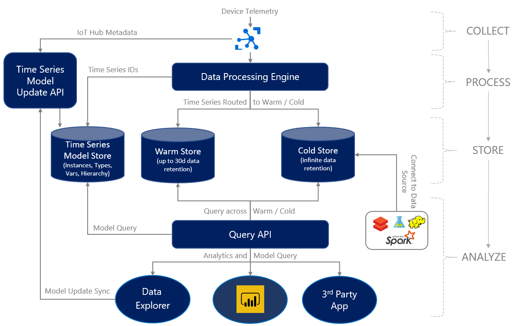

This article discusses data analysis and visualizations in an [Azure industrial IoT (IIoT) analytics](./iiot-architecture.yml) solution. There are several ways to analyze, query, and present industrial data by using visualizations and dashboards. You can use these tools to evaluate solution effectiveness, explore trends, and derive insights. The insights you gain can power streaming analytics calculations to determine conditions, or logic apps to take actions.

Your IIoT analytics solution might use some or all of the following options, depending on how you need to use your data:

- Ad-hoc analytics and trend visualizations with [Azure Data Explorer dashboards (Preview)](/azure/data-explorer/azure-data-explorer-dashboards).
- Power BI visualizations and dashboards. Connect to your Azure IIoT data by using the [Azure Data Explorer connector for Power BI connector](/azure/data-explorer/power-bi-connector). Use Power BI to combine external data from your Enterprise Resource Planning (ERP), Enterprise Asset Management (EAM), or other line-of-business systems with your IIoT data.
- Custom web applications, for advanced visualizations like schematic views and process graphics.
- [Microsoft and GitHub notebooks](https://visualstudio.microsoft.com/vs/features/notebooks-at-microsoft) that work with open-source tools like Jupyter Notebook and [Matplotlib](https://matplotlib.org).

## Architecture

The following diagram shows how analytics and visualization tools collect, process, store, and analyze data over warm, cold, and historical sources.

1. Devices send telemetry data to the cloud through Azure IoT Hub.
1. IoT Hub sends the device telemetry to a data processing engine, and directs time series metadata to the time series model store.
1. The data processing engine routes data into warm storage and cold storage, and sends time series IDs to the time series model store.
1. The query API can query over the warm storage, cold storage, and time series data.
1. Query results feed into data explorer dashboards, visualizations, and third-party apps.
1. Cold storage data also fuels advanced analysis tools and machine learning.
1. Telemetry metadata and query results continually update the time series model.

## Azure Data Explorer dashboards (Preview)

[Azure Data Explorer](https://azure.microsoft.com/services/data-explorer) is a fast and highly scalable data exploration service for log and telemetry data. Azure Data Explorer is ideally suited to explore, analyze, and visualize raw data from industrial systems.

Azure Data Explorer provides a web application, the [Web UI](/azure/data-explorer/web-query-data), where you can run queries and build dashboards. Azure Data Explorer also integrates with other dashboard services like Power BI.

## Power BI

Dashboards that show factory or plant *key progress indicators (KPIs)* and visualizations can be more helpful than viewing the raw data. [Power BI](https://powerbi.microsoft.com/) is an ideal visualization solution. You can [use the Azure Data Explorer connector for Power BI](/azure/data-explorer/power-bi-connector) to connect to industrial data stored in Azure Data Explorer. Power BI provides powerful reporting and dashboard capabilities that let you share insights and results across your organization. Power BI has desktop, web, and mobile interfaces.

By connecting your data to Power BI, you can:

- Perform correlations with other data sources that Power BI supports, and use many different data visualization options.
- Create Power BI dashboards and reports that use your Azure Data Explorer data, and share them with your organization.
- Unlock data interoperability scenarios simply and easily, with features like suggested Q&A and automatic insights.
- Interact with Azure Data Explorer data by using the powerful Advanced Query Editor in Power BI.

## Custom web application

For advanced visualizations, such as schematic views or process graphics, you can create a custom web application. A custom web application can give you a single pane of glass (SPOG) user experience and other advanced capabilities. You can create applications such as:

- Simplified and integrated authoring experiences for Stream Analytics jobs and Azure Logic Apps.
- Process or custom visuals that display real-time data.
- Web apps with [embedded Power BI dashboards](/power-bi/collaborate-share/service-embed-secure) that display KPIs and external data.
- Visual alert displays using SignalR.
- Administrative applications for adding or removing solution users.

You can create a single-page application (SPA) by using:

- JavaScript, HTML5, and CSS3.
- [MSAL.js](/graph/toolkit/providers/msal) to sign in users and get tokens to use with the Microsoft Graph.
- [Azure App Services Web Apps](https://azure.microsoft.com/services/app-service/web) to host the web application.
- [Power BI embedded analytics](/power-bi/developer/embedded/embedded-analytics-power-bi) to embed your Power BI content such as reports and dashboards in the web application.
- [Azure Maps](/azure/azure-maps) to render map visualizations.
- [Microsoft Graph SDK for JavaScript](https://developer.microsoft.com/graph/blogs/microsoft-graph-sdk-for-javascript-2-0-0) to integrate with Microsoft 365.

## Notebooks

[Jupyter Notebook](https://jupyter.org) is an open-source web application for creating and sharing documents that contain live code, equations, visualizations, persistent data, and narrative text. Jupyter Notebook supports data sources including Azure Data Explorer, Azure Monitor logs, and Application Insights.

For more information, see:

- [Microsoft and GitHub notebooks](https://visualstudio.microsoft.com/vs/features/notebooks-at-microsoft) 
- [Use a Jupyter Notebook and kqlmagic extension to analyze data in Azure Data Explorer](/azure/data-explorer/kqlmagic).

## Next steps

> [!div class="nextstepaction"]
> [Considerations for an Azure Industrial IoT (IIoT) analytics solution](iiot-considerations.md)

