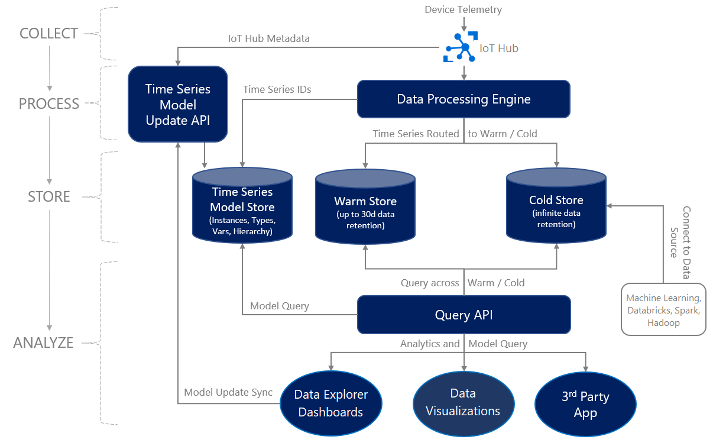

# Data analysis in Azure Industrial IoT analytics solution

This article shows you how to visualize the data collected by the [Azure Industrial IoT analytics solution](./iiot-architecture.md). You can easily look for data trends using visual elements and dashboards, and use these trends to analyze the effectiveness of your solution.

## Visualization

There are many options for visualizing your industrial data. Your IIoT analytics solution may use some or all of these options, depending on the personas using your solution.

- For Process Engineers and other personas looking to perform ad-hoc analytics and trend visualizations, we recommend using [Azure Time Series Insights explorer](/azure/time-series-insights/concepts-ux-panels).
- For Plant Managers and other personas wanting to develop dashboards, we recommend using Power BI, and connecting Power BI with your data in Time Series Insights using the [Power BI connector](/azure/time-series-insights/concepts-power-bi). Using Power BI, these users can also combine external data from your ERP, EAM, or other systems with the data in Time Series Insights.
- For advanced visualizations, such as schematic views and process graphics, we recommend a custom web application.
- For Data Scientists interested in using open source data analysis and visualization tools such as Python, Jupyter Notebooks, and [*Matplotlib*](https://matplotlib.org/), we recommend [Azure Notebooks](https://notebooks.azure.com/).

## Data Trends

The Azure Time Series Insights explorer is a web application that provides powerful data trending and visualization capabilities that make it simple to explore and analyze billions of IIoT events simultaneously.

Time Series Insights Explorer is ideally suited to personas, such as a Process Engineer or Operations Manager, who want to explore, analyze and visualize the raw data coming from your industrial systems. The insights gained from exploring the raw data can help build Azure Stream Analytics jobs, which look for conditions in the data or perform calculations over the data.

The Azure Time Series Insights explorer allows you to seamlessly explore both warm and cold data, or your historical data, as demonstrated in the following figure.

Azure Time Series Insights explorer has a powerful yet intuitive user interface, as shown below.

Key features of Azure Time Series Insights explorer:

1. **Environment panel:** Displays all your Azure Time Series Insights environments.
1. **Navigation bar:** Lets you switch between the Analyze and Model pages.
1. **Hierarchy tree and search panel:** Lets you select and search for specific data elements to be charted.
1. **Time series well:** Shows all your currently selected data elements.
1. **Chart panel:** Displays your current working chart.
1. **Timeline:** Lets you modify your working time span.
1. **App bar:** Contains your user management options (such as current tenant), and allows you to change them and language settings.

## Dashboards

For some personas, such as a Plant Manager, dashboards containing factory or plant KPIs and visualizations are more important than viewing the raw data. For such users, we recommend [Power BI](https://powerbi.microsoft.com/) as the visualization solution. You can [connect](/azure/time-series-insights/concepts-power-bi) Power BI with your data stored in Time Series Insights, providing you with powerful reporting and dashboard capabilities over your industrial data, and allowing you to share insights and results across your organization.

By connecting your data to Power BI, you can:

- Perform correlations with other data sources supported by Power BI and access a host of different data visualization options.
- Create Power BI dashboards and reports using your Time Series Insight data and share them with your organization.
- Unlock data interoperability scenarios in a simple, easy-to-use manner, and get to insights faster than ever.
- Modify Time Series Insights data within Power BI using the powerful Advanced Editor.

## Schematic Views

For advanced visualizations, such as schematic views or process graphics, you may require a custom web application. A custom web application also allows you to provide a *single pane of glass* user experience and other advanced capabilities including:

- a simplified and integrated authoring experience for Azure Stream Analytics jobs and Logic Apps,
- displaying real-time data using process or custom visuals,
- displaying KPIs and external data with embedded Power BI dashboards,
- displaying visual alerts using SignalR, and
- allowing administrators to add/remove users from the solution.

We recommend building a Single Page Application (SPA) using:

- JavaScript, HTML5, and CSS3
- [Time Series Insights JavaScript SDK](https://tsiclientsample.azurewebsites.net/) for displaying process or custom visuals with data from Time Series Insights
- [MSAL.js](/graph/toolkit/providers/msal) to sign in users and acquire tokens to use with the Microsoft Graph
- [Azure App Services Web Apps](https://azure.microsoft.com/services/app-service/web/) to host the web application
- Power BI to [embed Power BI dashboards](/power-bi/collaborate-share/service-embed-secure) directly in the web app
- [Azure Maps](/azure/azure-maps/) to render map visualizations
- [Microsoft Graph SDK for JavaScript](https://developer.microsoft.com/graph/blogs/microsoft-graph-sdk-for-javascript-2-0-0/) to integrate with Microsoft 365

## Notebooks

One of the advantages of moving operational data to the cloud is to take advantage of modern big-data tool sets.  One of the most common tools used by Data Scientists for ad-hoc analysis of big data are [Jupyter Notebooks](https://notebooks.azure.com/). [Jupyter (formerly IPython)](/azure/notebooks/azure-notebooks-overview) is an open-source project that lets you easily combine Markdown text, executable code, persistent data, graphics, and visualizations onto a single, sharable canvas - *the notebook*. Production Engineers should also consider learning Jupyter Notebooks technology to assist in analysis of plant events, finding correlations, and so on.  Jupyter Notebooks provide support for Python 2/3, R, and F# programming languages and can connect to your Time Series Insights data stored Azure storage.

## Next steps

Now that you have learned the architecture of an Azure IIoT analytics solution, read [the architectural considerations](./iiot-considerations.md) that improve the resiliency and efficiency of this architecture.
