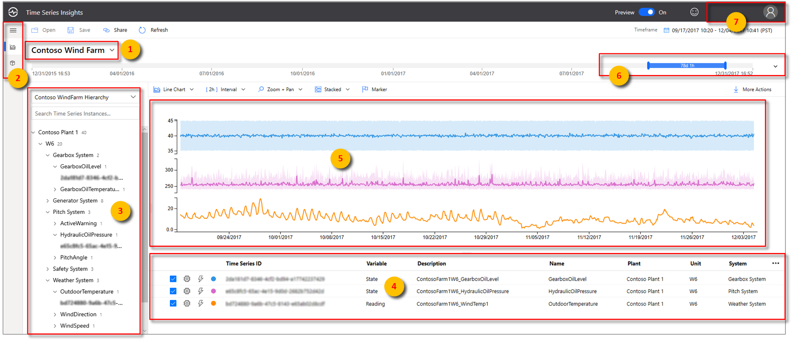
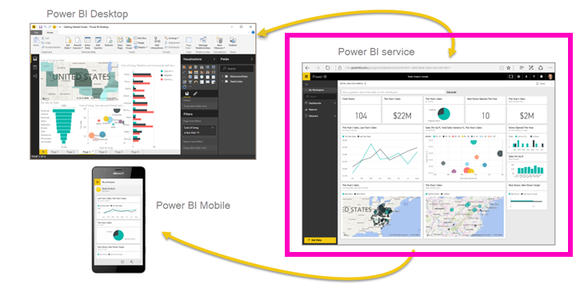

# Azure Industrial IoT Analytics Guidance

This reference architecture shows a recommended architecture for an Industrial IoT (IIoT) Analytics Solution on Azure using PaaS (platform-as-a-service) components.
An IIoT Analytics Solution can be used to build a variety of applications that provide:

- Asset monitoring
- Process dashboards
- OEE (overall equipment effectiveness)
- Predictive maintenance
- Forecasting

The following architecture diagram shows the core subsystems that comprise an IIoT Analytics Solution.

> [!IMPORTANT]
> This architecture represents an ingestion-only pattern. No control commands are sent back to the industrial systems or devices.

The IIoT Analytics Solution relies on real time and historical data from industrial devices and control systems located in discrete and process manufacturing facilities. These include PLCs (Programmable Logic Controller), industrial equipment, SCADA (Supervisory Control and Data Acquisition) systems, MES (Manufacturing Execution System) and Process Historians. This reference architecture includes guidance for connecting to all these systems.

A modern IIoT Analytics Solution goes beyond moving existing industrial processes and tools to the cloud. It involves transforming your operations processes, embracing PaaS services, and leveraging the power of machine learning and the intelligent edge to optimize industrial processes.

## Personas

This architecture includes example personas to illustrate who would use the solution and how the solution would be used.

- Plant Manager - responsible for the entire operations, production and administrative tasks of the Plant
- Production Manager - responsible for production of a certain number of components
- Process Engineer - responsible for designing, implementing, controlling and optimizing industrial processes
- Operations Manager - responsible for overall efficiency of operation in terms of Cost Reduction, Process Time, Process improvement etc.
- Data Scientist – responsible for building and training predictive Machine Learning models using historical industrial telemetry 

## Architecture

The architecture consists of a number of subsystems and services and makes use of the [Azure Industrial IoT](https://github.com/Azure/Industrial-IoT/blob/master/docs/deploy/readme.md) components. Your own solution may not use all these services or may have additional services. This architecture also lists alternative service options, where applicable.

> [!IMPORTANT]
> This reference architecture includes some services marked as "Preview" or "Public Preview".  Preview services are governed by [Supplemental Terms of Use for Microsoft Azure Previews](https://azure.microsoft.com/support/legal/preview-supplemental-terms/).

## Industrial Systems and Devices

In process manufacturing, industrial equipment (e.g. flow monitors, pumps, etc.) is often geographically dispersed and must be monitored remotely. Remote Terminal Units (RTUs) connect remote equipment to a central SCADA system. RTUs work well in conditions where connectivity is intermittent, and no reliable continuous power supply exists.

In discrete manufacturing, industrial equipment (e.g. factory robots, conveyor systems, etc.) are connected and controlled by a PLC. One or more PLCs may be connected to a central SCADA system using protocols such as Modbus or other industrial protocols.

In some cases, the data from SCADA systems is forwarded and centralized in an MES or Historian software (also known as Process Historian or Operational Historian). These Historians are often located in IT controlled networks and have some access to the Internet.  

Frequently, industrial equipment and SCADA systems are in a closed Process Control Network (PCN), behind one or more firewalls, with no direct access to the Internet. Historians often contain industrial data from multiple facilities and are located outside of a PCN. Therefore, connecting to a Historian is often the path of least resistance, rather than connecting to a SCADA, MES or PLC. If a Historian is not available, then connecting to an MES or SCADA system would be the next logical choice.

The connection to the Historian, MES or SCADA system will depend on what protocols are available on that system. Many systems now include Industry 4.0 standards such as OPC UA. Older systems may only support legacy protocols such as Modbus, ODBC, or SOAP. If so, you will most likely require [Protocol Translation](https://docs.microsoft.com/samples/azure-samples/azure-iotedge-opc-flattener/azure-iot-edge-protocol-translation-sample/) software running on an Intelligent Edge device.

## Intelligent Edge

Intelligent edge devices perform some data processing on the device itself or on a field gateway. In most industrial scenarios, the industrial equipment cannot have additional software installed on it. Therefore, a field gateway is required to connect the industrial equipment to the cloud.

### Azure IoT Edge

To connect industrial equipment and systems to the cloud , we recommend using [Azure IoT Edge](https://docs.microsoft.com/azure/iot-edge/about-iot-edge) as the field gateway for:

- Protocol and identity translation;
- Edge processing and analytics; and
- Adhering to network security policies (ISA 95, ISA 99).

Azure IoT Edge is a free, [open source](https://github.com/Azure/iotedge) field gateway software that runs on a variety of [supported hardware](https://docs.microsoft.com/azure/iot-edge/support) devices or a virtual machine.

IoT Edge allows you run edge workloads as Docker container modules. The modules can be developed in several languages, with SDKs provided for Python, Node.js, C#, Java and C.  Prebuilt Azure IoT Edge modules from Microsoft and third-party partners are available from the [Azure IoT Edge Marketplace](https://azure.microsoft.com/blog/publish-your-azure-iot-edge-modules-in-azure-marketplace/).

Real time industrial data is encrypted and streamed through Azure IoT Edge to [Azure IoT Hub](https://docs.microsoft.com/azure/iot-hub/about-iot-hub) using AMQP 1.0 or MQTT 3.1.1 protocols.  IoT Edge can operate in offline or intermittent network conditions providing "store and forward" capabilities.

There are two system modules that are provided as part of IoT Edge runtime.

- The **EdgeAgent** module is responsible for pulling down the container orchestration specification (manifest) from the cloud so that it knows which modules to run.  Module configuration is provided as part of the [module twin](https://docs.microsoft.com/azure/iot-hub/iot-hub-devguide-module-twins).
- The **EdgeHub** module manages the communication from the device to the Azure IoT Hub, as well as the inter-module communication.  Messages are routed from one module to the next using JSON configuration.

[Azure IoT Edge automatic deployments](https://azure.microsoft.com/blog/new-enhancements-for-azure-iot-edge-automatic-deployments/) can be used to specify a standing configuration for new or existing devices, providing a single location for deployment configuration across thousands of Azure IoT Edge devices.  

A number of third-party [IoT Edge gateway devices](https://catalog.azureiotsolutions.com/alldevices?filters={%2218%22:[%221%22]}) //TBD:LINK are available from the Azure Certified for IoT Device Catalog.

> [!IMPORTANT]
> Proper hardware sizing of an IoT Edge gateway is important to ensure edge module performance. See Performance Considerations later in this document.

## Gateway Patterns

There are [3 patterns for connecting your devices](https://docs.microsoft.com/azure/iot-edge/iot-edge-as-gateway) to Azure via an IoT Edge field gateway (or virtual machine):

1. **Transparent** - Devices already have the capability to send messages to the IoT Hub using AMQP or MQTT.  Instead of sending the messages directly to the IoT Hub, they instead send the messages to IoT Edge, which in turn passes them on to the IoT Hub.  Each device has an [identity](https://docs.microsoft.com/azure/iot-hub/iot-hub-devguide-identity-registry) and [device twin](https://docs.microsoft.com/azure/iot-hub/iot-hub-devguide-device-twins) in the Azure IoT Hub.

1. **Protocol Translation** - Also known as an opaque gateway pattern.  This pattern is often used to connect older brownfield equipment (e.g. Modbus) to Azure. Modules are deployed to Azure IoT Edge to perform the protocol conversion. Devices must provide a unique identifier to the gateway. 

1. **Identity Translation** - In this pattern, devices cannot communicate directly to the IoT Hub (e.g. OPC UA Pub/Sub, BLE devices). The gateway is smart enough to understand the protocol used by the downstream devices, provide them identity, and translate IoT Hub primitives.  Each device has an identity and device twin in the Azure IoT Hub.  

Although you can use any of these patterns in your IIoT Analytics Solution, your choice will be driven by which protocol is installed on your industrial systems. For example, if your SCADA system supports EtherNet/IP, you will need to use protocol translation software to convert EtherNet/IP to MQTT or AMQP. See the Connecting to Historians section for additional guidance.

IoT Edge gateways can be provisioned at scale using the [Azure IoT Hub Device Provisioning Service (DPS)](https://docs.microsoft.com/azure/iot-dps/about-iot-dps).  DPS is a helper service for IoT Hub that enables zero-touch, just-in-time provisioning to the right IoT Hub without requiring human intervention, enabling customers to provision millions of devices in a secure and scalable manner.

## OPC UA

[OPC UA](https://opcfoundation.org/about/opc-technologies/opc-ua/) is the successor to [OPC Classic](https://opcfoundation.org/about/opc-technologies/opc-classic/) (OPC DA, AE, HDA). The OPC UA standard is maintained by the [OPC Foundation](https://opcfoundation.org/). Microsoft has been a member of the OPC Foundation since 1996 and has supported OPC UA on Azure since 2016.

Industry and domain-specific Information Models can be created based on the OPC UA Data Model. The specifications of such Information Models ("Industry standard models" because they typically address a dedicated industry problem) are called Companion Specifications. The synergy of the OPC UA infrastructure to exchange such industry information models enables interoperability at the semantic level. OPC UA can utilize a number of transport protocols including MQTT, AMQP, and UADP.

Microsoft has developed open source [Azure Industrial IoT](https://github.com/Azure/Industrial-IoT/blob/master/docs/deploy/readme.md) components, based on OPC UA, which implement identity translation pattern:

- [OPC Twin](https://docs.microsoft.com/azure/iot-accelerators/overview-opc-twin) consists of microservices and an Azure IoT Edge module to connect the cloud and the factory network. OPC Twin provides discovery, registration, and synchronous remote control of industrial devices through REST APIs.
- [OPC Publisher](https://docs.microsoft.com/azure/iot-accelerators/overview-opc-publisher) is an Azure IoT Edge module that connects to existing OPC UA servers and publishes telemetry data from OPC UA servers in OPC UA PubSub format, in both JSON and binary.
- [OPC Vault](https://docs.microsoft.com/azure/iot-accelerators/overview-opc-vault) is a microservice that can configure, register, and manage certificate lifecycle for OPC UA server and client applications in the cloud.
- [Discovery Services](https://azure.github.io/Industrial-IoT/modules/discovery.html) is an Azure IoT Edge module that supports network scanning and OPC UA discovery.

The Microsoft Azure IIoT team has also developed a number of services, REST APIs, deployment scripts and configuration tools that you can integrate into your IIoT Analytics Solution. These are open source and available on [GitHub](https://azure.github.io/Industrial-IoT/).

## Edge Workloads

The ability to run custom or third-party modules at the edge is important. 

- If you want to respond to emergencies as quickly as possible, you can run anomaly detection or Machine Learning module in tight control loops at the edge. 
- If you want to reduce bandwidth costs and avoid transferring terabytes of raw data, you can clean and aggregate the data locally then only send the insights to the cloud for analysis.
- If you want to convert legacy industrial protocols, you can develop a custom module or purchase a third-party module to perform protocol translation. 
- If you want to quickly respond to an event on the factory floor, you can use an edge module to detect that event and another module respond to it. 

Microsoft, and our partners, have made available on the Azure Marketplace a number of edge modules which can be used in your IIoT Analytics Solution. 

Protocol and identity translation are the most common edge workloads used within an IIoT Analytics Solution. In the future, expect to see other workloads such as closed loop control using edge ML models.

## Connecting to Historians

A common pattern when developing an IIoT Analytics Solution is to connect to a Process Historian and stream real time data from the Historian to Azure IoT Hub. How will depend on which protocols are installed and accessible (not blocked by firewalls) on the Historian.

| Protocol Available on Historian | Options |
|----------------------------|---------------------------|
| OPC UA | 
* Utilize Azure IoT Edge, along with OPC Publisher, OPC Twin and OPC Vault, to send OPC UA data over MQTT to IoT Hub. OPC Twin also has support for OPC UA HDA profile, useful for obtaining historical data. * Utilize a third-party Azure IoT Edge OPC UA module to send OPC UA data over MQTT to IoT Hub.
 |
| OPC DA | 
* Use third-party software to convert OPC DA to OPC UA and send OPC UA data to IoT Hub over MQTT. Or use OPC Publisher, OPC Twin and OPC Vault to send OPC UA data over MQTT to IoT Hub. |
| Web Service | 
* Utilize a custom Azure IoT Edge HTTP module to poll the web service. * Utilize third-party software that supports HTTP to MQTT 3.1.1 or AMQP 1.0.
 |
| MQTT 3.1.1 (Can publish MQTT messages) | 
* Connect Historian directly to Azure IoT Hub using MQTT. * Connect Historian to Azure IoT Edge as a leaf device. See Transparent Gateway pattern.
 |
| Other | 
* Utilize a custom Azure IoT Edge module. * Utilize third-party software to convert to MQTT 3.1.1 or AMQP 1.0.
 |

A number of Microsoft partners have developed protocol and identity translation modules or solutions that are available on the [Azure Marketplace](https://azuremarketplace.microsoft.com/).

Some Historian vendors also provide first-class capabilities to send data to Azure.

|Historian|Options|
|--------------|-----------------------|
|OSIsoft PI|[PI Integrator for Azure](https://techsupport.osisoft.com/Products/PI-Integrators/PI-Integrator-for-Microsoft-Azure/Overview)|
|Honeywell|[Uniformance Cloud Historian](https://www.honeywellprocess.com/news-and-events/Pages/pr-01082018-honeywell-debuts-cloud-historian-as-part-of-honeywell-connected-plant.aspx)|

Once real time data streaming has been established between your Historian and Azure IoT Hub, it is important to export your Historian's historical data and import it into your IIoT Analytics Solution. For guidance on how to accomplish this, see Historical Data Ingestion.

## Cloud Gateway

A cloud gateway provides a cloud hub for devices and field gateways to connect securely to the cloud and send data. It also provides device management capabilities. For the cloud gateway, we recommend Azure IoT Hub. IoT Hub is a hosted cloud service that ingests events from devices and IoT Edge gateways. IoT Hub provides secure connectivity, event ingestion, bidirectional communication, and device management. When IoT Hub is combined with the Azure Industrial IoT components, you can control your industrial devices using cloud-based REST APIs.

IoT Hub supports the following [protocols](https://docs.microsoft.com/azure/iot-hub/iot-hub-devguide-protocols):

- MQTT 3.1.1; 
- MQTT over WebSockets, 
- AMQP 1.0,
- AMQP over WebSockets; and 
- HTTPS. 

If the industrial device or system supports any of these protocols, it can send directly to IoT Hub. In most industrial environments this is not permissible due to PCN firewalls and network security policies (ISA 95, ISA 99). In such cases, an Azure IoT Edge field gateway can be installed in a DMZ between the PCN and the Internet. 

## Services

This section discusses the recommended subsystems and Azure services that can be used to build an IIoT Analytics Solution. Your own solution may not use all these services or may have additional services.

### Time Series Service

A time series service will be required to provide a warm and cold store for the JSON-based industrial time series data. We recommend using [Time Series Insights](https://docs.microsoft.com/azure/time-series-insights/overview-what-is-tsi) as the time series service for the following reasons:

- Ability to ingest streaming data directly from IoT Hub or Event Hub.
- Multi-layered storage solution with warm and cold analytics support providing you the option to route data between warm and cold for interactive analytics over warm data as well as operational intelligence over decades of historical data.
  - A highly interactive warm analytics solution to perform frequent, and large number of queries over shorter time span data
  - A scalable, performant, and cost optimized time series data lake based on Azure Storage allowing customers to trend years' worth of time series data.

- Asset hierarchy support that describes the domain and metadata associated with the derived and raw signals from industrial assets and devices.  Multiple hierarchies can be defined reflecting different departments within your company.  For instance, a factory hierarchy will look different from an Oil & Gas hierarchy.
- Flexible analytics platform to store historical time series data in your own Azure Storage account, thereby allowing you to have ownership of your industrial IoT data. Data is stored in open source Apache Parquet format that enables connectivity and interop across a variety of data scenarios including predictive analytics, machine learning, and other custom computations done using familiar technologies including Spark, Databricks, and Jupyter.
- Rich analytics with enhanced query APIs and user experience that combines asset-based data insights with rich, ad hoc data analytics with support for interpolation, scalar and aggregate functions, categorical variables, scatter plots, and time shifting time series signals for in-depth analysis.
- Enterprise grade platform to support the scale, performance, security, and reliability needs of our industrial IoT customers.
- Ability to view and export the data in CSV format for further analysis.
- Ability to share analysis across your organization.  Current visualizations can be saved and shared. Alternatively, the current state of each user's analysis is assigned a unique identifier.  This identifier is placed in the URL allowing users to easily share their analysis by placing the URL in emails, documents, etc.  Because TSI pricing is not "seat" based, this democratizes the data by allowing anyone with access to the data to see it.

You can continue to use Time Series Insights with the old pricing model (S1, S2) for warm, ad hoc data analysis. However, we highly encourage you to use the updated offering (PAYG) as it offers many new capabilities as well as Pay-As-You-Go pricing, cost savings and flexibility to scale.
Alternatively, [Azure Data Explorer](https://docs.microsoft.com/azure/data-explorer/) or [Cosmos DB](https://docs.microsoft.com/azure/cosmos-db/introduction) may be used as a time series database if you plan to develop a custom time series service.

> [!NOTE]
> When connecting Time Series Insights with IoT Hub or Event Hub, ensure you select an appropriate [Time Series ID](https://docs.microsoft.com/azure/time-series-insights/how-to-select-tsid). We recommend using a SCADA tag name field or OPC UA node id (e.g. nsu=http://msft/boiler;i=10853) if possible, as these will map to leaf nodes in your [Time Series Model](https://docs.microsoft.com/azure/time-series-insights/concepts-model-overview).

The data in Time Series Insights is stored in your [Azure Blob Storage account](https://docs.microsoft.com/azure/time-series-insights/concepts-ingestion-overview#azure-storage) (bring your own storage account) in Parquet file format. It is your data after all!

You can query your data in Time Series Insights using:

- [Time Series Insights Explorer](https://docs.microsoft.com/azure/time-series-insights/concepts-ux-panels)
- [Query API](https://docs.microsoft.com/azure/time-series-insights/time-series-insights-update-query-data-csharp)
- [REST API](https://docs.microsoft.com/rest/api/time-series-insights/preview)
- [Power BI](https://docs.microsoft.com/azure/time-series-insights/concepts-power-bi)
- Any of your favorite BI and analytics tools (for example, Spark, Databricks, Azure Notebooks) by accessing the Parquet files in your Azure blob storage account

### Microservices

Your IIoT Analytics Solution will require a number of microservices to perform functions such as:

- Providing HTTP REST APIs to support your web application
  - We recommend creating HTTP-triggered [Azure Functions](https://docs.microsoft.com/azure/azure-functions/) to implement your APIs.
  - Alternatively, you can develop and host your REST APIs using Azure Service Fabric or [Azure Kubernetes Service (AKS)](https://docs.microsoft.com/azure/aks/).

- Providing a HTTP REST API interface to your factory floor OPC UA servers (for example, using Azure Industrial IoT components consisting of: OPC Publisher,  OPC Twin and OPC Vault) to provide discovery, registration, and remote control of industrial devices.
  - For hosting the Azure Industrial IoT microservices, we recommend using Azure Kubernetes Service (AKS). See [Deploying Azure Industrial IoT Platform](https://github.com/Azure/Industrial-IoT/blob/master/docs/deploy/readme.md) to understand the various deployment options. 

- Performing data transformation such as converting binary payloads to JSON or differing JSON payloads to a common, canonical format.
  - We recommend creating Azure Functions connected to IoT Hub to perform payload transformations. 
  - Different industrial equipment vendors will send telemetry in different payload formats (JSON, binary, etc.) and schemas. When possible, we recommend converting the different equipment schemas to a common, canonical schema, ideally based on an industry standard.  
  - If the message body is binary, use an Azure Function to convert the incoming messages to JSON and send the converted messages back to IoT Hub or to an Event Hub.
    - When the message body is binary, [IoT Hub message routing](https://docs.microsoft.com/azure/iot-hub/iot-hub-devguide-messages-d2c) cannot be used against the message body, but can be used against [message properties](https://docs.microsoft.com/azure/iot-hub/iot-hub-devguide-routing-query-syntax).
    - The Azure Industrial IoT components include the capability to decode OPC UA binary messages to JSON.

- A Data Ingest Administration service for updating the list of tags monitored by your IIoT Analytics Solution.

- A Historical Data Ingestion service for importing historical data from your SCADA, MES or Historian into your solution.

Your solution will likely involve additional microservices to satisfy the specific requirements of your IIoT Analytics Solution. If your organization is new to building microservices, we recommend implementing custom microservices using Azure Functions. Azure Functions is an event-driven serverless compute platform that can be used to develop microservices and solve complex orchestration problems. It allows you to build and debug locally (in several software languages) without additional setup, deploy and operate at scale in the cloud, and integrate Azure services using triggers and bindings.

Both stateless and stateful microservices can be developed using Azure Functions. Azure Functions can utilize Cosmos DB, Table Storage, Azure SQL and other databases to store stateful information. 

Alternatively, if your organization has a previous experience building container-based microservices, we recommend you also consider Azure Service Fabric or Azure Kubernetes Service (AKS). Refer to [Microservices in Azure](https://azure.microsoft.com/solutions/microservice-applications/) for more information.

Regardless of your microservices platform choice, we recommend using [Azure API Management](https://docs.microsoft.com/azure/api-management/) to create consistent and modern API gateways for your microservices. API Management helps abstract, publish, secure and version your APIs.

#### Data Ingest Administration

We recommend developing a Data Ingest Administration service to add/update the list of tags monitored by your IIoT Analytics Solution.

SCADA *tags* are variables mapped to I/O addresses on a PLC or RTU. Tag names vary from organization to organization but often follow a naming pattern. As an example, tag names for a pump with tag number `14P103` located in STN001 (Station 001), has these statuses:

- STN001_14P103_RUN
- STN001_14P103_STOP
- STN001_14P103_TRIP

As new tags are created in your SCADA system, the IIoT Analytics Solution must become aware of these tags and subscribe to them in order to begin collecting data from them. In some cases, the IIoT Analytics Solution may not subscribe to certain tags as the data they contain may be irrelevant.

If your SCADA system supports OPC UA, new tags should appear as new NodeIDs in the OPC UA hierarchy. For example, the above tag names may appear as:

- ns=2;s= STN001_14P103_RUN
- ns=2;s= STN001_14P103_STOP
- ns=2;s= STN001_14P103_TRIP

We recommend developing a workflow that informs the administrators of the IIoT Analytics Solution when new tags are created, or existing tags are edited in the SCADA system. At the end of the workflow, the OPC Publisher is updated with the new/updated tags.

To accomplish this, we recommend developing a workflow that involves [Power Apps](https://powerapps.microsoft.com/), [Logic Apps](https://docs.microsoft.com/azure/logic-apps/), and Azure Functions, as follows:

- The SCADA system operator can trigger the Logic Apps workflow using a Power Apps form whenever tags are created or edited in the SCADA system. 
  - Alternatively, Logic Apps [connectors](https://docs.microsoft.com/azure/connectors/apis-list) can monitor a table in the SCADA system database for tag changes.
  - The OPC UA Discovery service can be used to both find OPC UA servers and the tags and methods they implement.
- The Logic Apps workflow includes an approval step where the IIoT Analytics Solution owners can approve the new/updated tags.
- Once the new/updated tags are approved and a frequency assigned, the Logic App calls an Azure Function.
- The Azure Function calls the OPC Twin microservice, which directs the OPC Publisher module to subscribe to the new tags. 
  - A sample can be found [here](https://github.com/Azure-Samples/iot-edge-opc-publisher-nodeconfiguration).
  - If your solution involves third party software, rather than OPC Publisher, configure the Azure Function to call an API running on the third party software either directly or using an IoT Hub [Direct Method](https://docs.microsoft.com/azure/iot-hub/iot-hub-devguide-direct-methods).

Alternatively, Microsoft Forms and Microsoft Flow can be used in place of Power Apps and Logic Apps.

#### Historical Data Ingestion

Years of historical data likely exists in your current SCADA, MES or Historian system. In most cases you will want to import your historical data into your IIoT Analytics Solution. 

Loading historical data into your IIoT Analytics Solution consists of three steps:

1. Export your historical data.

      1. Most SCADA, MES or Historian system have some mechanism that allows you to export your historical data, often as CSV files. Consult your system's documentation on how best to export your historical.

      1. If there is no export option in your system, consult the system's documentation to determine if an API exists. Some systems support HTTP REST APIs or [OPC Historical Data Access (HDA)](https://en.wikipedia.org/wiki/OPC_Historical_Data_Access). If so, build an application or use a Microsoft partner solution that connects to the API, queries for the historical data, and saves it to a (CSV, Parquet, TSV, etc.) file.

1. Upload to Azure.

      1. If the aggregate size of the exported data is small, you can upload the files to Azure Blob Storage over the Internet using [Azcopy](https://docs.microsoft.com/azure/storage/common/storage-use-azcopy-v10).

      1. If the aggregate size of the exported data is larges (tens or hundreds of TBs), consider using [Azure Import/Export Service](https://docs.microsoft.com/azure/storage/common/storage-import-export-service) or [Azure Data Box](https://docs.microsoft.com/azure/databox/) to ship the files to the Azure region where your IIoT Analytics Solution is deployed. Once received, the files will be imported into your Azure Storage account.

1. Import your data.
    
      1. This step involves reading the files in your Azure Storage account, serializing the data as JSON, and sending data as streaming events into Time Series Insights. We recommend using an Azure Function to perform this.
      1. Time Series Insights only supports IoT Hub and Event Hub as data sources. We recommend using an Azure Function to send the events to a temporary Event Hub, which is connected to Time Series Insights. 
      1. Refer to [How to shape JSON events](https://docs.microsoft.com/azure/time-series-insights/how-to-shape-query-json) and [Supported JSON shapes](https://docs.microsoft.com/azure/time-series-insights/time-series-insights-send-events#supported-json-shapes) for best practices on shaping your JSON payload.
      1. Ensure you use the same [Time Series ID](https://docs.microsoft.com/azure/time-series-insights/how-to-select-tsid) as you do for your streaming data.
      1. Once this process is completed, the Event Hub and Azure Function may be deleted. This is an optional step.

> [!NOTE]
> Exporting large volumes of data from your industrial system (for example, SCADA or Historian) may place a significant performance load on that system, which can negatively impact operations. Consider exporting smaller batches of historical data to minimize performance impacts.

### Rules and Calculation Engine

Your IIoT Analytics Solution may need to perform near real time (low latency) calculations and complex event processing (CEP) over streaming data, before it lands in a database. For example, calculating moving averages or calculated "tags". This is often referred to as a "calculations engine". Your solution may also need to trigger actions (e.g. display an alert) based on the streaming data. This is referred to as a "rules engine."

We recommend using [Time Series Insights](https://docs.microsoft.com/azure/time-series-insights/overview-what-is-tsi) for simple calculations, at query time. The [Time Series Model](https://docs.microsoft.com/azure/time-series-insights/concepts-model-overview) introduced with Time Series Insights supports a number of formulas including: Avg, Min, Max, Sum, Count, First, and Last. The formulas can be created and applied using the [Time Series Insights APIs](https://docs.microsoft.com/rest/api/time-series-insights/preview) or [Time Series Insights explorer](https://docs.microsoft.com/azure/time-series-insights/concepts-ux-panels) user interface.

For example, a Production Manager may want to calculate the average number of widgets produced on a manufacturing line, over a time interval, to ensure productivity goals are met. In this example, we would recommend the Production Manager use the Time Series Insights explorer interface to create and visualize the calculation. Or if you have developed a custom web application, the web application can utilize the Time Series Insights APIs to create the calculation, and the [Azure Time Series Insights JavaScript SDK (or *tsiclient*)](https://tsiclientsample.azurewebsites.net/) to display the data in your custom web application.

For more advanced calculations and/or to implement a rules engine, we recommend using [Azure Stream Analytics](https://docs.microsoft.com/azure/stream-analytics/). Azure Stream Analytics is a real-time analytics and complex event-processing engine that is designed to analyze and process high volumes of fast streaming data from multiple sources simultaneously. Patterns and relationships can be identified in information extracted from a number of input sources including devices, sensors, click streams, social media feeds, and applications. These patterns can be used to trigger actions and initiate workflows such creating alerts, feeding information to a reporting tool, or storing transformed data for later use. 

For example, a Process Engineer may want to implement a more complex calculation such as calculating the [standard deviation (SDEV)](https://docs.microsoft.com/stream-analytics-query/stdev-azure-stream-analytics) of the widgets produced across a number of production lines to determine when any line is more than 2x beyond the mean over a period of time. In this example we recommend using Stream Analytics, with a custom web application. The Process Engineer authors the calculations using the custom web application, which calls the [Stream Analytics REST APIs](https://docs.microsoft.com/rest/api/streamanalytics/) to create and run these calculations (aka Jobs). The Job output can be sent to an Event Hub, connected to Time Series Insights, so the result can be visualized in Time Series Insights explorer. 

Similarly, for a *Rules Engine*, a custom web application can be developed that allow users to author alerts and actions. The web application creates associated Jobs in Azure Stream Analytics using the Steam Analytics REST API. To trigger actions, a Stream Analytics Job calls an Azure Function output. The Azure Function can call a Logic App or Power Automate task that sends an Email alert or invokes Azure SignalR to display a message in the web application. 

Azure Stream Analytics support processing events in CSV, JSON, and Avro data formats while Time Series Insights supports JSON. If your payload does not meet these requirements, consider using an Azure Function to perform data transformation prior to sending the data to Stream Analytics or Time Series Insights (using IoT Hub or Event Hubs).

Azure Stream Analytics also supports [reference data](https://docs.microsoft.com/azure/stream-analytics/stream-analytics-use-reference-data), a finite data set that is static or slowly changing in nature, used to perform a lookup or to augment your data streams. A common scenario is exporting asset metadata from your Enterprise Asset Management system and joining it with real time data coming from those industrial devices.

Stream Analytics is also available as a [module](https://azuremarketplace.microsoft.com/marketplace/apps/microsoft.stream-analytics-on-iot-edge?tab=Overview) on the Azure IoT Edge runtime. This is useful for situations where complex event processing needs to happen at the Edge. As an alternative to Azure Stream Analytics, near real time Calculation and Rules Engines may be implemented using [Apache Spark Streaming on Azure Databricks](https://docs.microsoft.com/azure/databricks/getting-started/spark/streaming).

### Notifications

Since the IIoT Analytics Solution is *not a control system*, it does not require a complete [Alarm Management](https://en.wikipedia.org/wiki/Alarm_management) system. However, there will be cases where you will want the ability to detect conditions in the streaming data and generate notifications or trigger workflows. Examples include:

- a temperature of a heat exchanger exceeding a configured limit which changes the color of an icon in your web application;
- an error code sent from a pump which triggers a work order in your ERP system; or
- the vibration of a motor exceeding limits which triggers an email notification to an Operations Manager.

We recommend using Azure Stream Analytics to define and detect conditions in the streaming data (Refer to *Rules Engine* earlier in this document). For example, a Plant Manager implements an automated workflow that runs whenever an error code is received from any equipment. In this example your custom web application can use the [Stream Analytics REST API](https://docs.microsoft.com/rest/api/streamanalytics/) to provide a user interface for the Plant Manager to create and run a Job that monitors for specific error codes.

For defining an alert (email or SMS) or triggering a workflow, we recommend using Azure Logic Apps. Logic Apps can be used to build automated, scalable workflows, business processes, and enterprise orchestrations to integrate your equipment and data across cloud services and on-premises systems. 

We recommend connecting Azure Stream Analytics with Azure Logic Apps using [Azure Service Bus](https://docs.microsoft.com/azure/service-bus-messaging/service-bus-messaging-overview). In the previous example, when an error code is detected by Stream Analytics, the Job will send the error code to an Azure Service Bus queue output. A Logic App will be triggered to run whenever a message is received on the queue. This Logic App will then perform the workflow defined by the Plant Manager, which may involve creating a work order in Dynamics 365 or SAP, or sending an email to maintenance technician. Your web application can use the [Logic Apps REST API](https://docs.microsoft.com/rest/api/logic/) to provide a user interface for the Plant Manager to author workflows or these can be built using the Azure Portal authoring experience.

To display visual alerts in your web application, we recommend creating an Azure Stream Analytics jobs to detect specific events and send those to either:

- **An Event Hub output** - Then connect the Event Hub to Time Series Insights. Use the [Azure Time Series Insights JavaScript SDK (or tsiclient)](https://tsiclientsample.azurewebsites.net/) to display the event in your web application.

or,

- **An Azure Functions output** - Then [develop an Azure Function](https://docs.microsoft.com/azure/azure-signalr/signalr-concept-azure-functions) that sends the events to your web application using [SignalR](https://docs.microsoft.com/aspnet/core/signalr/introduction?view=aspnetcore-3.1).

Operational alarms and events triggered on premise can also be ingested into Azure for reporting and to trigger work orders, SMS messages, and emails.

### Office 365

The IIoT Analytics Solution can also include Office 365 services to automate tasks and send notifications. The following are a few examples:

- Receive email alerts in Microsoft Outlook or post a message to a Microsoft Teams channel when a condition is met in Azure Stream Analytics. 
- Receive notifications as part of an approval workflow triggered by a Power App or Microsoft Forms submission. 
- Create an item in a SharePoint list when an alert is triggered by a Logic App.
- Notify a user or execute a workflow when a new tag is created in a SCADA system. 

### Machine Learning

Machine learning models can be trained using your historical industrial data, enabling you to add predictive capabilities to your IIoT application. For example, your Data Scientists may be interested in using the IIoT Analytics Solution to build and train models that can predict events on the factory floor or when maintenance should be conducted on an asset.

For building and training machine learning models, we recommend [Azure Machine Learning](https://docs.microsoft.com/azure/machine-learning/). Azure Machine Learning can [connect](https://docs.microsoft.com/azure/machine-learning/how-to-create-register-datasets) to Time Series Insights data stored in your Azure storage account. Using the data, you can create and train [forecasting models](https://docs.microsoft.com/azure/machine-learning/how-to-auto-train-forecast) in Azure Machine Learning. Once a model has been trained, it can be [deployed](https://docs.microsoft.com/azure/machine-learning/how-to-deploy-and-where) as a web service on Azure (hosted on Azure Kubernetes Services or Azure Functions, for example) or to an Azure IoT Edge field gateway.

For those new to machine learning or organizations without Data Scientists, we recommend starting with [Azure Cognitive Services](https://docs.microsoft.com/azure/cognitive-services/). Azure Cognitive Services are APIs, SDKs, and services available to help your build intelligent applications without having direct AI or data science skills or knowledge. Azure Cognitive Services enable you to easily add cognitive features into your IIoT Analytics Solution. The goal of Azure Cognitive Services is to help you create applications that can see, hear, speak, understand, and even begin to reason. The catalog of services within Azure Cognitive Services can be categorized into five main pillars - *Vision*, *Speech*, *Language*, *Web Search*, and *Decision*.

### Asset Hierarchy

An asset hierarchy allow you to define hierarchies for classifying your asset (for example, Country > Location > Facility > Room) and they may also contain the relationship between your assets. Many organizations maintain asset hierarchies within their industrial systems or within an Enterprise Asset Management (EAM) system.

The [Time Series Model](https://docs.microsoft.com/azure/time-series-insights/concepts-model-overview) in Azure Time Series Insights provides asset hierarchy capabilities and through the use of Instances, Types and Hierarchies, you can store metadata about your industrial devices.

If possible, we recommend exporting your existing asset hierarchy and importing it into Time Series Insights using the [Time Series Model APIs](https://docs.microsoft.com/rest/api/time-series-insights/preview). We recommend periodically refreshing it as updates are made in your Enterprise Asset Management system.

In the future, asset models will evolve to become digital twins, combining dynamic asset data (real time telemetry), static data (3D models, metadata from Asset Management Systems) and graph-based relationships, allowing the digital twin to change in real time along with the physical asset.

[Azure Digital Twins](https://docs.microsoft.com/azure/digital-twins/) is an IoT service that provides the ability to:

- Create comprehensive models of physical environments;
- Create spatial intelligence graphs to model the relationships and interactions between people, places, and devices;
- Query data from a physical space rather than disparate sensors; and
- Build reusable, highly scalable, spatially aware experiences that link streaming data across the physical and digital world.

### Business Process Integration

In some instances, you will want your IIoT Analytics Solution to perform actions based on insights from your industrial data. This can include raising alarms, sending email, sending SMS messages or triggering a workflow in your line of business systems (for example, CRM, ERP, and so on). We recommend using Azure Logic Apps for to integrate your IIoT Analytics Solution with your line of business systems. Azure Logic Apps has a number of connectors to business systems and Microsoft services such as:

- Dynamics 365
- SharePoint Online
- Office 365 Outlook
- Salesforce
- SAP

For example, an error code from a pump is detected by an Azure Stream Analytics job. The job sends a message to Azure Service Bus and triggers a Logic App to run. The Logic App sends an email notification to the Plant Manager using the [Office 365 Outlook connector](https://docs.microsoft.com/azure/connectors/connectors-create-api-office365-outlook) and sends a message to your SAP *S/4 HANA* system using the [SAP connector](https://docs.microsoft.com/azure/logic-apps/logic-apps-using-sap-connector), which creates a Service Order in SAP.

### User Management

User management involves managing user profiles and controlling what actions a user can perform in your IIoT Analytics Solution. For example, what asset data can a user view or can the user create conditions and alerts. This is frequently referred to as role-based access control (RBAC).

We recommend implementing role based access control using the [Microsoft identity platform](https://docs.microsoft.com/azure/active-directory/develop/) along with [Azure Active Directory](https://docs.microsoft.com/azure/active-directory/). In addition, the Azure PaaS services mentioned in this IIoT Analytics Solution can integrate directly with Azure Active Directory, thereby ensuring security across your solution.

Your web application and custom microservices can also integrate with the Microsoft identity platform using libraries such as [Microsoft Authentication Library or MSAL](https://docs.microsoft.com/azure/active-directory/develop/msal-overview) and protocols such as OAuth 2.0 and OpenID Connect.

User management also involves operations such as:

- Creating a new user;
- Updating a user's profile, such as their location and phone number;
- Changing a user's password; and
- Disabling a user's account.

For these operations we recommend using the [Microsoft Graph](https://developer.microsoft.com/graph).

### Visualization

There are many options for visualizing your industrial data. Your IIoT Analytics Solution may use some or all of these options, depending on the personas using your solution.

- For Process Engineers and other personas looking to perform ad-hoc analytics and trend visualizations, we recommend using [Azure Time Series Insights explorer](https://docs.microsoft.com/azure/time-series-insights/concepts-ux-panels).
- For Plant Managers and other personas wanting to develop dashboards, we recommend using Power BI and connecting Power BI with your data in Time Series Insights using the [Power BI connector](https://docs.microsoft.com/azure/time-series-insights/concepts-power-bi). Using Power BI, these users can also combine external data from your ERP, EAM or other systems with the data in Time Series Insights.
- For advanced visualizations, such as schematic views and process graphics, we recommend a custom web application.
- For Data Scientists interested in using open source data analysis and visualization tools such as Python, Jupyter Notebooks, and [*Matplotlib*](https://matplotlib.org/), we recommend [Azure Notebooks](https://notebooks.azure.com/).

### Data Trends

The Azure Time Series Insights explorer is a web application that provides powerful data trending and visualization capabilities that make it simple to explore and analyze billions of IIoT events simultaneously.

Time Series Insights Explorer is ideally suited to personas, such as a Process Engineer or Operations Manager, who want to explore, analyze and visualize the raw data coming from your industrial systems. The insights gained from exploring the raw data can help build Azure Stream Analytics jobs which look for conditions in the data or perform calculations over the data.  
The Azure Time Series Insights explorer allows you to seamlessly explore both warm and cold data, or your historical data.

Azure Time Series Insights explorer has a powerful yet intuitive user interface.

Key features of Azure Time Series Insights explorer:

1. **Environment panel** - Displays all your Azure Time Series Insights environments.
1. **Navigation bar** - Lets you switch between the Analyze and Model pages.
1. **Hierarchy tree and search panel** - Lets you select and search for specific data elements to be charted.
1. **Time series well** - Shows all your currently selected data elements.
1. **Chart panel** - Displays your current working chart.
1. **Timeline** - Lets you modify your working time span.
1. **App bar** - Contains your user management options (such as current tenant), and allows you to change them and language settings.

### Dashboards

For some personas, such as a *Plant Manager*, dashboards containing factory or plant KPIs and visualizations are more important than viewing the raw data. For such users, we recommend [Power BI](https://powerbi.microsoft.com/) as the visualization solution. You can [connect](https://docs.microsoft.com/azure/time-series-insights/concepts-power-bi) Power BI with your data stored in Time Series Insights, providing you with powerful reporting and dashboard capabilities over your industrial data, and allowing you to share insights and results across your organization.

By connecting your data to Power BI, you can:

- Perform correlations with other data sources supported by Power BI and access a host of different data visualization options.
- Create Power BI dashboards and reports using your Time Series Insight data and share them with your organization.
- Unlock data interoperability scenarios in a simple, easy-to-use manner, and get to insights faster than ever.
- Modify Time Series Insights data within Power BI using the powerful Advanced Editor.

### Schematic Views

For advanced visualizations, such as schematic views or process graphics, you may require a custom web application. A custom web application also allows you to provide a single pane of glass user experience and other advanced capabilities including:

- A simplified and integrated authoring experience for Azure Stream Analytics jobs and Logic Apps;
- Displaying real time data using process or custom visuals;
- Displaying KPIs and external data with embedded Power BI dashboards;
- Displaying visual alerts using SignalR; and
- Allowing administrators to add/remove users from the solution.

We recommend building a Single Page Application (SPA) using:

- JavaScript, HTML5, and CSS3
- [Time Series Insights JavaScript SDK](https://tsiclientsample.azurewebsites.net/) for displaying process or custom visuals with data from Time Series Insights
- [MSAL.js](https://docs.microsoft.com/graph/toolkit/providers/msal) to sign in users and acquire tokens to use with the Microsoft Graph
- [Azure App Services Web Apps](https://azure.microsoft.com/services/app-service/web/) to host the web application
- Power BI to [embed Power BI dashboards](https://docs.microsoft.com/power-bi/collaborate-share/service-embed-secure) directly in the web app
- [Azure Maps](https://docs.microsoft.com/azure/azure-maps/) to render map visualizations
- [Microsoft Graph SDK for JavaScript](https://developer.microsoft.com/graph/blogs/microsoft-graph-sdk-for-javascript-2-0-0/) to integrate with Office 365

### Notebooks

One of the advantages of moving operational data to the cloud is to take advantage of modern big-data tool sets.  One of the most common tools used by Data Scientists for ad-hoc analysis of big data are [Jupyter Notebooks](https://notebooks.azure.com/). [Jupyter (formerly IPython)](https://docs.microsoft.com/azure/notebooks/azure-notebooks-overview) is an open-source project that lets you easily combine Markdown text, executable code, persistent data, graphics, and visualizations onto a single, sharable canvas, the notebook. Production Engineers should also consider learning Jupyter Notebooks technology to assist in analysis of plant events, finding correlations, etc.  Jupyter Notebooks provide support for Python 2/3, R, and F# programming languages and can connect to your Time Series Insights data stored Azure storage.

## Performance Considerations

### Azure PaaS Services

All Azure PaaS services have an ability to scale up and/or out. Some services will do this automatically (e.g. IoT Hub, Azure Functions in a Consumption Plan) while others can be scaled manually.

As you test your IIoT Analytics Solution, we recommend that you:

- understand how each service scales (units of scale);
- collect performance metrics and establish baselines; and
- setup alerts when performance metrics exceed baselines.

All Azure PaaS services have a metrics blade that allows you to view service metrics and configure conditions and alerts which are collected and displayed in [Azure Monitor](https://docs.microsoft.com/azure/azure-monitor/overview). We recommend enabling these features to ensure you solution performs as expected.

### IoT Edge

Azure IoT Edge gateway performance is impacted by:

- The number of edge modules running and their performance requirements;
- The number of messages processed by modules and EdgeHub;
- Edge modules requiring GPU processing;
- Offline buffering of messages;
- The gateway hardware; and
- The gateway operating system.

We recommend real world testing and/or testing with simulated telemetry to understand the field gateway hardware requirements for Azure IoT Edge. Conduct your initial testing using virtual machine where CPU, RAM, disk can be easily adjusted. Once approximate hardware requirements are known, procure your field gateway hardware and conduct your testing again using actual hardware.

You should also test to ensure:

- no messages are being lost between source (e.g. Historian) and destination (e.g. Time Series Insights);
- acceptable message latency between source and destination;
- that source timestamps are preserved; and
- data accuracy, especially when performing data transformations.

## Availability Considerations

### IoT Edge

A single Azure IoT Edge field gateway can be a single point of failure between your SCADA, MES, or Historian and Azure IoT Hub. A failure can cause gaps in data in your IIoT Analytics Solution. To prevent this, IoT Edge can integrate with your on-premise Kubernetes environment, using it as a resilient, highly available infrastructure layer. For more information, refer to [How to install IoT Edge on Kubernetes (Preview)](https://docs.microsoft.com/azure/iot-edge/how-to-install-iot-edge-kubernetes).

## Network Considerations

### IoT Edge and Firewalls

To maintain compliance with standards such as ISA 95 and ISA 99, industrial equipment is often installed in a closed Process Control Network (PCN), behind firewalls, with no direct access to the Internet (see [Purdue networking model](https://en.wikipedia.org/wiki/Purdue_Enterprise_Reference_Architecture)).

There are three options to connect to equipment installed in a PCN:

1. Connect to a higher-level system, such as a Historian, located outside of the PCN.

1. Deploy an Azure IoT Edge device or virtual machine in a DMZ between the PCN and the Internet.
        1. The firewall between the DMZ and the PCN will need to allow inbound connections from the DMZ to the appropriate system or device in the PCN. 
        1. There may be no internal DNS setup to resolve PCN names to IP addresses. 

1. Deploy an Azure IoT Edge device or virtual machine in the PCN and configure IoT Edge to communicate with the Internet through a Proxy server a DMZ.
        1. Additional IoT Edge setup and configuration is required. See [Configure an IoT Edge device to communicate through a proxy server](https://docs.microsoft.com/azure/iot-edge/how-to-configure-proxy-support).
        1. The Proxy server may introduce a single point of failure and/or a performance bottleneck.
        1. There may be no DNS setup in the PCN to resolve external names to IP addresses.

Azure IoT Edge will also require:

- Access to container registries, such as Docker Hub or Azure Container Registry, to download modules over HTTPS.
- Access to DNS to resolve external FQDNs 
- Ability to communicate with Azure IoT Hub using MQTT, MQTT over WebSockets, AMQP, or AMQP over WebSockets.

For additional security, industrial firewalls can be configured to only allow traffic between IoT Edge and IoT Hub using [Service Tags](https://docs.microsoft.com/azure/virtual-network/service-tags-overview#service-tags-on-premises). IP address prefixes of IoT Hub public endpoints are published periodically under the AzureIoTHub service tag. Firewall administrators can programmatically retrieve the current list of service tags, together with IP address range detail, and update their firewall configuration.

## Next Steps

- For a more detailed discussion of the recommended architecture and implementation choices, see [Microsoft Azure IoT Reference Architecture](https://docs.microsoft.com/azure/virtual-network/service-tags-overview#service-tags-on-premises).

- [Azure Industrial IoT components, tutorials and source code](https://azure.github.io/Industrial-IoT/).

- For detailed documentation of the various Azure IoT services, see [Azure IoT Fundamentals](https://docs.microsoft.com/azure/iot-fundamentals/).
