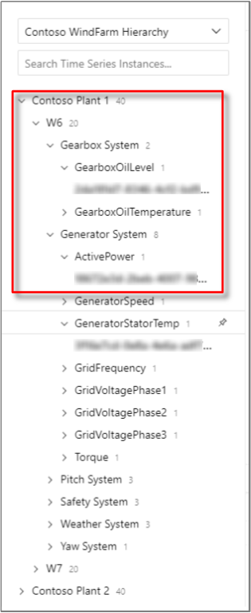

# Services in an industrial IoT (IIoT) analytics solution

Building on the architectural components in the recommended [Azure industrial IoT (IIoT) analytics solution](./iiot-architecture.yml), this article discusses the subsystems and Azure services that can be used in such a solution. Your solution may not use all these services or may have additional services.

## Time Series Service

A time series service will be required to provide a warm and cold store for the JSON-based industrial time series data. We recommend using [Time Series Insights (or TSI)](/azure/time-series-insights/overview-what-is-tsi) as the time series service for the following reasons:

- Ability to ingest streaming data directly from [Azure IoT Hub](/azure/iot-hub/about-iot-hub) or [Azure Event Hub](/azure/event-hubs/event-hubs-about).
- Multi-layered storage solution with warm and cold analytics support. It provides you the option to route data between warm and cold, for interactive analytics over warm data as well as operational intelligence over decades of historical data.
  - A highly interactive warm analytics solution to perform frequent, and large number of queries over shorter time span data.
  - A scalable, performant, and cost-optimized time series data lake based on Azure Storage allowing customers to trend years' worth of time series data.

- Asset hierarchy support that describes the domain and metadata associated with the derived and raw signals from industrial assets and devices.  Multiple hierarchies can be defined reflecting different departments within your company.  For instance, a factory hierarchy will look different from an Oil & Gas hierarchy.
- Flexible analytics platform to store historical time series data in your own Azure Storage account, thereby allowing you to have ownership of your industrial IoT data. Data is stored in open source Apache Parquet format that enables connectivity and interoperability across a variety of data scenarios including predictive analytics, machine learning, and other custom computations done using familiar technologies including Spark, Databricks, and Jupyter.
- Rich analytics with enhanced query APIs and user experience that combines asset-based data insights with rich, improvised data analytics with support for interpolation, scalar and aggregate functions, categorical variables, scatter plots, and time-shifting time series signals for in-depth analysis.
- Enterprise grade platform to support the scale, performance, security, and reliability needs of our industrial IoT customers.
- Ability to view and export the data in CSV format for further analysis.
- Ability to share analysis across your organization.  Current visualizations can be saved and shared. Alternatively, the current state of each user's analysis is assigned a unique identifier.  This identifier is placed in the URL allowing users to easily share their analysis by placing the URL in emails, documents, etc.  Because TSI pricing is not *seat*-based, this democratizes the data by allowing anyone with access to the data to see it.

You can continue to use Time Series Insights with the old pricing model (S1, S2) for warm, unplanned data analysis. However, we highly encourage you to use the updated offering (PAYG) as it offers many new capabilities as well as Pay-As-You-Go pricing, cost savings, and flexibility to scale. Alternatively, [Azure Data Explorer](/azure/data-explorer/) or [Cosmos DB](/azure/cosmos-db/introduction) may be used as a time series database if you plan to develop a custom time series service.

> [!NOTE]
> When connecting Time Series Insights with IoT Hub or Event Hub, ensure you select an appropriate [Time Series ID](/azure/time-series-insights/how-to-select-tsid). We recommend using a SCADA tag name field or OPC UA node id (for example, nsu=http://msft/boiler;i=#####) if possible, as these will map to leaf nodes in your [Time Series Model](/azure/time-series-insights/concepts-model-overview).

The data in Time Series Insights is stored in your [Azure Blob Storage account](/azure/time-series-insights/concepts-ingestion-overview#azure-storage) (bring your own storage account) in Parquet file format. It is your data after all!

You can query your data in Time Series Insights using:

- [Time Series Insights Explorer](/azure/time-series-insights/concepts-ux-panels)
- [Query API](/azure/time-series-insights/time-series-insights-update-query-data-csharp)
- [REST API](/rest/api/time-series-insights/preview)
- [Power BI](/azure/time-series-insights/concepts-power-bi)
- Any of your favorite BI and analytics tools (for example, Spark, Databricks, Azure Notebooks) by accessing the Parquet files in your Azure blob storage account

## Microservices

Your IIoT analytics solution will require a number of microservices to perform functions such as:

- Providing HTTP REST APIs to support your web application.
  - We recommend creating HTTP-triggered [Azure Functions](/azure/azure-functions) to implement your APIs.
  - Alternatively, you can develop and host your REST APIs using Azure Service Fabric or [Azure Kubernetes Service (AKS)](/azure/aks).

- Providing an HTTP REST API interface to your factory floor OPC UA servers (for example, using Azure industrial IoT components consisting of OPC Publisher, OPC Twin and OPC Vault) to provide discovery, registration, and remote control of industrial devices.
  - For hosting the Azure industrial IoT microservices, we recommend using Azure Kubernetes Service (AKS). See [Deploying Azure Industrial IoT Platform](https://github.com/Azure/Industrial-IoT/blob/master/docs/deploy/readme.md) to understand the various deployment options.

- Performing data transformation such as converting binary payloads to JSON or differing JSON payloads to a common, canonical format.
  - We recommend creating Azure Functions connected to IoT Hub to perform payload transformations.
  - Different industrial equipment vendors will send telemetry in different payload formats (JSON, binary, and so on) and schemas. When possible, we recommend converting the different equipment schemas to a common, canonical schema, ideally based on an industry standard.
  - If the message body is binary, use an Azure Function to convert the incoming messages to JSON and send the converted messages back to IoT Hub or to Event Hub.

      - When the message body is binary, [IoT Hub message routing](/azure/iot-hub/iot-hub-devguide-messages-d2c) cannot be used against the message body, but can be used against [message properties](/azure/iot-hub/iot-hub-devguide-routing-query-syntax).
      - The Azure industrial IoT components include the capability to decode OPC UA binary messages to JSON.

- A [Data Ingest Administration](#data-ingest-administration) service for updating the list of tags monitored by your IIoT analytics solution.

- A [Historical Data Ingestion](#historical-data-ingestion) service for importing historical data from your SCADA, MES, or historian into your solution.

Your solution will likely involve additional microservices to satisfy the specific requirements of your IIoT analytics solution. If your organization is new to building microservices, we recommend implementing custom microservices using Azure Functions. Azure Functions is an event-driven serverless compute platform that can be used to develop microservices and solve complex orchestration problems. It allows you to build and debug locally (in several software languages) without additional setup, deploy and operate at scale in the cloud, and integrate Azure services using triggers and bindings.

Both stateless and stateful microservices can be developed using Azure Functions. Azure Functions can use Cosmos DB, Table Storage, Azure SQL, and other databases to store stateful information.

Alternatively, if your organization has a previous experience building container-based microservices, we recommend you to also consider Azure Service Fabric or Azure Kubernetes Service (AKS). Refer to [Microservices in Azure](https://azure.microsoft.com/solutions/microservice-applications/) for more information.

Regardless of your microservices platform choice, we recommend using [Azure API Management](/azure/api-management/) to create consistent and modern API gateways for your microservices. API Management helps abstract, publish, secure, and version your APIs.

### Data Ingest Administration

We recommend developing a Data Ingest Administration service to add/update the list of tags monitored by your IIoT analytics solution.

SCADA *tags* are variables mapped to I/O addresses on a PLC or RTU. Tag names vary from organization to organization but often follow a naming pattern. As an example, tag names for a pump with tag number `14P103` located in STN001 (Station 001), has these statuses:

- STN001_14P103_RUN
- STN001_14P103_STOP
- STN001_14P103_TRIP

As new tags are created in your SCADA system, the IIoT analytics solution must become aware of these tags and subscribe to them in order to begin collecting data from them. In some cases, the IIoT analytics solution may not subscribe to certain tags as the data they contain may be irrelevant.

If your SCADA system supports OPC UA, new tags should appear as new NodeIDs in the OPC UA hierarchy. For example, the above tag names may appear as:

- ns=2;s= STN001_14P103_RUN
- ns=2;s= STN001_14P103_STOP
- ns=2;s= STN001_14P103_TRIP

We recommend developing a workflow that informs the administrators of the IIoT analytics solution when new tags are created, or existing tags are edited in the SCADA system. At the end of the workflow, the OPC Publisher is updated with the new/updated tags.

To accomplish this, we recommend developing a workflow that involves [Power Apps](https://powerapps.microsoft.com/), [Logic Apps](/azure/logic-apps/), and Azure Functions, as follows:

- The SCADA system operator can trigger the Logic Apps workflow using a Power Apps form whenever tags are created or edited in the SCADA system.
  - Alternatively, Logic Apps [connectors](/azure/connectors/apis-list) can monitor a table in the SCADA system database for tag changes.
  - The OPC UA Discovery service can be used to both find OPC UA servers and the tags and methods they implement.
- The Logic Apps workflow includes an approval step where the IIoT analytics solution owners can approve the new/updated tags.
- Once the new/updated tags are approved and a frequency assigned, the Logic App calls an Azure Function.
- The Azure function calls the OPC Twin microservice, which directs the OPC Publisher module to subscribe to the new tags.
  - A sample can be found [here](https://github.com/Azure-Samples/iot-edge-opc-publisher-nodeconfiguration).
  - If your solution involves third-party software, instead of OPC Publisher, configure the Azure Function to call an API running on the third-party software either directly or using an IoT Hub [Direct Method](/azure/iot-hub/iot-hub-devguide-direct-methods).

Alternatively, Microsoft Forms and Microsoft Flow can be used in place of Power Apps and Logic Apps.

### Historical Data Ingestion

Years of historical data likely exists in your current SCADA, MES, or historian system. In most cases, you will want to import your historical data into your IIoT analytics solution.

Loading historical data into your IIoT analytics solution consists of three steps:

1. Export your historical data.

      1. Most SCADA, MES, or historian systems have some mechanism that allows you to export your historical data, often as CSV files. Consult your system's documentation on how best to do this.
      1. If there is no export option in your system, consult the system's documentation to determine if an API exists. Some systems support HTTP REST APIs or [OPC Historical Data Access (HDA)](https://en.wikipedia.org/wiki/OPC_Historical_Data_Access). If so, build an application or use a Microsoft partner solution that connects to the API, queries for the historical data, and saves it to a file in formats such as CSV, Parquet, TSV, and so on.

1. Upload to Azure.

      1. If the aggregate size of the exported data is small, you can upload the files to Azure Blob Storage over the internet using [Azcopy](/azure/storage/common/storage-use-azcopy-v10).
      1. If the aggregate size of the exported data is large (tens or hundreds of TBs), consider using [Azure Import/Export Service](/azure/storage/common/storage-import-export-service) or [Azure Data Box](/azure/databox/) to ship the files to the Azure region where your IIoT analytics solution is deployed. Once received, the files will be imported into your Azure Storage account.

1. Import your data.

      1. This step involves reading the files in your Azure Storage account, serializing the data as JSON, and sending data as streaming events into Time Series Insights. We recommend using an Azure Function to perform this.
      1. Time Series Insights only supports IoT Hub and Event Hub as data sources. We recommend using an Azure Function to send the events to a temporary Event Hub, which is connected to Time Series Insights.
      1. Refer to [How to shape JSON events](/azure/time-series-insights/how-to-shape-query-json) and [Supported JSON shapes](/azure/time-series-insights/time-series-insights-send-events#supported-json-shapes) for best practices on shaping your JSON payload.
      1. Make sure to use the same [Time Series ID](/azure/time-series-insights/how-to-select-tsid) as you do for your streaming data.
      1. Once this process is completed, the Event Hub and Azure Function may be deleted. This is an optional step.

> [!NOTE]
> Exporting large volumes of data from your industrial system (for example, SCADA or historian) may place a significant performance load on that system, which can negatively impact operations. Consider exporting smaller batches of historical data to minimize performance impacts.

## Rules and Calculation Engine

Your IIoT analytics solution may need to perform near real-time (low latency) calculations and complex event processing (or CEP) over streaming data, before it lands in a database. For example, calculating moving averages or calculated *tags*. This is often referred to as a *calculations engine*. Your solution may also need to trigger actions (for example, display an alert) based on the streaming data. This is referred to as a *rules engine*.

We recommend using [Time Series Insights](/azure/time-series-insights/overview-what-is-tsi) for simple calculations, at query time. The [Time Series Model](/azure/time-series-insights/concepts-model-overview) introduced with Time Series Insights supports a number of formulas including: Avg, Min, Max, Sum, Count, First, and Last. The formulas can be created and applied using the [Time Series Insights APIs](/rest/api/time-series-insights/preview) or [Time Series Insights Explorer](/azure/time-series-insights/concepts-ux-panels) user interface.

For example, a Production Manager may want to calculate the average number of widgets produced on a manufacturing line, over a time interval, to ensure productivity goals are met. In this example, we would recommend the Production Manager to use the Time Series Insights explorer interface to create and visualize the calculation. Or if you have developed a custom web application, it can use the Time Series Insights APIs to create the calculation, and the [Azure Time Series Insights JavaScript SDK (or *tsiclient*)](https://tsiclientsample.azurewebsites.net/) to display the data in your custom web application.

For more advanced calculations and/or to implement a rules engine, we recommend using [Azure Stream Analytics](/azure/stream-analytics/). Azure Stream Analytics is a real-time analytics and complex event-processing engine, that is designed to analyze and process high volumes of fast streaming data from multiple sources simultaneously. Patterns and relationships can be identified in information extracted from a number of input sources including devices, sensors, click streams, social media feeds, and applications. These patterns can be used to trigger actions and initiate workflows such creating alerts, feeding information to a reporting tool, or storing transformed data for later use.

For example, a Process Engineer may want to implement a more complex calculation such as calculating the [standard deviation (SDEV)](/stream-analytics-query/stdev-azure-stream-analytics) of the widgets produced across a number of production lines to determine when any line is more than 2x beyond the mean over a period of time. In this example, we recommend using Stream Analytics, with a custom web application. The Process Engineer authors the calculations using the custom web application, which calls the [Stream Analytics REST APIs](/rest/api/streamanalytics/) to create and run these calculations (also known as *Jobs*). The Job output can be sent to an Event Hub, connected to Time Series Insights, so the result can be visualized in Time Series Insights explorer.

Similarly, for a *Rules Engine*, a custom web application can be developed that allows users to author alerts and actions. The web application creates associated Jobs in Azure Stream Analytics using the Steam Analytics REST API. To trigger actions, a Stream Analytics Job calls an Azure Function output. The Azure Function can call a Logic App or Power Automate task that sends an Email alert or invokes Azure SignalR to display a message in the web application.

Azure Stream Analytics supports processing events in CSV, JSON, and Avro data formats while Time Series Insights supports JSON. If your payload does not meet these requirements, consider using an Azure Function to perform data transformation prior to sending the data to Stream Analytics or Time Series Insights (using IoT Hub or Event Hubs).

Azure Stream Analytics also supports [reference data](/azure/stream-analytics/stream-analytics-use-reference-data), a finite data set that is static or slowly changing in nature, used to perform a lookup or to augment your data streams. A common scenario is exporting asset metadata from your Enterprise Asset Management system and joining it with real-time data coming from those industrial devices.

Stream Analytics is also available as a [module](https://azuremarketplace.microsoft.com/marketplace/apps/microsoft.stream-analytics-on-iot-?tab=Overview) on the Azure IoT Edge runtime. This is useful for situations where complex event processing needs to happen at the Edge. As an alternative to Azure Stream Analytics, near real-time Calculation and Rules Engines may be implemented using [Apache Spark Streaming on Azure Databricks](/azure/databricks/getting-started/spark/streaming).

## Notifications

Since the IIoT analytics solution is *not a control system*, it does not require a complete [Alarm Management](https://en.wikipedia.org/wiki/Alarm_management) system. However, there will be cases where you will want the ability to detect conditions in the streaming data and generate notifications or trigger workflows. Examples include:

- temperature of a heat exchanger exceeding a configured limit, which changes the color of an icon in your web application,
- an error code sent from a pump, which triggers a work order in your ERP system, or
- the vibration of a motor exceeding limits, which triggers an email notification to an Operations Manager.

We recommend using Azure Stream Analytics to define and detect conditions in the streaming data (refer to the [rules engine](#rules-and-calculation-engine) mentioned earlier). For example, a Plant Manager implements an automated workflow that runs whenever an error code is received from any equipment. In this example, your custom web application can use the [Stream Analytics REST API](/rest/api/streamanalytics/) to provide a user interface for the Plant Manager to create and run a job that monitors for specific error codes.

For defining an alert (email or SMS) or triggering a workflow, we recommend using Azure Logic Apps. Logic Apps can be used to build automated, scalable workflows, business processes, and enterprise orchestrations to integrate your equipment and data across cloud services and on-premises systems.

We recommend connecting Azure Stream Analytics with Azure Logic Apps using [Azure Service Bus](/azure/service-bus-messaging/service-bus-messaging-overview). In the previous example, when an error code is detected by Stream Analytics, the job will send the error code to an Azure Service Bus queue output. A Logic App will be triggered to run whenever a message is received on the queue. This Logic App will then perform the workflow defined by the Plant Manager, which may involve creating a work order in Dynamics 365 or SAP, or sending an email to maintenance technician. Your web application can use the [Logic Apps REST API](/rest/api/logic/) to provide a user interface for the Plant Manager to author workflows or these can be built using the Azure portal authoring experience.

To display visual alerts in your web application, we recommend creating an Azure Stream Analytics job to detect specific events and send those to either:

- **An Event Hub output:** Then connect the Event Hub to Time Series Insights. Use the [Azure Time Series Insights JavaScript SDK (tsiclient)](https://tsiclientsample.azurewebsites.net/) to display the event in your web application.

or,

- **An Azure Functions output:** Then [develop an Azure Function](/azure/azure-signalr/signalr-concept-azure-functions) that sends the events to your web application using [SignalR](/aspnet/core/signalr/introduction).

Operational alarms and events triggered on premise can also be ingested into Azure for reporting and to trigger work orders, SMS messages, and emails.

## Microsoft 365

The IIoT analytics solution can also include [Microsoft 365](/office365/) services to automate tasks and send notifications. The following are a few examples:

- Receive email alerts in Microsoft Outlook or post a message to a Microsoft Teams channel when a condition is met in Azure Stream Analytics.
- Receive notifications as part of an approval workflow triggered by a Power App or Microsoft Forms submission.
- Create an item in a SharePoint list when an alert is triggered by a Logic App.
- Notify a user or execute a workflow when a new tag is created in a SCADA system.

## Machine Learning

Machine learning models can be trained using your historical industrial data, enabling you to add predictive capabilities to your IIoT application. For example, your Data Scientists may be interested in using the IIoT analytics solution to build and train models that can predict events on the factory floor or indicate when maintenance should be conducted on an asset.

For building and training machine learning models, we recommend [Azure Machine Learning](/azure/machine-learning/). Azure Machine Learning can [connect](/azure/machine-learning/how-to-create-register-datasets) to Time Series Insights data stored in your Azure Storage account. Using the data, you can create and train [forecasting models](/azure/machine-learning/how-to-auto-train-forecast) in Azure Machine Learning. Once a model has been trained, it can be [deployed](/azure/machine-learning/how-to-deploy-and-where) as a web service on Azure (hosted on Azure Kubernetes Services or Azure Functions, for example) or to an Azure IoT Edge field gateway.

For those new to machine learning or organizations without Data Scientists, we recommend starting with [Azure Cognitive Services](/azure/cognitive-services/). Azure Cognitive Services are APIs, SDKs, and services available to help you build intelligent applications without having formal AI or data science skills or knowledge. Azure Cognitive Services enable you to easily add cognitive features into your IIoT analytics solution. The goal of Azure Cognitive Services is to help you create applications that can see, hear, speak, understand, and even begin to reason. The catalog of services within Azure Cognitive Services can be categorized into five main pillars - *Vision*, *Speech*, *Language*, *Web Search*, and *Decision*.

## Asset Hierarchy

An asset hierarchy allows you to define hierarchies for classifying your asset, for example, Country > Location > Facility > Room. They may also contain the relationship between your assets. Many organizations maintain asset hierarchies within their industrial systems or within an Enterprise Asset Management (EAM) system.

The [Time Series Model](/azure/time-series-insights/concepts-model-overview) in Azure Time Series Insights provides asset hierarchy capabilities. Through the use of *Instances*, *Types* and *Hierarchies*, you can store metadata about your industrial devices, as shown in the image below.

If possible, we recommend exporting your existing asset hierarchy and importing it into Time Series Insights using the [Time Series Model APIs](/rest/api/time-series-insights/preview). We recommend periodically refreshing it as updates are made in your Enterprise Asset Management system.

In the future, asset models will evolve to become [digital twins](/azure/digital-twins/concepts-twins-graph), combining dynamic asset data (real-time telemetry), static data (3D models, metadata from Asset Management Systems), and graph-based relationships, allowing the digital twin to change in real-time along with the physical asset.

[Azure Digital Twins](/azure/digital-twins/) is an Azure IoT service that provides the ability to:

- Create comprehensive models of physical environments,
- Create spatial intelligence graphs to model the relationships and interactions between people, places, and devices,
- Query data from a physical space rather than disparate sensors, and
- Build reusable, highly scalable, spatially aware experiences that link streaming data across the physical and digital world.

## Business Process Integration

In some instances, you will want your IIoT analytics solution to perform actions based on insights from your industrial data. This can include raising alarms, sending email, sending SMS messages, or triggering a workflow in your line-of-business systems (for example, CRM, ERP, and so on). We recommend using Azure Logic Apps to integrate your IIoT analytics solution with your line-of-business systems. Azure Logic Apps has a number of connectors to business systems and Microsoft services such as:

- Dynamics 365
- SharePoint Online
- Office 365 Outlook
- Salesforce
- SAP

For example, an error code from a pump is detected by an Azure Stream Analytics job. The job sends a message to Azure Service Bus and triggers a Logic App to run. The Logic App sends an email notification to the Plant Manager using the [Office 365 Outlook connector](/azure/connectors/connectors-create-api-office365-outlook). It then sends a message to your SAP *S/4 HANA* system using the [SAP connector](/azure/logic-apps/logic-apps-using-sap-connector), which creates a Service Order in SAP.

## User Management

User management involves managing user profiles and controlling what actions a user can perform in your IIoT analytics solution. For example, what asset data can a user view, or whether the user can create conditions and alerts. This is frequently referred to as role-based access control (RBAC).

We recommend implementing role-based access control using the [Microsoft identity platform](/azure/active-directory/develop/) along with [Azure Active Directory](/azure/active-directory/). In addition, the Azure PaaS services mentioned in this IIoT analytics solution can integrate directly with Azure Active Directory, thereby ensuring security across your solution.

Your web application and custom microservices can also integrate with the Microsoft identity platform using libraries such as [Microsoft Authentication Library (or MSAL)](/azure/active-directory/develop/msal-overview) and protocols such as OAuth 2.0 and OpenID Connect.

User management also involves operations such as:

- creating a new user,
- updating a user's profile, such as their location and phone number,
- changing a user's password, and
- disabling a user's account.

For these operations, we recommend using the [Microsoft Graph](https://developer.microsoft.com/graph).

## Next steps

Data visualization is the backbone of a well-defined analytics system. Learn about the [data visualization techniques](./iiot-data.yml) that you can use with the IIoT analytics solution recommended in this series.
