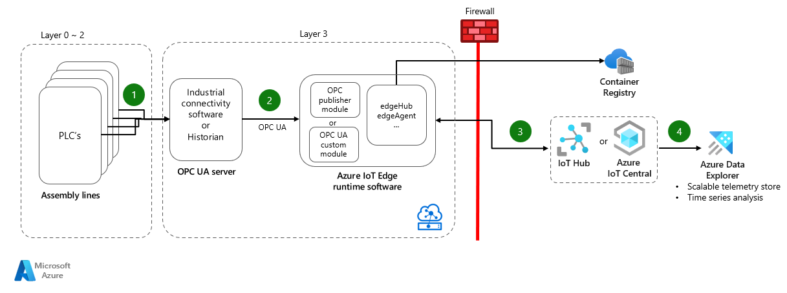
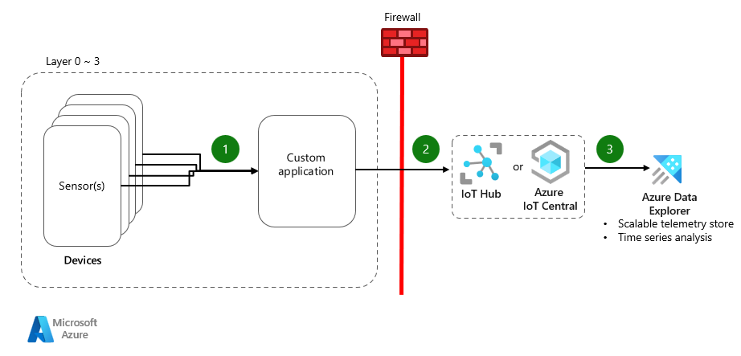
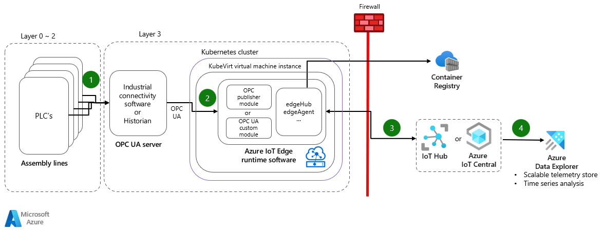
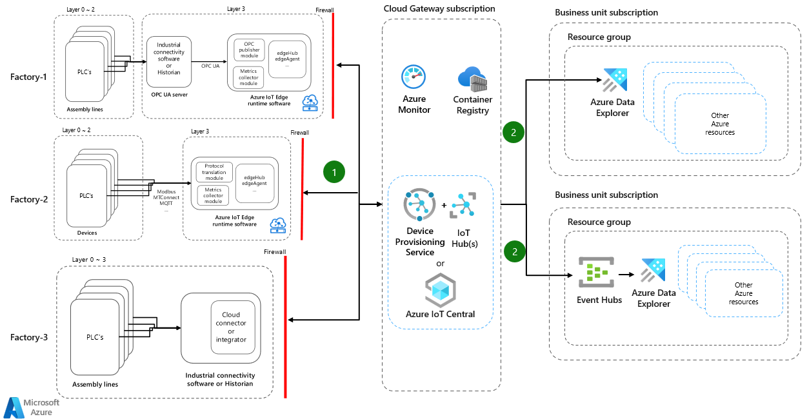

An end to end connectivity solution helps securely connect people, assets, workflow, and business processes, empowering organizations to be more resilient. The key aspects around connectivity include:

- Devices
    - PLC's, sensors, equipments, assembly lines
- Systems 
    - Historians, SCADA, MES, ICS/DCS
- Standards and Data Models
    - ISA 95, ISA 99, OPC DA, OPC UA, Modbus
- Network and Security
    - Purdue model, firewalls, proxies, network inspection, 5G, LoRaWAN
    - X.509 certificates, access policies
- Edge Gateway(s)
    - Software only or Hardware + Software solution
    - Modular design, cloud based management plane, offline support
    - Layered edge processing, analytics, machine learning
- Cloud Gateway(s)
    - Cloud connectivity, transport protocols, device management and scale

Following sections includes common connectivity patterns for industrial solutions. 

> [!NOTE]
> - These patterns are for telemetry egress only. No control commands are sent back to the industrial systems or devices.
> - These patterns are mostly focused on [Connected operations](https://docs.microsoft.com/en-us/azure/architecture/framework/iot/iot-overview#connected-operations) scenarios. We will include [Connected products](https://docs.microsoft.com/en-us/azure/architecture/framework/iot/iot-overview#connected-products) scenarios in the next iteration.

## OPC UA Server and Edge Gateway

- Use this pattern when:
    - OPC UA Server is already configured or can be configured to connect with PLC's.
    - IoT Edge can be installed at Layer 3 and can connect to PLC via OPC UA Server. 

- Considerations
    - [IoT Edge production checklist](https://docs.microsoft.com/en-us/azure/iot-edge/production-checklist?view=iotedge-2018-06)
    - [OPC Publisher module configuration guide](https://github.com/Azure/Industrial-IoT/blob/main/docs/modules/publisher.md)
    - [Security baseline for IoT Hub](https://docs.microsoft.com/en-us/security/benchmark/azure/baselines/iot-hub-security-baseline?toc=/azure/iot-hub/TOC.json)
    - IoT Edge runtime can be installed on a Virtual Machine (Linux or Windows) as well as dedicated hardware like [Azure Stack Edge](https://azure.microsoft.com/en-us/products/azure-stack/edge/#overview) 
    - See [Cloud Gateway options](#cloud-gateway-options) below to understand when to use IoT Hub vs. IoT Central

- Deployment Sample
    - [Connectivity with Industrial Assets using OPC UA and Edge for Linux on Windows (EFLOW)](https://github.com/Azure-Samples/industrial-iot-patterns/tree/main/1_Connectivity)
    - [Connecting OPC UA devices to IoT Central using custom modules](https://github.com/iot-for-all/iotc-opcua-iotedge-gateway)

## Protocol Translation and Edge Gateway

- Use this pattern when:
    - Devices cannot support OPC UA data model or prefer to use other approach.
    - IoT Edge can be installed at Layer 3 and can connect to Devices.

- Considerations
    - [IoT Edge production checklist](https://docs.microsoft.com/en-us/azure/iot-edge/production-checklist?view=iotedge-2018-06)
    - [Security baseline for IoT Hub](https://docs.microsoft.com/en-us/security/benchmark/azure/baselines/iot-hub-security-baseline?toc=/azure/iot-hub/TOC.json)
    - IoT Edge runtime can be installed on a Virtual Machine (Linux or Windows) as well as dedicated hardware like [Azure Stack Edge](https://azure.microsoft.com/en-us/products/azure-stack/edge/#overview)
    - [Azure IoT Edge Module Markeplace](https://azuremarketplace.microsoft.com/en-us/marketplace/apps/category/internet-of-things?page=1&subcategories=iot-edge-modules) for partner solutions
    - See [Cloud Gateway options](#cloud-gateway-options) below to understand when to use IoT Hub vs. IoT Central 

- Deployment Sample
    - [Connecting modbus device(s) with IoT Central application via an IoT Edge Gateway device](https://github.com/iot-for-all/iotc-modbus-iotedge-gateway)
    
   
## Cloud connector from Industrial Connectivity Software or Historian

- Use this pattern when:
    - Industrial Connectivity Software or Historian is available and has built-in cloud connector.
    - Management, processing and analytics functionality of edge gateway is not required for the use case.
    - Connector can provide the data with same granularity as edge gateway.   

- Considerations
    - Additional cost for cloud connectors along with licensing and tag based costing model for historians.
    - [Security baseline for IoT Hub](https://docs.microsoft.com/en-us/security/benchmark/azure/baselines/iot-hub-security-baseline?toc=/azure/iot-hub/TOC.json)
    - See [Cloud Gateway options](#cloud-gateway-options) below to understand when to use IoT Hub vs. IoT Central 

- Deployment Sample
    - [Connect PTC/Kepware's KEPServerEX to IoT Hub and IoT Edge](https://docs.microsoft.com/en-us/samples/azure-samples/iot-hub-how-to-kepware-edge/azure-iot-edge-connect-ptc/)

- Resources
    - [Bring Industrial data into your Azure IoT solution with CloudRail](https://docs.microsoft.com/en-us/shows/internet-of-things-show/bring-industrial-data-into-your-azure-iot-solution-with-cloudrail)

## Constrained devices and add-on sensors

- Use this pattern when:
    - Working with constrained devices or add-on sensors in remote and off-site locations.
    - Management, processing and analytics functionality of edge gateway is not required for the use case.
    - Data egress can be allowed to go outside of the Purdue Model.

- Considerations
    - Requires management of custom application and/or firmware updates.
    - No support for offline or edge analytics scenarios.
    - [Security baseline for IoT Hub](https://docs.microsoft.com/en-us/security/benchmark/azure/baselines/iot-hub-security-baseline?toc=/azure/iot-hub/TOC.json)
    - See [Cloud Gateway options](#cloud-gateway-options) below to understand when to use IoT Hub vs. IoT Central 

- Resources
    - [IoT Hub SDKs and Samples](https://docs.microsoft.com/en-us/azure/iot-hub/iot-hub-devguide-sdks)

## Connecting to Layer 2 and IoT Edge Gateways

- Use this pattern when:
    - Layer 0~1 can only connect with adjacent Layer 2.
    - IoT Edge can be installed at Layer 2 and can connect to Layer 0~1.

- Considerations
    - Complex deployment model and certificate configuration for security.
    - [Deploying hierarchy of IoT Edge Devices](https://docs.microsoft.com/en-us/azure/iot-edge/tutorial-nested-iot-edge?view=iotedge-2020-11)
    - [IoT Edge production checklist](https://docs.microsoft.com/en-us/azure/iot-edge/production-checklist?view=iotedge-2018-06)
    - [Security baseline for IoT Hub](https://docs.microsoft.com/en-us/security/benchmark/azure/baselines/iot-hub-security-baseline?toc=/azure/iot-hub/TOC.json)
    - See [Cloud Gateway options](#cloud-gateway-options) below to understand when to use IoT Hub vs. IoT Central 

- Deployment Sample
    - [Nested Edge Devices and Offline Dashboards Sample](https://github.com/Azure-Samples/iot-edge-for-iiot)

## Resilient Edge Gateway

- Use this pattern when:
    - Kubernetes infrastructure and skillset is already available.
    - Horizontal scaling and hardware failure resiliency is critical.
    - IoT Edge VM snapshots are not enough to meet the RTO and RPO needs for HA/DR.

- Considerations
    - This pattern is for hardware resiliency and agnostic of data models, protocols and industrial connectivity software.
    - [Kubernetes at the edge compute options](https://docs.microsoft.com/en-us/azure/architecture/operator-guides/aks/choose-kubernetes-edge-compute-option)
    - [IoT Edge production checklist](https://docs.microsoft.com/en-us/azure/iot-edge/production-checklist?view=iotedge-2018-06)
    - [Security baseline for IoT Hub](https://docs.microsoft.com/en-us/security/benchmark/azure/baselines/iot-hub-security-baseline?toc=/azure/iot-hub/TOC.json)
    - See [Cloud Gateway options](#cloud-gateway-options) below to understand when to use IoT Hub vs. IoT Central 
    
- Deployment Sample
    - [IoT Edge on Kubernetes with KubeVirt](https://github.com/Azure-Samples/IoT-Edge-K8s-KubeVirt-Deployment/)

## Scale to multiple factories and business units

- Use this pattern when:
    - Scaling Industrial IoT solution patterns across multiple factories
    - Multiple business units and project(s) need access to IIoT data
    - [Landing zones](https://docs.microsoft.com/en-us/azure/cloud-adoption-framework/ready/landing-zone/design-principles) are enabled for cloud connectivity

- Considerations
    - This pattern is for scaling cloud gateway and services for connecting multiple factories, it is agnostic of data models, protocols and industrial connectivity software.
    - Dedicated subscription for cloud gateway enables OT and Networking teams to better manage cloud egress, connectivity.
    - IIoT data can be pushed to each business unit or project specific route via routes, consumer groups
    - IIoT solutions are one of many enterprise solutions, and need to integrate well with the overall [cloud operating model](https://docs.microsoft.com/en-us/azure/cloud-adoption-framework/operating-model/compare) and [landing zone design principles](https://docs.microsoft.com/en-us/azure/cloud-adoption-framework/ready/landing-zone/design-principles) of the entire enterprise.
    - [IoT Hub high availability and disaster recovery](https://docs.microsoft.com/en-us/azure/iot-hub/iot-hub-ha-dr)

## Cloud Gateway Options

- Use this pattern when:
    - Use IoT Hub or IoT Central when you require device + edge management and two way communication, along with messaging.
    - IoT Central has built-in dashboard and rules engine for alerts.
    - Use Event hub when you only require messaging and have cost constraints.

- Considerations
    - [IoT Hub vs. Event Hub](https://docs.microsoft.com/en-us/azure/iot-hub/iot-hub-compare-event-hubs)
    - [IoT Hub vs. IoT Central](https://docs.microsoft.com/en-us/azure/iot-fundamentals/iot-solution-apaas-paas#comparing-approaches)
    - [RPO and RTO options for IoT Hub](https://docs.microsoft.com/en-us/azure/iot-hub/iot-hub-ha-dr#choose-the-right-hadr-option)
    - [HA/DR for IoT Central](https://docs.microsoft.com/en-us/azure/iot-central/core/concepts-faq-scalability-availability) and [limitations](https://docs.microsoft.com/en-us/azure/iot-central/core/concepts-faq-scalability-availability#limitations) around IoT Edge devices. 
    - [Availability](https://docs.microsoft.com/en-us/azure/event-hubs/event-hubs-availability-and-consistency?tabs=dotnet) and [Geo-disaster recovery](https://docs.microsoft.com/en-us/azure/event-hubs/event-hubs-geo-dr?tabs=portal) for Event Hub

- Deployment Samples
    - [Connect OPC UA devices with IoT Central](https://github.com/iot-for-all/iotc-opcua-iotedge-gateway)
    - [Industrial IoT patterns with IoT Central](https://docs.microsoft.com/en-us/azure/iot-central/core/concepts-iiot-architecture)
    - [Streaming at Scale with Event Hubs and Data Explorer](https://github.com/Azure-Samples/streaming-at-scale/tree/main/eventhubs-dataexplorer)