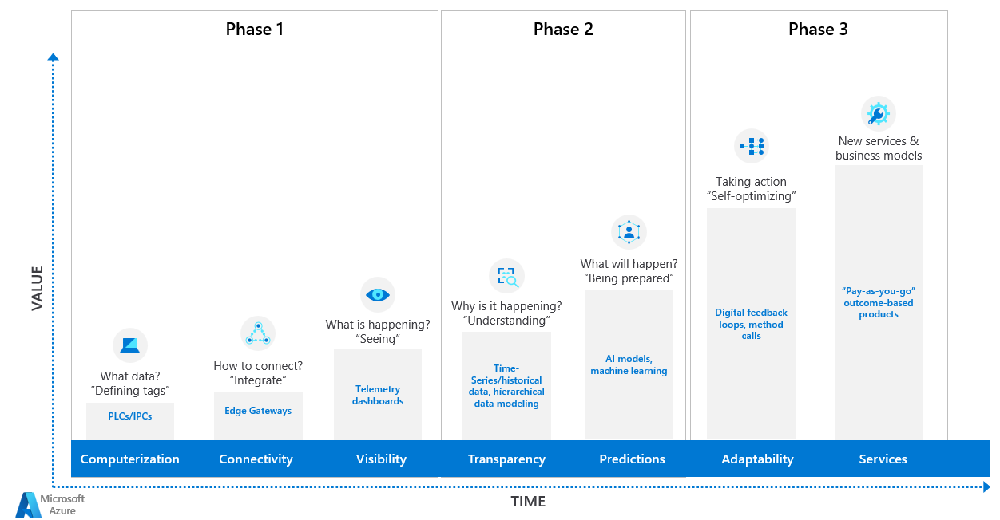

For manufacturers, the promise of digital transformation lies in breaking down silos and gaining a holistic view across the entire operation, from asset data to insights across all manufacturing processes. An IIoT solution relies on real-time and historical data from industrial devices and control systems located in manufacturing facilities. These include PLCs (Programmable Logic Controller), industrial equipment, SCADA (Supervisory Control and Data Acquisition) systems, MES (Manufacturing Execution System), and Process Historians.

A modern IIoT solution goes beyond moving existing industrial processes and tools to the cloud. It involves transforming your operations and processes, embracing cloud native services, and leveraging the power of machine learning and the intelligent edge to optimize industrial processes.

There are five key stages for a typical IIoT solution:

Each stage of an IIoT Solution consists of multiple design patterns. Computerisation is the prerequisite step and it referes to enabling sensors and actuators to monitor production processes. We typically start our IIoT journey with Connectivity as the first step.

## Connectivity 
- Patterns
    - OPC UA Server and Edge Gateway
    - Protocol Translation and Edge Gateway
    - Built-in cloud connector
    - Cloud SDK and Custom Application
    - Hierarchy of IoT Edge Gateways
    - Resilient Edge Gateway
    - Scale to multiple factories and business units
    - Cloud Gateway Options
- Solution Samples
    - [OPC UA Connectivity using Edge for Linux on Windows (EFLOW)](https://github.com/Azure-Samples/industrial-iot-patterns)

## Visibility

- Patterns
    - Time Series Analytics
    - Anomaly Detection and Root Cause Analysis
- Solution Samples
    - [Operational Visibility](https://github.com/Azure-Samples/industrial-iot-patterns)
## Transparency 

- Patterns
    - Business KPI Calculation Engine
    - Asset Hierarchy and Digital Twin Management

- Solution Samples
    - [Overall Equipment Effectiveness(OEE) Calculation Engine](https://github.com/Azure-Samples/industrial-iot-patterns)
    - [Factory Digital Twin Simulation](https://github.com/Azure-Samples/industrial-iot-patterns)

## Predictions 

- Patterns
    - Predict process and equipment failures using machine learning
    - Augment manual quality inspection using deep learing based image recognition

- Solution Samples
    - [Exploratory Data Analysis for machine learning based failure predictions](https://github.com/Azure-Samples/industrial-iot-patterns)
    - [Operationalizing machine learning models for batch and real-time predictions](https://github.com/Azure-Samples/industrial-iot-patterns)
    - [Operationalizing image recognition solution on the factory floor](https://github.com/Azure-Samples/industrial-iot-patterns)

## Adaptability 

- Patterns
    - Control system optimization using Deep Reinforcement Learning

- Solution Samples
    - *TODO*