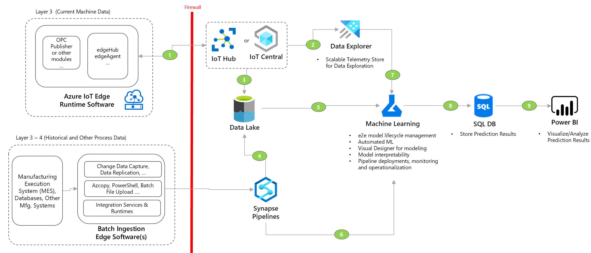
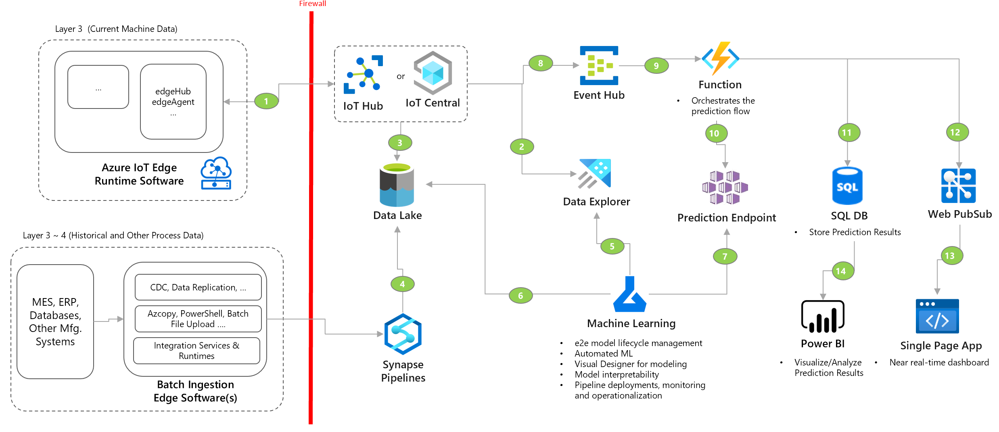
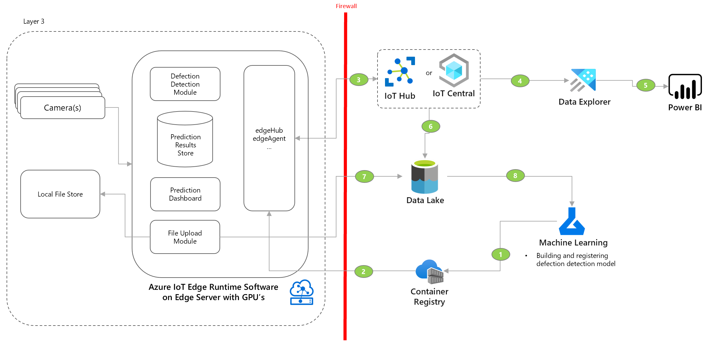

Prediction extends operational visibility by leveraging machine learning and AI to optimize production, scheduling, enable predictive maintenance and predictive quality, which helps reduce unexpected downtime, reduce cycle time and helps achieve operational excellence.

Following section includes common prediction patterns for industrial solutions. 

## Predict process and equipment failures using machine learning (Batch)

- Use this pattern when:
    - Need to build custom machine learning models on structured (tabular) data.
    - Need to use raw telemetry data for feature engineering.
    - Perform predictions on on hourly or daily basis.

- Considerations
    - [No Code / Low Code Automated Machine Learning](https://docs.microsoft.com/en-us/azure/machine-learning/concept-automated-ml)
    - [Understanding and building Machine Learning Pipelines](https://docs.microsoft.com/en-us/azure/machine-learning/concept-train-machine-learning-model#machine-learning-pipeline)
    - [Security baseline for Azure Machine Learning](https://docs.microsoft.com/en-us/security/benchmark/azure/baselines/machine-learning-security-baseline?context=/azure/machine-learning/context/ml-context)
    - [Manage and optimize Azure Machine Learning costs](https://docs.microsoft.com/en-us/azure/machine-learning/how-to-manage-optimize-cost)
    
- Deployment Sample
    - [Exploratory Data Analysis for failure predictions using machine learning](https://github.com/Azure-Samples/industrial-iot-patterns/tree/main/5_ExplorationDataAnalysis)
    - [Operationalizing machine learning based prediction models](https://github.com/Azure-Samples/industrial-iot-patterns/tree/main/6_MachineLearningForIIoT)

## Predict process and equipment failures using machine learning (Near real-time)

- Use this pattern when:
    - Need to build custom machine learning models on structured (tabular) data.
    - Need to use raw telemetry data for feature engineering.
    - Perform near real-time predictions within seconds.
    - Need custom dashboards to provide action recommendations that may impact current running manufacturing.process.

- Considerations
    - [No Code / Low Code Automated Machine Learning](https://docs.microsoft.com/en-us/azure/machine-learning/concept-automated-ml)
    - [Understanding and building Machine Learning Pipelines](https://docs.microsoft.com/en-us/azure/machine-learning/concept-train-machine-learning-model#machine-learning-pipeline)
    - [Security baseline for Azure Machine Learning](https://docs.microsoft.com/en-us/security/benchmark/azure/baselines/machine-learning-security-baseline?context=/azure/machine-learning/context/ml-context)
    - [Manage and optimize Azure Machine Learning costs](https://docs.microsoft.com/en-us/azure/machine-learning/how-to-manage-optimize-cost)
    - [Web PubSub vs. SignalR](https://docs.microsoft.com/en-us/azure/azure-web-pubsub/resource-faq#how-do-i-choose-between-azure-signalr-service-and-azure-web-pubsub-service)
    - [Choosing compute target for deploying machine learning models](https://docs.microsoft.com/en-us/azure/machine-learning/how-to-deploy-and-where?tabs=azcli#choose-a-compute-target)
    - The near real-time inference in cloud only. Consider deploying the model to IoT Edge to support offline and edge scenarios.
   
    
- Deployment Sample
     - [Exploratory Data Analysis for failure predictions using machine learning](https://github.com/Azure-Samples/industrial-iot-patterns/tree/main/5_ExplorationDataAnalysis)
    - [Operationalizing machine learning based prediction models](https://github.com/Azure-Samples/industrial-iot-patterns/tree/main/6_MachineLearningForIIoT)
    
## Augment manual quality inspection using deep learing based image recognition

- Use this pattern when:
    - Need to build custom machine learning models on image data.
    - Need to build pipeline to get data from external device sources like a camera.
    - Perform near real-time predictions within milliseconds
    - Need custom dashboards to provide action recommendations that may impact current running manufacturing process.

- Considerations
    - Using partner solutions that combine hardware + software can help accelerate time to value. Consider cost of scaling such solution.
    - Building custom solution can be cost effective for scale and help build IP. Consider complexity of managing such solution.
    - See [Vision AI solutions with Azure IoT Edge](https://docs.microsoft.com/en-us/azure/architecture/guide/iot-edge-vision/) for details around use cases, camera selection and edge integrations.
    - See [First principles of Computer Vision](https://www.youtube.com/channel/UCf0WB91t8Ky6AuYcQV0CcLw) to deep dive into how computer vision works
    
- Deployment Sample
    - [Vision on Edge (VoE)](https://github.com/Azure-Samples/azure-intelligent-edge-patterns/tree/master/factory-ai-vision)
    - [Azure Machine Learning anywhere with Kubernetes](https://github.com/Azure/AML-Kubernetes)
