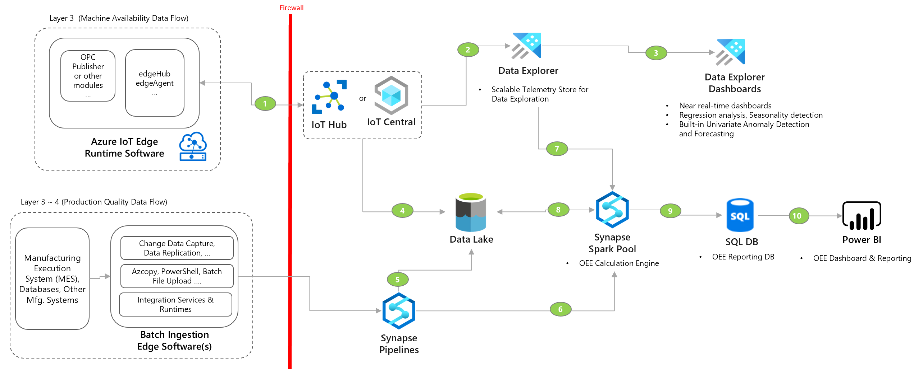

Transparency builds on top of visibilty and enables contextual data processing. It helps build the data hierarchy for enabling digital twins and also enables consistent business KPI calculcation flow.

Following section includes common transparency patterns for industrial solutions. 

## Business KPI Calculation Engine

- Use this pattern when:
    - Using Synapse Analytics for data fabric aspects like data lake, data pipeline management, serverless data processing, data warehousing, data governace. 
    - Need to combine both real-time and batch data pipelines and perform business KPI calculations.
    - Standardize KPI calculations across factories and business units.
    
- Considerations
    - [Data flows in Synapse Analytics](https://docs.microsoft.com/en-us/azure/synapse-analytics/concepts-data-flow-overview)
    - [Data Explorer (Kusto) Spark connector](https://docs.microsoft.com/en-us/azure/synapse-analytics/quickstart-connect-azure-data-explorer?toc=/azure/data-explorer/toc.json&bc=/azure/data-explorer/breadcrumb/toc.json)
    - For less compute intentive and serverless calculation engine, consider Functions. 
    
- Deployment Sample
    - [Overall Equipment Effectiveness(OEE) and KPI Calculation Engine](https://github.com/Azure-Samples/industrial-iot-patterns/tree/main/3_OEECalculationEngine)