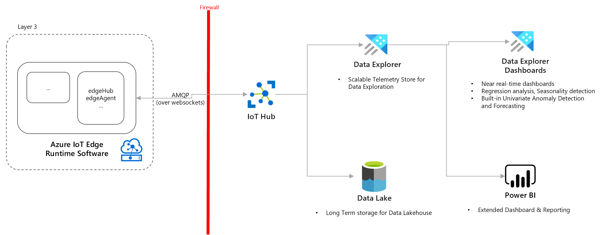
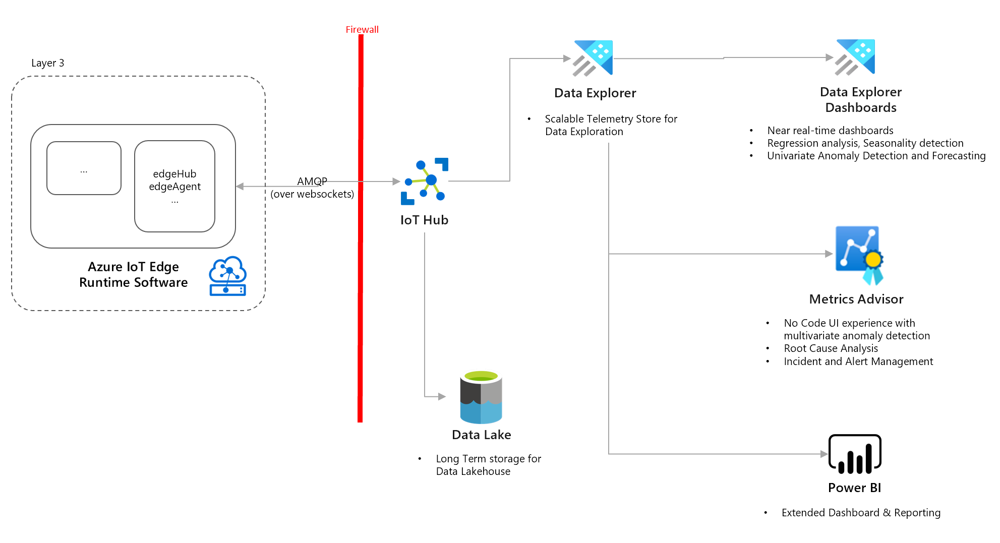

Operational visibility enables manufacturers to gain insights & drive decision-making to improve quality and be more efficient and improve safety. Visibilty involves visualizing and correlating IoT data with multiple other business systems including Historians, MES, ERP, QMS to impact metrics like OEE, energy costs, machine downtime, labor efficiency which directly impacts the business value.

Following section includes common visibility patterns for industrial solutions. 

## Time Series Analysis

- Use this pattern when:
    - Need time series analysis for large scale IIoT telemetry data.
    - Need real-time dashboards and querying capabilities on the factory floor.
    - Perform univariate anomaly detection and correlation between sensors.

- Considerations
    - Data Explorer is an append only platform, [not suitable for data which requires frequent updates.](https://docs.microsoft.com/en-us/azure/data-explorer/data-explorer-overview) 
    - [Time Series Analysis in Data Explorer](https://docs.microsoft.com/en-us/azure/data-explorer/time-series-analysis)
    - [Considerations around Streaming Ingestion for Data Explorer](https://docs.microsoft.com/en-us/azure/data-explorer/ingest-data-streaming?tabs=azure-portal%2Ccsharp)
    - [Disaster recovery configurations for Data Explorer](https://docs.microsoft.com/en-us/azure/data-explorer/business-continuity-overview#disaster-recovery-configurations)
    - [Migrating from Time Series Insights (TSI)](https://docs.microsoft.com/en-us/azure/time-series-insights/migration-to-adx)
    
- Deployment Sample
    - [Operational Visibility with Anomaly Detection and Root Cause Analysis](https://github.com/Azure-Samples/industrial-iot-patterns/tree/main/2_OperationalVisibility)

## Anomaly Detection and Root Cause Analysis

- Use this pattern when:
    - Need automatic anomaly detection based on machine learning algorithms and range thresholds.
    - Need no code / low code way to build time series machine learning models.
    - Need anomaly incident management and business action alerts.
    - Perform root cause analysis and correlation mapping .

- Considerations
    - [Onboard metric data to Metrics Advisor](https://docs.microsoft.com/en-us/azure/applied-ai-services/metrics-advisor/how-tos/onboard-your-data)
    - [Data feed management for Metrics Advisor](https://docs.microsoft.com/en-us/azure/applied-ai-services/metrics-advisor/how-tos/manage-data-feeds)
    - [Data requirements for Metrics Advisor anomaly detection](https://docs.microsoft.com/en-us/azure/applied-ai-services/metrics-advisor/faq#how-much-data-is-needed-for-metrics-advisor-to-start-anomaly-detection-)
    - [Cost management for Metrics Advisor](https://docs.microsoft.com/en-us/azure/applied-ai-services/metrics-advisor/cost-management#key-points-about-cost-management-and-pricing)
    
- Deployment Sample
    - [Operational Visibility with Anomaly Detection and Root Cause Analysis](https://github.com/Azure-Samples/industrial-iot-patterns/tree/main/2_OperationalVisibility)