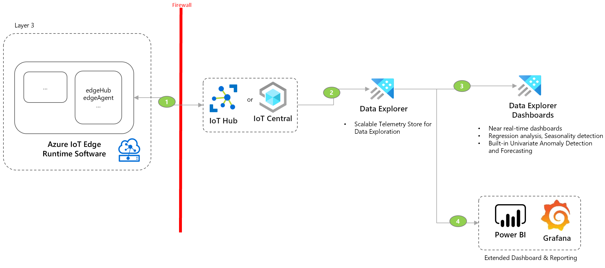
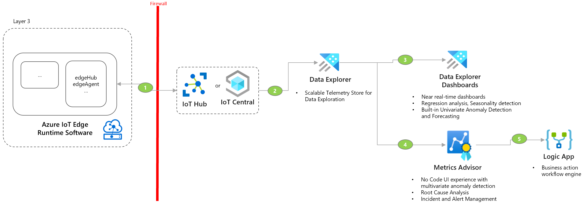

Visibility enables manufacturers to gain insights & drive decision-making to improve quality and be more efficient and improve safety. It involves visualizing and correlating IoT data with multiple other business systems including Historians, Manufacturing Execution Systems(MES), Enterprise Resource Planning (ERP), Quality Management Systems to impact metrics like Overall Equipment Effectiveness(OEE), energy costs, machine downtime, labor efficiency which directly impacts the business value.

Following section includes common visibility patterns for industrial solutions. 

## Time Series Analysis

Analyze IoT telemetry data using time series techniques.

- Dataflow
    1. EdgeHub sends the data to IoT Hub/ Central using AMQP or MQTT.
    1. Data from IoT Hub / Central goes to Data Explorer using Data Connection in IoT Hub or Data Export in IoT Central.
    1. Data Explorer dashboards use kql query langauge to fetch the data from the clusters and build near real-time dashboards.
    1. Use Power BI or Grafana to build more custom dashboards with query builder and integration with other data sources.

- Use this pattern when you:
    - Need time series analysis for large scale IIoT telemetry data.
    - Need real-time dashboards and querying capabilities on the factory floor.
    - Perform univariate anomaly detection and correlation between sensors.

- Considerations
    - IoT Central includes dashboards for basic time series analysis on last 30 days of data. For analysis on larger datasets beyond 30 days, use Data Explorer.
    - Data explorer is an append only platform, which is [not suitable for data which requires updates or deletes](/azure/data-explorer/data-explorer-overview)
    - [Time Series Analysis in Data Explorer](/azure/data-explorer/time-series-analysis)
    - [Considerations around Streaming Ingestion for Data Explorer](/azure/data-explorer/ingest-data-streaming?tabs=azure-portal%2Ccsharp)
    - [Disaster recovery configurations for Data Explorer](/azure/data-explorer/business-continuity-overview#disaster-recovery-configurations)
    - [Migrating from Time Series Insights (TSI)](/azure/time-series-insights/migration-to-adx)
    
- Deployment Sample
    - [Operational Visibility with Anomaly Detection and Root Cause Analysis](https://github.com/Azure-Samples/industrial-iot-patterns/tree/main/2_OperationalVisibility)

## Anomaly Detection and Root Cause Analysis

Detect anomalies and identify root cause analysis for anomaly incidents.

- Dataflow
    1. EdgeHub sends the data to IoT Hub/ Central using AMQP or MQTT.
    1. Data from IoT Hub / Central goes to Data Explorer using Data Connection in IoT Hub or Data Export in IoT Central.
    1. Data Explorer dashboards use kql query langauge to fetch the data from the clusters and build near real-time dashboards.
    1. Metrics Advisor fetches data from Data Explorer using data feed configuration. It configures the metrics level configuration for anomaly detection and an alert that links to a webhook.
    1. Metrics advisor web hook is connected to an HTTP-triggered Logic App, which gets called when an anomaly is detected.

- Use this pattern when you:
    - Need automatic anomaly detection based on machine learning algorithms and range thresholds
    - Need no code / low code way to build time series machine learning models
    - Need anomaly incident management and business action alerts
    - Perform root cause analysis and correlation mapping

- Considerations
    - [Onboard metric data to Metrics Advisor](/azure/applied-ai-services/metrics-advisor/how-tos/onboard-your-data)
    - [Data feed management for Metrics Advisor](/azure/applied-ai-services/metrics-advisor/how-tos/manage-data-feeds)
    - [Data requirements for Metrics Advisor anomaly detection](/azure/applied-ai-services/metrics-advisor/faq#how-much-data-is-needed-for-metrics-advisor-to-start-anomaly-detection-)
    - [Cost management for Metrics Advisor](/azure/applied-ai-services/metrics-advisor/cost-management#key-points-about-cost-management-and-pricing)
    
- Deployment Sample
    - [Operational Visibility with Anomaly Detection and Root Cause Analysis](https://github.com/Azure-Samples/industrial-iot-patterns/tree/main/2_OperationalVisibility)

## Next steps

- [Industrial IoT Patterns Overview](./iiot-patterns-overview.md)

- [Industrial IoT Connectivity Patterns](./iiot-connectivity-patterns.md)

- [Industrial IoT Transparency Patterns](./iiot-transparency-patterns.md)

- [Industrial IoT Prediction Patterns](./iiot-prediction-patterns.md)

- [Solutions for the manufacturing industry](/azure/architecture/industries/manufacturing)

- [IoT Well-Architected Framework](/azure/architecture/framework/iot/iot-overview)