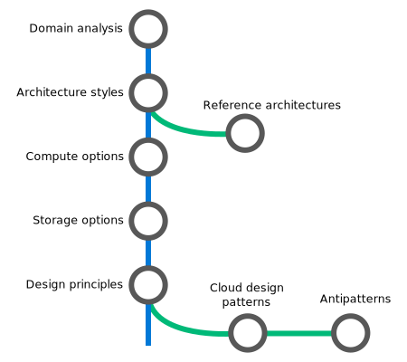

# Azure Application Architecture Guide

This guide presents a structured approach for designing applications on Azure that are scalable, resilient, and highly available. It is based on proven practices that we have learned from customer engagements.

## Introduction

The cloud is changing the way applications are designed. Instead of monoliths, applications are decomposed into smaller, decentralized services. These services communicate through APIs or by using asynchronous messaging or eventing. Applications scale horizontally, adding new instances as demand requires. 

These trends bring new challenges. Application state is distributed. Operations are done in parallel and asynchronously. The system as a whole must be resilient when failures occur. Deployments must be automated and predictable. Monitoring and telemetry are critical for gaining insight into the system. The Azure Application Architecture Guide is designed to help you navigate these changes. 

<table>
<thead>
    <tr><th>Traditional on-premises</th><th>Modern cloud</th></tr>
</thead>
<tbody>
<tr><td>Monolithic, centralized 
Design for predictable scalability 
Relational database 
Strong consistency 
Serial and synchronized processing 
Design to avoid failures (MTBF) 
Occasional big updates 
Manual management 
Snowflake servers</td>
<td>
Decomposed, de-centralized 
Design for elastic scale 
Polyglot persistence (mix of storage technologies) 
Eventual consistency 
Parallel and asynchronous processing 
Design for failure. (MTTR) 
Frequent small updates 
Automated self-management 
Immutable infrastructure 
</td>
</tbody>
</table>

This guide is intended for application architects, developers, and operations teams. It's not a how-to guide for using individual Azure services. After reading this guide, you will understand the architectural patterns and best practices to apply when building on the Azure cloud platform.

## How this guide is structured

The Azure Application Architecture Guide is organized as a series of steps, from the architecture and design to implementation. For each step, there is supporting guidance that will help you with the design of your application architecture.

**[Architecture styles][arch-styles]**. The first decision point is the most fundamental. What kind of architecture are you building? It might be a microservices architecture, a more traditional N-tier application, or a big data solution. We have identified seven distinct architecture styles. There are benefits and challenges to each.

> &#10148; [Azure Reference Architectures][ref-archs] show recommended deployments in Azure, along with considerations for scalability, availability, manageability, and security. Most also include deployable Resource Manager templates.

**[Technology Choices][technology-choices]**. Two technology choices should be decided early on, because they affect the entire architecture. These are the choice of compute and storage technologies. The term *compute* refers to the hosting model for the computing resources that your applications runs on. Storage includes databases but also storage for message queues, caches, IoT data, unstructured log data, and anything else that an application might persist to storage. 

> &#10148; [Compute options][compute-options] and [Storage options][storage-options] provide detailed comparison criteria for selecting compute and storage services.

**[Design Principles][design-principles]**. Throughout the design process, keep these ten high-level design principles in mind. 

> &#10148; [Best practices][best-practices] articles give specific guidance on areas such as auto-scaling, caching, data partitioning, API design, and others.   

**[Pillars][pillars]**. A successful cloud application will focus on these five pillars of software quality: Scalability, availability, resiliency, management, and security. 

> &#10148; Use our [Design review checklists][checklists] to review your design according to these quality pillars. 

**[Cloud Design Patterns][patterns]**. These design patterns are useful for building reliable, scalable, and secure applications on Azure. Each pattern describes a problem, a pattern that addresses the problem, and an example based on Azure.

> &#10148; View the complete [Catalog of cloud design patterns](../patterns/index.md).

[arch-styles]: ./architecture-styles/index.md
[best-practices]: ../best-practices/index.md
[checklists]: ../checklist/index.md
[compute-options]: ./technology-choices/compute-comparison.md
[design-principles]: ./design-principles/index.md
[patterns]: ../patterns/index.md?toc=/azure/architecture/guide/toc.json
[pillars]: ./pillars.md
[ref-archs]: ../reference-architectures/index.md
[storage-options]: ./technology-choices/data-store-comparison.md
[technology-choices]: ./technology-choices/index.md

