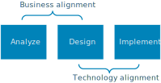

# Azure Application Architecture Guide

The cloud is changing the way applications are built and architected. Instead of monoliths, applications are being decomposed into smaller, decentralized services. These services communicate through APIs or by using asynchronous messaging or eventing. Applications scale horizontally, adding new instances as demand requires.  

These trends bring new challenges. Application state is distributed. Data may be eventually consistent. Work is distributed too. Operations are done in parallel and asynchronously. The system as a whole must be resilient when failures occur. Deployments must be automated and predictable. Monitoring and telemetry are critical for gaining insight into the system.

This guide presents a structured approach for designing applications on Azure that are scalable, resilient, and highly available. It is intended for architects and engineers who are designing solutions for Azure. 

> This is not a how-to guide for individual services in Azure, which are covered in the documentation for those services.

### Traditional vs modern cloud 

| Traditional on-premises | Modern cloud |
|-------------------------|--------------|
| Monolithic, centralized | Decomposed, de-centralized
| Design for predictable scalability | Design for elastic scale |
| Relational database | Polyglot persistence (mix of storage technologies) |
| Strong consistency | Eventual consistency |
| Serial and synchronized processing | Parallel and asynchronous processing |
| Design to avoid failures (MTBF) | Design for failure. (MTTR) |
| Occasional big updates | Frequent small updates |
| Manual management | Automated self-management |
| Snowflake servers | Immutable infrastructure |

## How this guide is structured

In this guide, we describe a series of steps on the path from design to implementation. Each step involves decisions about the architecture, starting with the most fundamental: What kind of architecture are you building? A Microservices architecture? A more traditional N-tier application? A Big Data solution?

As you move from design to implementation, the descisions become more granular and local. Should you place a message queue between two components? Can the application recover from a transient network failure? Using a structured approach helps you to keep the right focus at each stage. You move from the big picture to the particulars, and avoid making premature techical decisions early in the process.

For each step of the process, we point to related guidance on the Azure Architecture Center. This guide serves as a roadmap, while the supporting content goes deeper into each area.

<object data="./images/guide-steps.svg" type="image/svg+xml"></object>

## Analyze the business domain

The first step, before making any decisions about architecture or technology, is to analyze the business domain to derive functional and non-functional requirements.

**Functional requirements**. Use domain driven design (DDD) to identity bounded contexts. A *bounded context* is an explicit boundary around a domain model. It defines which parts of the domain the model applies to. Ideally, a bounded context maps directly to a subdomain of the business domain. (That might not always be the case. If the application integrates with legacy systems, for example, the bounded contexts may be messier than ideal.) 

Bounded contexts are the starting point when decomposing an application into services. Generally, application services should not cross bounded contexts. There might be multiple services within a bounded context. Throughout this guide, many of the decision points are applied within a bounded context. For example, when you select an architecture style, you should be looking at a bounded context. You might adopt a different style for another context.

> Does every application require a DDD approach? Not necessarily. If you're building a simple web application that mostly does CRUD operations on a data set, you may feel that DDD is superfluous. That said, DDD is compatible with agile development. There's no reason that DDD needs be a heavyweight process.

**Non-functional requirements**. Non-functional requirements will influence many of the technical decisions that you make along the way. 

| Requirement | Leads to... |
|-------------|------------|
| Recovery time objective (RTO) |  Failover period |
| Recovery point objective (RPO) | Backup interval  |
| Service level agreement (SLA) and service level objectives (SLO) | Choice of Azure services and level of redundancy |
| Throughput and latency | Choice of SKU or service tier |

## Choose an architecture style

We use the term *architecture style* to mean a family of architectures that share certain characteristics. For example, [N-tier][n-tier] is a common architecture style. More recently, [microservice architectures][microservices] have started to gain favor. 

What are the goals of choosing an architecture style?

- Managing dependencies across layers or services.
- Managing change. 
- Managing deployments, so that updates are reliable and low-risk.
- Data access patterns. For example, a subdomain of an application might be characterized by frequent reads from many independent clients, and relatively few writes. 
- Data ingestion patterns. For example, an application might require high velocity event ingestion (IoT).
     

> **Related guidance: [Architecture Styles][arch-styles]**

## Design principles

The ten principles listed here encapsulate a broad set of best practices and recommendations for cloud applications. Keep these high-level principles in mind throughout the design process. You can read more about each principle, with supporting examples for each. 

1. **[Use managed services.](./design-principles/managed-services.md)** When possible, use Platform as a Service (PaaS) over Infrastructure as a Service (IaaS).

2. **[Minimize coordination.](./design-principles/minimize-coordination.md)** Minimize coordination between application services to achieve scalability.
 
3. **[Partition around limits.](./design-principles/partition.md)** Use partitioning to work around database, network, and compute limits.

4. **[Design for scale out.](./design-principles/scale-out.md)** Design your application so that it can scale horizontally, adding or removing new instances as demand requires.

5. **[Design for self-healing.](./design-principles/self-healing.md)** In a distributed system, failures happen. Design your application to be self-healing when failures occur.

6. **[Make all things redundant.](./design-principles/redundancy.md)** Build redundancy into your application, to avoid having single points of failure.
 
7. **[Use the best data store for the job.](./design-principles/use-the-best-data-store.md)** Pick the storage technology that is the best fit for your data and how it will be used. 
 
8. **[Design for change.](./design-principles/design-for-change.md)** All successful applications change over time. An evolutionary design is key for continuous innovation.

9. **[Design for operations.](./design-principles/design-for-operations.md)** Design your application so that the operations team has the tools they need.

10. **[Build for the needs of business.](./design-principles/build-for-business.md)** Every design decision must be justified by a business requirement.

## Choose technologies 

Two technology choices should be decided early on, because they will affect the entire architecture. These are the choice of **compute** and **storage** technologies.

### Compute

The term *compute* refers to the hosting model for the computing resources that your applications runs on. At one end of the spectrum is **intrastructure-as-a-service (IaaS)**. You provision the VMs that you need, along with associated network and storage components. Then you deploy whatever software and applications you want onto those VMs. This model is the closest to a traditional on-premises environment, except that Microsoft manages the infrastructure for you.

**Platform-as-a-service (PaaS)** provides a managed hosting environment. You deploy your application, without needing to manage VMs or networking resources. For example, instead of creating individual VMs, you would simply set the instance count, and the service will provision, configure, and manage the necessary resources. Azure App Service is an examlple of a PaaS service.

**Functions-as-a-service (FaaS)** goes even further in removing the need to worry about the hosting environment. Instead of creating compute instances and deploying code to those instances, you simply deploy your code, and the managed service automatically runs it. You don't need to administer the compute resources. These services use a serverless architecture, and seamlessly scale up or down to whatever level necessary to handle the traffic. Azure Functions are a FaaS service.

IaaS gives the most control, flexibility, and portability. FaaS provides simplicity, ease of management, and potential cost savings, because you pay only for the time your code is running. PaaS falls somewhere between the two.

### Storage

Data services can be broken up into these major types:

Relational database management system (RDBMS). Relational databases store data in tables that consist of rows and columns.  

base their structure on two-dimensional tables comprising rows and columns. Most provide some form of SQL for performing query and data manipulation tasks. 

Key/Value Stores. A key/value store is essentially a large hash table, where each piece of data is a BLOB associated with a unique key. These stores can handle very flexible types of data and are easily scalable.

Document Databases. Document databases also use a key/value lookup mechanism, but store documents instead of BLOB data. Documents in this context consist of structured data, which the datastore makes accessible to the data consumer.

Column-Family Databases. Column-family databases organize data into rows and columns in similar manner to relational databases. However, column-family databases provide additional structure by grouping columns into logical families, which can be manipulated independently of the rest of the row.

Graph Databases. A graph database stores two types of information: nodes that you can think of entities, and edges which specify the relationships between nodes. The purpose of a graph database is to enable an application to efficiently perform queries that traverse the network of nodes and edges, and to analyze the relationships between entities.

Parallel Data Warehouses. A parallel data warehouse (PDW) provides a massively parallel solution for ingesting, storing, and analyzing data. PDWs are optimized for processing very large amounts of data in various formats.

Search Engine Databases. Search engine databases rapidly index large amounts of data from external data stores, enabling fast searching through the result set. 

Time Series Databases. Time series databases are optimized for dealing with data organized from time, such as telemetry data. These databases are designed to support large numbers of write operations, as the individual data points stored are small, but the overall amount of data sent to these databases can be quite large.

Shared Files. A shared file data store is simply a location where flat files can be stored and used by consuming applications and services. 

Some technologies may span multiple types. The technologies are changing quickly and the lines will continue to blur even more.

<!-- links -->

[arch-styles]: ./architecture-styles/overview.md
[n-tier]: ./architecture-styles/n-tier.md
[microservices]: ./architecture-styles/microservices.md