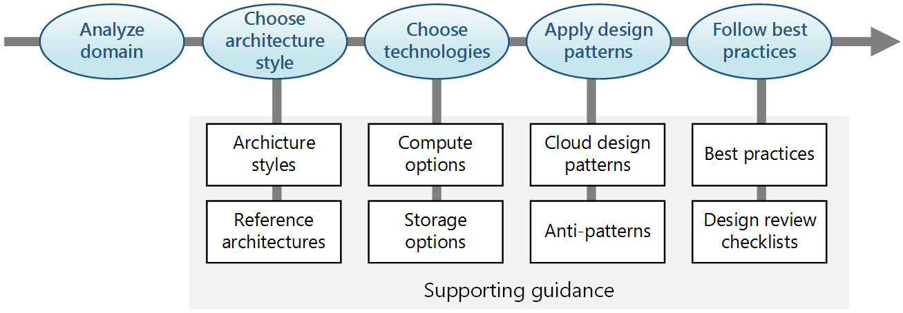
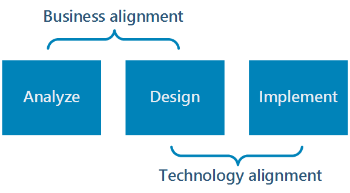

# Azure Application Architecture Guide

The cloud is changing the way applications are built and architected. Instead of monoliths, applications are being decomposed into smaller, decentralized services. These services communicate through APIs or by using asynchronous messaging or eventing. Applications scale horizontally, adding new instances as demand requires.  

These trends bring new challenges. Application state is distributed. Data may be eventually consistent. Work is distributed too. Operations are done in parallel and asynchronously. The system as a whole must be resilient when failures occur. Deployments must be automated and predictable. Monitoring and telemetry are critical for gaining insight into the system.

This guide presents a structured approach for designing applications on Azure that are scalable, resilient, and highly available. It is intended for architects and engineers who are designing solutions for Azure. 

> This is not a how-to guide for individual services in Azure, which are covered in the documentation for those services.

### Traditional vs modern cloud 

| Traditional on-premises | Modern cloud |
|-------------------------|--------------|
| Monolithic, centralized | Decomposed, de-centralized
| Design for predictable scalability | Design for elastic scale |
| Relational database | Polyglot persistence (mix of storage technologies) |
| Strong consistency | Eventual consistency |
| Serial and synchronized processing | Parallel and asynchronous processing |
| Design to avoid failures (MTBF) | Design for failure. (MTTR) |
| Occasional big updates | Frequent small updates |
| Manual management | Automated self-management |
| Snowflake servers | Immutable infrastructure |

## How this guide is structured

In this guide, we describe a series of steps on the path from design to implementation. Each step involves decisions about the architecture, starting with the most fundamental: What kind of architecture are you building? A Microservices architecture? A more traditional N-tier application? A Big Data solution?

As you move from design to implementation, the descisions become more granular and local. Should you place a message queue between two components? Can the application recover from a transient network failure? Using a structured approach helps you to keep the right focus at each stage. You move from the big picture to the particulars, and avoid making premature techical decisions early in the process.

For each step of the process, we point to related guidance on the Azure Architecture Center. This guide serves as a roadmap, while the supporting content goes deeper into each area.

## Analyze the business domain

The first step, before making any decisions about architecture or technology, is to analyze the business domain to derive functional and non-functional requirements.

**Functional requirements**. Use domain driven design (DDD) to identity bounded contexts. A *bounded context* is an explicit boundary around a domain model. It defines which parts of the domain the model applies to. Ideally, a bounded context maps directly to a subdomain of the business domain. (That might not always be the case. If the application integrates with legacy systems, for example, the bounded contexts may be messier than ideal.) 

Bounded contexts are the starting point when decomposing an application into services. Generally, application services should not cross bounded contexts. There might be multiple services within a bounded context. Throughout this guide, many of the decision points are applied within a bounded context. For example, when you select an architecture style, you should be looking at a bounded context. You might adopt a different style for another context.

> Does every application require a DDD approach? Not necessarily. If you're building a simple web application that mostly does CRUD operations on a data set, you may feel that DDD is superfluous. That said, DDD is compatible with agile development. There's no reason that DDD needs be a heavyweight process.

**Non-function requirements**. Non-functional requirements will influence many of the technical decisions that you make along the way. 

| Requirement | Leads to... |
|-------------|------------|
| Recovery time objective (RTO) |  Failover period |
| Recovery point objective (RPO) | Backup interval  |
| Service level agreement (SLA) and service level objectives (SLO) | Choice of Azure services and level of redundancy |
| Throughput and latency | Choice of SKU or service tier |

## Choose an architecture style

We use the term *architecture style* to mean a family of architectures that share certain characteristics. For example, [N-tier][n-tier] is a common architecture style. More recently, [microservice architectures][microservices] have started to gain favor. 

What are the goals of choosing an architecture style?

- Managing dependencies across layers or services.
- Managing change. 
- Managing deployments, so that updates are reliable and low-risk.
- Data access patterns. For example, a subdomain of an application might be characterized by frequent reads from many independent clients, and relatively few writes. 
- Data ingestion patterns. For example, an application might require high velocity event ingestion (IoT).
     
### Architecture styles as constraints

An architecture style places constraints on the design, including the set of elements that can appear and the allowed relationships between those elements. Constraints guide the "shape" of an architecture by restricting the universe of choices. When an architecture conforms to the constraints of a particular style, certain desirable properties emerge. 

For example, the constraints in microservices include: 

- A service represents a single responsibility. 
- Every service is independent of the others. 
- Data is private to the service that owns it; services do not share data.

By adhering to these constraints, what emerges is a system where services can be deployed independently, faults are isolated, frequent updates are possible, and it's easy to introduce new technologies into the application.

Before choosing an architecture style, make sure that you understand the underlying principles and constraints of that style. Otherwise, you can end up with a design that conforms to the style at a superficial level, but does not achieve the full potential of that style. 

It's also important to be pragmatic. Sometimes it's better to relax a constraint, rather than insist on architectural purity.

### Challenges and benefits

Constraints also create challenges, so it's important to understand the trade-offs when adopting any of these styles. Do the benefits of the architecture style outweigh the challenges, *for this application domain and bounded context*. 

Some of the challenges to consider include:

- Complexity. Is the complexity of the architecture justified for your domain? Conversely, is the style too simplistic for your domain? In that case, you risk ending up with a "ball of mud", because the architecture does not help you to manage dependencies cleanly.

- Data consistency, messaging. 

- Inter-service communication. As you decompose an application into separate services, there is a risk that network traffic between services will cause unacceptable latency or create bottlenecks. 

The choice of architecture style does not dictate a particular technology. However, some technologies are more naturally suited for some architectures. For example, containers are a natural fit for microservices. 

<!-- links -->

[n-tier]: ./architecture-styles/n-tier.md
[microservices]: ./architecture-styles/microservices.md