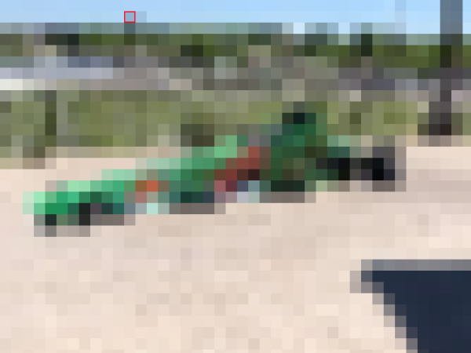
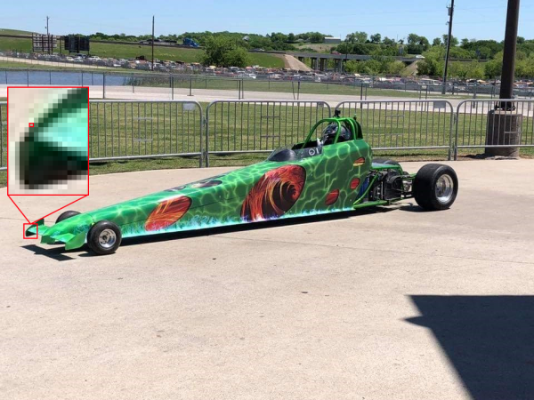
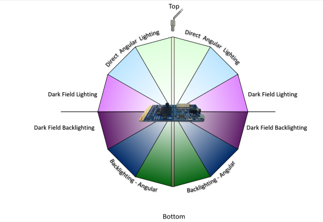

# Camera selection for Azure IoT Edge vision AI

One of the most critical components in a computer vision system is the camera. The camera must capture and present images that artificial intelligence (AI) or machine learning (ML) models can evaluate and identify correctly. This article provides an in-depth understanding of different camera types, capabilities, and considerations.

## Types of cameras

Camera types include area scan, line scan, and embedded smart cameras. There are many different manufacturers for these cameras. Select a vendor that fits your specific needs.

### Area scan cameras

Area scan cameras generate a traditional camera image. This camera typically has a matrix of pixel sensors. The camera captures a 2D image and sends it to the Azure IoT Edge hardware for evaluation.

Area scan cameras look at a large area, and are good for detecting changes. Examples of workloads that can use area scan cameras are workplace safety, or detecting or counting objects in an environment.

<!--Examples of manufacturers of area scan cameras are [Basler](https://www.baslerweb.com/en/products/industrial-cameras/), [Axis](https://www.axis.com), [Sony](https://www.sony-semicon.co.jp/e/products/IS/industry/product.html), [Bosch](https://commerce.boschsecurity.com/us/en/IP-Cameras/c/10164917899), [FLIR](https://www.flir.com/), [Allied Vision](https://www.alliedvision.com/en/products/customization/).-->

### Line scan cameras

A line scan camera has a single row of linear pixel sensors. The camera takes 1-pixel-width images in quick succession, stitches them together into a video stream, and sends the stream to the IoT Edge device for processing.

Line scan cameras are good for vision workloads where items are either moving past the camera, or need to be rotated to detect defects. The line scan camera then produces a continuous image stream for evaluation. Examples of workloads that work best with line scan cameras are:

- Item defect detection on parts that are moving on a conveyer belt
- Workloads that require spinning to see a cylindrical object
- Workloads that require rotation

<!--Examples of manufacturers of line scan cameras are [Basler](https://www.baslerweb.com/en/products/industrial-cameras/), [Teledyne Dalsa](https://www.teledynedalsa.com/en/home/), [Hamamatsu Corporation](https://www.hamamatsu.com/index.html?nfxsid=5ede4ac8e12e41591626440), [DataLogic](https://www.datalogic.com/), [Vieworks](https://vieworks.com/), and [Xenics](https://www.xenics.com/).-->

### Embedded smart cameras

An embedded smart camera is a self-contained, standalone system that can process as well as acquire images. Embedded smart cameras can use either an area scan or a line scan camera for capturing images, although a line scan smart camera is rare. These cameras usually have either an RS232 or an Ethernet output port, so they can integrate directly into a programmable logic controller (PLC) or other industrial IoT (IIoT) controller.

<!--Examples of manufacturers of embedded smart cameras are [Basler](https://www.baslerweb.com/en/products/industrial-cameras/), [Lesuze Electronics](https://www.leuze.com).-->

## Camera features

There are several features to consider when selecting a camera for a vision workload. The following sections discuss sensor size, resolution, and speed. Other camera features to consider include:

- Lens selection
- Focal length
- Monochrome or color depth
- Stereo depth
- Triggers
- Physical size
- Support

Camera manufacturers can help you understand what specific features your application requires.

### Sensor size

Sensor size is one of the most important factors to evaluate in a camera. The sensor is the hardware within a camera that captures the target and converts it into signals, which then produce an image. The sensor contains millions of semiconducting photodetectors called *photosites*.

A higher megapixel count doesn't always result in a better image. For example, a camera with 12 million photosites and a 1-inch sensor produces a clearer, sharper image than a camera with 12 million photosites and a ½-inch sensor. Cameras for computer vision workloads usually have sensor sizes between ¼ inch and 1 inch. Some cases might require much larger sensors.

Choose larger sensors if your vision workload has:

- A need for precision measurements
- Lower light conditions
- Shorter exposure times or fast-moving items

### Resolution

Resolution is another important factor in camera selection. You need higher resolution cameras if your workload:

- Must identify fine features, such as the writing on an integrated circuit chip
- Is trying to detect faces
- Needs to identify vehicles from a distance

The following images show the problem with using the wrong resolution for a given use case. Both images were taken 20 feet away from the car. The small red boxes represent one pixel.

- The following image was taken with 480 horizontal pixels:

  

- The following image was taken with 5184 horizontal pixels:

  

### Speed

If your vision workload requires capturing many images per second, two factors are important. The first factor is the speed of the camera interface connection. The second factor is the type of sensor. Sensors come in two types, [charge-coupled devices (CCD) and active-pixel sensors (CMOS)](https://en.wikipedia.org/wiki/Image_sensor). CMOS sensors have a direct readout from the photosites, so they typically offer a higher frame rate.

## Camera placement

The items you need to capture in your vision workload determine the locations and angles for camera placement. Camera location can also interact with sensor type, lens type, and camera body type. Two of the most critical factors for determining camera placement are lighting and field of view.

### Camera lighting

In a computer vision workload, lighting is critical to camera placement. You can apply several different lighting conditions. Lighting conditions that are useful for one vision workload might produce undesirable effects in a different workload.

There are several common lighting types for computer vision workloads:

- *Direct lighting* is the most common lighting condition. The light source is projected at the object to be captured.
- *Line lighting* is a single array of lights most used with line scan cameras. Line lighting creates a single line of light at the focus of the camera.
- *Diffused lighting* illuminates an object but prevents harsh shadows. Diffused lighting is mostly used around specular, or reflective, objects.
- *Axial diffused lighting* is often used with highly reflective objects, or to prevent shadows on the part to capture.
- *Back lighting* is used behind the object, producing a silhouette of the object. Back lighting is most useful for measurements, edge detection, or object orientation.
- *Custom grid lighting* is a structured lighting condition that lays out a grid of light on the object. The known grid projection provides more accurate measurements of item components, parts, and placement.
- *Strobe lighting* is used for high speed moving parts. The strobe must be in sync with the camera to take a *freeze* of the object for evaluation. Strobe lighting helps prevent motion blurring effects.
- *Dark field lighting* uses several lights with different angles to the part to be captured. For example, if the part is lying flat on a conveyor belt, the lights are at a 45-degree angle to the belt. Dark field lighting is most useful with highly reflective clear objects, and is commonly used for *lens scratch detections*.

The following figure demonstrates the angular placement of light sources:

### Field of view

In planning a vision workload, you need to know about the field of view (FOV) of the objects you're evaluating. FOV plays a part in camera selection, sensor selection, and lens configuration. FOV components include:

- Distance to objects. For example, is the object being monitored on a conveyor belt with the camera two feet above it, or across a parking lot? Camera sensors and lens configurations are different for different distances.
- Area of coverage. Is the area that the computer vision is trying to monitor small or large? This factor directly correlates to the camera's resolution, lens, and sensor type.
- Direction of the sun. If the computer vision workload is outdoors, you should consider the direction of the sun throughout the day. The angle of the sun as it moves might impact the computer vision model. If the camera gets direct sunlight in the lens, it might be blinded until the angle of the sun changes. If the sun casts a shadow over the object being monitored, the object might be obscured.
- Camera angle to the objects. If the camera is too high or too low, it might miss the details that the workload is trying to capture.

## Communication interface

In planning a computer vision workload, it's important to understand how the camera output interacts with the rest of the system. There are several standard ways that cameras communicate to IoT Edge devices:

- [Real Time Streaming Protocol (RTSP)](https://en.wikipedia.org/wiki/Real_Time_Streaming_Protocol) is an application-level network protocol that controls streaming video servers. RTSP transfers real-time video data from the camera to the IoT Edge compute endpoint over a TCP/IP connection.
- [Open Network Video Interface Forum (ONVIF)](https://www.onvif.org) is a global, open industry forum that develops open standards for IP-based cameras. These standards describe communication between IP cameras and downstream systems, interoperability, and open source.
- [Universal Serial Bus (USB)](https://en.wikipedia.org/wiki/USB)-connected cameras connect over the USB port directly to the IoT Edge compute device. This connection is less complex, but limits the distance the camera can be located from the IoT Edge device.
- [Camera Serial Interface (CSI)](https://www.mipi.org/specifications/csi-2) includes several standards from the Mobile Industry Processor Interface (MIPI) Alliance. CSI describes how to communicate between a camera and a host processor. CSI-2, released in 2005, has several layers:

  - Physical layer (either C-PHY or D-PHY)
  - Lane merger layer
  - Low-level protocol layer
  - Pixel to byte conversion layer
  - Application layer

  [CSI-2 v3.0](https://resources.mipi.org/blog/mipi-csi-2s-newest-frontier-machine-awareness) added support for RAW-24 color depth, Unified Serial Link, and Smart Region of Interest.
  
## Contributors

*This article is maintained by Microsoft. It was originally written by the following contributors.* 

Principal author:

 - [Keith Hill](https://www.linkedin.com/in/keith-hill-072060102/) | Senior PM Manager

*To see non-public LinkedIn profiles, sign in to LinkedIn.*

## Next steps

> [!div class="nextstepaction"]
> [Hardware acceleration in Azure IoT Edge vision AI](./hardware.md)
