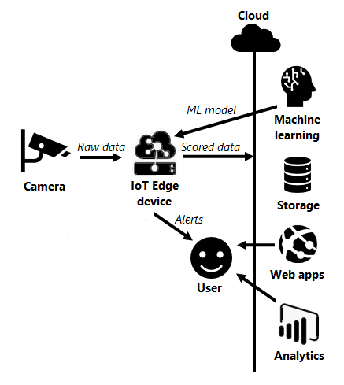

# Vision AI solutions with Azure IoT Edge

This series of articles describes how to plan and design a computer vision workload that uses [Azure IoT Edge](https://azure.microsoft.com/services/iot-edge). You can run Azure IoT Edge on devices, and integrate with Azure Machine Learning, Azure Storage, Azure App Services, and Power BI for an end-to-end vision AI solution.

Visually inspecting products, resources, and environments is critical for many endeavors. Visual inspection and analytics used to be human processes subject to inefficiency and inaccuracy. Enterprises now use deep learning artificial neural networks called *convolutional neural networks* (CNNs) to emulate human vision. Using CNNs for automated image input and analysis is commonly called *computer vision* or *vision AI*.

Technologies like containerization support portability, which allows migrating vision AI models to the network edge. You can train vision inference models in the cloud, containerize the models, and use them to create custom modules for Azure IoT Edge runtime-enabled devices. Deploying vision AI solutions at the edge yields performance and cost savings.

## Use cases for vision AI at the edge

Use cases for vision AI span manufacturing, retail, healthcare, and the public sector. Typical vision AI use cases include quality assurance, safety, and security.

### Quality assurance

In manufacturing environments, vision AI can inspect parts and processes fast and accurately. Automated quality inspection can:

- Monitor manufacturing process consistency.
- Check proper product assembly.
- Provide early defect notifications.

For an example IoT Edge vision AI scenario for this use case, see [User scenario 1: Quality control](user-interface.md#user-scenario-1-quality-control).

### Safety and security

Automated visual monitoring can scan for potential safety and security issues. Automation can provide more time to respond to incidents, and more opportunities to reduce risk. Automated safety monitoring can:

- Track compliance with personal protective equipment guidelines.
- Monitor and alert on entry into unauthorized zones.
- Alert on unidentified objects.
- Record unreported close calls or pedestrian-equipment near-misses.

For an example IoT Edge vision AI scenario for this use case, see [User scenario 2: Safety](user-interface.md#user-scenario-2-safety).

## Architecture

Vision AI solutions for IoT Edge involve several components and processes. The remaining articles in this series provide in-depth planning and design guidance for each area.

1. Cameras provide the input into computer vision systems. See [Camera selection for Azure IoT Edge vision AI](./camera.md).
1. Hardware acceleration on IoT Edge devices gives the necessary computing power for computer graphics and AI. See [Hardware acceleration in Azure IoT Edge vision AI](./hardware.md).
1. ML models deployed as IoT Edge modules score the incoming image data. See [Machine learning in Azure IoT Edge vision AI](./machine-learning.md).
1. Image scores that need attention trigger automatic alerts. See [Alert persistence in Azure IoT Edge vision AI](./alerts.md).
1. Relevant image data and metadata sync to cloud storage for ML retraining, troubleshooting, and analytics. See [Image storage and management for Azure IoT Edge vision AI](./image-storage.md).
1. Users interact with the system through user interfaces like apps, visualizations, and dashboards. See [User interfaces and scenarios in Azure IoT Edge vision AI](./user-interface.md).

## Considerations

Reasons to migrate computer vision workloads from the cloud to the edge include performance and cost.

### Performance considerations

- Exporting large amounts of data to the cloud can strain network infrastructure, causing performance issues.
- Retrieving results from the cloud can introduce unacceptable latency.
- Alerting via the cloud can lead to delay and more complexity.

For example, a person entering an unauthorized area might need immediate intervention. Positioning the scoring model near the data ingestion point allows near real-time image scoring and alerting.

### Cost considerations

Sending all data to the cloud for analysis can significantly impact the return on investment (ROI) of a computer vision initiative. IoT Edge custom vision modules can score image data and send only images deemed relevant with reasonable confidence to the cloud. Sending only selected images significantly reduces the amount of data going to the cloud, lowering costs.

## Next steps

To continue with this series about IoT Edge vision AI, go on to the next article:

> [!div class="nextstepaction"]
> [Camera selection for Azure IoT Edge vision AI](./camera.md)

To learn more about CNNs, vision AI, Azure Machine Learning, and Azure IoT Edge, see the following documentation:

- [Azure IoT Edge documentation](/azure/iot-edge)
- [Azure Machine Learning documentation](/azure/machine-learning)
- [Tutorial: Perform image classification at the edge with Custom Vision Service](/azure/iot-edge/tutorial-deploy-custom-vision)
- [What is Computer Vision?](/azure/cognitive-services/computer-vision/overview)
- [What is Azure Video Analyzer? (preview)](/azure/azure-video-analyzer/video-analyzer-docs/overview)
- [Azure Kinect DK developer kit documentation](/azure/kinect-dk)
- [Open Neural Network Exchange (ONNX) ML framework](https://onnx.ai)
- [Model management deep neural network (MMdnn) ML framework](https://github.com/Microsoft/MMdnn)

## Related resources

For more computer vision architectures, examples, and ideas that use Azure IoT, see the following articles:

- [Getting started with Azure IoT solutions](../../reference-architectures/iot/iot-architecture-overview.yml)
- [End-to-end manufacturing using computer vision on the edge](../../reference-architectures/ai/end-to-end-smart-factory.yml)
- [Connected factory hierarchy service](../../solution-ideas/articles/connected-factory-hierarchy-service.yml)
- [Connected factory signal pipeline](../../example-scenario/iot/connected-factory-signal-pipeline.yml)
- [Create smart places by using Azure Digital Twins](../../example-scenario/iot/smart-places.yml)
- [Deploy AI and ML computing on-premises and to the edge](../../hybrid/deploy-ai-ml-azure-stack-edge.yml)
