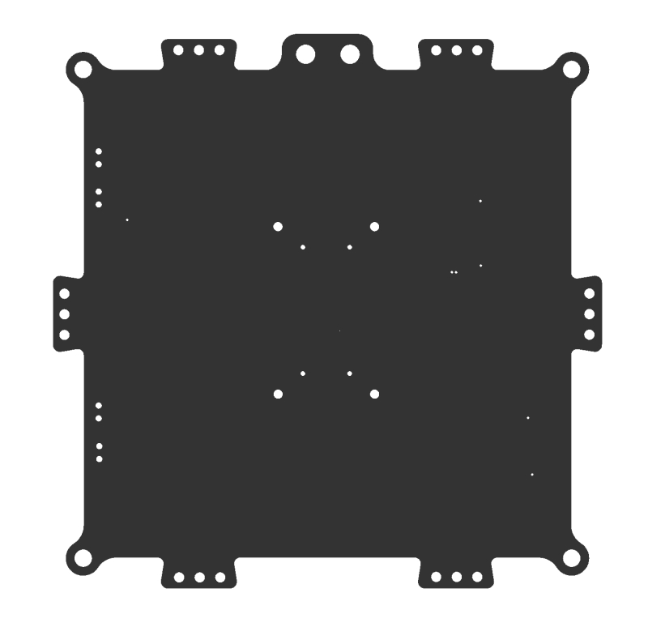
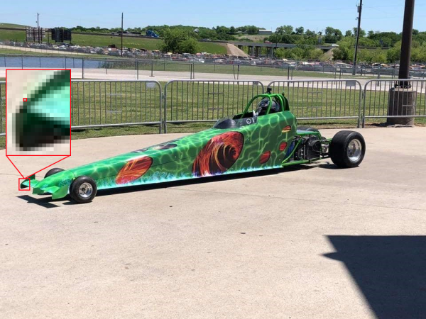

# User interface in Azure IoT Edge Vision

The user interface requirements of an IoT solution will vary depending on the overall solution objectives. In general, there are four user interfaces that are commonly found on IoT solutions: Administrator, Operator, Consumer and Analytics. In this guidance, we are going to focus on simple operator’s user interface and visualization dashboard. We will provide a reference implementation of the latter two

* **Administrator:** Allows full access to device provisioning, device and solution configuration, user management etc. These features could be provided as part of one solution or as separate solutions.
* **Consumer:** Only applicable to consumer solution. They provide similar access to the operators’ solution but limited to devices owned by the user
* **Operator:** Provides centralize access to the operational components of the solutions which typically includes device management, alerts monitoring and configuration.  
* **Analytics:** Interactive dashboard which provide visualization of telemetry and other data/analysis.

## Technology Options

Power BI is a compelling option for our Analytics/Virtualization needs. It provides power features to create customizable interactive dashboards. It also allows connectivity to many popular database systems and services. It is available as a managed service and as a self-hosted package. The former is the most popular and recommend options. With Power BI embedded you could add customer-facing reports, dashboards, and analytics in your own applications by using and branding Power BI as your own. Reduce developer resources by automating the monitoring, management, and deployment of analytics, while getting full control of Power BI features and intelligent analytics.

Another suitable technology for IoT visualizations is Azure Maps which allows you to create location-aware web and mobile applications using simple and secure geospatial services, APIs, and SDKs in Azure. Deliver seamless experiences based on geospatial data with built-in location intelligence from world-class mobility technology partners.

Azure App Service is a managed platform with powerful capabilities for building web and mobile apps for many platforms and mobile devices. It allows developers to quickly build, deploy, and scale web apps created with popular frameworks .NET, .NET Core, Node.js, Java, PHP, Ruby, or Python, in containers or running on any operating system. You can also meet rigorous, enterprise-grade performance, security, and compliance requirements by using the fully managed platform for your operational and monitoring tasks.

For real time data reporting, Azure SignalR Service, makes adding real-time communications to your web application is as simple as provisioning a service—no need to be a real-time communications guru! It easily integrates with services such as Azure Functions, Azure Active Directory, Azure Storage, Azure App Service, Azure Analytics, Power BI, IoT, Cognitive Services, Machine Learning, and more.
To secure your user interface solutions, the Azure Active Directory (Azure AD) enterprise identity service provides single sign-on and multi-factor authentication to help protect your users from 99.9 percent of cybersecurity attacks.

## Scenario 1

Contoso Boards produces high quality circuit boards used in computers. Their number one product is a motherboard. Lately they have been seeing an increase in issues with chip placement on the board. Through their investigation they have noticed that the circuit boards are getting placed incorrectly on the assembly line. They need a way to identify if the circuit board is placed on the assembly line correctly.   The data scientist at Contoso Boards are most familiar with TensorFlow and would like to continue using it as their primary ML model structure.  Contoso Boards has several assembly lines that produce these mother boards.  Contoso Boards would also like to centralized management of the entire solution.

### Considerations in this scenario

What are we analyzing?

* Motherboard

Where are we going to be viewing the motherboard from?

* Assembly Line Conveyor belt

What camera do we need?

* Area or Line scan
* Color or Monochrome
* CCD or CMOS Sensor
* Global or rolling shutter
* Frame Rate
* Resolution

What type of lighting is needed?

* Backlighting
* Shade
* Darkfield

How should the camera be mounted?

* Top down
* Side view
* Angular

What hardware should be used?

* CPU
* FPGA
* GPU
* ASIC

### Solution

Based on the overall solution that the Contoso Boards is looking for with this vision use case we should be looking for edge detection of the part.  Based on this we need to **position a camera directly above the at 90 degrees and about 16 inches above the part**. Since the conveyer system moves relatively slowly, we can use an **Area Scan** camera with a **Global shutter**. For this use case our camera should **capture about 30 frames per second**. As for the resolution using the formula of Res=(Object Size) Divided by (details to be captured). Based on the formula Res=16”/8” give 2MP in x and 4 in y so we need a **camera capable of 4MP**. As for the sensor type, we are not fast moving, and really looking for an edge detection, so a CCD sensor could be used, however a **CMOS sensor** will be used. One of the more critical aspects for any vision workload is lighting. In this application Contoso Boards should choose to use a **white diffused filter back light**. This will make the part look almost black and have a high amount of contrast for edge detection. When it comes to color options for this application it is better to be in black and white, as this is what will yield the sharpest edge for the detection AI model.   Looking at what kind of hard, the data scientist are most familiar with TensorFlow and learning ONNX or others would slow down the time for development of the model.  Also because there are several assembly lines that will use this solution, and Contoso Boards would like a centrally managed edge solution so **Azure Stack Edge** (with GPU option) would work well here.  Based on the workload, the fact that Contoso Boards already know TensorFlow, and this will be used on multiple assembly lines, GPU based hardware would be the choice for hardware acceleration.

The following figure shows a sample of what the camera would see in this scenario:

## Scenario 2

Contoso Shipping recently has had several pedestrian accidents at their loading docks. Most of the accidents are happening when a truck leaves the loading dock, and the driver does not see a dock worker walking in front of the truck. Contoso Shipping would like a solution that would watch for people, predict the direction of travel, and warn the drivers of potential dangers of hitting the workers.  The distance from the cameras to Contoso Shipping's server room is to far for GigE connectivity, however they do have a large WIFI mesh that could be used for connectivity.  Most of the data scientist that Contoso Shipping employ are familiar with Open-VINO and they would like to be able to reuse the models on additional hardware in the future.  The solution will also need to ensure that devices are operating as power efficiently as possible.  Finally, Contoso Shipping needs a way to manage the solution remotely for updates.  

### Considerations in this scenario

What are we analyzing?

* People and patterns of movement

Where are we going to be viewing the people from?

* The loading docks are 165 feet long
* Cameras will be placed 17 feet high to keep with city ordnances.
* Cameras will need to be positioned 100 feet away from the front of the trucks.
* Camera focus will need to be 10 feet behind the front of the truck, and 10 additional feet in front of the truck, giving us a 20 foot depth on focus.

What camera do we need?

* Area or Line scan
* Color or Monochrome
* CCD or CMOS Sensor
* Global or rolling shutter
* Frame Rate
* Resolution

What type of lighting is needed?

* Backlighting
* Shade
* Darkfield

What hardware should be used?

* CPU
* FPGA
* GPU
* ASIC

How should the camera be mounted?

* Top down
* Side view
* Angular

### Solution

Based on the distance of the loading dock size Contoso Shipping will require several cameras to cover the entire dock. Based on zoning laws that Contoso Shipping must adhere to require that the surveillance cameras cannot be mounted higher that 20 feet. In this use case the average size of a worker is 5 foot 8 inches. The solution must use the least number of cameras as possible.

Formula:

For an example if we look at the following images:

Taken with 480 horizontal pixels at 20 foot

Taken with 5184 horizontal pixels at 20 foot

The red square is shown to illustrate one pixel color.

*Note: This is the issue with using the wrong resolution camera for a given use case. Lens can impact the FOV, however, if the wrong sensor is used for that given use case the results could be less than expected.*

With the above in mind, when choosing a camera for the overall solution required for Contoso Shipping, we need to think about how many cameras and at what resolution is needed to get the correct amount of details to detect a person. Since we are only trying to identify if a person is in the frame or not, our PPF does not need to be around 80 (which is what is about needed for facial identification) and we can use somewhere around 15-20. That would place the FOV around 16 feet. A 16-foot FOV would give us about 17.5 pixels per foot…which fits within our required PPF of 15-20. This would mean that we need a **10MP camera that has a horizontal resolution of ~5184 pixels**, and a lens that would allow for a **FOV of 16 feet**. When looking at the solution the cameras would need to be placed outside, and the choice of sensor type should not allow for “bloom”. Bloom is when light hits the sensor and overloads the sensor with light…this causes a view of almost over exposure or a “white out” kind of condition. **CMOS** is the choice here. Contoso operates 24x7 and as such needs to ensure that nighttime personal are also protected. When looking at color vs Monochrome, **Monochrome** handles low light conditions much better, and we are not looking to identify a person based on color monochrome sensors are a little cheaper as well. How many cameras will it take? Since we have figured out that our cameras can look at a 16 foot path, it is just simple math. 165 foot dock divided by 16 foot FOV gives us 10.3125 cameras. So the solution would need **11 Monochrome 5184 horizontal pixel (or 10MP) CMOS cameras with IPX67 housings or weather boxes**. The cameras would be mounted on 11 poles 100 feet from the trucks at 17f high.  Based on the fact that the data scientist are more familiar with **Open-VINO** data models should be built in **ONNX**.  When looking for what hardware should be used, they need a device that can be connected over WIFI, and use as little power as possible.  Based on this they should look to an **FPGA processor**. Potentially an ASIC processor could also be utilized, but due to the nature of how an ASIC processor works, it would not meet the requirement of being able to use the models on different hardware in the future.

