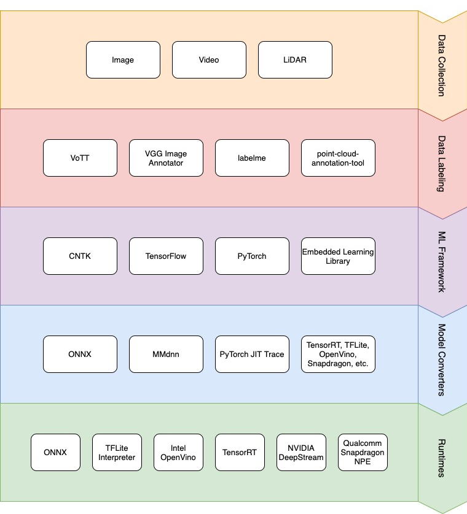

# Machine learning in Azure IoT Edge vision AI

IoT Edge systems, with their limited memory, compute capacity, and power capabilities, present unique challenges and requirements for machine learning (ML). This article discusses ML data and architectural choices for Azure IoT Edge vision AI solutions. The article also discusses the process of choosing, training, and deploying ML solutions, and gives examples of ML platform and tool choices.

Training ML models is an iterative, data-driven process. Choosing the data and architecture to use for an ML solution is also an iterative process. If a chosen ML model performs poorly, you can address issues through experimentation and retraining.

To determine the correct data to use and train an ML model to score data correctly, you need knowledge of the problem domain. You also need experience designing and using ML algorithms or neural networks. IoT Edge AI projects also require expertise with deploying models to IoT Edge hardware. Make sure your team has the necessary knowledge to explore and evaluate all appropriate solutions.

When investigating and choosing ML models for IoT Edge scenarios, follow these guidelines:

- Clearly define the problem to solve.
- Ensure or acquire sufficient expertise in the problem domain, ML, and IoT Edge scenarios.
- Understand the type of data the devices collect, to determine the kind of ML algorithm to use.
- Make sure to use representative data, with enough variability to represent all classes.
- Consider how to solve the problem without ML, or with the simplest possible ML algorithm.
- Plan to test several ML architectures that have different learning capacities.
- Have a way to collect new data from devices to retrain the ML models.

## Machine learning data

Data sources and attributes dictate how to build the system. Before you train any models, collect and examine real world data. For vision AI, the streaming data signal can be still images, videos, or Light Detection and Ranging (Lidar) data.

Be sure to collect and use a *balanced dataset* that equally represents all data classes or categories. The more representative the data collected for training, the better the model performs.

Datasets for ML model training are split into training, validation, and test subsets.

- The *training* dataset is used for the actual model training, over many passes or iterations called *epochs*.
- Throughout training, the model is spot-checked for performance on the *validation* dataset.
- After training is finished, the *test* dataset is passed through the model to assess how well the model performs as a proxy to the real world.

  > [!TIP]
  > Don't optimize models for one test dataset. It's a good idea to have a few different test datasets.

[Deep learning](/azure/machine-learning/concept-deep-learning-vs-machine-learning) finds signals in noise better than traditional ML, and helps avoid costly and difficult feature engineering, featurizations, and preprocessing. Deep learning still uses data transformations to clean or reformat data for model input. Transformations are needed both during training and during *inference*, or using the model to score new data.

For IoT Edge vision AI solutions, advanced preprocessing like denoising, adjusting brightness or contrast, or transformations from RGB to HSV can greatly affect model performance. Sometimes, you can only fully observe and evaluate these effects in a real-world situation.

After installing IoT Edge hardware in its permanent location, monitor the incoming data stream for *data drift*. Data drift is deviation of current data from the original data, and often causes degraded model performance and accuracy. Decreased performance can also be due to other factors, like hardware or camera failure.

The system must also collect new data for retraining rounds. You can also use the new data to monitor components for hardware degradation.

Here are key recommendations for data in IoT Edge vision ML models:

- Use a balanced dataset with all classes represented equally.
- Make sure the data is as representative as possible.
- Have a system in place to test for data drift.
- Have a system in place to collect new data for retraining.
- Only run a test set through a new ML model once. Iterating and retesting on the same test set can cause *overfitting* to the test set.

## Machine learning architecture

ML architecture is the layout of mathematical operations that process data input into desired actionable output. In deep learning, architecture describes the number and arrangement of layers and neurons in each layer of a deep neural network. Learnable parameters correlate to the number of layers and neurons per layer. The number of learnable parameters determine a model's *memorization capacity*.

You choose an ML architecture to achieve the best possible performance metric, such as accuracy. In the exploratory phase, consider several different architectures before choosing one. You might update both the choice of data and the choice of architecture during this phase.

During training, assessment values pass through *optimization* and *weight updates*. Issues can arise when training an ML model, after training, or even at the point of inferencing on devices. *Overfitting* and *underfitting* are two common issues found during training and testing.

Overfitting occurs when the model fits to the training or testing data so closely that it can't generalize well to new data. For example, a model only performs well indoors, because the training data was from an indoor setting. Overfitting can give a false sense of success, because the performance metric might be very good when the input data looks like the training data.

Many issues can cause overfitting, some beyond the scope of this article. Common causes of overfitting include:

- The model learned to focus on non-representative features that were only in the training dataset.
- The training data didn't have enough complexity or variation.
- The model was trained over too many iterations.
- The model architecture has too many learnable parameters.

Underfitting happens when the model has generalized so much that it can't tell the difference between classes with confidence. The training [loss](/dotnet/machine-learning/resources/glossary#loss-function) is unacceptably high.

Common causes of underfitting include:

- There weren't enough samples available in the training data.
- The model was trained over too few iterations and is overgeneralized.
- The model was unable to recognize objects, or had poor recognition and high loss values during training.

*Capacity* refers to network size and number of learnable parameters. An ML architecture can have too much or too little capacity. *Transfer learning* happens when some network layers are set as not trainable, or *frozen*. Increasing capacity means opening up more layers earlier in the network. Less capacity means using only the last few layers in training, with the rest remaining frozen.

There's no hard and fast rule for determining the number of layers needed in deep neural networks. Several model architectures might need to be evaluated within an ML task. In general, start with smaller networks and fewer layers and parameters. Increase the complexity gradually.

Another consideration for architecture choice is inference speed requirements. Faster inference speed can be associated with lower performance, accuracy, confidence, or precision. Assess and determine the acceptable speed versus accuracy tradeoff for your needs.

Base discussions about ML training and inferencing on the preceding considerations, and any company-specific requirements. If company policy allows, open-source solutions provide many ML algorithmic possibilities. Most cutting-edge ML work is in the open-source domain.

Here are key recommendations for making ML model architecture decisions:

- Watch for overfitting and underfitting.
- Test several ML architectures.
- Trade off between too much network capacity and too little. Start with too little, and build up from there.
- Trade off between speed and performance metrics such as accuracy.
- Investigate open-source ML solution if possible.
- Don't iterate indefinitely. When ML model performance is acceptable, the exploratory phase is complete.

## Model deployment on IoT Edge devices

The IoT Edge ML model deployment process follows a cyclical, iterative pattern.

First, formulate a clear, data-driven problem statement, and decide on the desired outcome and success metrics. Then, take the steps illustrated in the following diagram:

1. Collect or acquire data from a representative data source.

   Generally, the more data the better, and the more data variability, the better the generalization. Data collection or acquisition can be an online image search from a currently deployed device.

1. Label the data.

   You can label the data for a small number of images in-house, such as when using transfer learning. If many images need labeling, you can use a vendor for both data collection and labeling.
   
1. Train a model with an ML framework.

   Choose an ML framework like [TensorFlow](https://www.tensorflow.org) or [PyTorch](https://pytorch.org), both with Python and C++ APIs. Framework choice usually depends on the code samples that are available open-source or in-house, and the team's expertise and preference.

   The chosen code language partly determines what API or SDK to use for ML model training and inferencing. The API or SDK then dictates the types of ML model, device, and IoT Edge module to use.

   For example, if the app developer is building a C++ app, use a framework like PyTorch, TensorFlow, or CNTK that has C++ inferencing APIs. The PyTorch C++ inferencing and training API works well with the OpenCV C++ API.

   You can use [Azure Machine Learning](https://azure.microsoft.com/services/machine-learning) to train models using any ML framework and approach. Azure Machine Learning is framework-agnostic, has Python and R bindings, and includes many wrappers around popular frameworks.

1. Convert the model for inferencing on the device.

   You almost always have to convert the ML model to work with a particular IoT Edge runtime. Model conversion usually includes optimizations like faster inference and smaller model footprint. The process differs for each ML framework and runtime. [ONNX](https://onnx.ai) and [MMdnn](https://github.com/Microsoft/MMdnn) are some available open-source interoperability frameworks.

1. Build the solution for the device.

   You build the solution on the same type of device that you use for the final deployment, because binary files are system-specific.

1. Using the runtime, deploy the solution to the device.

   Choose a runtime, usually in conjunction with the ML framework choice, and deploy the compiled solution. The [Azure IoT Edge runtime](/azure/iot-edge/iot-edge-runtime) is a Docker-based system that can deploy the ML models as containers.
   
1. Continue to collect data to use for retraining and monitoring.

The following diagram shows a sample data science process that uses open-source tools for the deployment workflow. Data type and availability drive most of the choices, including the devices and hardware chosen.

If a workflow already exists for data scientists and app developers, a few other recommendations apply:

- Have a code, model, and data versioning system in place.
- Have an automation plan for testing code, integration, triggers, and the build/release process. Automated testing speeds up the time to production.

Here are the key ML and data science considerations for deployingg IoT Edge vision AI scenarios:

- Converting models involves optimizations like faster inference and smaller model footprints, which are critical for resource-constrained devices.
- Build the solution on the same type of build-dedicated device to be used for final deployment.
- The chosen code language and ML framework depend on the ML practitioner's experience and what is available in open-source.
- The chosen runtime depends on the type of device and hardware acceleration available for ML.
- It's important to have a code, model, and data versioning system and automated testing in place.

## Next steps

> [!div class="nextstepaction"]
> [Image storage and management in Azure IoT Edge Vision](./image-storage.md)
