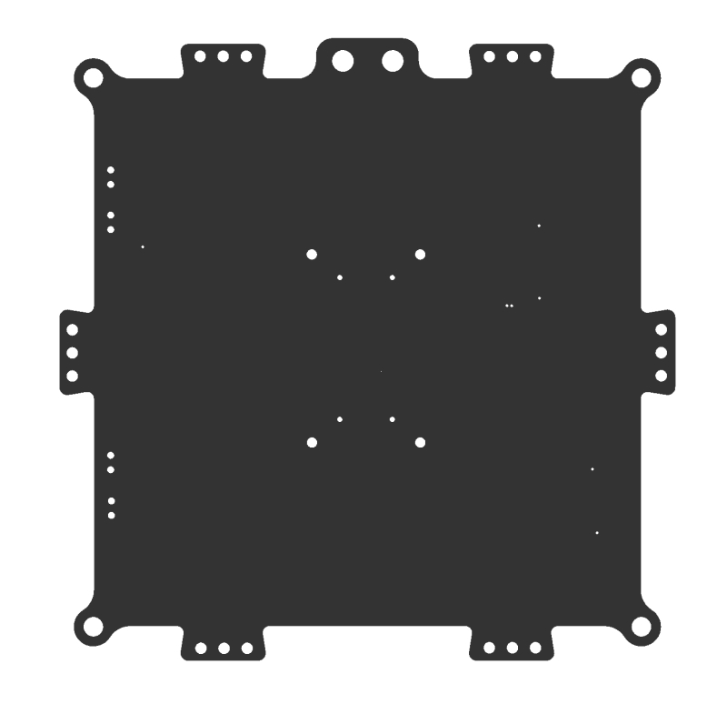
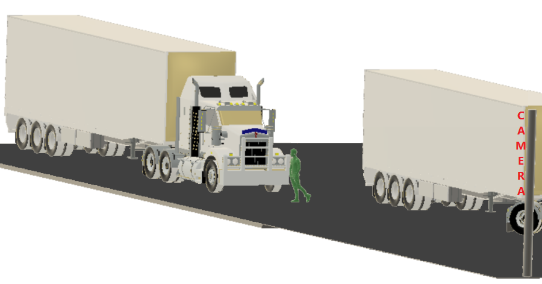

# User interfaces and scenarios for Azure IoT Edge vision AI

This final article in the Azure IoT Edge vision AI series discusses how users interact with internet of things (IoT) and artificial intelligence (AI) solutions. The article also presents two example IoT Edge vision AI scenarios.

## User interfaces

Users interact with computer systems through a user interface (UI). UI requirements vary depending on overall objectives. IoT systems usually have four UI types:

- The *administrator* UI allows full access to device provisioning, device and solution configuration, and user management. These features can be part of one solution, or separate solutions.
- An *operator* UI provides access to the solution's operational components, such as device management, alert monitoring, and configuration.
- A *consumer* UI applies only to consumer-facing solutions. The UI is similar to an operator's interface, but is limited to the devices the user owns.
- An *analytics* UI is an interactive dashboard that provides telemetry visualizations and other data analyses.

### Technology choices

Here are some of the services and software you can use to create user interfaces for IoT Edge vision AI systems:

- [Azure App Service](https://azure.microsoft.com/services/app-service) is a platform for developers to quickly build, deploy, and scale web and mobile apps. App Service supports frameworks like .NET, .NET Core, Node.js, Java, PHP, Ruby, or Python. Apps can be in containers or run on any supported operating system, mobile device, or IoT Edge hardware. The fully managed App Service platform meets enterprise-grade performance, security, and compliance requirements.

- [Azure SignalR Service](https://azure.microsoft.com/services/signalr-service) adds real-time data communications and reporting to apps, without requiring in-depth real-time communications expertise. SignalR Service integrates easily with many Azure cloud services.

- [Azure Maps](https://azure.microsoft.com/services/azure-maps) is a technology for IoT visualization and computer vision projects. Azure Maps lets you create location-aware web and mobile apps by using simple and secure geospatial services, APIs, and SDKs. Azure Maps has built-in location intelligence from worldwide technology partners. You can deliver seamless experiences based on geospatial data.

- [Azure Active Directory (Azure AD)](https://azure.microsoft.com/services/active-directory) provides single sign-on and multi-factor authentication to secure your apps and user interfaces.

- [Power BI](https://powerbi.microsoft.com) is a set of analytics services, apps, and connectors that turn data into customizable, interactive visualizations and dashboards. Power BI is available as a managed service or self-hosted package, and connects to many popular database systems and data services. With [Power BI Embedded](https://azure.microsoft.com/services/power-bi-embedded), you can create customer-facing reports and dashboards, and brand them as your own apps. Power BI can conserve developer resources by automating analytics monitoring, management, and deployment.

## User scenario 1: Quality control

Contoso Boards produces high-quality circuit boards used in computers. Their number one product is a motherboard.

Contoso Boards saw an increase in issues with chip placement on the board. Investigation determined that the circuit boards were being placed incorrectly on the assembly line. Contoso Boards needed a way to identify and check correct circuit board placement.

The Contoso Boards data scientists were familiar with [TensorFlow](https://www.tensorflow.org), and wanted to continue using it as their primary ML model structure. Contoso Boards also wanted to centralize management of several assembly lines that produce the motherboards.

The Contoso Boards solution focuses on edge detection.

### Camera

The following camera choices supported this workload:

- Camera placement: The camera is directly above at 90 degrees and about 16 inches from the part.
- Camera type: Since the conveyer system moves relatively slowly, the solution can use an area scan camera with a global shutter.
- Frame rate: For this use case, the camera captures about 30 frames per second.
- Resolution: The formula for required resolution is `Res=(object size) / (details to capture)`. Based on this formula, `Res=16"/8"` gives 2 megapixels (MP) in `x` and 4MP in `y`, so Contoso Boards needs a camera capable of 4MP resolution.
- Sensor type: The targets aren't fast moving, and only require edge detection, so a CMOS sensor works well.
- Lighting: The solution use a white diffused filter back light. This lighting makes the part look almost black, with high contrast for edge detection.
- Color: Monochrome yields the sharpest edges for the AI detection model.

The following image shows what the camera captures in this scenario:

### Hardware acceleration

Based on the workload, the use of TensorFlow, and the usage on several assembly lines, GPU-based hardware is the best choice for hardware acceleration.

### ML model

The data scientists are most familiar with TensorFlow, so learning ONNX or other ML frameworks would slow down model development. [Azure Stack Edge](https://azure.microsoft.com/products/azure-stack/edge) provides a centrally managed edge solution for all assembly lines.

## User scenario 2: Safety

Contoso Shipping has had several pedestrian accidents at their loading docks. Most accidents happened when a truck left the loading dock, and the driver didn't see a dock worker walking in front of the truck. Contoso Shipping needed a vision AI solution that could watch for people, predict their direction of travel, and warn drivers of potential collisions.

Most of the data scientists at Contoso Shipping were familiar with [OpenVINO](https://docs.openvino.ai/latest/index.html), and wanted to reuse the solution models on future hardware. The solution also needed to support power efficiency, and use the smallest possible number of cameras. Finally, Contoso Shipping wanted to manage the solution remotely for updates.

### Cameras

The solution uses 11 monochrome, 10MP CMOS cameras with IPX67 housings or weather boxes, mounted on 17-foot poles, 100 feet away from the trucks. The following sections describe how Contoso Shipping determined these specifications.

#### Camera placement

Cameras needed to be 100 feet away from the fronts of the trucks. Camera focus had to be 10 feet in front of and behind the fronts of the trucks, giving a 20-foot depth of focus. Local zoning laws limited surveillance camera height to 20 feet.

The following illustration shows the camera placement for this scenario:

#### Resolution and field of view

The solution must capture only enough detail to detect a person in the frame. The pixels per foot (PPF) can be around 15-20, rather than the 80 PPF that facial recognition needs.

The formula for field of view (FOV) is `FOV=(horizontal resolution) / (PPF)`. For resolution, the camera must use the right sensor for the use case.

This solution uses camera lenses that allow a 16-foot FOV. Using the preceding formula, a 16-foot FOV gives about 17.5 PPF, which falls within the required 15-20 PPF. This FOV means the solution should use 10MP cameras, which have a horizontal resolution of about 5184 pixels.

Since the cameras can look at a 16-foot path, a 165-foot long loading dock divided by a 16-foot FOV gives 10.3125 cameras. So the solution needs 11, 5184-horizontal pixel or 10MP cameras.

#### Sensor type

The cameras are outdoors, so the sensor type shouldn't allow *bloom*. Bloom is when light hits the sensor and overloads the sensor, causing overexposure or whiteout. CMOS is the sensor of choice.

#### Color and lighting

Contoso Shipping operates 24/7, and must also protect nighttime personnel. Monochrome handles low light conditions better than color. In this case, color information is unnecessary. Monochrome sensors are also lower cost.

### ML model

Because the data scientists are familiar with OpenVINO, the solution builds data models in [ONNX](https://onnx.ai).

### Hardware acceleration

The distance from the cameras to the servers is too far for Gigabit Ethernet or USB connectivity, but there's a large mesh Wi-Fi network. The hardware must connect over Wi-Fi, and use as little power as possible.

Based on these requirements, the solution uses FPGA processors. The solution could also use ASIC processors, but purpose-built ASIC chips don't meet the requirement for future usability.

## Contributors

*This article is maintained by Microsoft. It was originally written by the following contributors.* 

Principal author:

 - [Keith Hill](https://www.linkedin.com/in/keith-hill-072060102/) | Senior PM Manager

*To see non-public LinkedIn profiles, sign in to LinkedIn.*

## Next steps

This series of articles described how to build a vision AI workload with Azure IoT Edge. For the other articles in this series, see:

- [Azure IoT Edge vision AI overview](./index.md)
- [Camera selection for Azure IoT Edge vision AI](./camera.md)
- [Hardware acceleration in Azure IoT Edge vision AI](./hardware.md)
- [Machine learning and data science in Azure IoT Edge vision AI](./machine-learning.yml)
- [Image storage and management for Azure IoT Edge vision AI](./image-storage.md)
- [Alert persistence in Azure IoT Edge vision AI](./alerts.md)

To learn more about CNNs, vision AI, Azure Machine Learning, and Azure IoT Edge, see the following documentation:

- [Azure IoT Edge documentation](/azure/iot-edge)
- [Azure Machine Learning documentation](/azure/machine-learning)
- [Tutorial: Perform image classification at the edge with Custom Vision Service](/azure/iot-edge/tutorial-deploy-custom-vision)
- [What is Computer Vision?](/azure/cognitive-services/computer-vision/overview)
- [Azure Kinect DK developer kit documentation](/azure/kinect-dk)
- [Open Neural Network Exchange (ONNX) ML framework](https://onnx.ai)
- [Model management deep neural network (MMdnn) ML tool](https://github.com/Microsoft/MMdnn)

## Related resources

For more computer vision architectures, examples, and ideas that use Azure IoT, see the following articles:

- [Getting started with Azure IoT solutions](../../reference-architectures/iot/iot-architecture-overview.md)
- [End-to-end manufacturing using computer vision on the edge](../../reference-architectures/ai/end-to-end-smart-factory.yml)
- [Connected factory hierarchy service](../../solution-ideas/articles/connected-factory-hierarchy-service.yml)
- [Connected factory signal pipeline](../../example-scenario/iot/connected-factory-signal-pipeline.yml)
- [Create smart places by using Azure Digital Twins](../../example-scenario/iot/smart-places.yml)
- [Deploy AI and ML computing on-premises and to the edge](../../hybrid/deploy-ai-ml-azure-stack-edge.yml)

