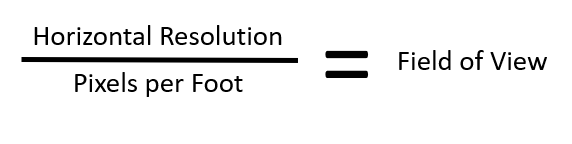

# User interface in Azure IoT Edge Vision

The user interface requirements of an IoT solution will vary depending on the overall objectives. Four types of user interfaces are commonly found in IoT solutions:

* **Administrator:** Allows full access to device provisioning, device and solution configuration, user management, and so on. These features could be provided as part of one solution or as separate solutions.
* **Consumer:** Is only applicable to consumer solutions. They provide similar access to the operator's interface, but limited to the devices owned by the user.
* **Operator:** Provides centralized access to the operational components of the solution. It typically includes device management, alerts monitoring, and configuration.
* **Analytics:** Is an interactive dashboard which provides visualization of telemetry and other data analyses.

This article focuses on a simple operator's user interface and visualization dashboard.

## Technology options

- **Power BI:** Power BI is a compelling option for our analytics and virtualization needs. It provides power features to create customizable interactive dashboards. It also allows connectivity to many popular database systems and services. It is available as a managed service and as a self-hosted package. The former is the most popular and recommended option. With Power BI embedded in your solution, you could add customer-facing reports, dashboards, and analytics in your own applications by using and branding Power BI as your own. You can reduce developer resources by automating the monitoring, management, and deployment of analytics, while getting full control of Power BI features and intelligent analytics.

- **Azure Maps:** Another suitable technology for IoT visualizations is Azure Maps which allows you to create location-aware web and mobile applications using simple and secure geospatial services, APIs, and SDKs in Azure. You can deliver seamless experiences based on geospatial data with built-in location intelligence from world-class mobility technology partners.

- **Azure App Service:** Azure App Service is a managed platform with powerful capabilities for building web and mobile apps for many platforms and mobile devices. It allows developers to quickly build, deploy, and scale web apps created with popular frameworks, such as .NET, .NET Core, Node.js, Java, PHP, Ruby, or Python, in containers or running on any supported operating system. You can also meet rigorous, enterprise-grade performance, security, and compliance requirements by using the fully managed platform for your operational and monitoring tasks.

- **Azure SignalR Service:** For real-time data reporting, Azure SignalR Service, makes adding real-time communications to your web application as simple as provisioning a service. An in-depth real-time communications expertise is not required. It easily integrates with services such as Azure Functions, Azure Active Directory, Azure Storage, Azure App Service, Azure Analytics, Power BI, Azure IoT, Azure Cognitive Services, Azure Machine Learning, and more.

To secure your user interface solutions, **Azure Active Directory (Azure AD)** enterprise identity service provides single sign-on and multi-factor authentication.

Now let's learn how to build the user interface for some common scenarios.

## Scenario 1

Contoso Boards produces high-quality circuit boards used in computers. Their number one product is a motherboard. Lately, they have been seeing an increase in issues with chip placement on the board. Through their investigation, they have noticed that the circuit boards are getting placed incorrectly on the assembly line. They need a way to identify if the circuit board is placed on the assembly line correctly. The data scientists at Contoso Boards are most familiar with TensorFlow and would like to continue using it as their primary ML model structure. Contoso Boards has several assembly lines that produce these mother boards. They would also like to centralize the management of the entire solution.

### Considerations in this scenario

Contoso Boards can ask themselves questions such as the following:

- What are we analyzing?
  - Motherboard

- Where are we going to view the motherboard from?
  - Assembly Line Conveyor belt

- What camera do we need?
  - Area or line scan
  - Color or monochrome
  - CCD or CMOS sensor
  - Global or rolling shutter
  - Frame rate
  - Resolution

- What type of lighting is needed?
  - Backlighting
  - Shade
  - Darkfield

- How should the camera be mounted?
  - Top down
  - Side view
  - Angular

- What hardware should be used?
  - CPU
  - FPGA
  - GPU
  - ASIC

### Solution

To find the solution that will be useful for Contoso Boards, let's focus on the edge detection. We need to **position a camera directly above at 90 degrees and about 16 inches above the edge part**. Since the conveyer system moves relatively slowly, we can use an **area scan** camera with a **global shutter**. For this use case, our camera should **capture about 30 frames per second**. The resolution can be found using the formula of `Res=(Object Size) Divided by (details to be captured)`. Based on this formula, **Res=16"/8"** gives 2MP in x and 4 in y, so we need a **camera capable of 4MP**. As for the sensor type, we are not fast moving, and really looking for an edge detection, so a **CMOS sensor** is better suited. One of the more critical aspects for any vision workload is lighting. In this application, Contoso Boards should choose to use a **white diffused filter back light**. This will make the part look almost black and have a high amount of contrast for edge detection. When it comes to color options for this application, it is better to be in black and white, as this is what will yield the sharpest edge for the AI detection model. The data scientists are most familiar with TensorFlow, so learning ONNX or others would slow down the time for development of the model. Also because there are several assembly lines that will use this solution, and Contoso Boards would like a centrally managed edge solution, so **Azure Stack Edge** (with GPU option) would work well here. Based on the workload, the fact that Contoso Boards already knows TensorFlow, and this will be used on multiple assembly lines, GPU-based hardware would be the choice for hardware acceleration.

The following figure shows a sample of what the camera would see in this scenario:

## Scenario 2

Contoso Shipping recently has had several pedestrian accidents at their loading docks. Most of the accidents are happening when a truck leaves the loading dock, and the driver does not see a dock worker walking in front of the truck. Contoso Shipping would like a solution that would watch for people, predict the direction of travel, and warn the drivers of potential dangers of hitting the workers. The distance from the cameras to Contoso Shipping's server room is too far for GigE connectivity, however they do have a large WIFI mesh that could be used. Most of the data scientists at Contoso Shipping are familiar with Open-VINO and they would like to be able to reuse the models on additional hardware in the future. The solution will also need to ensure that devices are operating as power-efficiently as possible. Finally, Contoso Shipping needs a way to manage the solution remotely for updates.

### Considerations in this scenario

Contoso Shipping can introspect by asking the following questions:

- What are we analyzing?
  - People and patterns of movement

- Where are we going to view the people from?
  - The loading docks are 165 feet long.
  - Cameras will be placed 17 feet high to keep with city ordinances.
  - Cameras will need to be positioned 100 feet away from the front of the trucks.
  - Camera focus will need to be 10 feet behind the front of the truck, and 10 additional feet in front of the truck, giving a 20 foot depth on focus.

- What camera do we need?
  - Area or line scan
  - Color or monochrome
  - CCD or CMOS sensor
  - Global or rolling shutter
  - Frame rate
  - Resolution

- What type of lighting is needed?
  - Backlighting
  - Shade
  - Darkfield

- What hardware should be used?
  - CPU
  - FPGA
  - GPU
  - ASIC

- How should the camera be mounted?
  - Top down
  - Side view
  - Angular

### Solution

Based on the distance of the loading dock size, Contoso Shipping will require several cameras to cover the entire dock. The zoning laws that Contoso Shipping must adhere to, require that the surveillance cameras cannot be mounted higher that 20 feet. In this use case, the average size of a worker is 5 foot 8 inches. The solution must use the least number of cameras possible.

Formula for field of view (FOV):

For example, look at the following images.

This image is taken with 480 horizontal pixels at 20 foot:

This image is taken with 5184 horizontal pixels at 20 foot:

The red square is shown to illustrate one pixel color.

These images demonstrate the issue with using the wrong resolution camera for a given use case. Lens can impact the FOV. However, if the wrong sensor is used for that given use case, the results could be less than expected.

With the above in mind, when choosing a camera for the solution required for Contoso Shipping, we need to think about how many cameras, and at what resolution, are needed to get the correct number of details to detect a person. Since we are only trying to identify if a person is in the frame or not, our PPF does not need to be around 80, which is needed for facial identification; we can use somewhere around 15-20. That would place the FOV around 16 feet. A 16-foot FOV would give us about 17.5 pixels per foot, which fits within our required PPF of 15-20. This would mean that we need a **10MP camera that has a horizontal resolution of ~5184 pixels**, and a lens that would allow for an **FOV of 16 feet**. The cameras would need to be placed outside, and the choice of sensor type should not allow for *bloom*. Bloom is when light hits the sensor and overloads the sensor, causing a view of almost over-exposure or a *white out* kind of condition. **CMOS** is the sensor of choice here.

Contoso operates 24x7 and as such, needs to ensure that nighttime personnel are also protected. **Monochrome** handles low light conditions much better compared to color. We are not looking to identify a person based on color. And monochrome sensors are a little cheaper then color.

How many cameras will it take? Since we have figured out that our cameras can look at a 16 foot path, we can do simple math. 165 foot dock divided by 16 foot FOV gives us 10.3125 cameras. So the solution would need **11 monochrome 5184 horizontal pixel (or 10MP) CMOS cameras with IPX67 housings or weather boxes**. The cameras would be mounted on 11 poles 100 feet from the trucks at 17f high.  Based on the fact that the data scientists are more familiar with **Open-VINO**, data models should be built in **ONNX**. As for what hardware should be used, a device that can be connected over WIFI, and use as little power as possible, is required. Based on this, they should look to an **FPGA processor**. Potentially an ASIC processor could also be utilized, but due to the nature of how an ASIC processor works, it would not meet the requirement of being able to use the models on different hardware in the future.

## Next steps

This series of articles have demonstrated how to build a complete vision workload using Azure IoT Edge devices. For further information, you may refer to the product documentation as following:

- [Azure IoT Edge documentation](/azure/iot-edge/)
- [Tutorial: Perform image classification at the edge with Custom Vision Service](/azure/iot-edge/tutorial-deploy-custom-vision)
- [Azure Machine Learning documentation](/azure/machine-learning/)
- [Azure Kinect DK documentation](/azure/kinect-dk/)
- [MMdnn tool](https://github.com/Microsoft/MMdnn)
- [ONNX](https://onnx.ai/)
