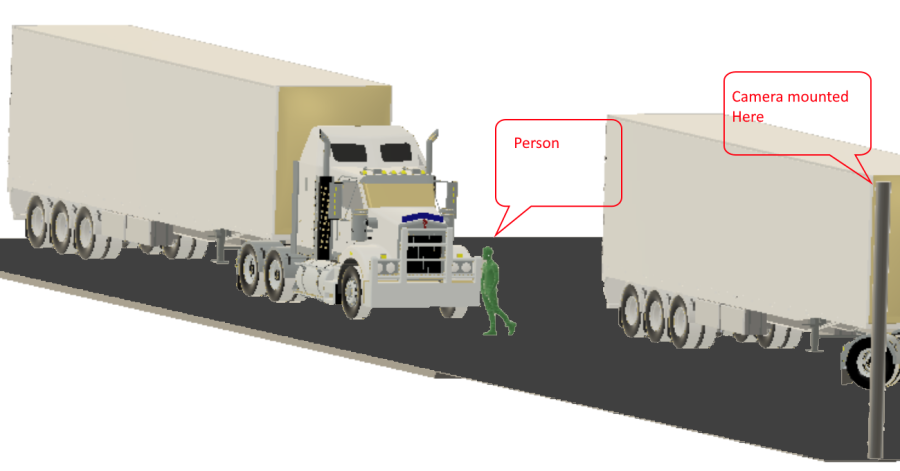

# User interfaces and scenarios for Azure IoT Edge vision AI

This final article in the Azure IoT Edge vision AI series discusses how users interact with internet of things (IoT) and artificial intelligence (AI) solutions. The article presents two detailed scenarios describing how organizations implemented user-facing IoT Edge vision AI solutions.

## User interfaces

A user interface (UI) is how users interact with a system. UI requirements vary depending on overall objectives. Internet of things (IoT) solutions usually have four UI types:

- The *administrator* UI allows full access to device provisioning, device and solution configuration, and user management. These features can be part of one solution, or separate solutions.
- An *operator* UI provides access to the solution's operational components, such as device management, alert monitoring, and configuration.
- A *consumer* UI applies only to consumer-facing solutions. The UI is similar to an operator's interface, but is limited to the devices the user owns.
- An *analytics* UI is an interactive dashboard that provides telemetry visualizations and other data analyses.

## Technology choices

Here are some user-friendly options for building and analyzing IoT Edge vision AI solutions:

- [Azure App Service](https://azure.microsoft.com/services/app-service) is a managed platform for building web and mobile apps for many platforms and mobile devices. App Service allows developers to quickly build, deploy, and scale web apps. App Service supports frameworks like .NET, .NET Core, Node.js, Java, PHP, Ruby, or Python, in containers or running on any supported operating system. The fully managed App Service platform meets rigorous, enterprise-grade performance, security, and compliance requirements.

- [Azure SignalR Service](https://azure.microsoft.com/services/signalr-service) lets you add real-time data communications and reporting to your web apps, without needing in-depth real-time communications expertise. SignalR Service integrates easily with many Azure services.

- [Azure Maps](https://azure.microsoft.com/services/azure-maps) is a suitable technology for IoT visualizations and computer vision projects. Azure Maps lets you create location-aware web and mobile apps by using simple and secure geospatial services, APIs, and SDKs. You can deliver seamless experiences based on geospatial data. Azure Maps has built-in location intelligence from worldwide technology partners.

- [Power BI](https://powerbi.microsoft.com) has powerful features to create customizable interactive visualizations and dashboards. Power BI is available as a managed service or self-hosted package, and connects to many popular database systems and data services. With [Power BI Embedded](https://azure.microsoft.com/services/power-bi-embedded), you can add customer-facing reports, dashboards, and analytics to your apps and brand them as your own. Use Power BI to conserve developer resources by automating analytics monitoring, management, and deployment.

- [Azure Active Directory (Azure AD)](https://azure.microsoft.com/services/active-directory) provides single sign-on and multi-factor authentication to secure your UI solutions.

## User scenarios

### Scenario 1: Quality control

Contoso Boards produces high-quality circuit boards used in computers. Their number one product is a motherboard.

Contoso Boards saw an increase in issues with chip placement on the board, and determined that the circuit boards are getting placed incorrectly on the assembly line. Contoso Boards need a way to identify correct circuit board placement on the assembly line.

The Contoso Boards data scientists are familiar with [TensorFlow]() and want to continue using it as their primary ML model structure. Contoso Boards also wants to centralize management of several assembly lines that produce the motherboards.

The Contoso Boards solution focuses on edge detection.

### Camera

Camera placement: The camera position will be directly above at 90 degrees and about 16 inches from the part.

Camera type: Since the conveyer system moves relatively slowly, Contoso can use an area scan camera with a global shutter.

Frame rate: For this use case, the camera should capture about 30 frames per second.

Resolution: Resolution uses the formula of `Res=(Object Size) divided by (details to be captured)`. Based on this formula, `Res=16"/8"` gives 2 megapixels (MP) in `x` and 4 MP in `y`, so Contoso Boards needs a camera capable of 4MP resolution.

Sensor type: The targets aren't fast moving, and only require edge detection, so a CMOS sensor is best suited.

Lighting: Contoso Boards chooses to use a white diffused filter back light. This lighting makes the part look almost black, with high contrast for edge detection.

Color: Black and white yields the sharpest edges for the AI detection model.

### Hardware acceleration

Based on the workload, the fact that Contoso Boards already knows TensorFlow, and that this solution will be used on several assembly lines, GPU-based hardware is the choice for hardware acceleration.

### ML model

The data scientists are most familiar with TensorFlow, so learning ONNX or other frameworks would slow down model development. Also because there are several assembly lines using this solution, and Contoso Boards wants a centrally managed edge solution, [Azure Stack Edge]() works well here.

The following image shows what the camera captures in this scenario:

## Scenario 2: Safety

Contoso Shipping recently had several pedestrian accidents at their loading docks. Most accidents happened when a truck left the loading dock, and the driver didn't see a dock worker walking in front of the truck. Contoso Shipping needs a solution that watches for people, predicts their direction of travel, and warns drivers of potential collisions.

Most of the data scientists at Contoso Shipping are familiar with Open-VINO, and want to reuse the models on future hardware. The solution should also support power efficiency, and use the smallest number of cameras possible. Finally, Contoso Shipping wants to manage the solution remotely for updates.

### Cameras

The solution needs 11 monochrome 5184 horizontal pixel or 10MP CMOS cameras with IPX67 housings or weather boxes. The cameras are mounted on 17-foot poles 100 feet from the trucks. The following sections describe how Contoso Shipping determined these camera specifications.

#### Placement

The loading docks are 165 feet long. Cameras must be 100 feet away from the front of the trucks. Local zoning laws require surveillance cameras to be mounted no higher than 20 feet. The average worker height is 5 foot 8 inches. Cameras will be mounted on poles 100 feet from the trucks and 17 feet high.

#### Resolution and field of view

Contoso Shipping must consider what resolution they need to capture enough details to detect a person. This solution only needs to identify if a person is in the frame, so the pixels per foot (PPF) can be around 15-20, rather than the 80 needed for facial recognition. Camera focus will need to be 10 feet behind and 10 feet in front of the front of the truck, giving a 20 foot depth of focus.

The formula for field of view (FOV) is `FOV=(Horizontal resolution) divided by (Pixels per foot)`. Lens can impact the FOV, but if the camera uses the wrong sensor for the use case, results can be unsatisfactory. The following images demonstrate the problem with using the wrong resolution camera for a given use case. The red square illustrates one pixel color.

- This image is taken with 480 horizontal pixels at 20 feet:

  

- This image is taken with 5184 horizontal pixels at 20 feet:

  

For Contoso Shipping, the required 15-20 PPF value puts the FOV at around 16 feet. A 16-foot FOV gives about 17.5 pixels per foot, which meets the required PPF of 15-20. This POV means that the solution needs 10MP cameras with a horizontal resolution of about 5184 pixels, and lenses that allows a 16-foot FOV.

Since the cameras can look at a 16-foot path, a 165-foot dock divided by a 16-foot FOV gives 10.3125 cameras. The solution needs 11, 5184-horizontal pixel or 10MP cameras.

#### Sensor type

The cameras are outside, so the sensor type shouldn't allow *bloom*. Bloom is when light hits the sensor and overloads the sensor, causing overexposure or whiteout. CMOS is the sensor of choice.

#### Color and lighting

Contoso operates day and night, and must also protect nighttime personnel. Monochrome handles low light conditions better than color. In this case, color information is unnecessary. Monochrome sensors are also lower cost.

### ML model

Because the data scientists are more familiar with [Open-VINO](), data models are built in ONNX. 

### Hardware acceleration

The distance from the cameras to the Contoso Shipping server room is too far for GigE connectivity, but there is a large WIFI mesh. The solution requires a device that connects over WIFI, and uses as little power as possible. Based on these requirements, FPGA processors are best to use. The solution could also use ASIC processors, but because ASIC chips aren't configurable, they don't meet the requirement of usability for future models.

The following illustration shows the camera placement solution for this scenario.

## Next steps

This series of articles described how to build a vision AI workload that uses Azure IoT Edge devices.

See the other articles in this series:

- [Camera selection for Azure IoT Edge vision AI](./camera.md)
- [Hardware acceleration in Azure IoT Edge vision AI](./hardware.md)
- [Machine learning and data science in Azure IoT Edge vision AI](./machine-learning.md)
- [Image storage and management for Azure IoT Edge vision AI](./image-storage.md)
- [Alert persistence in Azure IoT Edge vision AI](./alerts.md)

To learn more about CNNs, vision AI, Azure Machine Learning, and Azure IoT Edge, see the following documentation:

- [Azure IoT Edge documentation](/azure/iot-edge/)
- [Azure Machine Learning documentation](/azure/machine-learning/)
- [Tutorial: Perform image classification at the edge with Custom Vision Service](/azure/iot-edge/tutorial-deploy-custom-vision)
- [What is Computer Vision?](/azure/cognitive-services/computer-vision/overview)
- [What is Azure Video Analyzer? (preview)](/azure/azure-video-analyzer/video-analyzer-docs/overview)
- [Azure Kinect DK developer kit documentation](/azure/kinect-dk/)
- [Open Neural Network Exchange (ONNX)](https://onnx.ai/)

## Related resources

For more computer vision architectures, examples, and ideas that use Azure IoT, see the following articles:

- [Getting started with Azure IoT solutions](/azure/architecture/reference-architectures/iot/iot-architecture-overview)
- [End-to-end manufacturing using computer vision on the edge](/azure/architecture/reference-architectures/ai/end-to-end-smart-factory)
- [Connected factory hierarchy service](/azure/architecture/solution-ideas/articles/connected-factory-hierarchy-service)
- [Connected factory signal pipeline](/azure/architecture/example-scenario/iot/connected-factory-signal-pipeline)
- [Create smart places by using Azure Digital Twins](/azure/architecture/example-scenario/iot/smart-places)

