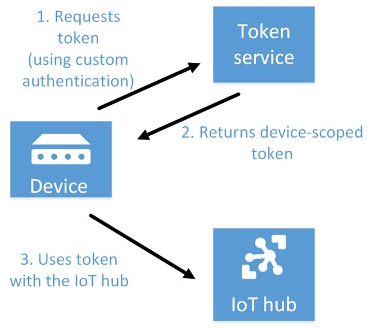
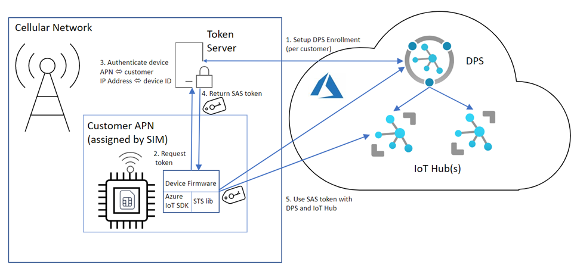

The article [Control access to IoT Hub](/azure/iot-hub/iot-hub-devguide-security#custom-device-and-module-authentication) illustrates how a third-party token service can be integrated with IoT Hub. This article outlines the support for shared access signature (SAS) token authentication in each of the Azure IoT client SDKs. It also outlines both what needs to be implemented in a device application using the corresponding SDK for each language, and how to use device-scoped or module-scoped tokens for the shared access policies of DeviceConnect or ModuleConnect.

## Context and problem

The current Azure IoT Hub security documentation discusses the third-party token-server pattern for SAS authentication with IoT Hub by IoT devices using the Azure IoT client SDKs. However, incorrect assumptions made by a customer during a recent enterprise engagement suggests that without further clarification, you can develop a misleading impression about the level of support implemented by default in the Azure IoT client SDKs.

This article discusses the learning from that engagement and clarifies what needs to be done in each SDK for devices to achieve third-party token-server authentication. This article should also prevent you from making similar incorrect assumptions about support for the third-party token-server pattern in the Azure IoT client SDK.

## Solution

The Azure IoT client SDKs provide varying levels of support for SAS token authentication, each requiring some custom code to complete the authentication and token management functionality.

The token evaluation frequency depends on the chosen transport protocol—MQTT, AMQP, or HTTPS. The variation depends on the capability of the protocol to support proactive renewal of tokens and session time-outs. Only AMQP implements proactive renewal support. This means the other transports will close the connection on SAS token authentication failure, and then need to perform a new connection operation. This is a potentially expensive connectivity operation for the client.

If SAS authentication fails, an error is raised by the transport implementation that can be handled within the device application by a "Connection Status Changed" event handler. Failure to implement such a handler will typically see the device application halt due to the error. With the correct implementation of the event handler and token renewal functionality, the transports can re-attempt the connection.

The following figure illustrates the third-party token-server pattern:



The following figure illustrates implementation support in the Azure IoT client SDK with Mobile Net Operator integration:



Sample implementations are included in the [Azure Samples](https://github.com/orgs/Azure-Samples/repositories?q=iot&type=&language=&sort=) repository on GitHub.

## Issues and considerations

Consider the following points when deciding whether to implement this pattern:

-   The [Azure IoT Hub Device Provisioning Service (Azure DPS) client SDKs](/azure/iot-hub/iot-hub-devguide-sdks) do not support SAS token authentication. The [Azure DPS REST  API](/rest/api/iot-dps/) *does* support SAS token authentication. Therefore, to use the Azure DPS with a third-party token service for SAS authentication, a device application must implement the device DPS process using the Azure DPS REST API.

-   This consists of making an initial registration request operation, and then polling the operational status API until the DPS process succeeds or fails. On success, the device provisioning details can be obtained by requesting them from the [Azure DPS REST API Runtime Registration](/rest/api/iot-dps/device/runtime-registration).

**References:**

-   [Initial registration request API](/rest/api/iot-dps/device/runtime-registration/register-device)

-   [Poll operation API](/rest/api/iot-dps/device/runtime-registration/operation-status-lookup)

-   [Request provisioned device details API](/rest/api/iot-dps/device/runtime-registration/device-registration-status-lookup)

## When to use this pattern

You should user this pattern whenever you want to authenticate to Azure IoT Hub from IoT devices using the various Azure IoT Client SDKs. Instead of using the client SDKs for SAS token authentication, use the Azure DPS REST API to ensure implementation of proactive renewal support for all transport mechanisms.

## Examples

The following sections offer examples that you can use for different programming languages, such as Embedded C, .NET, Java, and Python.

### Azure IoT Hub device SDK for C and Azure IoT Hub device SDK for Embedded C

The following approach can be utilized in device applications built using the Azure IoT C SDK or the Azure IoT Embedded C SDK. Neither SDK provides SAS token lifetime management, therefore you'll need to implement a SAS token lifetime manager capability.

SAS tokens can be used via the *IOTHUB\_CLIENT\_CONFIG* structure by setting the
*deviceSasToken* member to the token and making the *deviceKey* null. Other unused values, such as *protocolGatewayHostName*, must also be set to null.

```
CONFIG = (IOTHUB\_CLIENT\_CONFIG\*)MALLOC(SIZEOF (IOTHUB\_CLIENT\_CONFIG));

CONFIG-\>PROTOCOL = PROTOCOL;

CONFIG-\>DEVICEID = DEVICEID;

CONFIG-\>IOTHUBNAME = IOTHUBNAME;

CONFIG-\>IOTHUBSUFFIX = IOTHUBSUFFIX;

CONFIG-\>DEVICEKEY = 0;

CONFIG-\>DEVICESASTOKEN = TOKEN;

CONFIG-\>PROTOCOLGATEWAYHOSTNAME = 0;
`The created IOTHUB\_CLIENT\_CONFIG can then be provided to the IoTHubDeviceClient\_Create function to establish a DeviceClient instance.`
IF ((IOTHUBCLIENTHANDLE = IOTHUBDEVICECLIENT\_CREATE(CONFIG)) == NULL)

{

(VOID)PRINTF("ERROR: IOTHUBCLIENTHANDLE IS NULL!\\R\\N");

}
`To capture SAS token authentication failures, a handler needs to be implemented for the IoTHubDeviceClient\_SetConnectionStatusCallback.`
(VOID)IOTHUBDEVICECLIENT\_SETCONNECTIONSTATUSCALLBACK(IOTHUBCLIENTHANDLE,
CONNECTION\_STATUS\_CALLBACK, NULL);
```

The connection\_status\_callback can catch the IOTHUB\_CLIENT\_CONNECTION\_STATUS\_REASON of IOTHUB\_CLIENT\_CONNECTION\_EXPIRED\_SAS\_TOKEN to trigger a renewal of the SAS token via the third-party token service. This is required for all transports to capture connection issues but is specifically required by transports which do not support proactive SAS token renewal. Proactive SAS token lifetime management can be implemented as a function repeatedly run during the device applications
"operational" loop. Ensuring the lifetime of the token is frequently evaluated, and token renewal can be proactively executed when required.

SAS token authentication implementation summary for C SDKs:

1.  Implement a ConnectionStatusCallback handler to capture IOTHUB\_CLIENT\_CONNECTION\_EXPIRED\_SAS\_TOKEN event and trigger token renewal.

2.  Use an IOTHUB\_CLIENT\_CONFIG to provide the device SAS token to IoTHubDeviceClient\_Create.

3.  Implement proactive SAS token lifetime management as part of the device application's operation loop.

### Azure IoT Hub device SDK for .Net

The Azure IoT client SDK for .Net implements support for SAS token lifetime management through the abstract DeviceAuthenticationWithTokenRefresh class. A concrete implementation of this class, adding token renewal functionality, can be provided as the authentication method to a DeviceClient.Create method. The transport implementations will automatically renew the token via the authentication method as required. A ConnectionStatusChangesHandler is required to capture connection changes and prevent exceptions being raised by the transports.

Example implementation based on the DeviceAuthenticationWithTokenRefreash class

```
INTERNAL CLASS STSDEVICEAUTHENTICATIONWITHTOKENREFRESH :
DEVICEAUTHENTICATIONWITHTOKENREFRESH

{

PRIVATE READONLY STRING \_STSCONNECTURL =
"HTTP://LOCALHOST:8080/STS/AZURE/TOKEN/OPERATIONS?SR={0}/DEVICES/{1}";

PRIVATE CONST INT DEFAULTTIMETOLIVESECONDS = 1 \* 60 \* 60;

PRIVATE CONST INT DEFAULTBUFFERPERCENTAGE = 15;

PUBLIC STSDEVICEAUTHENTICATIONWITHTOKENREFRESH(STRING DEVICEID, INT
SUGGESTEDTIMETOLIVESECONDS, INT TIMEBUFFERPERCENTAGE) : BASE(DEVICEID,
SUGGESTEDTIMETOLIVESECONDS, TIMEBUFFERPERCENTAGE)

{

IF (STRING.ISNULLORWHITESPACE(DEVICEID))

{

THROW NEW ARGUMENTNULLEXCEPTION(NAMEOF(DEVICEID));

}

}

PROTECTED OVERRIDE TASK\<STRING\> SAFECREATENEWTOKEN(STRING IOTHUB, INT
SUGGESTEDTIMETOLIVE)

{

STRING RESULT;

STRING URL = STRING.FORMAT(\_STSCONNECTURL, IOTHUB, DEVICEID);

HTTPCLIENTHANDLER HANDLER = NEW HTTPCLIENTHANDLER();

HTTPCLIENT = NEW HTTPCLIENT(HANDLER);

TRY

{

VAR APIRESPONSE = HTTPCLIENT.GETASYNC(URL).RESULT;

IF (APIRESPONSE.ISSUCCESSSTATUSCODE)

{

RESULT = APIRESPONSE.CONTENT.READASSTRINGASYNC().RESULT;

}

ELSE

{

THROW NEW HTTPREQUESTEXCEPTION();

}

}

CATCH (HTTPREQUESTEXCEPTION)

{

RESULT = NULL;

}

RETURN TASK.FROMRESULT(RESULT);

}

}
```

SAS token authentication implementation summary for Azure IoT Hub device SDK for
.Net:

1.  Implement a concrete class based on the DeviceAuthenticationWithTokenRefresh abstract class, which implements token renewal functionality.

2.  Implement a ConnectionStatusChangesHandler to capture transport connection status and avoid exceptions raised by transport implementation.

**References:**

-   [DeviceAuthenticationWithTokenRefresh Class](/dotnet/api/microsoft.azure.devices.client.deviceauthenticationwithtokenrefresh?view=azure-dotnet&preserve-view=true)

-   [DeviceClient.Create Method](/dotnet/api/microsoft.azure.devices.client.deviceclient.create?view=azure-dotnet&preserve-view=true)

### Azure IoT Hub device SDK for Java

The Azure IoT Client SDK for Java implements support for SAS token lifetime management through the [SasTokenProvider Interface](/java/api/com.microsoft.azure.sdk.iot.service.digitaltwin.authentication.sastokenprovider?view=azure-java-stable&preserve-view=true). A class that implements this interface with SAS token renewal functionality can be used as the SecurityProvider in a DeviceClient constructor. The transport implementations will automatically renew the token via the security provider as required. A ConnectionStatusChangeCallback needs to be registered to capture connection changes and prevent exceptions being raised by the transports.

Example implementation of the security provider implementing the SasTokenProvider interface:
```
IMPORT JAVA.IO.IOEXCEPTION;

IMPORT JAVA.NET.URI;

IMPORT JAVA.NET.HTTP.HTTPCLIENT;

IMPORT JAVA.NET.HTTP.HTTPREQUEST;

IMPORT JAVA.NET.HTTP.HTTPRESPONSE;

IMPORT JAVA.TIME.DURATION;

PUBLIC CLASS STSSECURITYPROVIDER IMPLEMENTS SASTOKENPROVIDER {

PRIVATE FINAL STRING HOSTNAME;

PRIVATE FINAL STRING DEVICEID;

PRIVATE INT RENEWALBUFFERSECONDS;

PRIVATE LONG EXPIRYTIMESECONDS;

PRIVATE CHAR[] SASTOKEN;

PUBLIC STSSECURITYPROVIDER(STRING HOSTNAME, STRING DEVICEID)

{

THIS.HOSTNAME = HOSTNAME;

THIS.DEVICEID = DEVICEID;

THIS.RENEWALBUFFERSECONDS = 120;

THIS.EXPIRYTIMESECONDS = (SYSTEM.CURRENTTIMEMILLIS() / 1000);

}

\@OVERRIDE

PUBLIC CHAR[] GETSASTOKEN() {

LONG CURRENTTIMESECONDS = (SYSTEM.CURRENTTIMEMILLIS() / 1000);

TRY {

IF (THIS.SASTOKEN == NULL \|\| THIS.EXPIRYTIMESECONDS +
THIS.RENEWALBUFFERSECONDS \>= CURRENTTIMESECONDS) {

THIS.SASTOKEN = STSGETTOKEN();

ASSERT THIS.SASTOKEN != NULL;

STRING T = STRING.COPYVALUEOF(THIS.SASTOKEN);

STRING[] BITS = T.SPLIT("SE=");

LONG L = LONG.PARSELONG(BITS[1]);

THIS.EXPIRYTIMESECONDS = L; // THE SE= NUMBER

THIS.RENEWALBUFFERSECONDS = (INT) (L \* 0.15); // RENEW WITHIN 15% OF EXPIRY

}

} CATCH (INTERRUPTEDEXCEPTION \| IOEXCEPTION E) {

E.PRINTSTACKTRACE();

}

RETURN THIS.SASTOKEN;

}

PRIVATE CHAR[] STSGETTOKEN() THROWS IOEXCEPTION, INTERRUPTEDEXCEPTION {

STRING STSURL =
STRING.FORMAT("HTTP://LOCALHOST:8080/STS/AZURE/TOKEN/OPERATIONS?SR=%S/DEVICES/%S",
THIS.HOSTNAME, THIS.DEVICEID);

HTTPREQUEST REQUEST = HTTPREQUEST.NEWBUILDER()

.URI(URI.CREATE(STSURL))

.TIMEOUT(DURATION.OFMINUTES(2))

.HEADER("CONTENT-TYPE", "APPLICATION/JSON")

.BUILD();

HTTPCLIENT CLIENT = HTTPCLIENT.NEWBUILDER()

.VERSION(HTTPCLIENT.VERSION.HTTP\_1\_1)

.CONNECTTIMEOUT(DURATION.OFSECONDS(20))

.BUILD();

HTTPRESPONSE\<STRING\> RESPONSE = CLIENT.SEND(REQUEST,
HTTPRESPONSE.BODYHANDLERS.OFSTRING());

IF(RESPONSE.STATUSCODE() \<200 \|\| RESPONSE.STATUSCODE()\>=300) {

RETURN NULL;

}

IF(RESPONSE.BODY().ISEMPTY()) {

RETURN NULL;

}

RETURN RESPONSE.BODY().TOCHARARRAY();

}

}
```
SAS token authentication implementation summary for Azure IoT Hub device SDK for Java:

1.  Implement the SasTokenProvider interface on a class and include token renewal functionality.

2.  Implement a ConnectionStatusChangeCallback handler to capture transport connection status changes and avoid exceptions raised by transport implementation.

**References:**

-   [SasTokenProvider Interface](/java/api/com.microsoft.azure.sdk.iot.service.digitaltwin.authentication.sastokenprovider?view=azure-java-stable&preserve-view=true)

-   [DeviceClient.registerConnectionStateCallback(IotHubConnectionStateCallback callback, Object callbackContext) Method](/java/api/com.microsoft.azure.sdk.iot.device.deviceclient.registerconnectionstatecallback?view=azure-java-stable&preserve-view=true)

-   [Custom SAS token provider sample - SDK Sample](https://github.com/Azure/azure-iot-sdk-java/tree/main/iothub/device/iot-device-samples/custom-sas-token-provider-sample)

### Azure IoT Hub device SDK for Python

The Azure IoT Hub device SDK for Python implements SAS token support through methods on the IoTHubDeviceClient object. These methods enable the creation of a device client using a token, and the ability to supply an updated token once the device client has been created. They do not implement token lifetime management, but this can be implemented easily as an asynchronous operation.

A Python 3.7 example implementation showing just the outline of functionality:
```
ASYNC DEF MAIN():

\# GET A SASTOKEN YOU GENERATED

SASTOKEN = GET\_NEW\_SASTOKEN()

\# THE CLIENT OBJECT IS USED TO INTERACT WITH YOUR AZURE IOT HUB.

DEVICE\_CLIENT = IOTHUBDEVICECLIENT.CREATE\_FROM\_SASTOKEN(SASTOKEN)

\# CONNECT THE CLIENT.

AWAIT DEVICE\_CLIENT.CONNECT()

\# DEFINE BEHAVIOR FOR PROVIDING NEW SASTOKENS TO PREVENT EXPIRY

ASYNC DEF SASTOKEN\_KEEPALIVE():

WHILE TRUE:

AWAIT ASYNCIO.SLEEP(NEW\_TOKEN\_INTERVAL)

SASTOKEN = GET\_NEW\_SASTOKEN()

AWAIT DEVICE\_CLIENT.UPDATE\_SASTOKEN(SASTOKEN)

\# ALSO RUN THE SASTOKEN KEEPALIVE IN THE EVENT LOOP

KEEPALIVE\_TASK = ASYNCIO.CREATE\_TASK(SASTOKEN\_KEEPALIVE())

\# CANCEL THE SASTOKEN UPDATE TASK

KEEPALIVE\_TASK.CANCEL()

\# FINALLY, SHUT DOWN THE CLIENT

AWAIT DEVICE\_CLIENT.SHUTDOWN()

IF \_\_NAME\_\_ == "\_\_MAIN\_\_":

ASYNCIO.RUN(MAIN())
```
Summary of Azure IoT Hub device SDK for Python SAS token authentication:

1.  Create SAS token generation function.

2.  Create a device client using IoTHubDeviceClient.create\_from\_sastoken.

3.  Manage token lifetime as a separate activity, supplying the device client with a renewed token when required by the IoTHubDeviceClient.update\_sastoken method.

**References:**

-   [IoTHubDeviceClient](/python/api/azure-iot-device/azure.iot.device.iothubdeviceclient?view=azure-python#create-from-sastoken-sastoken----kwargs-&preserve-view=true)

### Azure IoT Hub device SDK for Node.JS/JavaScript

The Azure IoT for Node.JS/JavaScript implements a SharedAccessSignatureAuthenticationProvider that will serve an SAS token to the device client and transports to authenticate with IoT Hub. It does not implement any token renewal functionality. The device application must manage token lifetime, renewing the token as required.

Use the device client methods fromSharedAccessSignature and updateSharedAccessSignature to initiate a connection with IoT Hub and supply a renewed token to the SharedAccessSignatuteAuthenticationProvider, which will cause the authentication provider to emit a newTokenAvailable event to the transports.

A basic SAS token sample is provided in the
[simple\_sample\_device\_with\_sas.js](https://github.com/Azure/azure-iot-sdk-node/blob/master/device/samples/javascript/simple_sample_device_with_sas.js) example.

Summary of Azure IoT Hub device SDK for Node.JS/JavaScript

1.  Implement SAS token lifetime management and renewal.

2.  Use device client fromSharedAccessSignature to construct a device client instance.

3.  Use device client updateSharedAccessSignature to supply a renewed token.

**References:**

-   [Client class](/javascript/api/azure-iot-device/client?view=azure-node-latest&preserve-view=true)

Next steps
----------

-   [Control access to IoT Hub using Shared Access Signatures and security tokens](/azure/iot-hub/iot-hub-dev-guide-sas)

-   [Communicate with your IoT hub using the MQTT protocol](/azure/iot-hub/iot-hub-mqtt-support)

-   [Communicate with your IoT hub by using the AMQP Protocol](/azure/iot-hub/iot-hub-amqp-support)

-   [Azure IoT Hub SDKs](/azure/iot-hub/iot-hub-devguide-sdks)

Related resources 
------------------

-   [Azure IoT Hub developer guide](/azure/iot-hub/iot-hub-devguide)

-   [Choose an Internet of Things (IoT) solution in Azure](/azure/architecture/example-scenario/iot/iot-central-iot-hub-cheat-sheet)

-   [Getting started with Azure IoT solutions](/azure/architecture/reference-architectures/iot/iot-architecture-overview)
