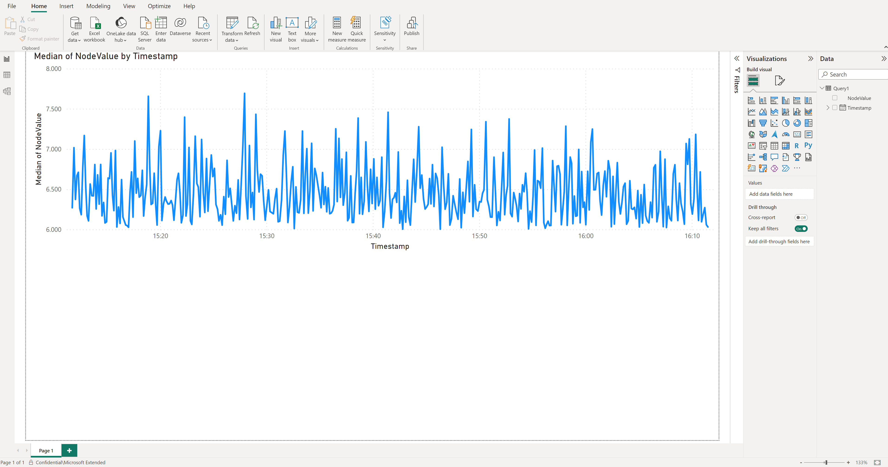

# Connect Microsoft Power BI to the reference solution

[Microsoft Power BI](/power-bi/fundamentals/power-bi-overview) is a unified, self-service business intelligence platform that turns data from many sources into interactive, shareable dashboards and reports.  For this reference solution, it connects to the OPC UA telemetry and lets business users and plant managers explore key manufacturing metrics—such as OEE, production counts, and energy consumption—through interactive visualizations. Mobile access and sharing capabilities make the industrial data available to decision-makers.

To connect the solution to Power BI, you need access to a Power BI subscription.

:::image type="complex" source="./media/power-bi-solution-architecture.png" alt-text="Architecture diagram that shows industrial telemetry flowing through Azure IoT Operations and Azure Data Explorer into Microsoft Power BI dashboards." lightbox="./media/power-bi-solution-architecture.png" border="false":::
The diagram shows an industrial data pipeline from edge assets to business reporting. On the left, OPC UA-enabled and non-OPC UA production-line assets connect through an edge gateway that runs Azure IoT Operations services on Kubernetes, including the OPC UA connector, message queue, dataflows, and schema registry. Telemetry flows through a firewall to Azure Event Hubs and then to Azure Data Explorer, where data is stored and queried. On the right, Microsoft Power BI connects to Azure Data Explorer to visualize metrics such as production, OEE, energy usage, and station performance.
:::image-end:::

To create the Power BI dashboard, complete the following steps:

1. Install the [Power BI Desktop app](/power-bi/fundamentals/desktop-latest-update).
2. Sign in to the Power BI desktop app using the user with access to the Power BI subscription.
3. In the Azure portal, navigate to the `ontologies` Azure Data Explorer database and grant **Viewer** permission to the Microsoft Entra ID user who connects from Power BI.
4. From Power BI, create a new report and select Azure Data Explorer time-series data as a data source: **Get data &gt; Azure &gt; Azure Data Explorer (Kusto)**.
5. In the popup window, enter the Azure Data Explorer endpoint of your cluster (`https://<your cluster name>.<location>.kusto.windows.net`), the database name (`ontologies`), and the following query:

    ```kql
    let _startTime = ago(1h);
    let _endTime = now();
    opcua_metadata_lkv
    | where DataSetName contains "assembly"
    | where DataSetName contains "munich"
    | join kind=inner (opcua_telemetry
        | where Name == "ActualCycleTime"
        | where Timestamp > _startTime and Timestamp < _endTime
    ) on Subject
    | extend NodeValue = todouble(Value)
    | project Timestamp1, NodeValue
    ```
6. Sign in to Azure Data Explorer using the Microsoft Entra ID user you gave permission to access the Azure Data Explorer database previously.


7. Select **Load**. This action imports the actual cycle time of the Assembly station of the Munich production line for the last hour.
8. From the `Table view`, select the **NodeValue** column and select **Don't summarize** in the **Summarization** menu item.
9. Switch to the `Report view`.
10. Under **Visualizations**, select the **Line Chart** visualization.
11. Under **Visualizations**, move the `Timestamp1` from the `Data` source to the `X-axis`, select it, and select **Timestamp1**.
12. Under **Visualizations**, move the `NodeValue` from the `Data` source to the `Y-axis`, select it, and select **Median**.
13. Save your new report.

>[!Tip]
>Use the same approach to add other data from Azure Data Explorer to your report.

[](./media/power-bi.png#lightbox)