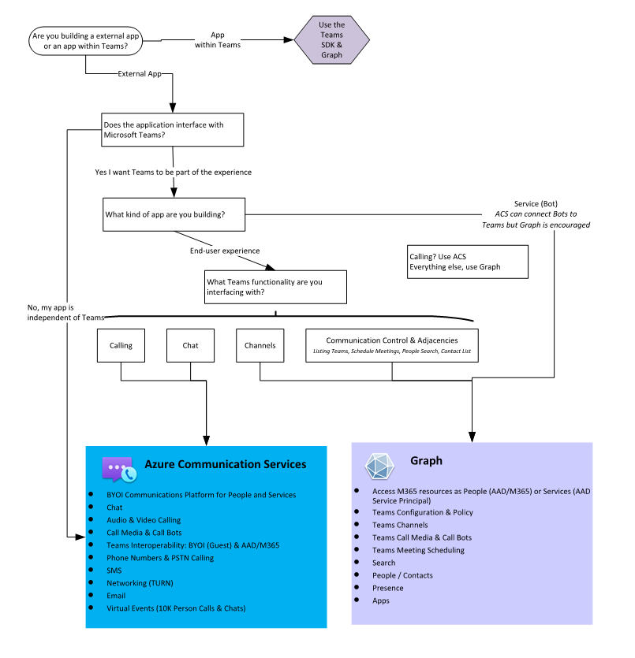
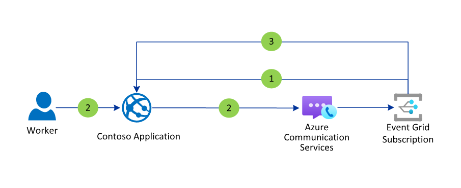

# Azure Communication Services Architecture Guide

This guide presents an overview of Azure Communication Services architecture primitives. It's based on proven practices derived from customer engagements.

Mick->Ed: Should the image files (for example: page-6-1.png) be updated with descriptive filenames?

## Section Header 1
Mick->Ed: Should this be reformatted for readability?

## Section Header 2

## Section Header 3

## Section Header 4

## Section Header 5
Mick->Ed: Should this be reformatted for readability?

## Section Header 6

## Section Header 7

## Section Header 8

## Section Header 9

## Section Header 10

## Section Header 11

## Section Header 12
Mick->Ed: Should this be reformatted for readability?

## Section Header 13
Mick->Ed: Should this be reformatted for readability?

## Section Header 14

## Section Header 15

