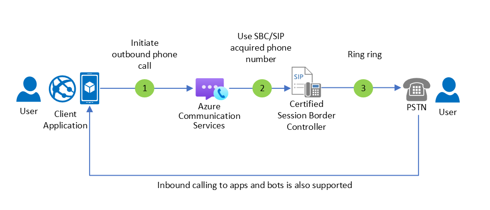

# Azure Communication Services Architecture Guide

This guide presents data flow diagrams for [Azure Communication Services (ACS)](https://docs.microsoft.com/en-us/azure/communication-services/). Use these diagrams to understand how your code interact with ACS sub-systems.

Azure Communication Services are cloud-based services with REST APIs and client library SDKs available to help you integrate communication into your applications. Azure Communication Services supports various communication formats: voice and video calling, text chat, SMS and "raw" data between clients (TURN). You can add communication features to your applications without being an expert in communication technologies such as media encoding and real-time networking. 

You can connect custom client endpoints, custom services, and the publicly switched telephony network (PSTN) to your communications application. You can acquire phone numbers directly through Azure Communication Services REST APIs, SDKs, or the Azure portal; and use these numbers for SMS or calling applications. Azure Communication Services direct routing allows you to use SIP and session border controllers to connect your own PSTN carriers and bring your own phone numbers.

Typical architectural components are used frequently in these data flow diagrams:

1. **Client Application.** This website or native application is leveraged by end-users to communicate. Azure Communication Services provides [SDK client libraries](sdk-options.md) for multiple browsers and application platforms. In addition to our core SDKs, [a UI Library](https://aka.ms/acsstorybook) is available to accelerate browser app development.
1. **Identity Management Service.**  This service capability you build to map users and other concepts in your business logic to Azure Communication Services and also to create tokens for those users when required.
1. **Call Management Service.**  This service capability you build to manage and monitor voice and video calls.  This service can create calls, invite users, call phone numbers, play audio, listen to DMTF tones and leverage many other call features through the Calling Automation SDK and REST APIs.

## User access management

Azure Communication Services clients must present `user access tokens` to access Communication Services resources securely. `User access tokens` should be generated and managed by a trusted service due to the sensitive nature of the token and the connection string or Azure AD authentication secrets necessary to generate them. Failure to properly manage access tokens can result in additional charges due to misuse of resources.

:::image type="content" source="./media/architecture_v2_identity.svg" alt-text="Diagram showing user access token architecture.":::

### Dataflows
1. The user starts the client application. The design of this application and user authentication scheme is in your control.
2. The client application contacts your identity management service. The identity management service maintains a mapping between your users and other addressable objects (for example services or bots) to Azure Communication Service identities.
3. The identity management service creates a user access token for the applicable identity. If no Azure Communication Services identity has been allocated the past, a new identity is created.

### Resources
- **Concept:** [User Identity](https://docs.microsoft.com/azure/communication-services/concepts/identity-model)
- **Quickstart:** [Create and manage access tokens](https://docs.microsoft.com/azure/communication-services/quickstarts/access-tokens)
- **Tutorial:** [Build a identity management services use Azure Functions](https://docs.microsoft.com/azure/communication-services/tutorials/trusted-service-tutorial)

> [!IMPORTANT]
> For simplicity, we do not show user access management and token distribution in subsequent flow diagrams.

## Calling a user without push notifications
The simplest voice and video calling scenarios involves a user calling another, in the foreground without push notifications.

:::image type="content" source="./media/architecture_v2_calling_without_notifications.svg" alt-text="Diagram showing Communication Services architecture calling without push notifications.":::

### Dataflows

1. The accepting user initializes the Call client, allowing them to receive incoming phone calls.
2. The initiating user needs the Azure Communication Services identity of the person they want to call. A typical experience may have a *friend's list* maintained by the identity management service that collates the user's friends and associated Azure Communication Service identities.
3. The initiating user initializes their Call client and calls the remote user.
4. The accepting user is notified of the incoming call through the Calling SDK.
5. The users communicate with each other using voice and video in a call.

 ### Resources
- **Concept:** [Calling Overview](voice-video-calling/calling-sdk-features.md)
- **Quickstart:** [Add voice calling to your app](https://docs.microsoft.com/azure/communication-services/quickstarts/voice-video-calling/getting-started-with-calling.md)
- **Quickstart:** [Add video calling to your app](https://docs.microsoft.com/azure/communication-services/quickstarts/voice-video-calling/get-started-with-video-calling.md)
- **Hero Sample:** [Group Calling for Web, iOS, and Android](https://docs.microsoft.com/azure/communication-services/samples/calling-hero-sample.md)

## Joining a user-created group call
You may want users to join a call without an explicit invitation. For example you may have a *social space* with an associated call, and users join that call at their leisure. In this dataflow, we show a call that is initially created by a client.

:::image type="content" source="./media/architecture_v2_calling_join_client_driven.svg" alt-text="Diagram showing Communication Services architecture calling out-of-band signaling.":::

### Dataflows
1. Initiating user initializes their Call client and makes a group call.
2. The initiating user shares the group call ID with a Call management service.
3. The Call Management Service shares the call ID with other users. For example, if the application orients around scheduled events, the group call ID might be an attribute of the scheduled event's data model.
4. Other users join the call using the group call ID.
5. The users communicate with each other using voice and video in a call.

## Outbound PSTN Calling with your own carrier

- TODO: Brief developer-friendly description

## Extending Microsoft 365 & Teams
Many enterprises use Microsoft 365 and Teams for communication. Developers can extend Teams in three different ways:

1. **Adding experiences within the Teams apps, such as tabs, bots, compliance automation, and Teams apps.** This is accomplished using the [Teams SDK](https://docs.microsoft.com/en-us/microsoftteams/platform/get-started/get-started-overview) with Microsoft Graph. This pattern is outside of this article's scope.
2. **Delivering a custom application for an external user to join a Teams meeting.** This is ideal for virtual visit scenarios where a business using Teams hosts a meeting for consumers using a custom app and a custom identity. Check out the [Virtual Visits tutorial and Sample Builder](https://docs.microsoft.com/en-us/learn/modules/intro-to-azure-communication-services/) to learn more about this specific scenario. 
3. **Delivering a custom application for an internal user with M365/Active Directory credentials to join Teams meetings and participate in 1:1 calling using their Teams identity and Teams-allocated phone number.** This is ideal for building custom employee experiences for Teams interaction, for example [Landis Technologies](https://landistechnologies.com/microsoft-teams-attendant-console/) offers a custom application optimized for attendant scenarios where an employee is answering many phone calls to their Teams allocated phone number.

These custom application scenarios require usage of [Microsoft Graph APIs](https://docs.microsoft.com/en-us/graph/overview?view=graph-rest-1.0). In the communications space, we use Graph as the *control plane** - configuring who, when, and how users communicate, in particular using the [calendar and online meeting APIs](https://docs.microsoft.com/en-us/graph/choose-online-meeting-api?view=graph-rest-1.0). Azure Communication Services is a *custom data plane* that is [interoperable with Teams](https://docs.microsoft.com/en-us/azure/communication-services/concepts/teams-interop.md).  

Common sub-systems in communication apps and their corresponding developer platforms are below. 

1. **Teams Shell Experience** - Create apps, tabs, and other enhancements to the Teams app with the [Teams SDK](https://docs.microsoft.com/en-us/microsoftteams/platform/get-started/get-started-overview).
2. **Teams Control Plane, Compliance, and Administration.** - Schedule meetings, search channels, and automate compliance tasks with [Microsoft Graph](https://docs.microsoft.com/en-us/graph/overview?view=graph-rest-1.0).
3. **Teams Data Plane** - Using Azure Communication SErvices to connect custom clients and services to Teams calls, meetings, chat threads, using BYOI (Guest) or AAD/M365 identity 
4. **Identity** - Use [Azure Active Directory](https://docs.microsoft.com/en-us/azure/active-directory/develop/v2-overview) to deliver secure single-sign-on (SSO) for end-users and accomplish secure service-to-service authentication 

## Joining a scheduled Teams call
Azure Communication Service applications can join Teams calls. For external users, they need a link to the Teams meeting, and this is managed using Graph APIs. The complete flow is below:

:::image type="content" source="./media/architecture_v2_calling_join_teams_driven.svg" alt-text="Diagram showing Communication Services architecture for joining a Teams meeting.":::

### Dataflows
1. The Call Management Service creates a group call with [Graph APIs](/graph/api/resources/onlinemeeting?view=graph-rest-1.0&preserve-view=true). Another pattern involves end users creating the group call using [Bookings](https://www.microsoft.com/microsoft-365/business/scheduling-and-booking-app), Outlook, Teams, or another scheduling experience in the Microsoft 365 ecosystem.
2. The Call Management Service shares the Teams call details with Azure Communication Service clients.
3. Typically, a Teams user must join the call and allow external users to join through the lobby. However this experience is sensitive to the Teams tenant configuration and specific meeting settings.
4. Azure Communication Service users initialize their Call client and join the Teams meeting, using the details received in Step 2.
5. The users communicate with each other using voice and video in a call.

### Resources
- **Concept:** [Teams Interoperability](https://docs.microsoft.com/en-us/azure/communication-services/concepts/teams-interop.md)
- **Quickstart:** [Join a Teams meeting](https://docs.microsoft.com/azure/communication-services/quickstarts/voice-video-calling/get-started-teams-interop.md)

## Next steps

- [What is Azure Communication Services?](https://docs.microsoft.com/en-us/azure/communication-services/overview)
- [Create a Communication Services resource](https://docs.microsoft.com/en-us/azure/communication-services/quickstarts/create-communication-resource)
- [Azure Communication Services Client and Server Architecture](https://docs.microsoft.com/en-us/azure/communication-services/concepts/client-and-server-architecture)

## Related resources

- [Azure Communication Services Reference docs](https://docs.microsoft.com/en-us/azure/communication-services/concepts/reference)
